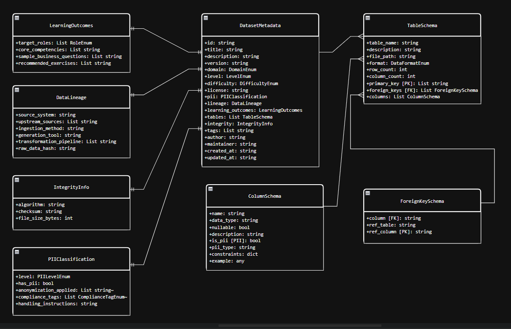

# 04. ĐẶC TẢ KỸ THUẬT METADATA SCHEMA DATASET REGISTRY

**Dự án**: CyberSoft Data & AI Lab  
**Đầu việc**: Ngày 04 - Thiết kế schema Dataset Registry  
**Vai trò phụ trách**: Data & AI Resource Engineer (Đào Trung Kiên)  
**Phiên bản**: v1.0  
**Ngày hoàn thiện**: 2026-09-04  

---

## 1. BỐI CẢNH VÀ MỤC TIÊU THIẾT KẾ

### 1.1. Bối cảnh
Trong hệ thống đào tạo của **CyberSoft Academy**, các khóa học Data Analyst (DA) và AI Engineer (AIE) cần hàng chục bộ dữ liệu phục vụ từ bài tập hàng ngày, mini-projects đến đồ án tốt nghiệp Capstone. Trước đây, các bộ dữ liệu thường được lưu trữ phân tán, thiếu mô tả định dạng trường (data dictionary), không rõ bản quyền (license), tiềm ẩn nguy cơ lộ thông tin cá nhân (PII) và không có mã băm xác thực tính toàn vẹn (checksum).

### 1.2. Mục tiêu kỹ thuật
Thiết kế một chuẩn metadata tập trung (**Dataset Registry Metadata Schema**) đóng vai trò như bản "khai sinh kỹ thuật" cho mọi tài nguyên dữ liệu trước khi được đưa vào kho lưu trữ (Registry) và công bố (Publish) cho học viên và hệ thống RAG Tutor.

Schema phải giải quyết 5 bài toán cốt lõi:
1. **Cataloging & Discovery**: Tìm kiếm tài nguyên theo domain, cấp độ (level), độ khó (difficulty) và đối tượng học viên (target roles).
2. **Data Dictionary**: Đặc tả chi tiết từng cột, kiểu dữ liệu, ràng buộc (constraints) và ví dụ trực quan.
3. **Multi-Table Relational Integrity**: Hỗ trợ đầy đủ quan hệ Khóa chính (Primary Key) và Khóa ngoại (Foreign Key) cho các đồ án đa bảng (Star Schema, Snowflake Schema).
4. **Data Governance & PII Protection**: Bắt buộc phân loại mức độ nhạy cảm dữ liệu (PII Level), kỹ thuật ẩn danh đã áp dụng và tuân thủ pháp lý (PDPA Việt Nam, GDPR).
5. **Lineage & Cryptographic Integrity**: Ghi nhận toàn bộ chuỗi nguồn gốc phát sinh dữ liệu (upstream sources, transformation pipeline) và mã băm SHA-256 bảo đảm tính toàn vẹn 100%.

---

## 2. KIẾN TRÚC VÀ CẤU TRÚC PHÂN TẦNG SCHEMA

Schema được thiết kế theo chuẩn hướng đối tượng mở rộng, chia thành 6 khối chức năng chính:

---

## 3. CHI TIẾT CÁC TRƯỜNG DỮ LIỆU & RÀNG BUỘC (SPECIFICATION)

### 3.1. Khối Nhận diện & Phân loại (Identity & Classification)
- `id` (string, required): Mã định danh duy nhất toàn cầu, chuẩn slug lowercase, regex `^ds-[a-z0-9-]+$`.
- `title` (string, required): Tên hiển thị của bộ dữ liệu (5-200 ký tự).
- `version` (string, required): Phiên bản chuẩn SemVer 2.0 (`Major.Minor.Patch`), ví dụ `1.0.0`, regex `^(0|[1-9]\d*)\.(0|[1-9]\d*)\.(0|[1-9]\d*)(?:-([a-zA-Z0-9.-]+))?$`.
- `domain` (enum, required): `retail_ecommerce`, `hr_operations`, `fintech_banking`, `nlp_genai`, `computer_vision`, `healthtech`, `education`, `logistics`.
- `level` (enum, required): `beginner`, `intermediate`, `advanced`.
- `difficulty` (enum, required): `easy`, `medium`, `hard`.

### 3.2. Khối Quản trị Bản quyền & PII (Governance & Security)
- `license` (string, required): Trường bắt buộc, cấm để trống hoặc n/a. Hỗ trợ các giấy phép như `CC-BY-4.0`, `MIT`, `Apache-2.0`, `CyberSoft-Internal-Educational-v1`.
- `pii` (object, required):
  - `level` (enum): `none`, `low`, `moderate`, `high`, `critical`.
  - `has_pii` (bool): Cờ báo hiệu có chứa thông tin định danh cá nhân hay không. Ràng buộc: nếu `has_pii=True` thì `level` không được là `none` và phải ghi nhận ít nhất một phương pháp ẩn danh trong `anonymization_applied`.
  - `compliance_tags` (list[enum]): Khung pháp lý tuân thủ (`PDPA_VN`, `GDPR`, `INTERNAL_CYBERSOFT`).
  - `handling_instructions` (string): Hướng dẫn an toàn bảo mật khi thực hành.

### 3.3. Khối Nguồn gốc Dữ liệu (Data Lineage)
- `source_system` (string, required): Hệ thống nguồn sinh hoặc trích xuất dữ liệu.
- `upstream_sources` (list[string]): Danh sách nguồn dữ liệu thô đầu vào.
- `ingestion_method` (string, required): Phương pháp thu thập (`synthetic_generator`, `api_sync`, `manual_curation`, `web_scraping`).
- `generation_tool` (string, optional): Công cụ sử dụng (Faker, SDV, LangChain, NumPy).
- `transformation_pipeline` (list[string], required): Các bước tiền xử lý, làm sạch và đóng gói từ dữ liệu thô (raw) đến thành phẩm (processed).
- `raw_data_hash` (string, optional): Mã băm SHA-256 của file thô ban đầu để truy vết nguồn gốc (data provenance).

### 3.4. Khối Mục tiêu Sư phạm (Learning Outcomes)
- `target_roles` (list[enum], required): Đối tượng đào tạo hướng tới (`data_analyst`, `ai_engineer`, `data_engineer`, `bi_analyst`).
- `core_competencies` (list[string], required): Kỹ năng trọng tâm đạt được (ví dụ: `Star Schema`, `SQL Window Functions`, `RAG Embeddings`, `XGBoost`).
- `sample_business_questions` (list[string], required): Câu hỏi nghiệp vụ thực tế học viên phải trả lời bằng dữ liệu.
- `recommended_exercises` (list[string], required): Danh mục bài tập Lab và Capstone đề xuất.

### 3.5. Khối Cấu trúc Bảng & Từ điển Dữ liệu (Tables & Data Dictionary)
- Hỗ trợ kiến trúc đa bảng:
  - `table_name`: Tên bảng chuẩn hóa (`dim_customers`, `fact_sales_orders`).
  - `file_path`: Đường dẫn tương đối lưu trữ file (`data/processed/dim_customers.parquet`).
  - `format`: Định dạng file (`csv`, `parquet`, `json`, `jsonl`, `sqlite`).
  - `row_count` & `column_count`: Số dòng và số cột (ràng buộc kiểm tra số cột khai báo phải trùng khớp `len(columns)`).
  - `primary_key`: Danh sách cột khóa chính.
  - `foreign_keys`: Danh sách liên kết khóa ngoại (`column`, `ref_table`, `ref_column`).
  - `columns`: Danh sách trường dữ liệu chi tiết (`name`, `data_type`, `nullable`, `description`, `is_pii`, `pii_type`, `constraints`, `example`).

### 3.6. Khối Toàn vẹn Dữ liệu (Cryptographic Integrity)
- `algorithm`: Mặc định `SHA-256`.
- `checksum`: Chuỗi băm 64 ký tự Hexadecimal đảm bảo phát hiện ngay lập tức nếu file dữ liệu bị thay đổi, lỗi tải về hoặc chèn mã độc.
- `file_size_bytes`: Kích thước file tính theo bytes.

---

## 4. TRIỂN KHAI KÉP: JSON SCHEMA VÀ PYDANTIC V2

Để phục vụ môi trường đa ngôn ngữ trong hệ thống CyberSoft:
1. **JSON Schema (`dataset.schema.json`)**:
   - Tuân thủ chuẩn Draft 2020-12 của IETF.
   - Cho phép các microservice viết bằng Go, Node.js (Learning Platform) hoặc script Bash có thể validate metadata mà không phụ thuộc vào Python runtime.
2. **Pydantic v2 Models (`models.py`)**:
   - Tối ưu hóa hiệu năng cao (nhân viết bằng Rust của Pydantic core).
   - Tích hợp các hàm kiểm tra logic chéo (Cross-field validation):
     - Ràng buộc: Nếu bất kỳ cột nào có `is_pii=True` mà khối metadata chính `pii.has_pii=False` -> Báo lỗi `ValueError`.
     - Ràng buộc: `column_count` phải bằng chính xác số lượng đối tượng cột được định nghĩa.
     - Ràng buộc: Các cột trong `primary_key` và `foreign_keys` phải tồn tại trong danh sách `columns`.

---

## 5. KẾT QUẢ KIỂM CHỨNG & THỬ NGHIỆM

Bộ schema đã được kiểm thử trên **5 bộ dữ liệu tiêu chuẩn** và **4 trường hợp lỗi cố ý**:

| STT | Dataset Identifier | Nhóm ngành / Đối tượng | Số bảng | Trạng thái Validation |
| :---: | :--- | :--- | :---: | :---: |
| 1 | `ds-retail-ecommerce-sales-v1` | Retail E-Commerce (Data Analyst) | 3 bảng | **PASS 100%** |
| 2 | `ds-hr-operations-attendance-v1` | HR Operations & Attendance (Data Analyst) | 2 bảng | **PASS 100%** |
| 3 | `ds-fintech-customer-churn-v1` | FinTech Banking Churn (Data Analyst & AI) | 1 bảng | **PASS 100%** |
| 4 | `ds-nlp-rag-tutor-knowledgebase-v1` | NLP RAG Tutor QA Corpus (AI Engineer) | 3 bảng | **PASS 100%** |
| 5 | `ds-nlp-toxicity-detection-v1` | Vietnamese Toxic Speech (AI Engineer) | 1 bảng | **PASS 100%** |

Đồng thời, hệ sinh thái test cases âm bản (`test_cases/`) đã chứng minh:
- Bắt lỗi chính xác khi thiếu trường `license`.
- Bắt lỗi chính xác khi thiếu khối `pii`.
- Bắt lỗi chính xác khi sai kiểu dữ liệu (`column_count` là string, `row_count` âm).
- Bắt lỗi chính xác khi chuỗi `version` không tuân theo chuẩn SemVer.
