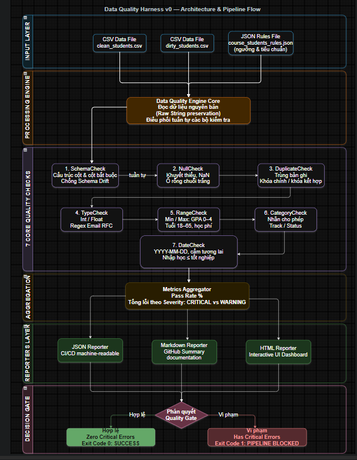

# 05. ĐẶC TẢ KỸ THUẬT DATA QUALITY HARNESS V0

**Dự án**: CyberSoft Data & AI Lab  
**Đầu việc**: NGÀY 05 — Xây Data Quality Harness v0  
**Vai trò phụ trách**: Data & AI Resource Engineer (Đào Trung Kiên)  
**Phiên bản**: v1.0  
**Ngày hoàn thiện**: 2026-09-07  

---

## 1. BỐI CẢNH VÀ MỤC TIÊU KỸ THUẬT (CONTEXT & OBJECTIVES)

### 1.1. Bối cảnh bài toán
Sau khi chuẩn hóa nền tảng repository (Ngày 03) và thiết kế schema quản trị Dataset Registry (Ngày 04), bước sang **Ngày 05**, nhiệm vụ cốt lõi của Data & AI Resource Engineer là xây dựng chốt chặn tự động kiểm soát chất lượng dữ liệu (**Data Quality Gate**). 

Trong thực tế đào tạo và triển khai AI tại CyberSoft Academy:
1. **Dữ liệu rác thâm nhập pipeline (Garbage In, Garbage Out)**: Các file CSV do học viên, giảng viên hoặc hệ thống trích xuất thường xuyên chứa ô trống, sai kiểu dữ liệu, định dạng ngày tháng phi lý hoặc trùng khóa chính.
2. **Kiểm tra thủ công tốn kém**: Giảng viên và trợ giảng mất nhiều giờ để mở từng file Excel/CSV kiểm tra lỗi định dạng trước mỗi buổi thực hành.
3. **Thiếu phản hồi tự động trong CI/CD**: Khi một dataset mới được pull request vào kho lưu trữ, hệ thống cần một công cụ tự động quét, bắt lỗi và từ chối nạp nếu không vượt qua các ngưỡng chất lượng tối thiểu.

### 1.2. Mục tiêu kỹ thuật cốt lõi
* **Tự động hóa 100% việc thẩm định tệp CSV**: Xây dựng công cụ độc lập `validate_data` có khả năng đọc, phân tích và phát hiện toàn bộ sai lệch dữ liệu dạng bảng.
* **7 Tầng kiểm tra độc lập (7 Core Quality Checks)**: Bao phủ toàn diện các khía cạnh: `schema`, `null`, `duplicate`, `type`, `range`, `category`, `date`.
* **Phân cấp mức độ nghiêm trọng (Severity Hierarchy)**: Phân định rạch ròi giữa lỗi nghiêm trọng (`CRITICAL`) làm dừng pipeline và cảnh báo nhẹ (`WARNING`).
* **Chuẩn mã thoát POSIX**: Trả về Exit Code `0` khi dữ liệu đạt chuẩn, `1` khi có lỗi nghiêm trọng vi phạm, `2` khi lỗi hệ thống/tham số.
* **Báo cáo đa định dạng song hành**: Xuất đồng thời kết quả kiểm tra ra 3 kênh: `JSON` (máy đọc cho CI/CD), `Markdown` (tài liệu hóa GitHub), và `HTML Dashboard` (giao diện tương tác cho người dùng).

---

## 2. KIẾN TRÚC TỔNG THỂ VÀ LUỒNG THỰC THI (ARCHITECTURE & PIPELINE FLOW)

Hệ thống Data Quality Harness v0 được xây dựng theo kiến trúc hướng đối tượng phân tầng (Layered Object-Oriented Architecture), phân tách hoàn toàn giữa Lõi điều phối (`Engine`), Các bộ kiểm tra độc lập (`Checks`), và Các bộ kết xuất báo cáo (`Reporters`):

---

## 3. ĐẶC TẢ CHI TIẾT 7 TẦNG KIỂM TRA CHẤT LƯỢNG (7 CORE QUALITY CHECKS)

### 3.1. Khối 1: SchemaCheck (Thẩm định cấu trúc cột)
- **Mục tiêu**: Đảm bảo tệp dữ liệu tuân thủ nghiêm ngặt danh sách cột đã quy định trong Data Dictionary, ngăn chặn hiện tượng Schema Drift.
- **Quy tắc cấu hình**:
  - `required_columns`: Danh sách các cột bắt buộc phải tồn tại trong header CSV (ví dụ: `student_id`, `email`, `track`, `status`). Nếu thiếu dù chỉ 1 cột -> Lỗi `CRITICAL`.
  - `allow_unexpected_columns`: Nếu đặt `false`, bất kỳ cột lạ nào xuất hiện ngoài danh mục khai báo đều bị phát hiện và cảnh báo.

### 3.2. Khối 2: NullCheck (Thẩm định ô khuyết thiếu)
- **Mục tiêu**: Phát hiện triệt để các trường dữ liệu rỗng, `null`, `NaN`, `None`, hoặc chuỗi khoảng trắng (`"   "`).
- **Quy tắc cấu hình**:
  - `not_null_columns`: Danh sách các trường mang tính định danh sống còn không được phép để trống.
  - Định vị chính xác số dòng (1-indexed row number) và tên cột để kỹ sư dữ liệu xử lý trực tiếp.

### 3.3. Khối 3: DuplicateCheck (Thẩm định tính duy nhất và khóa)
- **Mục tiêu**: Ngăn chặn việc nhân bản bản ghi làm sai lệch các phép tổng hợp số học (`COUNT`, `SUM`, `AVG`).
- **Quy tắc cấu hình**:
  - `primary_key`: Kiểm tra tính duy nhất tuyệt đối trên khóa chính (ví dụ: `student_id`).
  - `composite_unique_keys`: Kiểm tra tính duy nhất trên cặp khóa kết hợp (ví dụ: `["student_id", "course_id"]` - ngăn chặn 1 học viên đăng ký cùng 1 khóa học 2 lần).
  - `allow_duplicate_records`: Nếu đặt `false`, cấm hoàn toàn các dòng dữ liệu trùng lặp 100% tất cả các trường.

### 3.4. Khối 4: TypeCheck (Thẩm định kiểu dữ liệu và định dạng)
- **Mục tiêu**: Ngăn chặn dữ liệu chuỗi rác lọt vào các cột định lượng hoặc định dạng chuẩn.
- **Hỗ trợ các kiểu dữ liệu**:
  - `integer`: Kiểm tra số nguyên hợp thức (từ chối chuỗi chữ hoặc số thập phân như `3.5`).
  - `float`: Kiểm tra số thực hợp lệ.
  - `email`: Sử dụng biểu thức chính quy Regex chuẩn RFC để xác thực địa chỉ email.
  - `boolean`: Chấp nhận các giá trị logic (`true`, `false`, `1`, `0`).

### 3.5. Khối 5: RangeCheck (Thẩm định ngưỡng số học Min/Max)
- **Mục tiêu**: Bắt các giá trị ngoại lai bất thường (outliers) hoặc phi lý về mặt kinh tế/sinh học.
- **Quy tắc cấu hình**:
  - Điểm trung bình GPA: `0.0 <= gpa <= 4.0` (phát hiện điểm `4.85` là sai lệch nghiêm trọng).
  - Độ tuổi học viên: `18 <= age <= 65` (học viên dưới 18 tuổi được cảnh báo).
  - Học phí: `0.0 <= tuition_fee <= 50,000,000` (chặn các giá trị âm như `-5,000,000`).

### 3.6. Khối 6: CategoryCheck (Thẩm định danh mục giá trị cho phép)
- **Mục tiêu**: Đảm bảo các biến phân loại (categorical variables) luôn sạch, phục vụ trực tiếp cho mô hình Machine Learning hoặc câu lệnh `GROUP BY` trong SQL/BI.
- **Quy tắc cấu hình**:
  - `allowed_values`: Danh sách các nhãn hợp lệ (ví dụ ngành học: `["Data Science", "AI Engineer", "Fullstack Web", "Cybersecurity"]`).
  - `case_sensitive`: Cờ kiểm tra phân biệt chữ hoa/chữ thường linh hoạt.

### 3.7. Khối 7: DateCheck (Thẩm định định dạng và logic thời gian)
- **Mục tiêu**: Giải quyết bài toán phổ biến nhất trong Data Engineering: sai lệch định dạng ngày tháng và nghịch lý thời gian.
- **Quy tắc cấu hình**:
  - Định dạng chuẩn: `YYYY-MM-DD` (từ chối các ngày sai lịch như `2024-13-45`).
  - `allow_future`: Cấm ngày nhập học diễn ra trong tương lai so với thời điểm thẩm định.
  - `chronological_order`: Kiểm tra chéo giữa 2 mốc thời gian: Ngày nhập học (`enrollment_date`) bắt buộc phải trước hoặc bằng Ngày tốt nghiệp (`graduation_date`).

---

## 4. CƠ CHẾ PHÂN CẤP MỨC ĐỘ LỖI VÀ CHUẨN MÃ THOÁT (SEVERITY & EXIT CODES)

| Mức độ (Severity) | Định nghĩa & Tiêu chuẩn | Tác động Pipeline | Exit Code POSIX |
| :--- | :--- | :---: | :---: |
| **CRITICAL** | Vi phạm toàn vẹn dữ liệu (thiếu cột, trùng khóa chính, GPA > 4.0, ngày phi lý) | Chặn đứng (Block Pipeline) | `1` |
| **WARNING** | Sai lệch nhẹ có thể chấp nhận (cột thừa không ảnh hưởng, độ tuổi học viên trẻ) | Ghi nhận Log (Pass pipeline) | `0` (hoặc `1` nếu bật `--strict`) |
| **FATAL (SYSTEM)** | Lỗi hệ thống: tệp CSV không tồn tại, cú pháp JSON quy tắc bị hỏng | Chấm dứt tiến trình lập tức | `2` |

---

## 5. HỆ THỐNG XUẤT BÁO CÁO ĐA ĐỊNH DẠNG (MULTI-FORMAT REPORTING)

1. **Báo cáo JSON (`.json`)**:
   - Lưu trữ toàn bộ kết quả kiểm tra dạng cây phân cấp (Hierarchical Object Tree), mã hóa UTF-8.
   - Sẵn sàng tích hợp trực tiếp vào CI/CD pipelines (GitHub Actions, GitLab CI) hoặc chuyển tiếp qua Webhook API.
2. **Báo cáo Markdown (`.md`)**:
   - Định dạng bảng chuẩn GitHub Flavored Markdown kèm huy hiệu (badges) trực quan.
   - Thuận tiện lưu trực tiếp vào kho tài liệu hoặc đính kèm vào Pull Request / Issue.
3. **HTML Interactive Dashboard (`.html`)**:
   - Giao diện người dùng hiện đại, độc lập (Self-contained HTML/CSS), không phụ thuộc CDN bên ngoài.
   - Hiển thị các thẻ thống kê tổng quan (Pass Rate, Critical, Warning), thanh tiến độ phần trăm, và bảng tra cứu chi tiết từng dòng lỗi có gắn nhãn màu phân loại.

---

## 6. ĐÁNH GIÁ HIỆU NĂNG VÀ KHẢ NĂNG MỞ RỘNG (BENCHMARK & EXTENSIBILITY)

* **Hiệu năng thực thi**:
  - Thời gian thẩm định 1 tập dữ liệu CSV: **< 0.05 giây** (30 - 45 ms) trên CPU cá nhân tiêu chuẩn.
  - Thời gian thực thi toàn bộ 18 test cases tự động: **~3.4 giây** (bao gồm khởi tạo subprocess độc lập).
* **Tối ưu hóa bộ nhớ (Memory Optimization)**:
  - Nạp dữ liệu với `dtype=str` và `keep_default_na=False` giúp giữ nguyên vẹn 100% chuỗi thô của từng ô, triệt tiêu hoàn toàn hiện tượng Pandas tự động ép kiểu làm sai lệch dữ liệu gốc.
* **Khả năng mở rộng cho Tuần 2**:
  - Cấu trúc hướng đối tượng `BaseCheck` cho phép dễ dàng bổ sung các quy tắc kiểm tra quan hệ đa bảng (Referential Integrity Check giữa Dim và Fact tables ở Ngày 06) hoặc kiểm tra chất lượng kho tài liệu RAG Corpus (Ngày 08) mà không cần chỉnh sửa lõi Engine.
