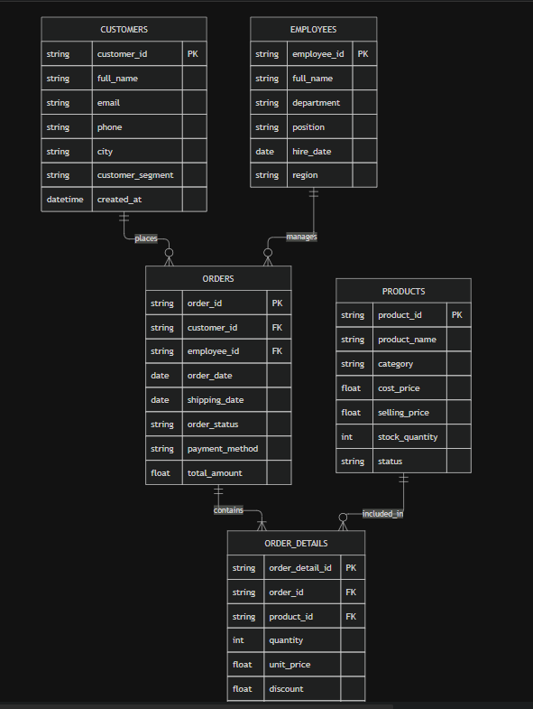

# 06. ĐẶC TẢ KỸ THUẬT BỘ DATASET BÁN HÀNG ĐA BẢNG SALES_V1

**Dự án**: CyberSoft Data & AI Lab  
**Đầu việc**: NGÀY 06 — Dataset bán hàng đa bảng  
**Vai trò phụ trách**: Data & AI Resource Engineer (Đào Trung Kiên)  
**Phiên bản**: v1.0  
**Ngày hoàn thiện**: 2026-09-08  

---

## 1. TỔNG QUAN VÀ MỤC TIÊU NGHIỆP VỤ

Tiếp nối thành quả của Tuần 1 khi đã hoàn thiện công cụ kiểm tra chất lượng dữ liệu tự động (**Data Quality Harness v0**), **Task 06** mở đầu cho Tuần 2 với vai trò là bài toán ứng dụng thực tế đầu tiên: kiến tạo và kiểm định bộ dữ liệu bán hàng đa bảng (**sales_v1**). Dữ liệu không chỉ được thiết kế theo chuẩn mô hình quan hệ (Star Schema) cho học viên Data Analyst thực hành nghiệp vụ kinh doanh, mà bản dirty còn đóng vai trò là 'bãi thử nghiệm đối chứng' (testing benchmark) với 10 loại lỗi thực tế để kiểm chứng trực tiếp năng lực bắt lỗi tự động của Data Quality Harness trước khi đưa vào kho tài nguyên chung.

Mục tiêu của **Task 06** là thiết kế và xây dựng bộ dữ liệu bán hàng đa bảng (**sales_v1**) đáp ứng đồng thời 2 yêu cầu:
1. **Bản chuẩn sạch (`sales_v1_clean`)**: Đáp ứng đầy đủ các ràng buộc khóa chính - khóa ngoại (Star Schema), tính toán dòng tiền không sai lệch, ngày tháng logic, không rò rỉ thông tin cá nhân thật (Zero PII Leakage), phục vụ cho các bài toán phân tích từ cơ bản đến nâng cao (SQL, Python Pandas, Power BI).
2. **Bản cài cắm lỗi (`sales_v1_dirty`)**: Cài cắm có kiểm soát **10 loại lỗi dữ liệu thực tế** phổ biến trong quy trình ETL doanh nghiệp để phục vụ các bài tập kiểm tra chất lượng (Data Quality Audit) và làm sạch dữ liệu (Data Cleaning).
3. **Bộ tài nguyên phụ trợ**: Từ điển dữ liệu chuẩn (**Data Dictionary**), Bảng đáp án lỗi đối chứng (**Ground Truth**), và **Bộ 20 câu hỏi phân tích kinh doanh** kèm câu lệnh SQL mẫu.

---

## 2. KIẾN TRÚC MÔ HÌNH DỮ LIỆU (RELATIONAL STAR SCHEMA)

Hệ thống dữ liệu bán hàng đa bảng (`sales_v1`) được tổ chức theo mô hình quan hệ Star Schema tối ưu cho truy vấn phân tích (OLAP) và xử lý báo cáo kinh doanh BI:

### Thống kê dung lượng bản ghi (Clean Dataset):
* `customers.csv`: **200** khách hàng phân bổ trên 10 tỉnh thành và 3 phân khúc.
* `products.csv`: **50** sản phẩm thuộc 5 ngành hàng kinh doanh chủ lực.
* `employees.csv`: **20** nhân viên bán hàng thuộc 3 miền Bắc - Trung - Nam.
* `orders.csv`: **1.000** đơn hàng phát sinh trong giai đoạn 2025 - 2026.
* `order_details.csv`: **1.803** dòng chi tiết sản phẩm.

---

## 3. CÀI CẮM 10 LOẠI LỖI DỮ LIỆU CÓ CHỦ Ý

| Nhóm kiểm định | Mã lỗi | Vị trí cài cắm | Hiện tượng dữ liệu bẩn | Rủi ro phân tích |
|---|---|---|---|---|
| **1. Khóa chính** | `ERR_01_PK_DUP` | `customers.customer_id` | Trùng mã `CUST_00015` tại dòng 89 | Phép JOIN nhân bản số lượng bản ghi (Fan-out trap). |
| **2. Khóa ngoại** | `ERR_02_FK_ORPHAN` | `order_details.product_id` | Tham chiếu tới `PROD_9999` không tồn tại | INNER JOIN làm mất doanh thu đơn hàng; LEFT JOIN sinh NULL. |
| **3. Khuyết thiếu** | `ERR_03_NULL_MANDATORY` | `orders.order_date` | Bị để trống (rỗng/NULL) tại đơn `ORD_00120` | Đơn hàng bị loại bỏ khỏi biểu đồ doanh thu theo thời gian. |
| **4. Sai định dạng** | `ERR_04_INVALID_FORMAT` | `customers.email & phone` | Email thiếu `@`, SĐT chứa ký tự chữ | Chiến dịch email marketing / SMS tự động bị lỗi gửi hàng loạt. |
| **5. Nghịch lý thời gian** | `ERR_05_TEMPORAL_PARADOX` | `orders.shipping_date` | Ngày giao trước ngày đặt (2024-12-01 < 2025-04-08) | Tính Lead Time ra số âm, làm hỏng KPI Logistics. |
| **6. Vượt ngưỡng số học** | `ERR_06_OUT_OF_RANGE` | `order_details.quantity` | Số lượng mua là số âm (`-5`) tại `DTL_000500` | Kéo giảm tổng số lượng hàng bán và làm âm doanh thu. |
| **7. Danh mục lộn xộn** | `ERR_07_INCONSISTENT_CAT` | `customers.city` | `TP.HCM`, `HCM`, `hồ chí minh`, `HN` | GROUP BY city bị phân mảnh thành nhiều nhóm không đồng nhất. |
| **8. Sai số tính toán** | `ERR_08_MATH_DISCREPANCY` | `order_details.line_total` | `line_total` bị ghi khống `99,999,999 VNĐ` | Doanh thu công ty bị đội khống gần 100 triệu VNĐ. |
| **9. Khoảng trắng dư thừa**| `ERR_09_WHITESPACE_ARTIFACT` | `products.product_name` | Dư khoảng trắng đầu/cuối chuỗi (`   Laptop...   `) | Truy vấn lọc `WHERE product_name = '...'` bị rớt kết quả. |
| **10. Xung đột trạng thái**| `ERR_10_STATUS_CONFLICT` | `orders.order_status` | Đơn `Cancelled` nhưng có `shipping_date` | Thống kê tỷ lệ giao hàng thành công bị mâu thuẫn nghiệp vụ. |

---

## 4. QUY TRÌNH SINH VÀ KIỂM ĐỊNH TỰ ĐỘNG

### 4.1. Sinh dữ liệu xác định (Deterministic Generation)
* Toàn bộ quy trình sinh dữ liệu tuân thủ tính tất định thông qua việc thiết lập `random.seed(42)`.
* Bất kỳ kỹ sư nào khi thực thi `python scripts/generate_sales_dataset.py` đều sẽ tái lập chính xác 100% cùng một bộ dữ liệu, cùng từng dòng giá trị và cùng mã khóa.

### 4.2. Kiểm định tự động với Pytest & Validator CLI
Hệ thống đi kèm công cụ kiểm định toàn diện:
* `validate_sales_data.py`:
  * Chạy trên `data/clean`: 0 lỗi, exit code 0.
  * Chạy trên `data/dirty`: Bắt chính xác 28 vi phạm thuộc 10 nhóm lỗi, exit code 1.
* `tests/test_sales_integrity.py`:
  * Bộ 6 kiểm thử tự động xác thực sự tồn tại của tệp, tính duy nhất của PK, tính toàn vẹn của FK, tính chính xác của dòng tiền và khả năng phát hiện lỗi của harness.
  * Kết quả: **6 passed in 0.46s (100% SUCCESS)**.

---

## 5. KẾT LUẬN VÀ BÀN GIAO
Bộ tài nguyên Task 06 đã hoàn thiện đầy đủ theo đúng thỏa thuận Definition of Done của CyberSoft, sẵn sàng để nạp vào kho dữ liệu Dataset Registry và phân phối cho học viên thực hành.
