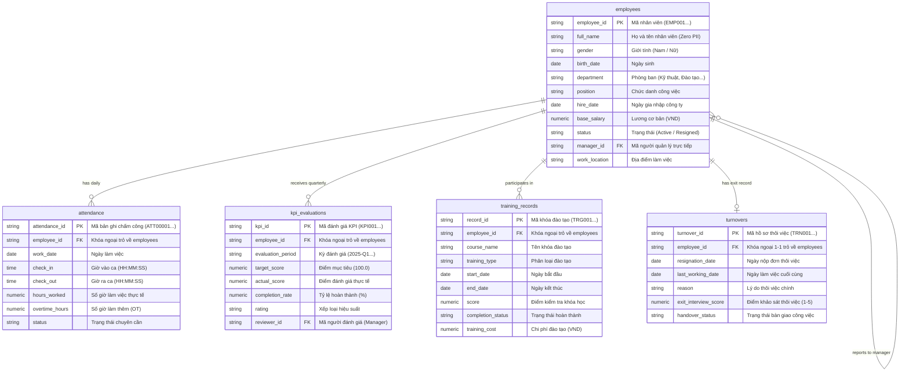

# ĐẶC TẢ KIẾN TRÚC VÀ MÔ HÌNH DỮ LIỆU NHÂN SỰ & VẬN HÀNH (`HR_ops_v1`)

> **Dự án**: CyberSoft Data & AI Lab  
> **Chương trình**: Thực tập sinh Data & AI Resource Engineer (30 ngày)  
> **Giai đoạn**: Tuần 2 — Tạo tài nguyên dữ liệu  
> **Tác giả**: Đào Trung Kiên  
> **Mã bàn giao**: `#DAY-07-HR-OPS-DATASET`  
> **Phiên bản**: 1.0.0 (Release Candidate)  

---

## 1. TỔNG QUAN BÀI TOÁN & GIÁ TRỊ GIẢNG DẠY

### 1.1. Bối cảnh Doanh nghiệp
Trong môi trường doanh nghiệp công nghệ và giáo dục quy mô vừa và lớn (như CyberSoft), dữ liệu Nhân sự (Human Resources) và Vận hành (Operations) đóng vai trò sống còn trong việc:
* Quản lý năng suất lao động, theo dõi chuyên cần và chi phí quỹ lương.
* Đánh giá hiệu suất nhân sự định kỳ (KPI & OKR) gắn liền với thăng tiến và đãi ngộ.
* Theo dõi lộ trình đào tạo nội bộ (Training & Development) nhằm nâng cao năng lực đội ngũ.
* Dự báo và kiểm soát tỷ lệ biến động nhân sự (Employee Turnover / Attrition), phát hiện sớm các nguy cơ mất nhân tài chủ chốt (Flight Risk).

### 1.2. Giá trị Giảng dạy và Thực hành
Bộ dữ liệu `HR_ops_v1` được thiết kế đặc thù cho học viên khối ngành **Data Analyst (DA)** và **Business Intelligence (BI)** tại CyberSoft với các năng lực mục tiêu:
1. **Thực hành Truy vấn SQL từ Cơ bản đến Nâng cao**:
   - Thao tác đa bảng (Multi-table JOINs, Self-JOIN mô hình phân cấp quản lý).
   - Truy vấn gom nhóm, tổng hợp có điều kiện (`GROUP BY`, `HAVING`, `CASE WHEN`).
   - Kỹ thuật Window Functions (`ROW_NUMBER`, `RANK`, `DENSE_RANK`, `LAG`, `LEAD`, `AVG() OVER (PARTITION BY ...)`).
   - CTEs (Common Table Expressions) và Subqueries đệ quy phân tích luồng nghỉ việc.
2. **Kỹ năng Phân tích Dữ liệu với Excel Nâng cao**:
   - Khởi tạo Pivot Table & Pivot Chart đa chiều.
   - Hàm tìm kiếm và xử lý động (`XLOOKUP`, `INDEX-MATCH`, `SUMIFS`, `COUNTIFS`, Dynamic Arrays `FILTER`, `UNIQUE`).
3. **Mô hình hóa Dữ liệu và Xây dựng Dashboard trên Power BI / Tableau**:
   - Thiết kế mô hình Star Schema / Snowflake Schema tối ưu hóa quan hệ 1-Nhiều (1-to-Many).
   - Viết các thước đo DAX (Measures) phức tạp: Headcount động theo thời gian, Rolling Turnover Rate, Average Tenure, Training ROI, KPI Performance Scorecard.

---

## 2. KIẾN TRÚC MÔ HÌNH DỮ LIỆU (DATA ARCHITECTURE & ERD)

Mô hình dữ liệu `HR_ops_v1` được tổ chức theo chuẩn quan hệ kết hợp Star Schema với 2 bảng chiều (Dimension Tables) và 3 bảng sự kiện / dữ kiện (Fact Tables):

---

## 3. THÔNG SỐ ĐỊNH LƯỢNG BỘ DỮ LIỆU (DATASET SPECS)

* **Tổng số bảng**: 5 bảng quan hệ chuẩn.
* **Tổng số bản ghi**: **> 6.600 bản ghi** (Vượt cam kết tối thiểu 5.000 bản ghi).
* **Phân bổ chi tiết từng bảng**:
  1. `employees.csv`: **250 bản ghi** (215 nhân sự đang làm việc, 35 nhân sự đã thôi việc).
  2. `attendance.csv`: **5.250 bản ghi** (Chấm công chi tiết của toàn bộ nhân sự qua các ngày làm việc tiêu chuẩn trong tháng).
  3. `kpi_evaluations.csv`: **705 bản ghi** (Dữ liệu đánh giá hiệu suất định kỳ theo các quý: 2025-Q1, 2025-Q2, 2025-Q3).
  4. `training_records.csv`: **450 bản ghi** (Lịch sử tham gia các khóa đào tạo nội bộ và chứng chỉ chuyên môn).
  5. `turnovers.csv`: **35 bản ghi** (Khớp chính xác 100% với 35 nhân sự có trạng thái `Resigned` trong bảng `employees`).
* **Thời gian sinh dữ liệu**: < 1.0 giây (Deterministic với seed=42).

---

## 4. MA TRẬN ĐỐI SOÁT & KIỂM TRA CHÉO KPI (KPI RECONCILIATION MATRIX)

| Mã KPI | Tên Chỉ số Nghiệp vụ | Công thức Tính toán | Quy tắc Kiểm tra Chéo (Cross-Validation) |
| :--- | :--- | :--- | :--- |
| **KPI-01** | Tỷ lệ Nghỉ việc (Turnover Rate) | `Turnover Rate = (Resigned / Avg Headcount) * 100%` | Số dòng trong `turnovers.csv` = Số bản ghi `employees.status = 'Resigned'`. Ngày `last_working_date` >= `hire_date`. |
| **KPI-02** | Tỷ lệ Chuyên cần (Attendance Rate) | `(Present + Late Days) / Total Scheduled Days * 100%` | Nhân viên nghỉ việc không được có phát sinh chấm công sau ngày `last_working_date`. |
| **KPI-03** | Tỷ lệ Đi trễ (Punctuality / Tardiness) | `Late Count / Total Working Days * 100%` | Bản ghi có `status = 'Late'` bắt buộc có `check_in > 08:30:00`. |
| **KPI-04** | Điểm KPI Trung bình (Average KPI) | `AVG(actual_score)` theo phòng ban & kỳ đánh giá | `completion_rate = round(actual_score / target_score * 100, 2)`. Phân loại rating phải khớp chính xác với completion_rate. |
| **KPI-05** | Tỷ lệ Hoàn thành Đào tạo (Training Rate) | `Completed Count / Total Enrolled * 100%` | Bản ghi `completion_status = 'Completed'` phải có `score >= 60.0` và `end_date >= start_date`. |

---

## 5. NGUYÊN TẮC AN TOÀN & BẢO MẬT DỮ LIỆU (ZERO PII COMPLIANCE)

1. **Tổng hợp Họ tên (Synthetic Names)**:
   - Sử dụng kho ngữ liệu thuần Việt gồm 15 họ phổ biến (Nguyễn, Trần, Lê, Phạm, Hoàng, Vũ, Võ, Phan, Trương, Bùi, Đặng, Đỗ, Ngô, Hồ, Dương), kết hợp 20 tên đệm và 30 tên riêng.
   - Không sử dụng bất kỳ thông tin thực tế nào của học viên, giảng viên hay nhân viên CyberSoft.
2. **Email & Số điện thoại ảo**:
   - Email chuẩn hóa không dấu: `{ho}.{dem}.{ten}.{id}@example.com`.
   - Toàn bộ domain đều trỏ về `@example.com` (chuẩn IETF RFC 2606 dành cho dữ liệu kiểm thử và giáo dục).
3. **Mức lương & Đãi ngộ**:
   - Dữ liệu lương được mô phỏng theo phân phối chuẩn theo vị trí công việc từ Junior (8 - 14 triệu) đến Director (40 - 55 triệu), không phản ánh bảng lương thực tế của tổ chức.
