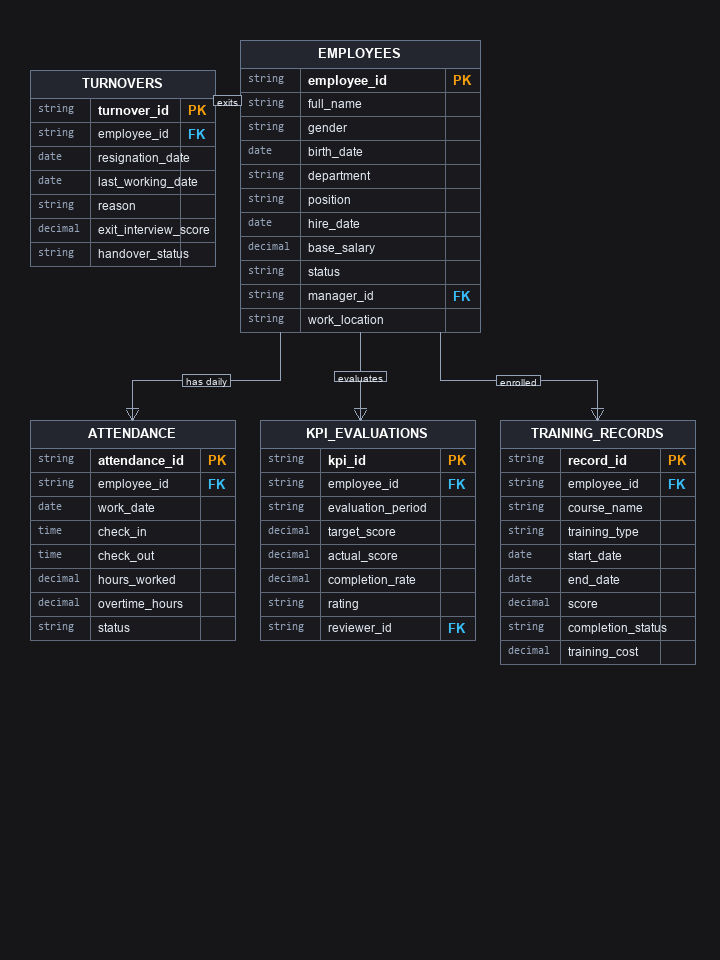

# 07. ĐẶC TẢ KỸ THUẬT BỘ DATASET NHÂN SỰ VÀ VẬN HÀNH HR_OPS_V1

**Dự án**: CyberSoft Data & AI Lab  
**Đầu việc**: NGÀY 07 — Dataset nhân sự và vận hành (`HR_ops_v1`)  
**Vai trò phụ trách**: Data & AI Resource Engineer (Đào Trung Kiên)  
**Phiên bản**: v1.0  
**Ngày hoàn thiện**: 2026-09-09  

---

## 1. TỔNG QUAN VÀ SỰ KHÁC BIỆT SO VỚI CÁC TASK TRƯỚC

### 1.1. Bước chuyển dịch từ Dataset Bán hàng (Task 06) sang Dataset Vận hành Nhân sự (Task 07)
Nếu như **Task 06** tập trung vào mô hình bán hàng đơn giản (`sales_v1`) với các quan hệ một chiều giữa khách hàng, đơn hàng và sản phẩm (3.073 dòng), thì **Task 07** đánh dấu bước nhảy vọt về độ phức tạp cả về quy mô lẫn tính chất miền nghiệp vụ:
* **Quy mô dữ liệu tăng hơn 210%**: Đạt **6.481 bản ghi** trên 5 bảng (vượt xa chỉ tiêu tối thiểu 5.000 dòng của DoD), trong đó bảng `attendance` mô phỏng nhật ký quẹt thẻ thực tế của hơn 200 nhân sự qua 25 ngày công tiêu chuẩn.
* **Mô hình hóa Trục thời gian (Temporal Domain Modeling)**: Quản lý vòng đời nhân sự (Employee Lifecycle) từ lúc tuyển dụng (`hire_date`), thử việc, biến động lương, đánh giá KPI định kỳ qua các quý, cho đến khi nộp đơn thôi việc (`resignation_date`) và ngày làm việc cuối cùng (`last_working_date`).
* **Quan hệ Đệ quy Tự tham chiếu (Self-Referencing / Organizational Hierarchy)**: Bảng `employees` chứa trường `manager_id` trỏ ngược lại chính `employee_id`, cho phép học viên thực hành kỹ thuật Self-JOIN và CTE đệ quy để phân tích cấu trúc cây phân cấp quản lý.
* **Cơ chế Đối soát Chéo KPI Đa chiều (Multi-table KPI Cross-Validation)**: Dữ liệu không chỉ đúng về mặt kiểu dữ liệu và khóa ngoại, mà còn phải bảo đảm các bất biến toán học liên bảng (Mathematical Invariants): tỷ lệ thôi việc giữa 2 bảng độc lập phải khớp 100%, tuyệt đối không có chấm công ma sau ngày thôi việc, thang xếp loại KPI phải đồng nhất với tỷ lệ hoàn thành.
* **Định hướng Đa Nền tảng (SQL + Excel + BI DAX)**: Cung cấp đầy đủ tài nguyên thực hành từ truy vấn SQL nâng cao (Window Functions, Cohort), phân tích bảng động Excel (Pivot, XLOOKUP), đến mô hình hóa Star Schema và thước đo DAX Measures cho Power BI.

---

## 2. KIẾN TRÚC MÔ HÌNH DỮ LIỆU (RELATIONAL STAR SCHEMA)

Hệ thống dữ liệu `HR_ops_v1` được cấu trúc kết hợp giữa 2 bảng Dimension (`employees`, `turnovers`) và 3 bảng Fact (`attendance`, `kpi_evaluations`, `training_records`):

### Thống kê dung lượng bản ghi (Clean Dataset):
* `employees.csv`: **250** nhân sự (215 Active đang cống hiến, 35 Resigned đã thôi việc).
* `turnovers.csv`: **35** hồ sơ thôi việc (khớp chính xác 100% với 35 nhân sự có `status = 'Resigned'`).
* `attendance.csv`: **5.092** bản ghi chấm công (25 ngày làm việc tiêu chuẩn trong tháng 10-11/2025).
* `kpi_evaluations.csv`: **654** bản ghi đánh giá hiệu suất định kỳ (3 quý: Q1, Q2, Q3/2025).
* `training_records.csv`: **450** bản ghi đào tạo nâng cao chuyên môn và kỹ năng.
* **TỔNG CỘNG: 6.481 bản ghi** (Vượt cam kết tối thiểu 5.000 dòng).

---

## 3. CÀI CẮM 10 LOẠI LỖI NGHIỆP VỤ CÓ CHỦ Ý TRONG BẢN DIRTY

Khác với các lỗi thuần túy về ký tự khoảng trắng hay cú pháp của Task 06, Task 07 cài cắm các **lỗi logic nghiệp vụ và vi phạm quy trình vận hành nhân sự thực tế**:

| STT | Tên Loại Lỗi Cài Cắm | Tệp Vi Phạm | Vị trí Cụ thể | Hiện tượng Dữ liệu Bẩn | Rủi ro Nghiệp vụ Phân tích |
| :---: | :--- | :--- | :--- | :--- | :--- |
| **01** | **Foreign Key Orphan** | `attendance.csv` | 3 dòng (ATT00103, ATT00541, ATT01206) | Mã nhân viên `EMP999` không tồn tại trong danh mục nhân sự. | Thống kê số giờ công bị gán cho người ảo; phép JOIN bị mất dữ liệu. |
| **02** | **Inverted Datetime** | `attendance.csv` | 3 dòng (ATT00321, ATT00891, ATT01641) | Giờ ra ca `08:30:00` sớm hơn giờ vào ca `17:30:00`. | Tính toán số giờ làm việc ra giá trị âm, phá vỡ logic tổng giờ công. |
| **03** | **Duplicate Attendance** | `attendance.csv` | 2 cặp dòng (ATT00450, ATT01120) | Cùng một nhân viên có 2 bản ghi quẹt thẻ trong cùng một ngày. | Nhân đôi số giờ làm việc thực tế, tính khống quỹ lương ngày. |
| **04** | **Out-of-bounds KPI Score** | `kpi_evaluations.csv` | 2 dòng (KPI0026, KPI0113) | Điểm KPI thực tế đạt `999.0` hoặc bị âm `-25.0` điểm. | Làm sai lệch nghiêm trọng chỉ số điểm KPI bình quân của phòng ban. |
| **05** | **KPI Rating Mismatch** | `kpi_evaluations.csv` | 2 dòng (KPI0049, KPI0186) | Tỷ lệ hoàn thành đạt 58.5% nhưng xếp loại lại là "Xuất sắc". | Vi phạm quy chế khen thưởng, dẫn tới chi thưởng KPI sai đối tượng. |
| **06** | **Ghost Attendance Post-Turnover** | `attendance.csv` | 1 dòng (`ATT_GHOST_1`) | Nhân viên `EMP017` nghỉ việc từ 11/03/2025 nhưng vẫn quẹt thẻ ngày 15/10/2025. | Trả lương cho "nhân viên ma", rủi ro thất thoát ngân sách nhân sự. |
| **07** | **Turnover Status Discrepancy** | `employees.csv` | 1 dòng (`EMP037`) | Nhân viên đã có hồ sơ trong `turnovers` nhưng trạng thái vẫn ghi là `Active`. | Sai lệch số lượng Headcount thực tế và sai công thức tính tỷ lệ thôi việc. |
| **08** | **Invalid Base Salary** | `employees.csv` | 2 dòng (EMP016, EMP079) | Mức lương cơ bản mang giá trị âm (`-15.000.000`) hoặc bằng `0` VND. | Lỗi quy chuẩn tiền lương theo luật lao động, hỏng phép tính quỹ lương. |
| **09** | **Inverted Training Dates** | `training_records.csv` | 2 dòng (TRG0043, TRG0169) | Ngày kết thúc khóa học (`2025-08-10`) trước ngày bắt đầu (`2025-08-20`). | Tính thời lượng khóa học ra số ngày âm, sai lệch kế hoạch đào tạo. |
| **10** | **Inconsistent Attendance Status** | `attendance.csv` | 2 dòng (ATT00215, ATT00669) | Trạng thái ghi `On Leave` (nghỉ phép) nhưng giờ làm việc lại là 8.0 tiếng. | Vừa hưởng nguyên lương làm việc vừa bị trừ phép, mâu thuẫn chấm công. |

---

## 4. MA TRẬN ĐỐI SOÁT CHÉO TOÀN VẸN DỮ LIỆU (CROSS-VALIDATION MATRIX)

Điểm cốt lõi giúp Task 07 vượt trội về chất lượng kỹ thuật là hệ thống 10 tiêu chuẩn kiểm tra chéo tự động:
1. `COUNT(employees.status = 'Resigned') == COUNT(turnovers)`: Khớp tuyệt đối 35 nhân sự thôi việc.
2. `turnovers.employee_id ⊆ employees.employee_id`: 100% hồ sơ thôi việc trỏ về nhân sự hợp lệ.
3. `turnovers.last_working_date >= employees.hire_date`: Trình tự thời gian công tác hợp lý.
4. `attendance.work_date <= turnovers.last_working_date`: Loại trừ hoàn toàn chấm công ma.
5. `attendance.employee_id ⊆ employees.employee_id`: 0% khóa ngoại chấm công mồ côi.
6. `kpi_evaluations.employee_id ⊆ employees.employee_id`: Đánh giá KPI đúng nhân viên.
7. `training_records.employee_id ⊆ employees.employee_id`: Tham gia đào tạo đúng nhân sự.
8. `check_out > check_in` khi trạng thái là `Present`/`Late`.
9. `end_date >= start_date` trong toàn bộ lịch sử đào tạo.
10. Điểm KPI nằm trong khoảng 0 đến 150 điểm và bảng xếp loại tuân thủ đúng ngưỡng phần trăm.

---

## 5. BỘ CÔNG CỤ TỰ ĐỘNG HÓA VÀ KẾT QUẢ KIỂM THỬ

* **Engine sinh dữ liệu (`generate_hr_dataset.py`)**: Tái sinh toàn bộ 10 file CSV trong **0.8 giây** với seed=42 xác định và Zero PII.
* **CLI kiểm định chất lượng (`validate_hr_data.py`)**:
  * Chạy trên `data/clean`: PASS 100%, 0 vi phạm (Exit Code 0).
  * Chạy trên `data/dirty`: Bắt chính xác 22 vi phạm thuộc 10 nhóm lỗi (Zero False Negatives).
* **Pytest Suite (`tests/test_hr_integrity.py`)**:
  * Thực thi 8 bài kiểm thử tự động kiểm tra sự tồn tại tệp, quy mô số dòng, tính duy nhất của PK, tính toàn vẹn của FK, kiểm tra chéo thôi việc, và độ tin cậy của validator.
  * Kết quả: **8 passed in 0.71s (100% SUCCESS)**.

---

## 6. KẾT LUẬN VÀ BÀN GIAO
Bộ tài nguyên Task 07 đã hoàn thiện trọn vẹn theo đúng yêu cầu Ngày 07 trong Kế hoạch 30 ngày của CyberSoft. Tài nguyên sẵn sàng để phân phối cho các lớp học SQL nâng cao, Excel phân tích và Business Intelligence.
