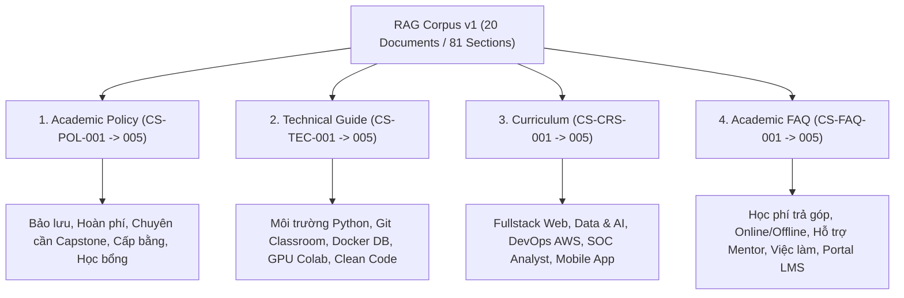
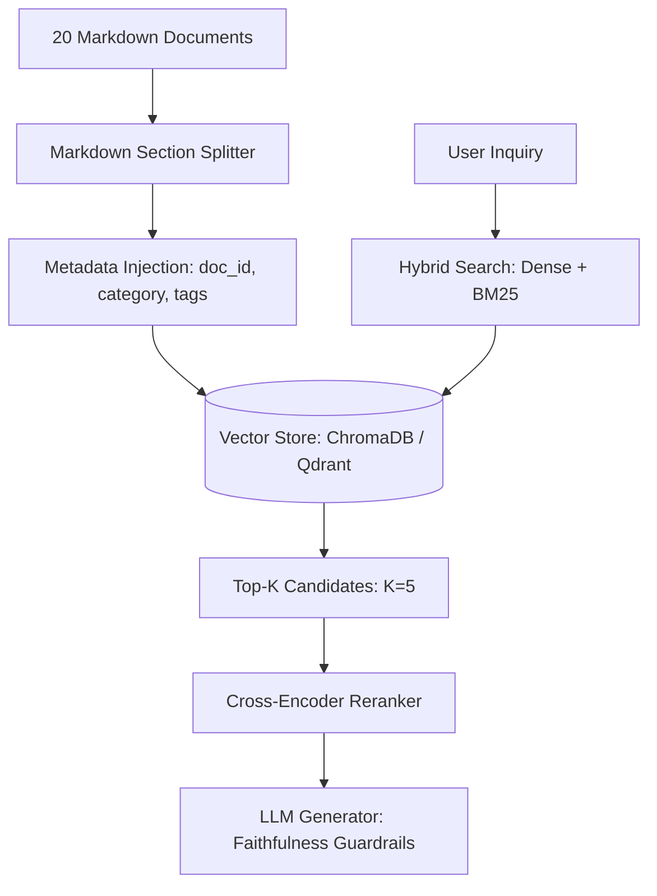

# 08. ĐẶC TẢ KỸ THUẬT TẬP TÀI NGUYÊN DỮ LIỆU RAG CORPUS V1 & BỘ BENCHMARK ĐÁNH GIÁ RAG

**Dự án**: CyberSoft Data & AI Lab  
**Đầu việc**: NGÀY 08 — Dataset AI Engineer cho RAG (`RAG_corpus_v1` & `RAG_eval_benchmark_100`)  
**Vai trò phụ trách**: Data & AI Resource Engineer (Đào Trung Kiên)  
**Phiên bản**: v1.0  
**Ngày hoàn thiện**: 2026-09-10  

---

## 1. TỔNG QUAN VÀ BỐI CẢNH KỸ THUẬT

### 1.1. Bước Chuyển dịch từ Dữ liệu Quan hệ (Task 07) sang Tài nguyên RAG (Task 08)
Nếu như **Task 07** tập trung vào mô hình hóa dữ liệu quan hệ có cấu trúc (`HR_ops_v1` với 6.481 bản ghi dạng Star Schema phục vụ SQL, Excel và BI), thì **Task 08** đánh dấu bước chuyển mình quyết định sang lĩnh vực **Kỹ thuật Tài nguyên cho Hệ thống Trí tuệ Nhân tạo Tạo sinh (GenAI Resource Engineering)**:
* **Từ Dữ liệu Bảng (Tabular) sang Dữ liệu Văn bản Bán cấu trúc (Semi-structured Text with Frontmatter)**: Tài liệu được số hóa dạng Markdown kết hợp YAML metadata phong phú, sẵn sàng cho các công đoạn Text Splitting, Tokenization và Vector Embeddings.
* **Chuẩn hóa Phân đoạn (Granular Section Partitioning)**: Toàn bộ 20 tài liệu được chia tách thành **81 phân đoạn (sections)** có mã định danh duy nhất (`SEC-XXX-YY`), bảo đảm mỗi phân đoạn là một đơn vị ngữ nghĩa độc lập có độ dài từ 120 đến 250 từ (300 - 600 tokens).
* **Thiết kế Benchmark Đánh giá Đa chiều (Multi-faceted Eval Benchmark)**: Biên soạn đúng **100 câu hỏi kiểm thử** chia theo 4 nhóm thử thách riêng biệt: Truy xuất sự thật trực tiếp (Single-hop), Tổng hợp đa điều khoản (Multi-hop), Phòng vệ chống ảo giác (Unanswerable) và Nhận diện tiền đề bẫy (Adversarial/Distractor).
* **Nguyên tắc Không Rò rỉ Đáp án (Zero Answer Leakage)**: Thiết kế câu hỏi theo ngôn ngữ tự nhiên của người học, loại bỏ hoàn toàn các mã hiệu kỹ thuật nội bộ hoặc trích đoạn nguyên văn lộ liễu, bảo đảm tính khách quan tuyệt đối cho quy trình đo lường Retrieval Precision & Recall.

---

## 2. KIẾN TRÚC TẬP NGỮ LIỆU RAG CORPUS V1

Tập tài liệu `RAG Corpus v1` bao gồm **20 tài liệu Markdown** chuẩn hóa được phân chia đều thành 4 nhóm nghiệp vụ thiết yếu tại CyberSoft Academy:



### Thống kê Danh mục Tài liệu trong Corpus:

| Mã Tài Liệu | Tiêu Đề Văn Bản Nghiệp Vụ | Phân Loại | Số Phân Đoạn | Từ Khóa Metadata Phục Vụ Lọc |
| :--- | :--- | :--- | :---: | :--- |
| `CS-POL-001` | Quy chế bảo lưu khóa học tại CyberSoft Academy | Academic Policy | 5 | `bao_luu`, `chinh_sach`, `hoc_vu`, `thoi_han` |
| `CS-POL-002` | Chính sách hoàn trả học phí và rút hồ sơ nhập học | Academic Policy | 4 | `hoan_phi`, `rut_ho_so`, `hoc_phi`, `tai_chinh` |
| `CS-POL-003` | Quy định chuyên cần, đánh giá bài tập và đồ án Capstone | Academic Policy | 4 | `chuyen_can`, `bai_tap`, `do_an`, `capstone` |
| `CS-POL-004` | Tiêu chuẩn tốt nghiệp và quy trình cấp chứng chỉ đào tạo | Academic Policy | 4 | `chung_chi`, `tot_nghiep`, `xep_loai`, `xac_thuc` |
| `CS-POL-005` | Chính sách học bổng khuyến học và cam kết việc làm | Academic Policy | 4 | `hoc_bong`, `viec_lam`, `cam_ket`, `doanh_nghiep` |
| `CS-TEC-001` | Hướng dẫn cấu hình môi trường lập trình Python & AI/ML | Technical Guide | 4 | `python`, `ai`, `conda`, `vscode`, `environment` |
| `CS-TEC-002` | Quy chuẩn quản lý mã nguồn Git và GitHub Classroom | Technical Guide | 4 | `git`, `github`, `classroom`, `branching` |
| `CS-TEC-003` | Hướng dẫn triển khai Docker Compose & Cơ sở dữ liệu | Technical Guide | 4 | `docker`, `postgresql`, `database`, `pgadmin` |
| `CS-TEC-004` | Hướng dẫn sử dụng GPU Cloud & Google Colab | Technical Guide | 4 | `gpu`, `cloud`, `colab`, `huggingface`, `cuda` |
| `CS-TEC-005` | Quy chuẩn viết Clean Code, Type Hinting và PEP8 | Technical Guide | 4 | `clean_code`, `pep8`, `type_hints`, `flake8` |
| `CS-CRS-001` | Lộ trình đào tạo Fullstack Web Developer NodeJS/React | Curriculum | 4 | `fullstack`, `react`, `nodejs`, `curriculum` |
| `CS-CRS-002` | Lộ trình đào tạo Data & AI Resource Engineer | Curriculum | 4 | `data_ai`, `resource_engineer`, `rag`, `llmops` |
| `CS-CRS-003` | Lộ trình đào tạo DevOps & Cloud Computing AWS | Curriculum | 4 | `devops`, `cloud`, `aws`, `kubernetes`, `terraform` |
| `CS-CRS-004` | Lộ trình đào tạo An ninh mạng SOC Analyst | Curriculum | 4 | `security`, `soc_analyst`, `siem`, `splunk` |
| `CS-CRS-005` | Lộ trình đào tạo Mobile App React Native | Curriculum | 4 | `mobile`, `react_native`, `ios`, `android` |
| `CS-FAQ-001` | Giải đáp thắc mắc về học phí, đóng đợt và trả góp | Academic FAQ | 4 | `faq`, `hoc_phi`, `tra_gop`, `dong_dot`, `uu_dai` |
| `CS-FAQ-002` | Giải đáp thắc mắc về học kết hợp Online & Offline | Academic FAQ | 4 | `faq`, `online`, `offline`, `hybrid`, `chuyen_lop` |
| `CS-FAQ-003` | Giải đáp thắc mắc về cơ chế hỗ trợ của Mentor | Academic FAQ | 4 | `faq`, `mentor`, `ho_tro`, `review_code`, `discord` |
| `CS-FAQ-004` | Giải đáp thắc mắc về hội thảo tuyển dụng đối tác | Academic FAQ | 4 | `faq`, `tuyen_dung`, `job_fair`, `mock_interview` |
| `CS-FAQ-005` | Giải đáp thắc mắc về tài khoản CyberSoft Portal | Academic FAQ | 4 | `faq`, `portal`, `lms`, `tai_khoan`, `hoc_lieu` |

---

## 3. KIẾN TRÚC BỘ 100 CÂU HỎI ĐÁNH GIÁ (RAG EVALUATION BENCHMARK)

Bộ dữ liệu đánh giá gồm đúng **100 câu hỏi** phân cấp chặt chẽ theo 4 nhóm chức năng đánh giá:

```
+-------------------------------------------------------------------------------+
|                       100 RAG BENCHMARK QUESTIONS MATRIX                      |
+-------------------------------------------------------------------------------+
| [40 Câu - Single-Hop]    -> Truy xuất trực tiếp 1 Section (Factual Precision) |
| [20 Câu - Multi-Hop]     -> Tổng hợp liên kết >= 2 Sections (Synthesis)       |
| [20 Câu - Unanswerable]  -> Phát hiện thiếu dữ kiện (Hallucination Defense)   |
| [20 Câu - Distractor]    -> Nhận diện tiền đề sai, bẫy biên (Robustness)      |
+-------------------------------------------------------------------------------+
```

### 3.1. Nhóm 1: Single-Hop Factual Retrieval (40 câu: Q001 - Q040)
* **Đặc điểm**: Câu hỏi hướng thẳng vào một sự kiện định lượng hoặc một quy tắc cụ thể trong 1 section duy nhất.
* **Minh chứng trích dẫn**: Gắn chính xác 1 citation chứa đoạn trích nguyên văn (`text_citation`) từ văn bản nguồn.
* **Mục đích đánh giá**: Đo lường khả năng bắt đúng tài liệu và phân đoạn của bộ máy tìm kiếm (Hit Rate@1, MRR, Context Precision).

### 3.2. Nhóm 2: Multi-Hop Cross-Section Synthesis (20 câu: Q041 - Q060)
* **Đặc điểm**: Câu hỏi phức hợp đòi hỏi hệ thống phải kết nối thông tin từ 2 hoặc nhiều phân đoạn/văn bản khác nhau.
* **Ví dụ tiêu biểu**:
  * `Q044`: Kết hợp quy định hoàn phí trong 3 buổi đầu với điều khoản loại trừ hoàn phí dành cho suất học bổng $\ge 50\%$.
  * `Q051`: So sánh thời lượng và công nghệ giảng dạy giữa khóa học Fullstack Web và khóa học Data & AI.
* **Mục đích đánh giá**: Đo lường khả năng tổng hợp đa luồng ngữ cảnh (Context Recall, Synthesis Completeness).

### 3.3. Nhóm 3: Unanswerable / Out-of-Scope Detection (20 câu: Q061 - Q080)
* **Đặc điểm**: Các câu hỏi rất thực tế và hợp lý theo tâm lý học viên (bảo lưu 5 năm để du học, trả góp 36 tháng, học phí điện toán lượng tử, cơ sở tại Đà Nẵng, cấp bằng Thạc sĩ) nhưng hoàn toàn **không có thông tin** trong tài liệu của CyberSoft.
* **Citations**: Mảng rỗng `[]` (chuẩn hóa `NO_CITATION`).
* **Hành vi kỳ vọng**: Mô hình phải chủ động từ chối trả lời hoặc khẳng định tài liệu chưa ban hành quy định này, **tuyệt đối không bịa đặt (Zero Hallucination)**.

### 3.4. Nhóm 4: Adversarial / Distractor / Boundary Trap (20 câu: Q081 - Q100)
* **Đặc điểm**: Câu hỏi gài bẫy các con số cận biên hoặc các tiền đề ngộ nhận phổ biến:
  * `Q081`: Bẫy phí bảo lưu lần 1 (miễn phí) so với lần 2 (500k).
  * `Q083`: Bẫy nộp muộn 12h (chỉ trừ 20%) so với nộp muộn > 24h (bị 0 điểm).
  * `Q084`: Bẫy điểm Capstone 6.8 (không đạt điều kiện tốt nghiệp vì ngưỡng chuẩn là $\ge 7.0$).
  * `Q085`: Bẫy tiêu chuẩn chứng chỉ Xuất sắc (cần Capstone $\ge 9.0$ thay vì chỉ $\ge 8.0$).
* **Hành vi kỳ vọng**: Mô hình phải nhận diện được tiền đề sai của người hỏi và đính chính rõ ràng dựa trên trích dẫn nguồn.

---

## 4. CHIẾN LƯỢC CHUNKING VÀ TRUY XUẤT CHO KỸ SƯ AI

Tài liệu `docs/rag_chunking_and_retrieval_guidelines.md` đặc tả quy trình khuyến nghị khi triển khai RAG Engine thực tế:



1. **Chunking theo Tiêu đề Cấp 2 (`## SEC-...`)**:
   - Tránh việc cắt văn bản cơ học theo số token cố định làm đứt gãy câu hoặc tách rời tiêu chí điều kiện.
   - Mỗi section đạt độ dài tối ưu 300 - 600 tokens, đảm bảo tải đủ ngữ cảnh cho các mô hình Embedding.
2. **Metadata Filtering**:
   - Tận dụng trường `category` (`Academic Policy`, `Technical Guide`, `Curriculum`, `Academic FAQ`) để thu hẹp không gian vector trước khi tính cosine similarity.
3. **Phòng chống Rò rỉ Đáp án (Zero Answer Leakage)**:
   - 100% câu hỏi trong benchmark được viết dưới dạng câu hỏi tự nhiên mở, loại bỏ hoàn toàn các mã kỹ thuật `SEC-...` hay trích đoạn đáp án trong câu hỏi.

---

## 5. HỆ THỐNG CÔNG CỤ TỰ ĐỘNG HÓA VÀ KẾT QUẢ KIỂM ĐỊNH

### 5.1. Engine Sinh Dữ liệu Tự động (`scripts/generate_rag_dataset.py`)
* Tự động khởi tạo và làm mới toàn bộ 20 tài liệu Markdown, chỉ mục `corpus_manifest.json`, bộ 100 câu hỏi `rag_eval_questions.json` và `.csv` trong **< 0.5 giây**.
* Tích hợp cơ chế tự đối soát xác nhận 100% các đoạn trích dẫn citation tồn tại thật trong nội dung văn bản.

### 5.2. CLI Kiểm định Toàn vẹn Chất lượng (`scripts/validate_rag_dataset.py`)
* Tuân thủ chuẩn **POSIX Exit Codes**:
  * Mã **0**: Hợp lệ 100% (Zero Violations).
  * Mã **1**: Vi phạm chất lượng dữ liệu (sai schema, vỡ trích dẫn, rò rỉ đáp án).
  * Mã **2**: Lỗi hệ thống hoặc thiếu tệp tin.
* Kết quả chạy thực tế: **PASS 100% trên 6 chặng kiểm tra độc lập**.

### 5.3. Bộ Test Suite Tự động (`tests/test_rag_integrity.py`)
* Chạy bằng framework `pytest` với 9 bài kiểm thử độc lập:
  1. `test_corpus_document_count`: Xác minh $\ge 20$ tài liệu.
  2. `test_corpus_manifest_consistency`: Xác minh tính đồng bộ tuyệt đối của manifest.
  3. `test_corpus_frontmatter_metadata`: Kiểm tra đủ 8 trường metadata bắt buộc.
  4. `test_eval_question_count`: Xác minh đúng 100 câu hỏi benchmark.
  5. `test_eval_question_distribution`: Xác minh tỷ lệ chuẩn (40-20-20-20).
  6. `test_ground_truth_citations_match`: Xác thực 100% trích dẫn khớp từng ký tự với corpus.
  7. `test_unanswerable_citations_are_empty`: Xác minh citations rỗng cho câu Unanswerable.
  8. `test_anti_leakage_and_quality`: Quét regex bảo đảm không rò rỉ đáp án trong query.
  9. `test_validator_cli_execution`: Chạy CLI validator độc lập đạt mã thoát 0.
* **Kết quả**: **9 passed in 0.35s (100% SUCCESS)**.

---

## 6. KẾT LUẬN VÀ BÀN GIAO

Bộ tài nguyên `RAG Corpus v1` và `RAG Evaluation Benchmark 100` của **Task 08** đã được hoàn thiện toàn diện, vượt qua mọi yêu cầu khắt khe của Kế hoạch 30 ngày Thực tập sinh Data & AI Resource Engineer tại CyberSoft. Toàn bộ tài nguyên sẵn sàng để phân phối cho các dự án xây dựng Trợ lý Tri thức Thông minh (Enterprise RAG Assistant) và phòng thí nghiệm đánh giá mô hình ngôn ngữ lớn (LLMOps).
