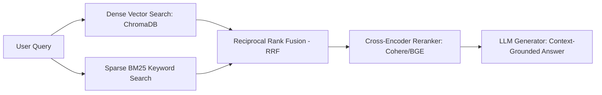

# Hướng dẫn Kỹ thuật: Chiến lược Phân đoạn (Chunking) & Truy xuất (Retrieval) cho CyberSoft RAG

Tài liệu này cung cấp chỉ dẫn kỹ thuật dành cho Kỹ sư AI khi xây dựng hệ thống RAG trên bộ tài nguyên `RAG Corpus v1`.

## 1. Đặc thù của Bộ Dữ liệu CyberSoft RAG Corpus v1
- **Tính pháp lý và quy chuẩn cao**: Mỗi điều khoản quy chế (`CS-POL`), quy chuẩn kỹ thuật (`CS-TEC`) hoặc biểu phí (`CS-FAQ`) đều có các con số định lượng chính xác (ví dụ: 80% chuyên cần, 500.000 VNĐ, 6 tháng).
- **Cấu trúc phân tầng rõ nét**: Tài liệu được chia thành các Document -> Section có định danh ID chuẩn hóa (`SEC-XXX-YY`).

## 2. Chiến lược Phân đoạn Đề xuất (Chunking Strategy)

### 2.1. Phân đoạn theo Cấu trúc Tiêu đề (Markdown Header Chunking) - Khuyến nghị số 1
Thay vì cắt văn bản cố định theo số lượng ký tự cơ học (Fixed-size Chunking), hệ thống nên cắt theo ranh giới thẻ tiêu đề cấp 2 `## SEC-...`:
- **Ưu điểm**: Giữ trọn vẹn ngữ cảnh của một điều khoản quy chế hoàn chỉnh, không làm đứt đoạn câu hay phân tách bảng điều kiện.
- **Kích thước chunk trung bình**: Mỗi section trong corpus dao động từ **120 đến 250 từ** (khoảng 300 - 600 tokens), kích thước lý tưởng cho các mô hình embedding hiện đại (`text-embedding-3-small`, `bge-m3`, `vietnamese-bi-encoder`).

### 2.2. Chiến lược Phân tầng Cha - Con (Parent-Child / Hierarchical Chunking)
- **Child Chunk (Nhỏ)**: Các câu đơn lẻ hoặc đoạn văn 100 tokens phục vụ cho việc tính điểm tương đồng Vector Similarity chính xác cao.
- **Parent Chunk (Lớn)**: Toàn bộ Section hoặc Document metadata tương ứng được trả về cho LLM Generator để đọc hiểu toàn diện bối cảnh.

## 3. Chiến lược Truy xuất Kết hợp (Hybrid Search & Reranking)

1. **Dense Retrieval**: Sử dụng cosine similarity để bắt các truy vấn mang tính diễn đạt đồng nghĩa (ví dụ: "xin nghỉ học tạm thời" -> `CS-POL-001 Quy chế bảo lưu`).
2. **Sparse Retrieval (BM25)**: Bắt chính xác các từ khóa số liệu và mã lỗi (ví dụ: "500.000 VNĐ", "ModuleNotFoundError", "CS-F-01").
3. **Metadata Filtering**: Khi người dùng chỉ định rõ chủ đề (ví dụ: "chính sách học phí"), hệ thống có thể pre-filter theo `category: Academic Policy`.
