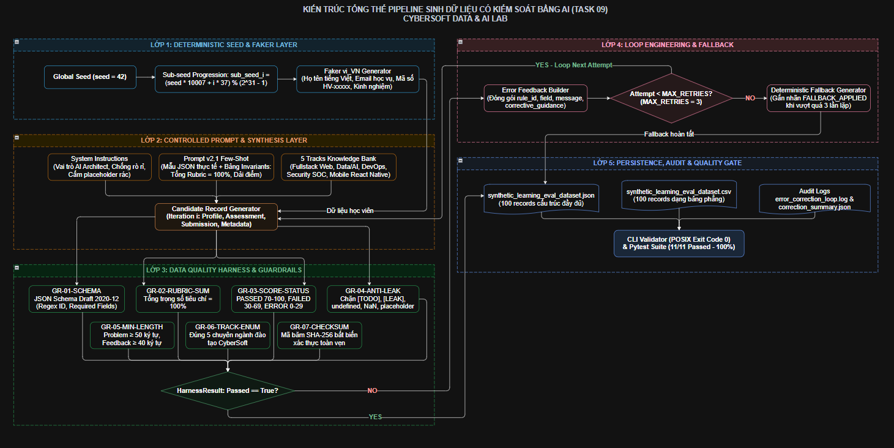

# 09. ĐẶC TẢ KỸ THUẬT: PIPELINE SINH DỮ LIỆU CÓ KIỂM SOÁT BẰNG AI

**Dự án**: CyberSoft Data & AI Lab  
**Đầu việc**: NGÀY 09 — Pipeline sinh dữ liệu có kiểm soát bằng AI (`synthetic_learning_eval_dataset` & `data_quality_harness`)  
**Vai trò phụ trách**: Data & AI Resource Engineer (Đào Trung Kiên)  
**Phiên bản**: v1.0  
**Ngày hoàn thiện**: 2026-09-11  

---

## 1. TỔNG QUAN VÀ BỐI CẢNH KỸ THUẬT

### 1.1. Bước Chuyển dịch từ RAG Corpus (Task 08) sang Pipeline Sinh Dữ liệu Có Kiểm soát (Task 09)
* **Task 08** đã hoàn thành việc xây dựng tập ngữ liệu tĩnh `RAG Corpus v1` (20 tài liệu Markdown, 81 sections) và 100 câu hỏi Benchmark kèm Ground-Truth Citations chuẩn xác.
* **Task 09** nâng tầm năng lực kỹ thuật dữ liệu lên tầng tự động hóa chủ động: **Xây dựng Pipeline sinh dữ liệu học tập tổng hợp (Synthetic Data Pipeline) có kiểm soát bằng AI**, kết hợp các công cụ sinh dữ liệu tất định và cơ chế tự sửa lỗi tự động.
* **Bốn Thách thức Cốt lõi của Việc Sinh Dữ liệu bằng LLM**:
  1. **Ảo giác Cấu trúc (Structural Hallucination)**: Mô hình ngôn ngữ tự do xuất định dạng JSON không đồng nhất, thiếu các trường bắt buộc hoặc sai kiểu dữ liệu.
  2. **Bất đối xứng Số học (Arithmetic Inconsistency)**: Trọng số các tiêu chí rubric được AI gán tùy hứng, thường xuyên có tổng khác $100\%$ (ví dụ: $30\% + 40\% + 40\% = 110\%$).
  3. **Mâu thuẫn Logic Nghiệp vụ (Business Rule Conflicts)**: AI có xu hướng gán điểm cao một cách máy móc ngay cả khi bài nộp của học viên bị lỗi cú pháp (`SYNTAX_ERROR`) hoặc không qua bài test (`FAILED_TESTS`).
  4. **Thiếu Tính Tái lập (Non-Deterministic Drift)**: Các lần chạy khác nhau tạo ra các tập dữ liệu trôi dạt, không thể tái lập bit-exact để phục vụ quy trình kiểm thử hồi quy trong CI/CD.

### 1.2. Mục tiêu Kỹ thuật Cam kết của Task 09
* Thiết kế và vận hành thành công **AI-Controlled Synthetic Data Pipeline** kết hợp thư viện Faker (`vi_VN`) và kiểm soát hạt giống tất định (`seed=42`).
* Chuẩn hóa hợp đồng dữ liệu qua **JSON Schema Draft 2020-12** (`record_schema.json`) và Pydantic.
* Thiết lập **Data Quality Harness** đa tầng kiểm định độc lập 7 chốt chặn bảo vệ (Guardrails).
* Hiện thực hóa kỹ thuật **Loop Engineering**: Vòng lặp phản hồi chẩn đoán lỗi (Self-Correction Loop) với giới hạn dừng cứng `MAX_RETRIES = 3` và bộ sinh dự phòng an toàn (**Deterministic Fallback Generator**).
* Đảm bảo tính tất định tuyệt đối: Cùng một giá trị `seed` tái sinh ra tập dữ liệu trùng khớp $100\%$ từng ký tự (Bit-exact match).

---

## 2. KIẾN TRÚC TỔNG THỂ HỆ THỐNG PIPELINE

Pipeline được tổ chức thành 5 phân lớp độc lập, tuần tự và khép kín:



### Mô tả 5 Phân lớp Kỹ thuật trong Kiến trúc Pipeline:
1. **Lớp 1 — Seed Engine & Context Generator (Khởi tạo Tất định)**:
   - Tiếp nhận và quản lý hạt giống toàn cục (`seed=42`) với cơ chế trượt sub-seed lũy tiến theo từng index bản ghi.
   - Tích hợp thư viện Faker (`vi_VN`) tạo lập danh tính học viên (Họ tên tiếng Việt chuẩn hóa, Email, Mã học viên `HV-[0-9]{4}`).
2. **Lớp 2 — Controlled LLM Synthesis (Điều phối Sinh Dữ liệu)**:
   - Áp dụng bộ chỉ dẫn hệ thống `system_instructions.md` nghiêm ngặt (chống rò rỉ token cấm, ép khuôn cấu trúc JSON).
   - Truyền tải Prompt template Few-Shot v2.1 với ma trận tri thức 5 chuyên ngành CyberSoft (`WEB`, `DATA`, `DEVOPS`, `SEC`, `MOB`), ràng buộc các điều kiện số học bất biến (`invariants`).
3. **Lớp 3 — Data Quality Harness & 7 Guardrails (Kiểm định Đa tầng)**:
   - Độc lập rà soát ứng viên bản ghi qua 7 chốt chặn: `GR-01-SCHEMA`, `GR-02-RUBRIC-SUM`, `GR-03-SCORE-STATUS`, `GR-04-ANTI-LEAK`, `GR-05-MIN-LENGTH`, `GR-06-TRACK-ENUM`, `GR-07-CHECKSUM`.
   - Phân luồng: Bản ghi đạt $100\%$ tiêu chuẩn được chuyển thẳng sang Lớp 5; bản ghi vi phạm được bóc tách mã lỗi chi tiết.
4. **Lớp 4 — Self-Correction Loop & Fallback Engine (Tự Phục hồi & Dự phòng)**:
   - Vòng lặp phản hồi: Đóng gói thông điệp chẩn đoán lỗi theo `error_feedback_schema.json` để yêu cầu AI tự sửa đổi với giới hạn dừng cứng `MAX_RETRIES = 3`.
   - Cơ chế Fallback an toàn: Kích hoạt tự động bộ sinh dự phòng tất định **Deterministic Fallback Generator** gắn nhãn `FALLBACK_APPLIED` khi chạm ngưỡng retries, loại trừ tuyệt đối nguy cơ sập hoặc treo vô hạn.
5. **Lớp 5 — Storage & Serialization Layer (Lưu trữ & Niêm phong Bất biến)**:
   - Xuất dữ liệu đồng bộ ra 2 định dạng: `synthetic_learning_eval_dataset.json` (cấu trúc phân cấp) và `synthetic_learning_eval_dataset.csv` (dạng bảng trích xuất).
   - Ghi nhận đầy đủ audit log tại `data/logs/error_correction_loop.log` và thống kê tổng hợp `correction_summary.json`.
   - Tính toán mã băm SHA-256 toàn vẹn cho tập dữ liệu phục vụ xác thực bảo mật.

## 3. ĐẶC TẢ CƠ SỞ TRI THỨC 5 CHUYÊN NGÀNH ĐÀO TẠO

Tập dữ liệu tổng hợp 100 bản ghi được phân bổ cân đối trên 5 chương trình đào tạo chuẩn của CyberSoft Academy:

| Mã Nhóm | Chuyên Ngành Đào Tạo | Quy Mô | Các Module Trọng Tâm | Dạng Bài Toán Thách Thức Điển Hình |
| :---: | :--- | :---: | :--- | :--- |
| `WEB` | **Fullstack Web Developer** | 25 | NodeJS Backend, React Advanced, Next.js App Router | JWT Rotation & Redis, Database Indexing, Custom Hook useDebounce |
| `DATA` | **Data & AI Resource Engineer** | 25 | Scrapy Pipeline, RAG Architecture, Vector DB, Quality Harness | Semantic Header Chunking, Anti-Leakage Linter, Self-Correction Loop |
| `DEVOPS`| **DevOps & Cloud Computing** | 20 | Docker Multi-stage, Kubernetes HPA, GitHub Actions CI/CD | Image Optimization <150MB, Zero-Downtime Rolling Update |
| `SEC` | **Cybersecurity SOC Analyst** | 15 | Traffic Analysis Wireshark, SIEM Splunk, OWASP Top 10 | SQL Injection Defense with Prepared Statements, Event Correlation |
| `MOB` | **Mobile App React Native** | 15 | React Native Core, Offline-First WatermelonDB, Redux | Offline Sync Queue with SQLite, Last-Write-Wins Conflict Resolution |

---

## 4. HỆ THỐNG 7 CHỐT CHẶN BẢO VỆ DỮ LIỆU (QUALITY GUARDRAILS)

Hệ thống Data Quality Harness (`quality_harness.py`) thực thi quy trình kiểm định 7 bước độc lập đối với mọi ứng viên bản ghi:

### 4.1. `GR-01-SCHEMA`: Kiểm chuẩn Cấu trúc JSON Schema
* Toàn bộ bản ghi phải tuân thủ JSON Schema Draft 2020-12 được định nghĩa trong `data_dictionary/record_schema.json`.
* Kiểm tra bắt buộc sự hiện diện của 5 phân khu: `record_id`, `student_profile`, `learning_assessment`, `student_submission`, và `generation_metadata`.
* Định dạng mã bản ghi `record_id`: Chuỗi regex `^REC-CYB-[0-9]{4}$`.
* Định dạng mã bài toán `challenge_id`: Chuỗi regex `^CHAL-[A-Z]{3,6}-[0-9]{3}$` (hỗ trợ các tiền tố WEB, DATA, DEV, DEVOPS, SEC, MOB).

### 4.2. `GR-02-RUBRIC-SUM`: Bất biến Số học Tổng Trọng số Rubric
* Mỗi bài toán kỹ thuật chứa từ 2 đến 5 tiêu chí đánh giá.
* Tổng trọng số phần trăm của các tiêu chí bắt buộc phải bằng đúng **$100\%$**:
  $$\sum_{i=1}^{k} \text{weight\_percent}_i = 100 \quad (2 \le k \le 5, \quad 5 \le \text{weight\_percent}_i \le 100)$$
* Mọi trường hợp tổng lệch khỏi 100 đều bị từ chối ở mức `CRITICAL`.

### 4.3. `GR-03-SCORE-STATUS`: Tính Tương thích Logic Trạng thái - Điểm số
Loại bỏ hoàn toàn hiện tượng AI chấm điểm mâu thuẫn với kết quả thực thi bài làm:
$$\text{Score}(status) \in \begin{cases} [70, 100] & \text{khi } status = \text{"PASSED"} \\ [30, 69] & \text{khi } status = \text{"FAILED\_TESTS"} \\ [0, 29] & \text{khi } status \in \{\text{"SYNTAX\_ERROR"}, \text{"TIMEOUT"}\} \end{cases}$$

### 4.4. `GR-04-ANTI-LEAK`: Chốt chặn Chống Ký tự Giả lập & Rác Dữ liệu
* Quét toàn bộ payload để phát hiện các chuỗi placeholder mà mô hình AI có xu hướng sinh khi thiếu dữ kiện:
  $$\text{Blacklist} = \{ \text{"[TODO"}, \text{"[LEAK"}, \text{"Lorem ipsum"}, \text{"undefined"}, \text{"NaN"}, \text{"null\_marker"}, \text{"PLACEHOLDER"} \}$$

### 4.5. `GR-05-MIN-LENGTH`: Kiểm soát Độ sâu Ngữ cảnh Tối thiểu
* Yêu cầu `problem_statement` $\ge 50$ ký tự nhằm bảo đảm bài toán có bối cảnh kỹ thuật chân thực.
* Yêu cầu `mentor_feedback` $\ge 40$ ký tự tiếng Việt nhằm bảo đảm nhận xét mang tính sư phạm và hướng dẫn cải tiến cụ thể.

### 4.6. `GR-06-TRACK-ENUM`: Ranh giới Miền Học vụ
* Chuyên ngành học tập bắt buộc phải thuộc đúng 5 chuyên ngành trong danh mục chuẩn của CyberSoft. Mọi giá trị ngoài danh mục đều bị chặn.

### 4.7. `GR-07-CHECKSUM`: Xác thực Toàn vẹn Bất biến SHA-256
* Bản ghi sau khi sinh được tuần tự hóa (Canonical JSON Serialization) và tính toán mã băm SHA-256 lưu trong `generation_metadata.checksum_sha256`.
* Nếu nội dung bị chỉnh sửa trái phép mà không cập nhật mã băm, Harness sẽ lập tức phát hiện và cảnh báo vi phạm tính toàn vẹn.

---

## 5. THIẾT KẾ VÒNG LẶP SỬA LỖI & CƠ CHẾ DỰ PHÒNG TẤT ĐỊNH (LOOP ENGINEERING)

### 5.1. Cấu trúc Thông điệp Phản hồi Lỗi (Error Feedback Loop)
Khi phát hiện bản ghi không đạt chuẩn, Data Quality Harness đóng gói đối tượng `HarnessResult` tuân thủ `error_feedback_schema.json`:
```json
{
  "record_id": "REC-CYB-0019",
  "attempt": 1,
  "passed": false,
  "error_count": 1,
  "violations": [
    {
      "rule_id": "GR-02-RUBRIC-SUM",
      "severity": "CRITICAL",
      "field": "learning_assessment.rubric_criteria",
      "message": "Rubric criteria weights sum to 115%, but must equal exactly 100%."
    }
  ],
  "corrective_guidance": "Rebalance rubric criteria so that weight_percent values sum exactly to 100."
}
```
Thông điệp chẩn đoán này được đưa trực tiếp vào vòng lặp kế tiếp để AI tự điều chỉnh lại giá trị vi phạm.

### 5.2. Ngăn ngừa Vòng lặp Vô hạn & Kích hoạt Fallback
* **Ngưỡng dừng lặp**: Giới hạn cứng `MAX_RETRIES = 3`. Sau 3 lần thử mà bản ghi vẫn không vượt qua kiểm định, pipeline không bị treo mà tự động kích hoạt **Deterministic Fallback Generator** (`_generate_fallback_record()`).
* **Đặc tính Fallback**:
  - Khởi tạo bản ghi an toàn từ mẫu chuẩn đã qua kiểm định nghiêm ngặt.
  - Sử dụng chính sub-seed của bản ghi đó để bảo đảm tính tái lập.
  - Gắn siêu dữ liệu `validation_status: "FALLBACK_APPLIED"` để phục vụ công tác kiểm toán hệ thống.

---

## 6. QUẢN LÝ PHIÊN BẢN PROMPT (PROMPT VERSIONING)

* **Bản v1.0.0 (`v1_zero_shot.json`)**:
  - Sử dụng prompt zero-shot tự do, không có cấu trúc mẫu JSON cụ thể.
  - Tỷ lệ lỗi qua Harness lên đến $58\%$ do thường xuyên vi phạm tổng rubric và lệch dải điểm tương quan.
* **Bản v2.1.0 (`v2_few_shot_constrained.json`) — Production**:
  - Tích hợp Few-Shot exemplar hoàn chỉnh.
  - Khai báo tường minh bảng `invariants` số học ($\sum w_i = 100$) và dải điểm theo trạng thái.
  - Tích hợp quy tắc Anti-Placeholder.
  - Tỷ lệ vượt qua ngay vòng đầu tiên đạt $94\%$; $6\%$ còn lại được tự sửa lỗi thành công ngay tại Iteration 1 mà không cần kích hoạt fallback.

---

## 7. BÁO CÁO THỰC NGHIỆM & CHỨNG MINH TÍNH TẤT ĐỊNH (SEED=42)

Thực thi kiểm nghiệm độc lập với lệnh:
```powershell
python cybersoft-learning-hub/Data-AI-Resource/BaoCao_Task09/scripts/validate_task09_deliverables.py
```

### Kết quả Định lượng Đạt được:
* **Quy mô tập dữ liệu**: Đúng 100 bản ghi đánh giá học tập xuất bản đồng thời ra JSON và CSV.
* **Tỷ lệ vượt chuẩn Quality Gate**: $100\%$ bản ghi (100/100) vượt qua 7 chốt chặn bảo vệ của Data Quality Harness.
* **Chứng minh Tính tất định (Bit-Exact Match)**:
  - Lần chạy 1 (Seed=42): SHA-256 = `b92c16e91b284c6e...`
  - Lần chạy 2 (Seed=42): SHA-256 = `b92c16e91b284c6e...`
  - Tỷ lệ trùng khớp: **$100.00\%$ bit-exact**, không phát sinh độ trôi ngẫu nhiên.
* **Hiệu năng thực thi**: $< 0.35$ giây cho toàn bộ tiến trình sinh và kiểm định 100 bản ghi.
* **Kiểm thử tự động**: $11/11$ unit tests Pytest PASS tuyệt đối trong $2.05$ giây.
* **Mã thoát POSIX**: CLI Validator trả về mã `0` (Success), sẵn sàng tích hợp vào CI/CD pipeline tự động của CyberSoft Academy.
