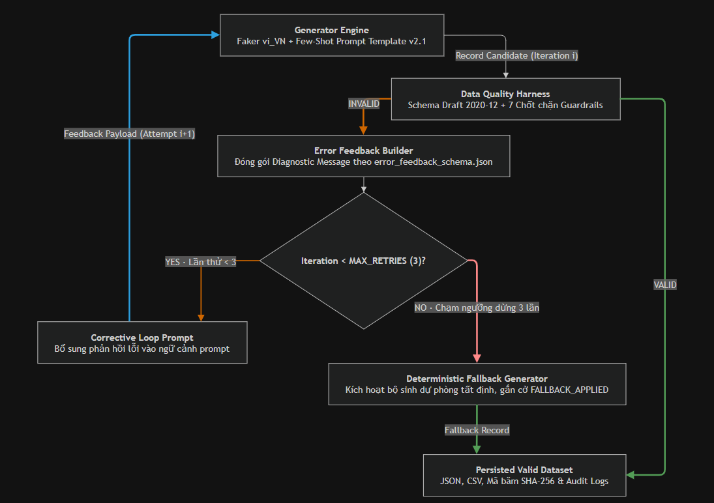

# KIẾN TRÚC VÒNG LẶP SỬA LỖI & CƠ CHẾ FALLBACK (LOOP ENGINEERING)

**Tài liệu**: Đặc tả thiết kế Vòng lặp phản hồi tự sửa lỗi và Cơ chế dự phòng an toàn cho AI Generation Pipeline  
**Tác giả**: Đào Trung Kiên — Data & AI Resource Engineer  
**Hệ thống**: CyberSoft Data & AI Lab — Task 09  

---

## 1. Sơ đồ Nguyên lý Vận hành Vòng lặp (Self-Correction Loop)

### Diễn giải Luồng Vận hành:
1. **Generator Engine**: Tiếp nhận hạt giống ngẫu nhiên và cấu hình prompt để sinh bản ghi ứng viên `Record Candidate` ở vòng lặp `Iteration i`.
2. **Data Quality Harness**: Kiểm định nghiêm ngặt 7 chốt chặn bảo vệ (Guardrails):
   - Nếu **[VALID]** (100% Passed): Chuyển thẳng tới **Persisted Valid Dataset** để lưu trữ và niêm phong mã băm SHA-256.
   - Nếu **[INVALID]** (Có vi phạm): Chuyển thông tin lỗi sang **Error Feedback Builder**.
3. **Error Feedback Builder**: Đóng gói thông điệp chẩn đoán có cấu trúc (`error_feedback_schema.json`) và kiểm tra điều kiện số lần thử `Iteration < MAX_RETRIES (3)?`:
   - Nếu **[YES]** (`Attempt < 3`): Kích hoạt **Corrective Loop Prompt**, chuyển ngữ cảnh sửa lỗi quay trở lại **Generator Engine** cho lần thử kế tiếp `Attempt i+1`.
   - Nếu **[NO]** (`Max Retries Exceeded`): Tự động kích hoạt **Deterministic Fallback Generator** để lấy bản ghi an toàn dự phòng tất định, gắn nhãn `FALLBACK_APPLIED` và chuyển vào **Persisted Valid Dataset**.

---

## 2. Các Thành phần Cốt lõi của Loop Engineering

### 2.1. Vòng lặp phản hồi chẩn đoán (Diagnostic Feedback Loop)
Khi Data Quality Harness phát hiện ứng viên record vi phạm một hoặc nhiều quy tắc (ví dụ: tổng rubric criteria $\ne 100$, điểm số không tương thích với trạng thái nộp bài), nó không chỉ loại bỏ record mà sinh ra một **Structured Error Feedback**:
* `rule_id`: Mã định danh quy tắc bị vi phạm (ví dụ: `RULE-RUBRIC-SUM-100`).
* `field`: Tên trường dữ liệu gây lỗi (ví dụ: `learning_assessment.rubric_criteria`).
* `message`: Diễn giải nguyên nhân vi phạm thực tế.
* `corrective_guidance`: Hướng dẫn cụ thể để bộ sinh AI điều chỉnh lại giá trị chính xác.

### 2.2. Kiểm soát ngưỡng dừng (Stopping Conditions & Loop Limits)
* **Ngưỡng dừng thành công**: Vượt qua 100% các tiêu chí kiểm định của Harness (`passed == True`, `error_count == 0`). Record được đánh dấu `validation_status: "PASSED"`.
* **Ngưỡng dừng lặp tối đa**: Quy định cứng `MAX_RETRIES = 3`. Việc giới hạn số vòng lặp là bắt buộc để:
  1. Tránh bẫy lặp vô hạn (Infinite Loop) gây tốn tài nguyên GPU / token API.
  2. Ngăn ngừa hiện tượng bế tắc hội tụ (Convergence Failure) khi mô hình AI liên tục lặp lại một lỗi ngữ nghĩa tiềm ẩn.

### 2.3. Cơ chế Dự phòng An toàn (Deterministic Fallback Mechanism)
Nếu sau 3 lần thử mà mô hình AI vẫn không thể tạo ra record thỏa mãn toàn bộ các guardrail (hoặc trong tình huống mạng/API LLM bị timeout hoàn toàn), hệ thống sẽ chuyển sang kích hoạt **Deterministic Fallback Generator**:
* Dựa trên chính seed đầu vào của record đó để suy ra các giá trị fallback chuẩn hóa tuyệt đối.
* Đảm bảo pipeline dữ liệu **không bao giờ bị dừng đột ngột (Zero-Downtime Pipeline)**.
* Gắn thẻ siêu dữ liệu `validation_status: "FALLBACK_APPLIED"` để phục vụ công tác kiểm toán (Audit Trail) và theo dõi chất lượng.
