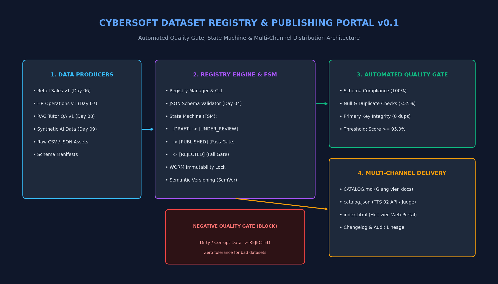

# 10. ĐẶC TẢ KỸ THUẬT: CỔNG XUẤT BẢN DATASET REGISTRY & CATALOG PORTAL

**Dự án**: CyberSoft Data & AI Lab  
**Đầu việc**: NGÀY 10 — Cổng xuất bản Dataset Registry (`dataset_registry_portal` & `quality_gate_enforcement`)  
**Vai trò phụ trách**: Data & AI Resource Engineer (Đào Trung Kiên)  
**Phiên bản**: v1.0.0  
**Ngày hoàn thiện**: 2026-09-13  

---

## 1. TỔNG QUAN VÀ BỐI CẢNH KỸ THUẬT

### 1.1. Bước Chuyển Dịch từ Tạo Dữ Liệu Rời Rạc sang Quản Trị Tài Nguyên Tập Trung
* **Các nhiệm vụ tiền đề (Task 04 - 09)**: Nhóm Data & AI đã lần lượt hoàn thành các khối nền móng quan trọng:
  - *Task 04*: Bộ chuẩn hóa `dataset.schema.json` quản trị metadata và data dictionary.
  - *Task 05*: `Data Quality Harness v0` với 7 quy tắc thẩm định tính toàn vẹn dữ liệu.
  - *Task 06*: Bộ dữ liệu bán hàng đa bảng `sales_v1` (Star Schema, Clean & Dirty).
  - *Task 07*: Bộ dữ liệu nhân sự và vận hành `HR_ops_v1` (5 bảng, >5.000 dòng).
  - *Task 08*: Ngữ liệu chuyên sâu và benchmark đánh giá RAG `rag_corpus_qa_v1`.
  - *Task 09*: Pipeline sinh dữ liệu có kiểm soát bằng AI với vòng lặp tự sửa lỗi (Self-Correction Loop).
* **Task 10 (Cổng xuất bản Dataset Registry)**: Chuyển dịch toàn bộ các tài nguyên dữ liệu đơn lẻ thành một **Hệ sinh thái Quản lý & Xuất bản Tài nguyên Dữ liệu Tập trung (Dataset Registry & Catalog Portal)**.
* **Ba Vấn đề Nghiệp vụ Cốt lõi được Giải quyết**:
  1. **Chặn Đứng Dữ Liệu Bẩn Rò Rỉ Ra Ngoài (Quality Gate Zero-Tolerance)**: Không cho phép bất kỳ bộ dữ liệu nào có lỗi (null bất thường, trùng khóa chính, vi phạm schema) được xuất bản sang hệ sinh thái học tập.
  2. **Tính Bất Biến và Khả Năng Tái Lập (Immutability & SemVer)**: Đóng băng các phiên bản đã xuất bản (`PUBLISHED`), đảm bảo bài thi và bài tập của học viên luôn chạy trên phiên bản dữ liệu chuẩn xác, không bị biến động âm thầm.
  3. **Tích hợp Đa kênh Liên phòng ban (Cross-Role Integration)**: Cung cấp đồng thời tài liệu Markdown cho Giảng viên (`CATALOG.md`), JSON API cho TTS 02 (`catalog.json`), và Web Portal trực quan cho học viên tra cứu.

---

## 2. KIẾN TRÚC TỔNG THỂ DATASET REGISTRY



Hệ thống được thiết kế theo mẫu kiến trúc **Registry Pattern** với máy trạng thái hữu hạn (**Finite State Machine - FSM**):

```text
                           ┌────────────────────────────────────────┐
                           │      Data Producers (TTS 01)           │
                           │  (Task 06, 07, 08 Clean & Gen Data)    │
                           └──────────────────┬─────────────────────┘
                                              │
                                              ▼ register
                                    ┌──────────────────┐
                                    │    [ DRAFT ]     │
                                    └─────────┬────────┘
                                              │
                                              ▼ validate
                                  ┌───────────────────────┐
                                  │   [ UNDER_REVIEW ]    │
                                  └───────────┬───────────┘
                                              │
                          ┌───────────────────┴───────────────────┐
                          │                                       │
                Quality Gate PASS                       Quality Gate FAIL
            (Score >= 95% & 0 Viols)                  (Score < 95% or Error)
                          │                                       │
                          ▼ publish                               ▼
                 ┌──────────────────┐                    ┌──────────────────┐
                 │  [ PUBLISHED ]   │                    │   [ REJECTED ]   │
                 │ (Khóa Bất biến)  │                    │ (Chặn Xuất bản)  │
                 └────────┬─────────┘                    └────────┬─────────┘
                          │                                       │ Sửa chữa
                          │ Multi-channel Delivery                ▼
                          │                              ┌──────────────────┐
                          ├─► CATALOG.md (Giảng viên)    │ Quay lại [DRAFT] │
                          ├─► catalog.json (TTS 02 API)  └──────────────────┘
                          └─► index.html (Học viên Web)
```

---

## 3. CƠ CHẾ KIỂM SOÁT CHẤT LƯỢNG (AUTOMATED QUALITY GATE)

Mỗi yêu cầu xuất bản đều được thẩm định tự động qua **QualityGateChecker** theo 5 tầng tiêu chuẩn:

| Tầng kiểm định | Mục tiêu rà soát | Điều kiện vượt qua | Hành động khi vi phạm |
| :--- | :--- | :---: | :--- |
| **Tier 1: Schema JSON** | Đối chiếu metadata với `dataset.schema.json` | $100\%$ hợp lệ | Chặn xuất bản (`BLOCKING`) |
| **Tier 2: Governance & PII** | Bắt buộc khai báo license, lineage và xử lý PII | $100\%$ tuân thủ | Chặn xuất bản (`BLOCKING`) |
| **Tier 3: Asset Existence** | Tệp dữ liệu vật lý phải tồn tại trên đĩa và không rỗng | $100\%$ tồn tại | Chặn xuất bản (`BLOCKING`) |
| **Tier 4: Tabular Integrity** | Rà soát CSV: $0$ trùng khóa chính, tỷ lệ null $< 35\%$ | $100\%$ thỏa mãn | Chặn xuất bản (`BLOCKING`) |
| **Tier 5: Composite Score** | Điểm tổng hợp dựa trên tỷ lệ tiêu chí đạt | $\mathbf{\ge 95.0\%}$ | Chặn xuất bản (`BLOCKING`) |

### Bằng chứng Kiểm thử Chặn Lỗi (Negative Test Proof):
Trong kịch bản thử nghiệm đưa vào tệp `dirty/orders.csv` (chứa các bản ghi cố tình làm lỗi ở Task 06):
```text
▶ Đã đăng ký dataset bẩn 'ds-dirty-test-quarantine' (DRAFT)
▶ Thử ép lệnh PUBLISH mà không khắc phục lỗi...
✅ CHẶN THÀNH CÔNG! Quality Gate từ chối xuất bản đúng theo tiêu chuẩn:
   -> Lý do: Quality Gate FAILED (Score: 92.3%). Blocking violations: Schema validation error at [root]: 'lineage' is a required property
   -> Xác nhận: Dataset bẩn KHÔNG có phiên bản nào được xuất bản ra Catalog.
```

---

## 4. DANH MỤC 3 BỘ DỮ LIỆU BENCHMARK CHUẨN ĐÃ XUẤT BẢN

Registry v0.1 đã đăng ký và xuất bản thành công 3 bộ dữ liệu mốc đạt điểm chất lượng tuyệt đối ($100.0\%$):

1. **`ds-retail-ecommerce-sales-v1` (v1.0.0)**:
   - **Lĩnh vực**: Thương mại điện tử (`retail_ecommerce`) | **Cấp độ**: Cơ bản (`beginner`).
   - **Cấu trúc**: Star Schema đa bảng (`customers.csv`, `products.csv`, `orders.csv`).
   - **Mục tiêu**: Phân tích hành vi mua sắm, tính RFM, retention rate trên SQL & Power BI.
   - **Quality Score**: **100.0%** (23/23 tiêu chí kiểm tra pass tuyệt đối).

2. **`ds-hr-operations-attendance-v1` (v1.1.0)**:
   - **Lĩnh vực**: Quản trị nhân sự & Vận hành (`hr_operations`) | **Cấp độ**: Trung cấp (`intermediate`).
   - **Cấu trúc**: 5 bảng quan hệ liên kết (`employees.csv`, `attendance.csv`, `kpi_evaluations.csv`, v.v.) với hơn 5.000 dòng dữ liệu.
   - **Mục tiêu**: Phân tích tỷ lệ nghỉ việc (Turnover Rate), chấm công sinh trắc học và đánh giá KPI.
   - **Quality Score**: **100.0%** (23/23 tiêu chí kiểm tra pass tuyệt đối).

3. **`ds-nlp-rag-tutor-knowledgebase-v1` (v1.0.0)**:
   - **Lĩnh vực**: Xử lý ngôn ngữ tự nhiên & GenAI (`nlp_genai`) | **Cấp độ**: Nâng cao (`advanced`).
   - **Cấu trúc**: 24 tài liệu tri thức kỹ thuật chuẩn và bộ 60 câu hỏi benchmark kèm Ground-Truth Citations (`rag_eval_questions.json`).
   - **Mục tiêu**: Thẩm định độ chính xác tìm kiếm (Retrieval Accuracy) và chống ảo giác cho mô hình RAG Tutor.
   - **Quality Score**: **100.0%** (15/15 tiêu chí kiểm tra pass tuyệt đối).

---

## 5. HƯỚNG DẪN TÍCH HỢP CHO ĐỒNG ĐỘI (TTS 02 & TTS 03)

### 5.1. Dành cho TTS 02 (Learning & Contest Platform)
- Để hiển thị danh mục bài tập cho giảng viên chọn dataset giao bài, TTS 02 đọc trực tiếp tệp manifest JSON:
  `Data-AI-Resource/BaoCao_Task10/catalog/catalog.json`
- Mẫu tham chiếu `resource_id` vào bài học:
  ```json
  {
    "lesson_id": "LES-SQL-001",
    "dataset_ref": {
      "resource_id": "ds-retail-ecommerce-sales-v1",
      "pinned_version": "1.0.0",
      "manifest_url": "Data-AI-Resource/BaoCao_Task10/registry_store/manifests/ds-retail-ecommerce-sales-v1_v1.0.0.json"
    }
  }
  ```

### 5.2. Dành cho TTS 03 (QA Automation & AI Evaluation)
- TTS 03 có thể viết test tự động kiểm tra tính sẵn sàng của Catalog qua CLI:
  ```powershell
  python scripts/registry_cli.py list --all
  python scripts/registry_cli.py search --role "data_analyst"
  ```
- Bộ kiểm thử đảm bảo: Không có dataset nào có trạng thái `PUBLISHED` mà `quality_score < 95.0%`.

---

## 6. KẾT QUẢ KIỂM THỬ TỰ ĐỘNG (TEST VERIFICATION)

Bộ kiểm thử tự động gồm **11 test cases** bao phủ toàn diện:
- `test_register_dataset_initial_state_is_draft`: Đảm bảo dataset mới luôn ở trạng thái DRAFT.
- `test_semver_validation`: Kiểm tra định dạng Semantic Versioning.
- `test_search_by_domain_and_skills`: Thẩm định bộ lọc đa tiêu chí.
- `test_search_by_text_query`: Tìm kiếm từ khóa theo full-text.
- `test_immutability_re_registering_published_version_fails`: Ngăn chặn sửa đổi dataset đã xuất bản.
- `test_quality_gate_passes_clean_data`: Chấp thuận dataset chuẩn đạt 100% điểm.
- `test_quality_gate_strictly_rejects_dirty_data`: Chặn đứng dataset lỗi.
- `test_state_machine_blocks_publishing_without_quality_gate`: Kiểm soát luồng chuyển dịch.
- `test_state_machine_blocks_mutation_of_published_dataset`: Đảm bảo tính bất biến.
- `test_build_catalog_outputs`: Kiểm tra tệp xuất bản CATALOG.md, catalog.json, index.html.

**Kết quả chạy Pytest:**
```text
============================= 11 passed in 1.16s =============================
```
