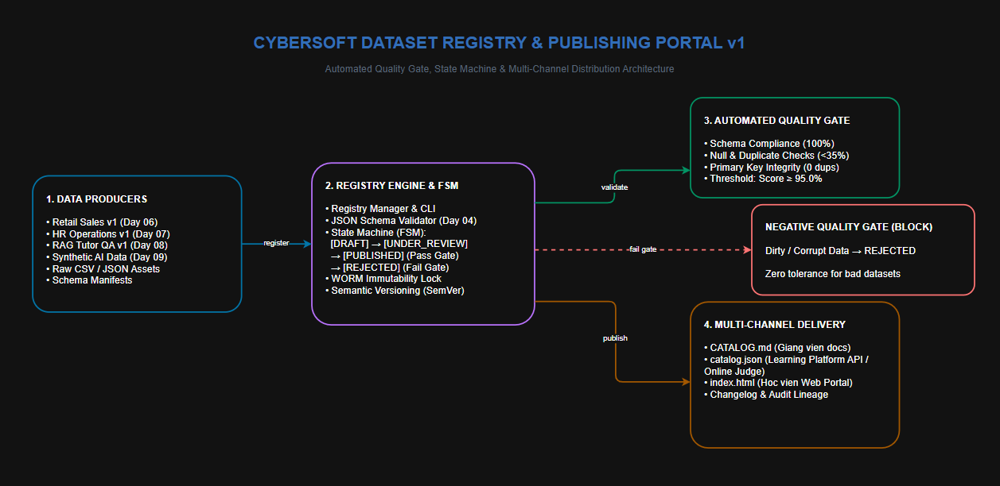
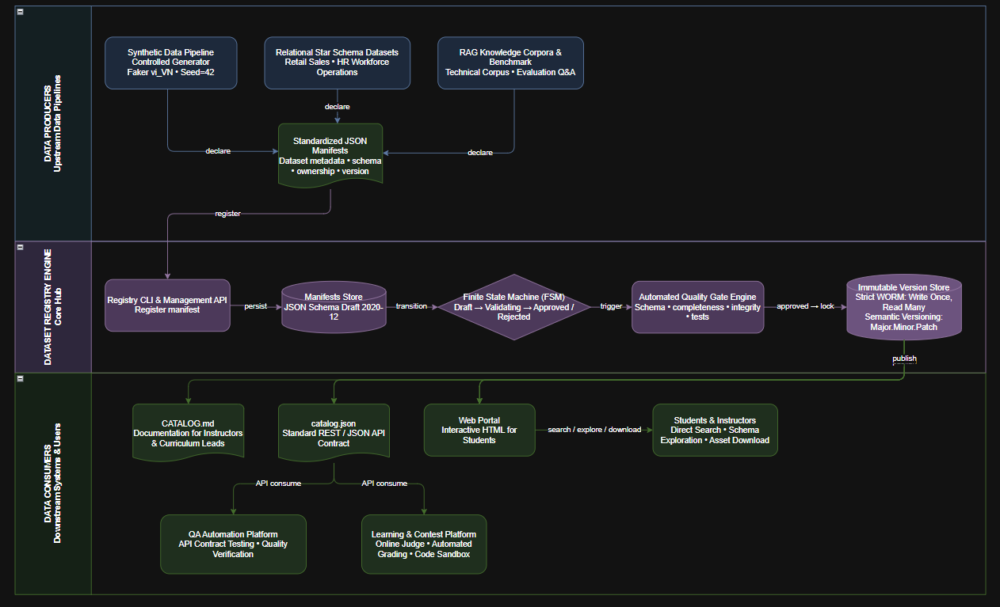

# 🏛️ CyberSoft Dataset Registry & Publishing Portal v0.1

> **Module quản lý vòng đời và xuất bản tài nguyên dữ liệu tập trung cho CyberSoft Learning Hub.**  
> **Tác giả:** Đào Trung Kiên — Data & AI Resource Engineer  
> **Nhiệm vụ:** Task 10 — Cổng xuất bản Dataset Registry & Resource Portal

---




## 🌟 Tính Năng Cốt Lõi
1. **Registry Pattern & SemVer:** Đăng ký và quản lý phiên bản dữ liệu chuẩn Semantic Versioning (`1.0.0`, `1.1.0`).
2. **Automated Quality Gate:** Tích hợp kiểm thử tự động đa tầng (Schema JSON, Tính toàn vẹn quan hệ PK-FK, Tỷ lệ null, PII).
3. **State Machine chặt chẽ:** Kiểm soát luồng trạng thái `DRAFT` $\rightarrow$ `UNDER_REVIEW` $\rightarrow$ `PUBLISHED` / `REJECTED`. Ngăn chặn dữ liệu bẩn rò rỉ ra môi trường học tập.
4. **Bảo đảm Tính Bất Biến (Immutability):** Dữ liệu đã xuất bản (`PUBLISHED`) bị khóa bất biến, bảo đảm khả năng tái lập kết quả cho bài thi học viên.
5. **Cổng Xuất Bản Đa Kênh (Multi-channel Delivery):**
   - 📄 `catalog/CATALOG.md`: Danh mục Markdown chi tiết cho Giảng viên.
   - ⚡ `catalog/catalog.json`: Điểm tích hợp JSON API cho Nền tảng Học tập (TTS 02).
   - 🌐 `catalog/index.html`: Web Portal giao diện trực quan cho Học viên.

---

## 🚀 Hướng Dẫn Nhanh (Quick Start)

### 1. Cài đặt Môi trường
```powershell
cd d:\Cybersoft\Kien\cybersoft-learning-hub\Data-AI-Resource\BaoCao_Task10
python -m pip install -r requirements.txt  # pydantic, jsonschema, pytest
```

### 2. Chạy Demo Tự Động Toàn Diện (End-to-End Demo)
Lệnh này sẽ tự động đăng ký 3 dataset benchmark, thực hiện kiểm thử chặn dữ liệu bẩn (Negative Test), và biên soạn lại toàn bộ Catalog:
```powershell
python scripts/demo_publish_workflow.py
```

### 3. Sử dụng Giao diện Dòng lệnh (CLI)
```powershell
# Liệt kê tất cả các dataset trong registry
python scripts/registry_cli.py list --all

# Tìm kiếm dataset theo từ khóa hoặc bộ lọc
python scripts/registry_cli.py search -q "sales"
python scripts/registry_cli.py search --domain "hr_operations"
python scripts/registry_cli.py search --role "ai_engineer"

# Biên dịch lại Catalog
python scripts/registry_cli.py build-catalog
```

### 4. Chạy Toàn Bộ Kiểm Thử Tự Động (Unit & Integration Tests)
```powershell
pytest -v
```
**Kỳ vọng:** `11 passed`.

---

## 📁 Cấu Trúc Thư Mục
```text
BaoCao_Task10/
├── 10_dataset_registry_portal.md           # Báo cáo đặc tả kỹ thuật chuẩn CyberSoft
├── README.md                                # Tài liệu hướng dẫn sử dụng
├── AI_WORKLOG.md                            # Nhật ký làm việc với AI & quyết định kỹ thuật
├── registry_store/                          # Cơ sở dữ liệu lưu trữ metadata
│   ├── registry_db.json                     # Database cục bộ lưu index và trạng thái
│   ├── manifests/                           # File manifest JSON theo chuẩn Task 04
│   └── changelogs/                          # Lịch sử phiên bản
├── catalog/                                 # Cổng xuất bản tài nguyên được sinh tự động
│   ├── CATALOG.md                           # Markdown catalog cho giảng viên
│   ├── catalog.json                         # API JSON cho hệ thống TTS 02/03
│   └── index.html                           # Giao diện Web Portal
├── src/                                     # Mã nguồn cốt lõi
│   ├── core/                                # Models, State Machine, Registry Manager
│   ├── quality_gate/                        # Multi-tier Quality Gate Checker
│   └── portal/                              # Catalog & HTML Generator
├── scripts/                                 # Dòng lệnh CLI & Demo script
│   ├── registry_cli.py
│   └── demo_publish_workflow.py
├── docs/                                    # Tài liệu kiến trúc chuyên sâu
│   ├── registry_architecture.md
│   └── quality_gate_specification.md
└── tests/                                   # Bộ kiểm thử tự động Pytest (11 tests)
    ├── test_registry_core.py
    ├── test_quality_gate_enforcement.py
    └── test_catalog_generation.py
```
