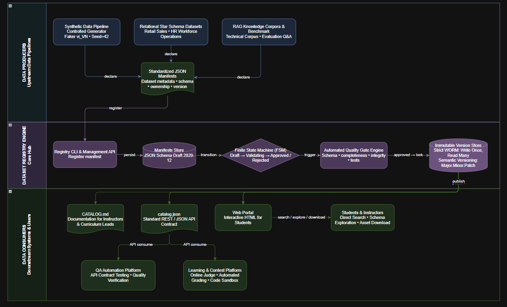
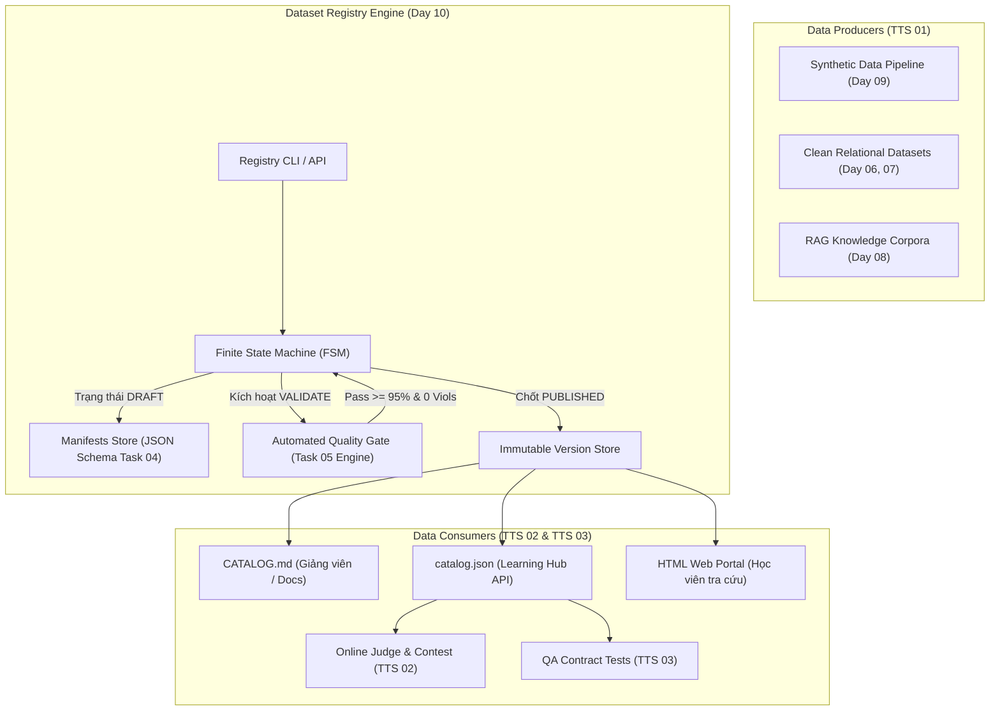

# Kiến trúc Dataset Registry Pattern & Data Contracts

## 1. Giới thiệu bài toán kiến trúc
Trong các nền tảng học tập AI-native quy mô lớn (CyberSoft Learning & Contest Hub), dữ liệu thực hành và tri thức RAG không thể lưu trữ phân tán hoặc quản lý thủ công qua file chia sẻ.
Nếu không có một **Dataset Registry chuẩn hóa**:
1. **Thiếu khả năng tái lập (Reproducibility):** Bài thi hoặc lab học viên làm vào tháng 1 có thể bị sai lệch kết quả vào tháng 6 nếu dữ liệu nguồn bị ai đó sửa trực tiếp.
2. **Nguy cơ rò rỉ dữ liệu bẩn (Dirty Data Leakage):** Bộ dữ liệu có null, orphan key, lỗi định dạng vô tình được đưa vào môi trường học tập khiến học viên hoang mang.
3. **Mất dấu nguồn gốc (Data Lineage & Governance):** Không biết dữ liệu sinh từ công cụ nào, prompt nào, seed bao nhiêu, ai duyệt.

## 2. Mô hình Dataset Registry Pattern

## 3. Quy tắc Bất biến (Immutability & SemVer)
- **Quy tắc 1 (WORM - Write Once, Read Many):** Một khi một phiên bản dataset đã đạt trạng thái `PUBLISHED`, phiên bản đó là **bất biến (Immutable)**. Mọi nỗ lực ghi đè hoặc sửa đổi nội dung đều bị từ chối (`VersionAlreadyExistsError`).
- **Quy tắc 2 (Semantic Versioning):**
  - **PATCH (1.0.0 -> 1.0.1):** Sửa lỗi chính tả trong metadata, cập nhật mô tả data dictionary, không đổi cấu trúc schema và số dòng.
  - **MINOR (1.0.0 -> 1.1.0):** Thêm bảng phụ, thêm cột không bắt buộc (backward-compatible), bổ sung câu hỏi phân tích.
  - **MAJOR (1.0.0 -> 2.0.0):** Thay đổi khóa chính, xóa cột, đổi kiểu dữ liệu cốt lõi (breaking change).
