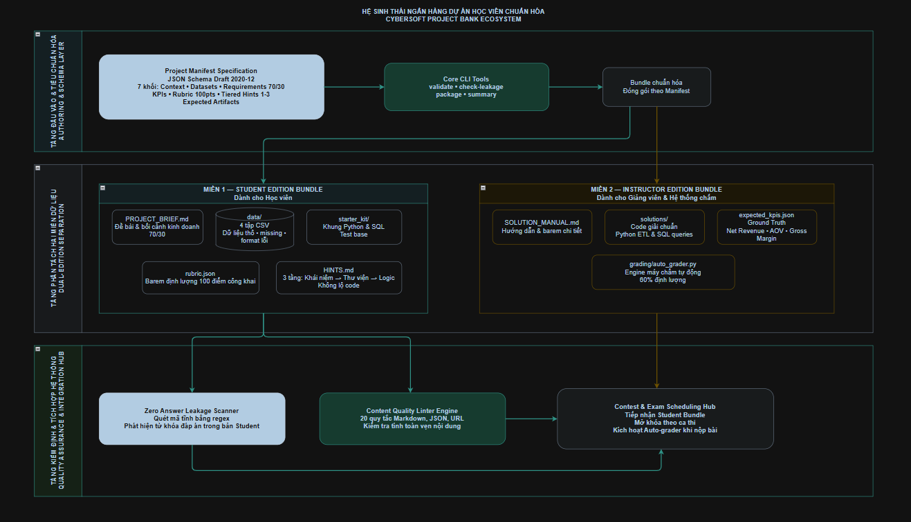

# 11. ĐẶC TẢ KỸ THUẬT: CHUẨN HÓA MẪU DỰ ÁN HỌC VIÊN & KHUNG PROJECT BANK

**Dự án**: CyberSoft Data & AI Lab  
**Đầu việc**: NGÀY 11 — Chuẩn hóa mẫu dự án học viên (`student_project_standardization` & `project_bank_framework`)  
**Vai trò phụ trách**: Data & AI Resource Engineer (Đào Trung Kiên)  
**Phiên bản**: v1.0.0  
**Ngày hoàn thiện**: 2026-09-15  

---

## 1. TỔNG QUAN VÀ BỐI CẢNH KỸ THUẬT

### 1.1. Bước Chuyển Dịch từ Kho Dữ Liệu Tĩnh sang Ngân Hàng Dự Án Thực Chiến (Project Bank)
* **Các nhiệm vụ tiền đề (Task 04 - 10)**: Nhóm Data & AI đã hoàn thành trọn bộ hạ tầng tài nguyên:
  - *Task 04 - 05*: Schema chuẩn hóa và Data Quality Harness v0 tự động thẩm định dữ liệu.
  - *Task 06 - 08*: Các bộ dữ liệu đa ngành (Bán hàng, Nhân sự, RAG Corpus).
  - *Task 09*: Pipeline sinh dữ liệu có kiểm soát bằng AI với vòng lặp tự sửa lỗi.
  - *Task 10*: Cổng xuất bản Dataset Registry với State Machine FSM và Quality Gate Zero-Tolerance.
* **Task 11 (Chuẩn hóa mẫu dự án học viên)**: Nâng tầm từ việc lưu trữ dữ liệu sang xây dựng **CyberSoft Project Bank Framework** — hệ thống cung cấp các bài tập lớn (Capstone Projects) chuẩn mực, sẵn sàng tích hợp vào nền tảng học tập và thi đấu.
* **Ba Vấn đề Nghiệp vụ Cốt lõi được Giải quyết**:
  1. **Chuẩn hóa cấu trúc 7 khối chức năng (Schema-Driven Structure)**: Xóa bỏ sự phân mảnh trong cách viết đề bài, quy chuẩn 100% dự án theo JSON Schema Draft 2020-12.
  2. **Lượng hóa barem đánh giá (Rubric Engineering)**: Loại bỏ triệt để các tiêu chí cảm tính (*"đẹp", "hợp lý"*), thay bằng các ngưỡng đo lường số học khách quan trên thang điểm 100 (tỷ lệ 70% Core : 30% Extension).
  3. **Phân tách hai miền & Chống rò rỉ đáp án (Zero Answer Leakage)**: Cách ly tuyệt đối giữa bản giao cho học viên (`student_edition`) và bản lời giải giảng viên (`instructor_edition`), bảo vệ liêm chính học thuật.

---

## 2. KIẾN TRÚC TỔNG THỂ CHUẨN HÓA DỰ ÁN & PROJECT BANK



Hệ thống quy định mọi dự án trong Project Bank đều phải tuân thủ nghiêm ngặt cấu trúc 7 khối chức năng:

| Khối chức năng | Mục đích kỹ thuật | Nội dung quy chuẩn |
| :--- | :--- | :--- |
| **1. Business Context** | Định vị bối cảnh doanh nghiệp | Tên công ty, ngành nghề, vấn đề kinh doanh thực tế, mục tiêu dự án, đối tượng thụ hưởng (CCO, Marketing, Ops). |
| **2. Datasets** | Khai báo dữ liệu đầu vào | Liên kết bảng dữ liệu từ Registry, khai báo schema, kiểu dữ liệu, khóa chính PK, khóa ngoại FK, và các dị biệt cố ý. |
| **3. Requirements** | Phân tầng nhiệm vụ kỹ thuật | Phân định rõ ràng: **Core Tasks (70 điểm)** đảm bảo chuẩn đầu ra nghề nghiệp; **Extension Tasks (30 điểm)** phân hóa năng lực chuyên sâu. |
| **4. Quantitative KPIs** | Chỉ số đo lường nghiệp vụ | Công thức toán học tường minh, đơn vị đo, và ngưỡng dung sai sai số tương đối ($\le 0.05\%$ với Doanh thu, $\le 0.10\%$ với AOV). |
| **5. Rubric Matrix** | Barem đánh giá định lượng 100đ | 4 mức đánh giá chuẩn (*Exemplary, Proficient, Developing, Unsatisfactory*) gắn chặt với các thước đo số học kiểm chứng được. |
| **6. Tiered Hints** | Hệ thống gợi ý 3 phân tầng | Giàn giáo sư phạm (Scaffolding): **Tier 1** (Khái niệm), **Tier 2** (Kỹ thuật/Cú pháp), **Tier 3** (Dị biệt dữ liệu và bẫy kỹ thuật). |
| **7. Expected Artifacts** | Danh mục sản phẩm kỳ vọng | Quy định định dạng và vị trí file nộp bài: mã nguồn Python, truy vấn SQL, báo cáo Executive Summary. |

---

## 3. CƠ CHẾ NGUYÊN TẮC RUBRIC ENGINEERING & PHÒNG VỆ RÒ RỈ

### 3.1. Barem Đánh Giá Định Lượng (Rubric Engineering Matrix)
Mọi tiêu chí trong `rubric.json` được thiết kế theo 4 mức độ định lượng rõ ràng:

| Hạng mục & Tiêu chí | Trọng số | Chỉ số định lượng bắt buộc (Quantitative Metric) | Ngưỡng Exemplary (100% điểm) | Ngưỡng Proficient (75-80%) | Ngưỡng Developing (40-50%) |
| :--- | :---: | :--- | :--- | :--- | :--- |
| **CRIT-01: Làm sạch dữ liệu** | 20đ | Khử 100% duplicate PK; quy chuẩn 100% missing status | 400 dòng sạch, 0 duplicate, 0 null, có log giải trình | Đã khử duplicate nhưng drop null thay vì imputation | Sót duplicate hoặc làm mất dữ liệu hợp lệ |
| **CRIT-02: Doanh thu & AOV** | 25đ | Sai số Net Revenue $\le 0.05\%$; AOV $\le 0.10\%$ | Kết quả khớp Ground Truth tuyệt đối trong dung sai | Sai số $0.05\% - 0.50\%$ do tính cả đơn hủy | Sai số $0.50\% - 5.0\%$ do nhầm lẫn giá chiết khấu |
| **CRIT-03: Trực quan hóa** | 25đ | Tối thiểu 4 biểu đồ đúng chuẩn + 3 đề xuất định lượng | Đủ 4 biểu đồ chuẩn xác, có nhãn đơn vị, 3 giải pháp sâu | Đủ 4 biểu đồ nhưng đề xuất còn chung chung | Thiếu biểu đồ hoặc trục tọa độ thiếu đơn vị |
| **CRIT-04: Phân khúc RFM** | 15đ | Phân khúc 5 nhóm khách hàng theo phân vị quantile | Đủ 5 nhóm chuẩn (Champions, Loyal, Potential, At Risk, Lost) | Tính được RFM nhưng chỉ chia 3 nhóm | Chỉ tính được 1 hoặc 2 trong 3 chỉ số RFM |
| **CRIT-05: Phân tích Hủy đơn** | 15đ | Bóc tách tỷ lệ hủy theo hình thức thanh toán | Phân tích sâu nguyên nhân COD, có giải pháp giảm hủy $< 8\%$ | Chỉ ra COD nhưng giải pháp chưa định lượng | Phân tích sơ sài, thiếu số liệu kiểm chứng |

### 3.2. Bốn Lớp Phòng Vệ Chống Rò Rỉ Đáp Án (Zero-Leakage Defense)
1. **Lớp Tách Biệt Vật Lý**: `student_edition/` và `instructor_edition/` nằm ở hai thư mục hoàn toàn độc lập.
2. **Lớp Khử Metadata Tự Động**: Khi đóng gói phát hành, bộ packager tự động đè `expected_value = null` trong manifest học viên.
3. **Lớp Quét Tự Động (Leakage Scanner)**: Bộ quét regex kiểm tra toàn bộ file trong `student_edition/`, phát hiện và chặn đứng mọi file hoặc nội dung chứa từ khóa giải (`solution`, `answer`, `ground_truth`, `auto_grader`).
4. **Lớp Máy Chấm Sandbox**: Các file lời giải và script `auto_grader.py` chỉ tồn tại trên máy chủ chấm thi độc lập.

### Bằng chứng Kiểm thử Chặn Rò rỉ (Negative Test Proof):
Khi thử nghiệm chèn một tệp bẫy chứa mã đáp án `solution_leak_trap.py` vào thư mục học viên:
```text
▶ Chèn file thử nghiệm: cybersoft-learning-hub/Data-AI-Resource/BaoCao_Task11/projects/sales_performance_analytics/student_edition/solution_leak_trap.py
▶ Chạy lệnh: python cybersoft-learning-hub/Data-AI-Resource/BaoCao_Task11/scripts/project_cli.py check-leakage cybersoft-learning-hub/Data-AI-Resource/BaoCao_Task11/projects/sales_performance_analytics/student_editioncd
[CRITICAL LEAKAGE DETECTED] Found 1 leakage issues:
  - Leaked solution file detected: solution_leak_trap.py (matched pattern: .*solution.*)
Exit Code: 2 (BLOCKING RELEASE)
```

---

## 4. DỰ ÁN BENCHMARK CYBERSOFT MART SALES PERFORMANCE

Dự án mẫu **CyberSoft Mart Sales Performance & Customer Retention Intelligence Capstone** được xây dựng hoàn chỉnh làm tiêu chuẩn mẫu mực:
* **Tập dữ liệu 4 bảng quan hệ**: `orders.csv` (402 dòng chứa 2 duplicate và 5 null status), `order_items.csv` (997 dòng), `customers.csv` (100 dòng), `products.csv` (50 dòng).
* **Bảng Đối Soát Chỉ Số Chuẩn (Official Ground Truth)**:

| Chỉ số Kinh doanh | Giá trị Chuẩn (Ground Truth) | Dung sai Cho phép | Ý nghĩa Nghiệp vụ |
| :--- | :---: | :---: | :--- |
| **Tổng số đơn sau làm sạch** | 400 đơn hàng | Tuyệt đối (400) | Đã loại bỏ 2 bản ghi trùng lặp khóa chính |
| **Doanh thu thực nhận (Net Revenue)** | **$388,850.28** | $\pm 0.05\%$ | Chỉ tính trên 338 đơn hàng hoàn tất (`completed`) |
| **Giá trị trung bình đơn (AOV)** | **$1,150.44** | $\pm 0.10\%$ | Mức chi tiêu bình quân trên mỗi đơn thành công |
| **Tỷ lệ hủy đơn hàng (Cancellation)** | **10.75%** | $\pm 0.20\%$ | 43 đơn hủy trên tổng 400 đơn sạch |
| **Tỷ lệ hoàn trả hàng (Return Rate)** | **4.75%** | $\pm 0.20\%$ | 19 đơn hoàn trả sau khi giao hàng |
| **Biên lợi nhuận gộp (Gross Margin)** | **31.43%** | $\pm 0.50\%$ | Lợi nhuận sản phẩm $121,652.51 trên tổng doanh thu mặt hàng |

* **Phân tách 2 bản bàn giao**:
  - `student_edition/`: `PROJECT_BRIEF.md`, `rubric.json`, `HINTS.md`, `submission_checklist.md`, dữ liệu thực hành, và `starter_kit/` (Python & SQL).
  - `instructor_edition/`: `SOLUTION_MANUAL.md`, `solutions/full_analysis_solution.py`, `solutions/solution_queries.sql`, `expected_kpis.json`, và `grading/auto_grader.py` (chấm tự động 60đ).

---

## 5. KẾT QUẢ KIỂM THỬ TỰ ĐỘNG (TEST VERIFICATION)

Bộ kiểm thử tự động gồm **14 test cases** bao phủ toàn diện:
- `test_cli_validate_success`: Kiểm tra lệnh CLI validate manifest.
- `test_cli_check_leakage_success`: Kiểm tra lệnh CLI quét rò rỉ đáp án đạt 100% clean.
- `test_cli_summary_success`: Kiểm tra lệnh CLI trích xuất tóm tắt dự án.
- `test_valid_manifest`: Thẩm định manifest hợp lệ với JSON Schema Draft 2020-12.
- `test_missing_required_section`: Chặn đứng manifest thiếu khối bắt buộc.
- `test_invalid_domain_enum`: Bắt lỗi domain không nằm trong danh mục chuẩn.
- `test_invalid_task_points_sum`: Bắt lỗi tổng điểm tasks không khớp với requirements.
- `test_rubric_total_100_points`: Đảm bảo tổng trọng số rubric bằng 100 điểm tuyệt đối.
- `test_criteria_sum_matches_category_weight`: Kiểm tra tổng điểm tiêu chí khớp trọng số nhóm.
- `test_all_criteria_have_quantitative_metrics`: Xác nhận 100% tiêu chí có thước đo định lượng.
- `test_core_vs_extension_ratio`: Đảm bảo chuẩn tỷ lệ 70 điểm Core và 30 điểm Extension.
- `test_student_edition_zero_leakage`: Kiểm tra bản học viên tuyệt đối sạch đáp án.
- `test_leakage_detection_when_solution_injected`: Kiểm tra khả năng phát hiện file bẫy giải.
- `test_packager_sanitizes_expected_kpis`: Đảm bảo packager tự động xóa ground truth KPIs trong bản học viên.

### 5.1. Lệnh Chạy Kiểm Thử Tự Động (Pytest):
```powershell
pytest cybersoft-learning-hub/Data-AI-Resource/BaoCao_Task11/tests/ -v
```

**Kết quả chạy Pytest:**
```text
============================= 14 passed in 3.05s =============================
```

### 5.2. Lệnh Chạy Kịch Bản Demo Toàn Diện (End-to-End Workflow):
```powershell
python cybersoft-learning-hub/Data-AI-Resource/BaoCao_Task11/scripts/demo_project_workflow.py
```

**Kết quả kịch bản Demo Workflow (5/5 bước):**
```text
[BƯỚC 1/5] Kiểm định Manifest với JSON Schema & Rubric Rules:    PASS ✓
[BƯỚC 2/5] Quét Phòng Vệ Rò Rỉ Đáp Án trên Student Edition:      PASS ✓ (100% CLEAN)
[BƯỚC 3/5] Thử nghiệm chèn file đáp án bẫy (Negative Test):      PASS ✓ (CHẶN THÀNH CÔNG)
[BƯỚC 4/5] Đóng gói phân tách Student & Instructor Bundle:       PASS ✓
[BƯỚC 5/5] Mô phỏng Chấm Điểm Tự Động (Auto-Grader):             PASS ✓ (60.0/60.0 điểm)
================================================================================
🎉 TOÀN BỘ WORKFLOW TASK 11 HOÀN TẤT THÀNH CÔNG RỰC RỠ! (EXIT CODE 0)
================================================================================
```
