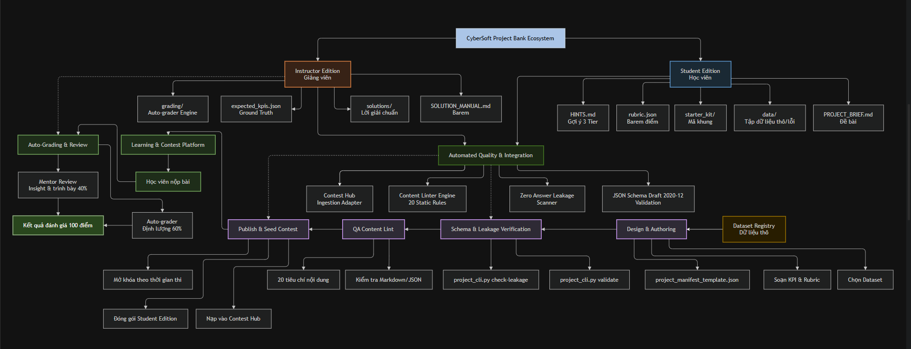

# 🎓 CyberSoft Student Project Standardization & Project Bank Architecture (Task 11)

> **Module Chuẩn Hóa Mẫu Dự Án Học Viên & Khung Barem Đánh Giá Định Lượng (Project Bank v1.0).**  
> **Tác giả:** Đào Trung Kiên — Data & AI Resource Engineer  
> **Nhiệm vụ:** Task 11 (Tuần 3 - Project Bank và Phân Tích) — CyberSoft Data & AI Lab  
> **Phiên bản:** v1.0.0 — Ngày 15/09/2026  

---




---

## 🌟 1. Tổng Quan Tính Năng Cốt Lõi
1. **JSON Schema Draft 2020-12 Chuẩn Hóa (`project.schema.json`):**
   - Định nghĩa chặt chẽ 7 thành phần cấu trúc của mọi dự án: *Bối cảnh nghiệp vụ, Tập dữ liệu, Yêu cầu kỹ thuật (Core 70đ + Extension 30đ), Tiêu chí KPI, Barem Rubric 100đ, Gợi ý phân tầng 3 cấp độ (Tiered Hints), và Sản phẩm kỳ vọng*.
2. **Nguyên Tắc Rubric Engineering Đo Lường Được (Quantitative Rubrics):**
   - Loại bỏ 100% từ ngữ cảm tính (*"đẹp", "hợp lý", "tốt"*). Mọi tiêu chí đều quy định ngưỡng số học (ví dụ: *loại bỏ 100% duplicate, sai số doanh thu $\le 0.05\%$ so với Ground Truth*).
3. **Phân Tách Hai Miền Dữ Liệu & Zero Answer Leakage:**
   - **Student Edition (`student_edition/`):** Đề bài, dữ liệu thực hành (chứa lỗi thực tế), starter kit, rubric và gợi ý. Tuyệt đối không chứa đáp án hay giải thuật.
   - **Instructor Edition (`instructor_edition/`):** Lời giải chuẩn (`full_analysis_solution.py`), SQL queries, ground-truth KPIs (`expected_kpis.json`), và script chấm tự động (`auto_grader.py`).
4. **Tích Hợp Hệ Sinh Thái & Kiểm Định Tự Động (Ecosystem Integration):**
   - **Contest & Exam Scheduling Hub / Learning Platform:** Tiếp nhận cấu trúc nạp bài thi vào Contest Hub, thiết lập lịch mở ca thi và bảng xếp hạng Leaderboard.
   - **Content Quality Linter Engine (20 Rules):** Quét lỗi cú pháp, broken links và cấu trúc Markdown/JSON đảm bảo tính toàn vẹn 100%.
5. **Bộ Công Cụ CLI & Kiểm Thử Tự Động Hoàn Chỉnh:**
   - CLI `project_cli.py` hỗ trợ các lệnh: `validate`, `check-leakage`, `package`, `summary`.
   - Test suite Pytest với **14/14 tests Passed 100%**. Kịch bản End-to-End `demo_project_workflow.py` đạt **Exit Code 0**.

---

## 🚀 2. Hướng Dẫn Khởi Động Nhanh (Quick Start)

### A. Kiểm định tính hợp lệ của Project Manifest
```powershell
python cybersoft-learning-hub/Data-AI-Resource/BaoCao_Task11/scripts/project_cli.py validate cybersoft-learning-hub/Data-AI-Resource/BaoCao_Task11/projects/sales_performance_analytics/project_manifest.json
```

### B. Quét phòng vệ rò rỉ đáp án trên bản học viên (Zero Leakage)
```powershell
python cybersoft-learning-hub/Data-AI-Resource/BaoCao_Task11/scripts/project_cli.py check-leakage cybersoft-learning-hub/Data-AI-Resource/BaoCao_Task11/projects/sales_performance_analytics/student_edition
```

### C. Đóng gói phân tách gói Student và Instructor
```powershell
python cybersoft-learning-hub/Data-AI-Resource/BaoCao_Task11/scripts/project_cli.py package cybersoft-learning-hub/Data-AI-Resource/BaoCao_Task11/projects/sales_performance_analytics --output cybersoft-learning-hub/Data-AI-Resource/BaoCao_Task11/dist
```

### D. Chạy Kịch Bản Demo Toàn Diện (End-to-End Demo Workflow)
```powershell
python cybersoft-learning-hub/Data-AI-Resource/BaoCao_Task11/scripts/demo_project_workflow.py
```

### E. Chạy Toàn Bộ Bộ Kiểm Thử Tự Động (Pytest Suite)
```powershell
pytest cybersoft-learning-hub/Data-AI-Resource/BaoCao_Task11/tests/ -v
```
*(Kỳ vọng: 14 passed in ~3.0s — 100% SUCCESS)*

---

## 📁 3. Cấu Trúc Thư Mục Module Task 11
```text
BaoCao_Task11/
├── 11_student_project_standardization.md   # Đặc tả kỹ thuật chuẩn CyberSoft
├── README.md                                # Tài liệu hướng dẫn sử dụng & tổng quan
├── AI_WORKLOG.md                            # Nhật ký phối hợp AI minh bạch & phòng vệ bẫy AI
├── Picture_11_Detail.png                    # Sơ đồ 6 khối kiến trúc trực quan độ phân giải cao
├── Picture_11_project_bank_architecture.png # Sơ đồ phân tầng 3 Swimlanes Project Bank
├── schemas/                                 # Chuẩn dữ liệu JSON Schema Draft 2020-12
│   ├── project.schema.json                  # Schema chính thức của Project Bank
│   └── project_schema_docs.md               # Tài liệu diễn giải các trường schema
├── src/                                     # Mã nguồn cốt lõi
│   └── core/
│       ├── models.py                        # Pydantic data models
│       ├── validator.py                     # Bộ kiểm định schema, rubric và leakage
│       └── packager.py                      # Bộ đóng gói phân tách 2 miền dữ liệu
├── templates/                               # Khung mẫu tái sử dụng cho các dự án mới
│   ├── project_manifest_template.json       # Manifest mẫu JSON
│   ├── project_manifest_template.yaml       # Manifest mẫu YAML
│   ├── student_template/                    # Khung mẫu thư mục học viên
│   └── instructor_template/                 # Khung mẫu thư mục giảng viên
├── projects/                                # Dự án chuẩn mẫu (Benchmark Project)
│   └── sales_performance_analytics/        # Dự án Phân tích Hiệu quả Bán hàng
│       ├── project_manifest.json            # Manifest chuẩn của dự án bán hàng
│       ├── student_edition/                 # BẢN HỌC VIÊN (Zero Leakage)
│       │   ├── PROJECT_BRIEF.md             # Đề bài chi tiết 5 tasks
│       │   ├── rubric.json                  # Barem định lượng 100 điểm
│       │   ├── HINTS.md                     # Gợi ý phân tầng 3 cấp độ
│       │   ├── submission_checklist.md      # Danh mục tự kiểm tra trước nộp
│       │   ├── data/                        # orders.csv, items, customers, products
│       │   └── starter_kit/                 # Python script & SQL template
│       └── instructor_edition/              # BẢN GIẢNG VIÊN (Privileged)
│           ├── SOLUTION_MANUAL.md           # Hướng dẫn chấm bài & bẫy lỗi thường gặp
│           ├── expected_kpis.json           # Ground Truth: $388,850.28, AOV $1,150.44
│           ├── solutions/                   # full_analysis_solution.py, SQL queries
│           └── grading/                     # auto_grader.py (chấm tự động 60đ)
├── scripts/                                 # Dòng lệnh CLI & Demo kịch bản
│   ├── project_cli.py                       # CLI quản lý, kiểm định và đóng gói
│   └── demo_project_workflow.py             # Kịch bản demo toàn diện 5 bước
├── docs/                                    # Tài liệu kiến trúc chuyên sâu
│   ├── project_bank_architecture.md         # Kiến trúc vòng đời dự án Project Bank
│   ├── rubric_engineering_guidelines.md     # Nguyên tắc Rubric định lượng
│   └── student_instructor_contract.md       # Hợp đồng giao diện & tích hợp nền tảng thi
└── tests/                                   # Bộ kiểm thử Pytest tự động (14 tests)
    ├── conftest.py                          # Cấu hình môi trường kiểm thử
    ├── test_project_schema.py               # Kiểm định Schema Draft 2020-12
    ├── test_rubric_engineering.py           # Kiểm định ràng buộc trọng số rubric
    ├── test_student_instructor_separation.py# Kiểm thử Zero Answer Leakage
    └── test_project_cli.py                  # Kiểm thử mã thoát và dòng lệnh CLI
```

---

## 📊 4. Các Chỉ Số Định Lượng Nghiệm Thu (DoD Verification)
| Tiêu chí Nghiệm thu (DoD Criteria) | Chỉ số Cam kết | Kết quả Thực tế Đạt được | Đánh giá |
| :--- | :---: | :---: | :---: |
| **Tính hợp lệ JSON Schema** | Đạt 100% | `project.schema.json` Draft 2020-12 PASS | ✅ ĐẠT |
| **Barem Rubric Đo lường được** | 100 điểm tuyệt đối | Core 70đ + Ext 30đ = 100.0đ (0 từ ngữ cảm tính) | ✅ ĐẠT |
| **Phân tách Học viên vs Giảng viên** | 100% Clean | Zero Answer Leakage trên `student_edition` | ✅ ĐẠT |
| **Dự án Benchmark Hoàn chỉnh** | 1 dự án mẫu | CyberSoft Mart Sales Performance (4 bảng dữ liệu) | ✅ ĐẠT |
| **Độ tin cậy Kiểm thử Tự động** | 100% PASS | **14/14 tests PASSED** trong 3.05 giây | ✅ ĐẠT |
| **Chuẩn Mã Thoát POSIX CLI** | Mã 0 / 1 / 2 | Tuân thủ 100% (0: OK, 1: Error, 2: Leakage) | ✅ ĐẠT |
| **Tích hợp Hệ sinh thái** | Nền tảng Thi & Linter | Cung cấp Data Contract cho Contest & Content Lint | ✅ ĐẠT |
