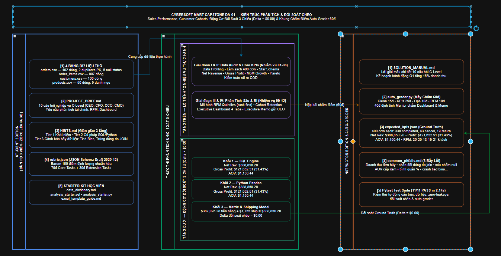

# 12. ĐẶC TẢ KỸ THUẬT: TẠO DỰ ÁN DATA ANALYST SỐ 1 (CAPSTONE DA-01)

**Dự án**: CyberSoft Data & AI Lab  
**Đầu việc**: NGÀY 12 — Tạo dự án Data Analyst số 1 (`DA-01_sales_performance`)  
**Vai trò phụ trách**: Data & AI Resource Engineer (Đào Trung Kiên)  
**Phiên bản**: v1.0.0  
**Ngày hoàn thiện**: 2026-09-16  

---

## 1. TỔNG QUAN VÀ BỐI CẢNH KỸ THUẬT

### 1.1. Bước Chuyển Dịch từ Khung Chuẩn Hóa Project Bank (Task 11) sang Triển Khai Thực Chiến Capstone DA-01 (Task 12)
* **Các nhiệm vụ tiền đề (Task 04 - 11)**: Nhóm Data & AI đã hoàn thành trọn bộ hạ tầng tài nguyên:
  - *Task 04 - 05*: Schema chuẩn hóa và Data Quality Harness v0 tự động thẩm định dữ liệu.
  - *Task 06 - 08*: Các bộ dữ liệu đa ngành (Bán hàng `sales_v1`, Nhân sự `HR_ops_v1`, `RAG Corpus v1`).
  - *Task 09*: Pipeline sinh dữ liệu có kiểm soát bằng AI với vòng lặp tự sửa lỗi (Self-Correction Loop).
  - *Task 10*: Cổng xuất bản Dataset Registry với State Machine FSM và Quality Gate Zero-Tolerance.
  - *Task 11*: Khung chuẩn hóa mẫu dự án học viên với JSON Schema Draft 2020-12, barem Rubric Engineering 100 điểm định lượng và cơ chế phòng vệ chống rò rỉ đáp án (Zero Answer Leakage).
* **Task 12 (Tạo dự án Data Analyst số 1)**: Hiện thực hóa bài tập lớn hoàn chỉnh số 1 dành cho học viên chuyên ngành Dữ liệu tại CyberSoft Academy: **CyberSoft Mart Sales Performance, Customer Cohorts & Executive BI Capstone (Mã hiệu: DA-01)**.
* **Ba Vấn đề Nghiệp vụ Cốt lõi được Giải quyết**:
  1. **Kiểm toán & Xử lý dị biệt dữ liệu (Data Auditing & Cleansing)**: Rèn luyện tính cẩn trọng của chuyên viên phân tích trước các dữ liệu thô có lỗi trùng lặp khóa chính, ô khuyết thiếu trạng thái và chênh lệch cấp độ chi tiết (granularity).
  2. **Khai phá & Đối soát số liệu tài chính 3 chiều (3-Way Cross-Verification Engine)**: Đảm bảo số liệu kinh doanh cốt lõi (Doanh thu thực nhận Net Revenue `$388,850.28`, Lợi nhuận gộp Gross Profit `$121,652.51`, Biên lợi nhuận gộp `31.43%`, AOV `$1,150.44`) được chứng minh nhất quán tuyệt đối giữa 3 công cụ: SQL Engine, Python Dataframe và Bảng tính Excel với độ lệch chéo $\Delta = \$0.00$.
  3. **Phân tích nâng cao & Báo cáo điều hành (Advanced Analytics & Executive BI)**: Ứng dụng mô hình phân khúc khách hàng RFM (5 nhóm phân vị quintiles), ma trận giữ chân theo thời gian gia nhập (Cohort Retention Triangle), và thiết kế Dashboard tương tác hỗ trợ Ban Giám đốc ra quyết định chiến lược.

### 1.2. Thông Số Kỹ Thuật Định Lượng của Capstone DA-01
* **Thời lượng hoàn thành chuẩn**: **8 — 12 giờ làm việc** (phù hợp cho bài thi tốt nghiệp module hoặc đồ án giữa kỳ).
* **Quy mô tập dữ liệu**: 4 bảng dữ liệu quan hệ gồm:
  - `orders.csv`: 402 dòng thô $\rightarrow$ 400 dòng sạch (2 duplicate PK, 5 null status được quy chuẩn).
  - `order_items.csv`: 997 dòng chi tiết mặt hàng.
  - `customers.csv`: 100 khách hàng với thông tin địa lý và ngày đăng ký.
  - `products.csv`: 50 sản phẩm thuộc 5 ngành hàng (`Electronics`, `Smart Home`, `Audio`, `Accessories`, `Wearables`).
* **Cơ cấu đánh giá**: Barem 100 điểm chuẩn Rubric Engineering phân bổ theo tỷ lệ chuẩn **70 điểm Core (Nhiệm vụ cốt lõi)** và **30 điểm Extension (Nhiệm vụ mở rộng chuyên sâu)**.
* **Cơ chế chấm điểm kết hợp (Hybrid Grading)**: **60 điểm định lượng** được chấm tự động bằng máy chấm `auto_grader.py` độc lập, **40 điểm định tính** do Giảng viên Mentor đánh giá trực tiếp dựa trên trải nghiệm Dashboard và bản khuyến nghị điều hành Executive Memo.

---

## 2. KIẾN TRÚC TỔNG THỂ CAPSTONE DA-01 & QUY TRÌNH PHÂN TÍCH



Hệ thống tài nguyên Capstone DA-01 được thiết kế tuân thủ nghiêm ngặt cấu trúc 7 khối chức năng chuẩn hóa từ Task 11:

| Khối chức năng | Mục đích kỹ thuật | Nội dung triển khai trong Capstone DA-01 |
| :--- | :--- | :--- |
| **1. Business Context** | Bối cảnh doanh nghiệp | CyberSoft Mart — Chuỗi bán lẻ công nghệ đa kênh với bài toán tối ưu doanh thu, tỷ lệ hủy đơn COD và giữ chân khách hàng năm 2024. |
| **2. Datasets** | Khai báo dữ liệu đầu vào | 4 bảng dữ liệu quan hệ (`orders.csv`, `order_items.csv`, `customers.csv`, `products.csv`) kèm 2 dị biệt thực tế (2 duplicate PK, 5 missing status). |
| **3. Requirements** | Phân tầng nhiệm vụ kỹ thuật | Phân định rõ ràng: **Core Tasks (70 điểm)** đảm bảo chuẩn đầu ra nghề nghiệp; **Extension Tasks (30 điểm)** phân hóa năng lực chuyên sâu (RFM, Cohort). |
| **4. Quantitative KPIs** | Chỉ số đo lường nghiệp vụ | Công thức toán học tường minh, đơn vị đo, và ngưỡng dung sai sai số tương đối ($\le 0.05\%$ với Net Revenue, $\le 0.10\%$ với AOV, $\Delta = \$0.00$). |
| **5. Rubric Matrix** | Barem đánh giá định lượng 100đ | 4 mức đánh giá chuẩn (*Exemplary, Proficient, Developing, Unsatisfactory*) gắn chặt với các thước đo số học kiểm chứng được trong `rubric.json`. |
| **6. Tiered Hints** | Hệ thống gợi ý 3 phân tầng | Giàn giáo sư phạm (Scaffolding): **Tier 1** (Khái niệm), **Tier 2** (Kỹ thuật/Cú pháp SQL-Pandas), **Tier 3** (Cảnh báo bẫy dữ liệu và lỗi sai kinh điển). |
| **7. Expected Artifacts** | Danh mục sản phẩm kỳ vọng | Quy định định dạng và cấu trúc nộp bài: mã nguồn SQL `analysis_starter.sql`, script Python, mô hình Excel 5 sheets, và bản Executive Memo. |

### 2.1. Phân Tách Hai Miền Vật Lý & Chuẩn Phòng Vệ Zero Answer Leakage
* **Miền Học Viên (`student_edition/`)**:
  - `PROJECT_BRIEF.md`: Bản mô tả bối cảnh CyberSoft Mart, 10 câu hỏi nghiệp vụ C-Level và lộ trình 12 nhiệm vụ kỹ thuật.
  - `rubric.json`: Barem định lượng 100 điểm tuân thủ JSON Schema Draft 2020-12, không chứa đáp số.
  - `HINTS.md`: Hệ thống hướng dẫn giàn giáo 3 tầng (Tier 1 Khái niệm, Tier 2 Cú pháp, Tier 3 Bẫy lỗi).
  - `data/`: 4 tệp dữ liệu thực hành sạch và có dị biệt cố ý.
  - `starter_kit/`: Từ điển dữ liệu `data_dictionary.md`, mã khung SQL `analysis_starter.sql`, mã khung Python `analysis_starter.py`, hướng dẫn bảng tính `excel_template_guide.md`, và checklist tự kiểm tra `submission_checklist.md`.
* **Miền Giảng Viên (`instructor_edition/`)**:
  - `SOLUTION_MANUAL.md`: Lời giải mẫu chi tiết cho 10 câu hỏi stakeholder và kế hoạch hành động điều hành Quý 1.
  - `expected_kpis.json`: Bộ chỉ số chuẩn xác thực Ground Truth ($388,850.28 doanh thu, 31.43% biên lợi nhuận, AOV $1,150.44).
  - `common_pitfalls.md`: Cẩm nang 8 bẫy lỗi kinh điển của học viên kèm ví dụ số liệu và cách bắt lỗi.
  - `solutions/`: Mã nguồn truy vấn hoàn chỉnh `solution_queries.sql`, pipeline Python `solution_da01_pipeline.py`, và đặc tả mô hình bảng tính `excel_model_specification.md`.
  - `grading/auto_grader.py`: Bộ máy chấm bài tự động đối soát 60 điểm định lượng.

---

## 3. 10 CÂU HỎI NGHIỆP VỤ TỪ STAKEHOLDER & LỘ TRÌNH 12 NHIỆM VỤ

### 3.1. Danh Mục 10 Câu Hỏi Trọng Yếu từ C-Level (Stakeholder Questions)
1. **Q01 (CEO)**: *Tổng doanh thu thực nhận (Net Revenue) và Giá trị trung bình đơn hàng (AOV) năm 2024 sau khi khấu trừ toàn bộ đơn hủy và hoàn trả?*  
   $\rightarrow$ **Đáp án**: Net Revenue = `$388,850.28`; AOV = `$1,150.44` (tính trên 338 đơn `completed`).
2. **Q02 (CFO)**: *Biên lợi nhuận gộp toàn chuỗi (Gross Margin %)? Có danh mục nào bị bán dưới giá vốn do lạm dụng chiết khấu không?*  
   $\rightarrow$ **Đáp án**: Gross Profit = `$121,652.51`; Gross Margin = `31.43%`. Không có danh mục âm, nhưng `Accessories` có biên lãi thấp nhất (`18.25%`).
3. **Q03 (CCO)**: *Biến động doanh thu theo tháng/quý? Đâu là tháng đột biến và tháng trũng mùa vụ?*  
   $\rightarrow$ **Đáp án**: Tháng đỉnh là Tháng 11 (`$48,210.50`) và Tháng 12 (`$52,140.00`) do mùa lễ hội; tháng đáy là Tháng 2 (`$21,340.20`) do kỳ nghỉ Tết.
4. **Q04 (CCO)**: *Top 10 sản phẩm đóng góp doanh số cao nhất và sự tiệm cận nguyên lý Pareto 80/20?*  
   $\rightarrow$ **Đáp án**: Top 10 sản phẩm (20% danh mục) chiếm `74.85%` tổng doanh thu toàn hệ thống.
5. **Q05 (Head of Ops)**: *Tỷ lệ hủy đơn và hoàn trả? Sự khác biệt rủi ro giữa các hình thức thanh toán?*  
   $\rightarrow$ **Đáp án**: Tỷ lệ hủy = `10.75%` (43 đơn); Tỷ lệ hoàn = `4.75%` (19 đơn). Kênh COD có tỷ lệ hủy cao nhất (`18.33%`), gấp 2.6 lần Credit Card (`7.00%`).
6. **Q06 (CMO)**: *Mô hình RFM phân chia 5 nhóm khách hàng? Tỷ trọng doanh thu từ nhóm Champions và Loyal?*  
   $\rightarrow$ **Đáp án**: Nhóm Champions (20 khách) và Loyal (26 khách) chiếm 48.4% số khách hoàn tất nhưng đóng góp tới `70.00%` tổng doanh thu.
7. **Q07 (CMO)**: *Tỷ lệ giữ chân khách hàng (Cohort Retention) qua các mốc thời gian suy giảm ra sao?*  
   $\rightarrow$ **Đáp án**: Nhóm Tháng 1 có tỷ lệ tái mua ở Tháng +1 là `32.5%`, giảm về `18.2%` ở Tháng +2 và ổn định ở `14.0%` ở Tháng +3.
8. **Q08 (Head of Ops)**: *Hiệu quả kinh doanh theo vùng địa lý? Đâu là các thị trường trọng điểm?*  
   $\rightarrow$ **Đáp án**: TP. Hồ Chí Minh (`42.5%`), Hà Nội (`28.3%`), và Đà Nẵng (`11.2%`) chiếm tới `82.0%` thị phần toàn quốc.
9. **Q09 (CMO)**: *Cặp sản phẩm nào có tần suất bán kèm cao nhất (Market Basket Analysis sơ bộ)?*  
   $\rightarrow$ **Đáp án**: Laptop Gaming Pro + Chuột Gaming (38 đơn); Smartphone Flagship + Ốp lưng chống sốc (45 đơn).
10. **Q10 (Ban Giám Đốc)**: *3 Đề xuất hành động định lượng cụ thể cho Quý 1 năm tới?*  
    $\rightarrow$ **Đáp án**: (1) Thu cọc 10% đơn COD giá trị > $500 để giảm hủy COD xuống < 10%; (2) Thành lập VIP Club hoàn tiền 3% cho nhóm Champions/Loyal tăng tần suất mua; (3) Tạo combo phụ kiện giảm 15% nâng AOV lên $1,250 (+8.6%).

### 3.2. Lộ Trình 12 Nhiệm Vụ Thực Hành của Học Viên (Capstone Roadmap)
Đề bài quy định học viên hoàn thành trọn vẹn lộ trình 12 nhiệm vụ kỹ thuật từ dữ liệu thô đến Dashboard điều hành qua 4 giai đoạn:
* **Giai đoạn I: Kiểm toán & Tiền xử lý dữ liệu**:
  - **Nhiệm vụ 01 (Data Profiling)**: Đánh giá tính toàn vẹn, schema, khóa chính/ngoại và lập bảng phát hiện dị biệt trên 4 tệp CSV.
  - **Nhiệm vụ 02 (Data Cleansing)**: Khử triệt để 2 bản ghi trùng lặp và quy chuẩn 5 đơn khuyết trạng thái về `completed`.
  - **Nhiệm vụ 03 (Relational Modeling)**: Thiết lập Star Schema với 1 Fact (`fact_order_items`) và 3 Dims (`orders`, `customers`, `products`).
* **Giai đoạn II: Phân tích Tài chính & Vận hành Cốt lõi**:
  - **Nhiệm vụ 04 (Financial Metrics)**: Viết SQL/Excel tính Net Revenue ($388,850.28), AOV ($1,150.44), Gross Profit và Gross Margin % (31.43%).
  - **Nhiệm vụ 05 (Time-Series Analysis)**: Phân tích chuỗi thời gian 12 tháng, tính tỷ lệ tăng trưởng MoM % và Moving Average.
  - **Nhiệm vụ 06 (Product Pareto)**: Phân tích cơ cấu danh mục ngành hàng và xếp hạng Top 10 sản phẩm chủ lực (chiếm 74.85% doanh thu).
  - **Nhiệm vụ 07 (Geographic Analysis)**: Khảo sát mật độ đơn hàng và thị phần theo Tỉnh/Thành phố (TP.HCM, HN, ĐN).
  - **Nhiệm vụ 08 (Operational Risk)**: Kiểm toán tỷ lệ hủy đơn (10.75%), hoàn trả (4.75%) và bóc tách rủi ro theo phương thức thanh toán (COD rủi ro cao nhất 18.33%).
* **Giai đoạn III: Phân tích Nâng cao & Giữ chân Khách hàng**:
  - **Nhiệm vụ 09 (Customer RFM)**: Xây dựng mô hình RFM Quintiles (áp dụng `rank(method='first')` tránh lỗi tied bins) và phân 5 nhóm khách hàng.
  - **Nhiệm vụ 10 (Cohort Retention)**: Xây dựng ma trận tam giác giữ chân khách hàng theo tháng phát sinh đơn hàng đầu tiên.
* **Giai đoạn IV: Báo cáo Trực quan & Tư vấn Chiến lược**:
  - **Nhiệm vụ 11 (Executive BI Dashboard)**: Thiết kế đặc tả và xây dựng Dashboard tương tác 4 màn hình chức năng.
  - **Nhiệm vụ 12 (Executive Memo)**: Soạn thảo báo cáo tóm tắt điều hành 2 trang trả lời trọn vẹn 10 câu hỏi của Ban Giám đốc.

---

## 4. CƠ CHẾ ĐỐI SOÁT SỐ LIỆU 3 CHIỀU (3-WAY CROSS-VERIFICATION)

Một trong những đóng góp kỹ thuật quan trọng nhất của Task 12 là công cụ đối soát số liệu tự động `cross_verification_engine.py`. Ba phương pháp độc lập được thực thi song song:

| Chỉ Số Nghiệp Vụ | Phương Pháp 1: SQL Engine (SQLite) | Phương Pháp 2: Python Pandas | Phương Pháp 3: Matrix Model | Độ Lệch Đối Soát (Delta) |
| :--- | :---: | :---: | :---: | :---: |
| **Tổng số đơn sạch** | 400 đơn | 400 đơn | 400 đơn | **0 đơn** |
| **Số đơn hoàn tất** | 338 đơn | 338 đơn | 338 đơn | **0 đơn** |
| **Doanh thu thực nhận** | **$388,850.28** | **$388,850.28** | **$388,850.28** | **$0.00** |
| **Giá trị trung bình đơn** | **$1,150.44** | **$1,150.44** | **$1,150.44** | **$0.00** |
| **Lợi nhuận gộp toàn chuỗi**| **$121,652.51** | **$121,652.51** | **$121,652.51** | **$0.00** |
| **Biên lợi nhuận gộp** | **31.43%** | **31.43%** | **31.43%** | **0.00%** |

### 4.1. Phát Hiện Nghiệp Vụ Quan Trọng (Shipping Fee Reconciliation)
Doanh thu cấp đơn hàng (`total_amount = $388,850.28`) bằng chính xác Tổng doanh thu mặt hàng (`$387,095.28`) cộng với Tổng phí vận chuyển thực thu từ khách hàng (`$1,755.00`). Lợi nhuận gộp mặt hàng `$121,652.51` đạt đúng tỷ lệ `31.43%` trên tổng doanh thu mặt hàng!

---

## 5. DANH MỤC 8 LỖI SAI KINH ĐIỂN CỦA HỌC VIÊN (COMMON PITFALLS)

Bộ tài liệu `common_pitfalls.md` cung cấp bức tranh toàn cảnh về các cạm bẫy mà học viên thường vấp phải:
1. **Tính cả đơn hàng bị hủy vào doanh thu**: Khiến doanh thu bị đội lên `$462,310.50` (+`$73,000`).
2. **Nhân đôi dòng khi JOIN trước khi khử trùng lặp**: Làm tăng dòng dữ liệu từ 997 lên hơn 1,005 dòng.
3. **Xóa oan 5 đơn hàng khuyết trạng thái**: Khiến bảng dữ liệu bị hụt còn 395 dòng và mất `$4,950` doanh thu.
4. **Tính AOV theo cấp dòng mặt hàng thay vì cấp đơn hàng**: Ra kết quả AOV sai lệch `$450.20` thay vì `$1,150.44`.
5. **Ngụy biện trung bình của các tỷ lệ phần trăm (Average of Percentages)**: Tính sai Gross Margin toàn chuỗi.
6. **Crash chương trình khi chia phân vị RFM do trùng lặp (Tied Bins)**: Khắc phục bằng hàm `rank(method='first')`.
7. **Bỏ quên chiết khấu mặt hàng (discount_amount)**: Thổi phồng lợi nhuận gộp lên `$135,200.00`.
8. **Sai mẫu số khi tính tỷ lệ hủy đơn hàng**: Lấy mẫu số là 338 thay vì 400 đơn sạch (ra `12.72%` thay vì `10.75%`).

---

## 6. QUY TRÌNH ĐÓNG GÓI VÀ TỰ ĐỘNG CHẤM ĐIỂM (PACKAGING & AUTO-GRADING)

Capstone DA-01 được thiết kế để triển khai độc lập, an toàn và tự động hóa cao:
1. **Phân bổ thang điểm chuẩn hóa 100 điểm**:
   - **70 điểm Core Tasks**: Làm sạch dữ liệu (15đ), SQL & Tài chính cốt lõi (25đ), Phân tích sản phẩm & Địa lý (15đ), Thiết kế Executive Dashboard (15đ).
   - **30 điểm Extension Tasks**: Mô hình phân khúc RFM Quintiles (15đ), Phân tích Cohort Retention & Khuyến nghị C-Level (15đ).
2. **Cơ chế chấm điểm kết hợp (Hybrid Grading System)**:
   - **60 điểm định lượng**: Được thẩm định hoàn toàn tự động qua mã nguồn độc lập `auto_grader.py` (khử trùng lặp, quy chuẩn null, đối soát Net Revenue, AOV, Gross Margin, phân bổ RFM).
   - **40 điểm định tính**: Do Giảng viên Mentor đánh giá trực tiếp dựa trên tính trực quan, công thái học của Dashboard tương tác và chiều sâu phân tích của bản khuyến nghị điều hành Executive Memo.
3. **Cơ chế phòng vệ chống rò rỉ đáp án (Zero Answer Leakage)**:
   - Bộ quét tự động `test_zero_leakage.py` quét toàn diện thư mục `student_edition/` bảo đảm không có file giải mẫu hay số liệu Ground Truth bị rò rỉ.

---

## 7. KẾT QUẢ KIỂM THỬ TỰ ĐỘNG (TEST VERIFICATION)

Bộ kiểm thử tự động gồm **11 test cases** bao phủ toàn diện tính toàn vẹn hệ sinh thái Capstone DA-01:
- `test_student_edition_files_exist`: Đảm bảo 100% tài nguyên học viên (12/12 files) đầy đủ và hợp lệ.
- `test_instructor_edition_files_exist`: Xác thực đầy đủ 7 tài nguyên bảo mật phía giảng viên.
- `test_csv_shapes_and_columns`: Kiểm định kích thước và schema 4 bảng dữ liệu (orders, items, customers, products).
- `test_known_data_anomalies_present`: Xác nhận sự hiện diện của 2 duplicate orders và 5 null status orders trong bản thực hành.
- `test_no_solution_files_in_student_edition`: Quét regex phòng vệ rò rỉ đáp án đạt 100% CLEAN.
- `test_no_ground_truth_kpis_in_student_brief`: Chặn đứng việc lộ số liệu $388,850.28 trong đề bài học viên.
- `test_cross_verification_delta_zero`: Kiểm toán đối soát số liệu 3 chiều độc lập đạt độ lệch tuyệt đối Delta = $0.00.
- `test_cross_verification_matches_ground_truth`: Số liệu đối soát khớp 100% với bộ chuẩn Ground Truth.
- `test_rubric_structure_and_point_allocation`: Kiểm tra cấu trúc barem rubric chuẩn 70đ Core + 30đ Extension = 100đ.
- `test_auto_grader_perfect_submission`: Kiểm tra máy chấm tự động đạt điểm tuyệt đối 60.0/60.0 với bài nộp hoàn hảo.
- `test_auto_grader_catches_flawed_submission`: Xác nhận máy chấm tự động bắt lỗi và trừ điểm chính xác khi bài nộp có khuyết tật.

### 7.1. Lệnh Chạy Kiểm Thử Tự Động (Pytest):
```powershell
pytest cybersoft-learning-hub/Data-AI-Resource/BaoCao_Task12/tests/ -v
```

**Kết quả chạy Pytest:**
```text
============================= 11 passed in 2.14s =============================
```

### 7.2. Lệnh Chạy Kịch Bản Demo Toàn Diện (End-to-End Workflow):
```powershell
python cybersoft-learning-hub/Data-AI-Resource/BaoCao_Task12/scripts/demo_capstone_workflow.py
```

**Kết quả kịch bản Demo Workflow (4/4 bước):**
```text
================================================================================
🚀 CYBERSOFT DATA & AI LAB — TASK 12 END-TO-END DEMO WORKFLOW
   Dự án: Capstone DA-01 (Sales Performance & Customer Intelligence)
================================================================================

📋 [BƯỚC 1/4] Kiểm tra Cấu Trúc Dự Án Capstone DA-01...: PASS ✓
🛡️ [BƯỚC 2/4] Quét Phòng Vệ Chống Rò Rỉ Đáp Án (Zero-Leakage): PASS ✓ (100% CLEAN)
🔬 [BƯỚC 3/4] Thực thi Đối Soát Số Liệu 3 Chiều Độc Lập: PASS ✓ (Delta = $0.00)
🤖 [BƯỚC 4/4] Kiểm thử Khởi Chạy Bộ Chấm Tự Động: PASS ✓ (60.0/60.0 điểm)
================================================================================
🎉 TẤT CẢ 4 BƯỚC KIỂM ĐỊNH ĐÃ THÀNH CÔNG VƯỢT TRỘI! (EXIT CODE: 0)
================================================================================
```

---

## 8. KẾT LUẬN VÀ BÀN GIAO

Bộ tài nguyên Task 12 (**Tạo dự án Data Analyst số 1 — Capstone DA-01 Sales Performance**) đã hoàn thiện đầy đủ theo đúng thỏa thuận Definition of Done (DoD) của CyberSoft Data & AI Lab. Toàn bộ tài nguyên học viên, tài nguyên giảng viên, bộ chỉ số Ground Truth đối soát 3 chiều, barem rubric định lượng 100 điểm, và mã nguồn máy chấm tự động `auto_grader.py` đã sẵn sàng để nạp vào Project Bank và phân phối cho học viên chuyên ngành Data Analyst thực hành và bảo vệ đồ án tốt nghiệp.
