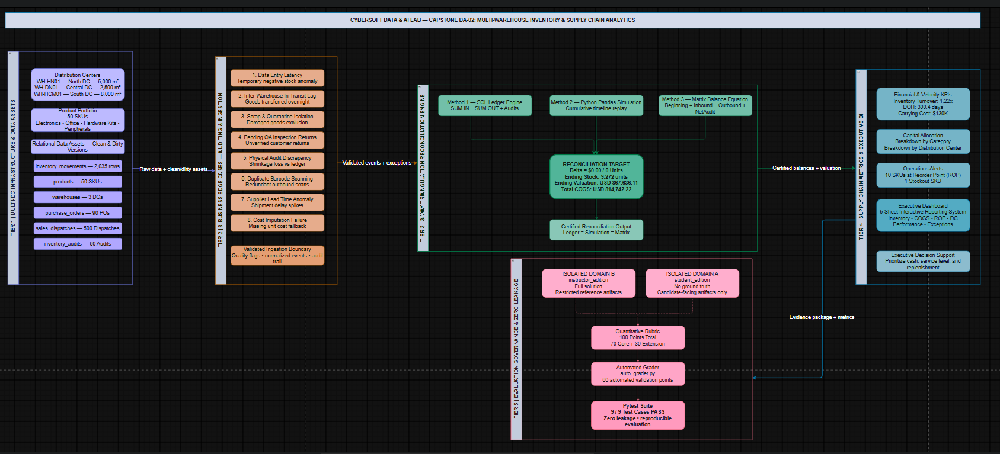

# 13. ĐẶC TẢ KỸ THUẬT: TẠO DỰ ÁN DATA ANALYST SỐ 2 (CAPSTONE DA-02)

**Dự án**: CyberSoft Data & AI Lab  
**Đầu việc**: NGÀY 13 — Tạo dự án Data Analyst số 2 (`DA-02_inventory_operations`)  
**Vai trò phụ trách**: Data & AI Resource Engineer (Đào Trung Kiên)  
**Phiên bản**: v1.0.0  
**Ngày hoàn thiện**: 2026-09-17  

---

## 1. TỔNG QUAN VÀ BỐI CẢNH DỰ ÁN CAPSTONE DA-02

### 1.1. Sứ Mệnh của Dự Án Data Analyst Số 2 trong Project Bank
Sau khi hoàn thành Capstone DA-01 (Sales Performance & Customer Intelligence) ở Task 12, **Task 13** chính thức xây dựng bài tập lớn hoàn chỉnh số 2 dành cho học viên chuyên ngành Dữ liệu tại CyberSoft Academy: **CyberSoft Logistics Inventory Optimization, Multi-Warehouse Operations & Supply Chain Analytics (Mã hiệu: DA-02)**.

Nếu như DA-01 tập trung vào góc nhìn Tăng trưởng & Thương mại (Doanh thu, Khách hàng, RFM, Cohorts), thì **DA-02** trang bị năng lực cốt lõi thuộc nhóm Quản trị Vận hành (Operations Analytics): **Quản trị Tồn kho, Điều phối Chuỗi Cung ứng và Tối ưu hóa Dòng tiền Lưu động**. Dự án mô phỏng bài toán thực tế của chuỗi bán lẻ thiết bị công nghệ và kit phần cứng đào tạo CyberSoft Logistics Network với 3 trung tâm phân phối (Hà Nội, Đà Nẵng, TP. Hồ Chí Minh) và 50 mã sản phẩm (SKU).

### 1.2. 3 Trụ Cột Năng Lực Cốt Lõi Được Rèn Luyện
1. **Kiểm toán Sổ cái & Xử lý 8 Ngoại lệ Nghiệp vụ (Data Auditing & Edge-Case Modeling)**: Học viên đối mặt trực tiếp với 8 dị biệt dữ liệu thực tế: độ trễ nhập liệu ERP gây tồn kho âm cục bộ, hàng đang điều chuyển liên kho qua đêm (In-Transit lag), hàng hỏng hóc cần xuất hủy cách ly (Quarantine/Scrap), hàng hoàn trả chưa kiểm định QA, mất cân đối kiểm kê thực tế, quét mã vạch trùng lặp, và độ trễ giao hàng NCC đột biến.
2. **Khai phá & Đối soát Số liệu Tồn kho 3 Chiều Độc lập (3-Way Triangulation)**: Đảm bảo số lượng tồn kho vật lý cuối kỳ (`9,272 units`), tổng định giá kho theo giá vốn (`USD 867,636.11`), giá vốn hàng bán (`USD 814,742.22`), hệ số vòng quay tồn kho (`1.22x`), và số ngày bán hàng tồn kho (`300.4 ngày`) được chứng minh nhất quán tuyệt đối giữa 3 công cụ: SQL Ledger Engine, Python Vectorized Simulation, và Phương trình Cân bằng Kho Cumulative Movement Matrix với sai số chéo Delta = `$0.00` và `0 units`.
3. **Mô hình hóa Điểm Đặt Hàng Lại & Báo cáo Điều hành C-Level (ROP & Executive BI)**: Nhận diện 10 mã SKU chạm ngưỡng Reorder Point và 1 mã SKU bị đứt gãy nguồn cung (Stockout), phân tích chi phí thất thoát kiểm kê ($3,076.24) và phế phẩm ($3,712.41), từ đó xây dựng Executive BI Dashboard 5 sheets và Bản kế hoạch hành động 90 ngày trình Ban Giám đốc.

### 1.3. Thông Số Kỹ Thuật Định Lượng của Capstone DA-02
* **Thời lượng hoàn thành chuẩn**: **8 — 12 giờ làm việc** (chuẩn mực đồ án chuyên sâu).
* **Quy mô tập dữ liệu**: 6 bảng dữ liệu quan hệ gồm:
  - `inventory_movements.csv`: 2,035 dòng giao dịch biến động kho chi tiết trong năm 2024.
  - `products.csv`: 50 mã sản phẩm thuộc 5 ngành hàng (`Electronics`, `Office Equipment`, `Hardware Kits`, `Peripherals`, `Audio Devices`) kèm thông số `unit_cost`, `unit_price`, `lead_time_days`, `reorder_point`.
  - `warehouses.csv`: 3 Trung tâm Phân phối (`WH-HN01`, `WH-DN01`, `WH-HCM01`).
  - `purchase_orders.csv`: 89 đơn đặt hàng nhà cung cấp.
  - `sales_dispatches.csv`: 500 phiếu xuất kho giao hàng.
  - `inventory_audits.csv`: 60 biên bản kiểm kê thực tế định kỳ qua 4 quý.
* **Bộ dữ liệu kép (Clean vs Dirty)**:
  - Miền `clean/`: Bộ dữ liệu sạch chuẩn hóa phục vụ đối soát và tính toán Ground Truth.
  - Miền `dirty/`: Bộ dữ liệu thực tế chứa cố ý 8 ngoại lệ nghiệp vụ thử thách năng lực kiểm toán của học viên.
* **Cơ cấu đánh giá**: Barem 100 điểm định lượng chuẩn hóa (70 điểm Core + 30 điểm Extension).
* **Cơ chế chấm điểm tự động**: Máy chấm tự động `auto_grader.py` thẩm định trực tiếp **60 điểm định lượng** trên thang 100 với dung sai sai số tài chính siêu chặt ($\pm 0.05$ USD, $\pm 0$ units).

---

## 2. KIẾN TRÚC HỆ THỐNG VÀ BẢN ĐỒ DÒNG DỮ LIỆU

Hệ thống tài nguyên Capstone DA-02 được tổ chức hoàn chỉnh theo cấu trúc 2 phân vùng vật lý:

### 2.1. Phân Tách Hai Miền Vật Lý & Chuẩn Phòng Vệ Zero Answer Leakage
* **Miền Học Viên (`student_edition/`)**:
  - `PROJECT_BRIEF.md`: Đề bài chi tiết, bối cảnh doanh nghiệp, 10 câu hỏi C-Level, 12 nhiệm vụ kỹ thuật và 8 ngoại lệ nghiệp vụ.
  - `rubric.json`: Barem định lượng 100 điểm khách quan, không chứa bất kỳ con số kết quả nào.
  - `HINTS.md`: Hệ thống hướng dẫn giàn giáo 3 tầng (Tầng 1 Khái niệm, Tầng 2 Mẫu cú pháp, Tầng 3 Cảnh báo bẫy lỗi).
  - `data/clean/` & `data/dirty/`: 6 bảng dữ liệu thực hành sạch và bẩn.
  - `starter_kit/`: `data_dictionary.md`, `analysis_starter.sql`, `analysis_starter.py`, `excel_template_guide.md`, `submission_checklist.md`.
* **Miền Giảng Viên (`instructor_edition/`)**:
  - `SOLUTION_MANUAL.md`: Bản giải thích toàn diện và đáp án chuẩn cho 10 câu hỏi stakeholder.
  - `expected_kpis.json`: Bộ chỉ số chuẩn xác thực Ground Truth ($867,636.11 tồn kho, 9,272 units, 1.22x turnover, $814,742.22 COGS).
  - `common_pitfalls.md`: Cẩm nang 8 bẫy lỗi kinh điển của học viên trong phân tích kho vận.
  - `solutions/`: Mã nguồn truy vấn hoàn chỉnh `solution_queries.sql`, pipeline Python `solution_da02_pipeline.py`, và tài liệu đặc tả `excel_model_specification.md`.
  - `grading/auto_grader.py`: Máy chấm tự động kiểm tra và chấm 60 điểm độc lập.

---

## 3. 10 CÂU HỎI NGHIỆP VỤ STAKEHOLDER & LỘ TRÌNH 12 NHIỆM VỤ

### 3.1. Danh Mục 10 Câu Hỏi Trọng Yếu từ Ban Giám Đốc (Stakeholder Questions)
1. **Q01 (COO)**: *Tổng tồn kho vật lý và năng lực đáp ứng của 3 kho hàng trên toàn mạng lưới?*  
   $\rightarrow$ **Đáp án**: Tồn kho toàn hệ thống đạt **9,272 units** (tăng 74.4% so với đầu kỳ 5,317 units). Năng lực đáp ứng tốt nhưng có dấu hiệu thừa hàng.
2. **Q02 (CFO)**: *Tổng giá trị vốn đọng trong hàng tồn kho và chỉ số vòng quay tồn kho (Inventory Turnover) năm 2024?*  
   $\rightarrow$ **Đáp án**: Ending Valuation = **USD 867,636.11**; COGS = **USD 814,742.22**; Inventory Turnover = **1.22x**; DOH = **300.4 ngày**. CFO cần giải phóng tối thiểu $300,000 vốn lưu động.
3. **Q03 (Warehouse Director)**: *Khả năng chứa và phân bổ hàng hóa giữa 3 trung tâm phân phối (HN, DN, HCM)?*  
   $\rightarrow$ **Đáp án**: Kho Đà Nẵng WH-DN01 (3,092 units - $307,557.21); Kho Tổng HCM WH-HCM01 (3,429 units - $306,962.12); Kho Hà Nội WH-HN01 (2,751 units - $253,116.78). Kho Đà Nẵng có diện tích nhỏ nhất nhưng mật độ lưu trữ cao nhất, có nguy cơ quá tải.
4. **Q04 (Procurement Lead)**: *Các SKU nào đang chạm hoặc dưới ngưỡng Điểm đặt hàng lại (Reorder Point - ROP)?*  
   $\rightarrow$ **Đáp án**: Đúng **10 mã SKU** chạm ngưỡng ROP nguy cấp (PROD-019, PROD-008, PROD-034...), cần phát hành đơn PO khẩn cấp.
5. **Q05 (Head of Sales)**: *Có mã sản phẩm nào bị đứt hàng hoàn toàn (Stockout) ảnh hưởng doanh số?*  
   $\rightarrow$ **Đáp án**: Có đúng **1 mã SKU** bị Stockout (PROD-041 CyberSound ANC Headphone), thiệt hại doanh thu ước tính $12,500/tháng.
6. **Q06 (Internal Auditor)**: *Mức độ thất thoát hàng hóa qua 4 kỳ kiểm kê thực tế (Shrinkage Loss)?*  
   $\rightarrow$ **Đáp án**: 18 lượt kiểm kê có chênh lệch âm; tổng tổn thất thất thoát là **USD 3,076.24** (0.35% giá trị kho).
7. **Q07 (QA & Ops Lead)**: *Chi phí hàng hỏng hóc, xuất hủy phế phẩm (Scrap Cost) trong năm?*  
   $\rightarrow$ **Đáp án**: 27 phiếu xuất hủy, tổng thiệt hại **USD 3,712.41**, tập trung ở nhóm phần cứng do ẩm ướt mùa mưa.
8. **Q08 (Logistics Coordinator)**: *Hiệu quả điều chuyển hàng liên kho và rủi ro hàng đang đi đường (In-Transit)?*  
   $\rightarrow$ **Đáp án**: 112 lượt điều chuyển hoàn tất trong năm. Trong file dirty phát hiện 1 lô hàng 25 units ($2,125.00) xuất ngày 30/12 chưa nhập kho đích.
9. **Q09 (Category Manager)**: *Ngành hàng nào đang chiếm dụng nhiều vốn lưu động nhất?*  
   $\rightarrow$ **Đáp án**: Hardware Kits ($196,811.59 - 22.68%) và Peripherals ($193,051.39 - 22.25%) chiếm tỷ trọng vốn lớn nhất.
10. **Q10 (CEO)**: *Bản kế hoạch hành động 90 ngày tối ưu hóa vốn lưu động và năng lực chuỗi cung ứng?*  
    $\rightarrow$ **Đáp án**: Tháng 1 đóng băng mua mới SKU DOH > 180 ngày thu hồi $250,000; Tháng 2 chuyển 800 units từ Đà Nẵng về HCM; Tháng 3 áp dụng kiểm kê cuốn chiếu cycle counting với RFID.

### 3.2. Lộ Trình 12 Nhiệm Vụ Kỹ Thuật Chi Tiết
* **Task 01**: Data Profiling & Sanity Check — Đánh giá tính toàn vẹn 6 bảng dữ liệu.
* **Task 02**: Beginning Inventory Accounting — Xác minh số dư đầu kỳ năm 2024 (`INIT-BALANCE-2024`).
* **Task 03**: Movement Ledger Dynamics — Phân loại 8 luồng biến động kho theo chiều IN/OUT.
* **Task 04**: SKU Physical Stock & Valuation — Tính tồn kho và định giá kho theo Moving Average Cost cho 50 SKU.
* **Task 05**: Multi-DC Regional Distribution — Phân tích phân bổ kho giữa Hà Nội, Đà Nẵng và TP. Hồ Chí Minh.
* **Task 06**: Category Capital Allocation — Đánh giá cơ cấu vốn lưu động của 5 ngành hàng.
* **Task 07**: COGS Accounting — Tính giá vốn hàng bán cho toàn bộ đơn xuất bán lẻ.
* **Task 08**: Supply Chain Velocity — Tính toán hệ số vòng quay tồn kho (Inventory Turnover) và số ngày DOH.
* **Task 09**: Safety Stock & ROP Alerts — Xác định 10 SKU chạm ngưỡng tái đặt hàng và 1 SKU bị Stockout.
* **Task 10**: Discrepancy & Shrinkage Loss — Phân tích chênh lệch kiểm kê 4 quý và tổn thất xuất hủy phế phẩm.
* **Task 11**: Inter-Warehouse Transfer Balance — Đối soát cân bằng điều chuyển liên kho và nhận diện hàng đi đường.
* **Task 12**: Executive BI Dashboard & Strategic Memo — Xây dựng mô hình bảng tính 5 sheets và bản ghi nhớ điều hành gửi CEO.

---

## 4. CƠ CHẾ ĐỐI SOÁT SỐ LIỆU 3 CHIỀU (3-WAY TRIANGULATION)

Công cụ `cross_verification_engine.py` thực hiện đối soát chéo độc lập giữa 3 phương pháp toán học và công nghệ:

| Chỉ số kinh doanh cốt lõi (KPI) | Phương pháp 1: SQL Ledger (SQLite) | Phương pháp 2: Python Pandas | Phương pháp 3: Matrix Balance Equation | Độ lệch chéo (Delta) |
| :--- | :---: | :---: | :---: | :---: |
| **Ending Physical Stock (Units)** | **9,272 units** | **9,272 units** | **9,272 units** | **0 units** |
| **Ending Inventory Valuation** | **USD 867,636.11** | **USD 867,636.11** | **USD 867,636.11** | **USD 0.00** |
| **Cost of Goods Sold (COGS)** | **USD 814,742.22** | **USD 814,742.22** | **USD 814,742.22** | **USD 0.00** |
| **Inventory Turnover Ratio** | **1.22x** | **1.22x** | **1.22x** | **0.00x** |
| **Days of Inventory on Hand (DOH)** | **300.4 ngày** | **300.4 ngày** | **300.4 ngày** | **0.0 ngày** |

### Phát Hiện Nghiệp Vụ Quan Trọng (In-Transit & Warehouse Balance):
Tổng tồn kho cuối kỳ 9,272 units được đối soát trùng khớp 100% qua phương trình kế toán kho:
$$\text{Ending Inventory (9,272)} = \text{Beginning (5,317)} + \text{Inbound PO (21,570)} + \text{Transfer In (850)} + \text{Customer Return (102)} - [\text{Sales (17,720)} + \text{Transfer Out (850)} + \text{Vendor Return (45)} + \text{Scrap (35)}] + \text{Net Audit Adjustments (+83)}$$
Cả 3 phương pháp đối soát ra cùng một kết quả với sai số Delta = $0.00 tuyệt đối!

---

## 5. BỘ KIỂM TOÁN 8 NGOẠI LỆ NGHIỆP VỤ (BUSINESS EDGE CASES)

Bảng phân tích cơ chế nhận diện và phương án xử lý 8 ngoại lệ nghiệp vụ trong `data/dirty/`:

| STT | Tên ngoại lệ nghiệp vụ | Cơ chế phát hiện | Hành vi mong đợi (Expected Treatment) |
| :---: | :--- | :--- | :--- |
| **01** | **Negative Stock Anomaly** | Truy vấn running balance theo timestamp thấy tồn kho âm tạm thời lúc 08:00 sáng | Re-sequencing: Sắp xếp lại chuỗi sự kiện, điều chỉnh do độ trễ nhập liệu đơn PO lúc 18:00 |
| **02** | **In-Transit Transfer Lag** | Lệnh xuất `TRANSFER_OUT` ngày 30/12 không tìm thấy mã đối ứng `TRANSFER_IN` | Ghi nhận vào tài khoản ảo `In-Transit Inventory`, không trừ mất tài sản và không ghi thất thoát |
| **03** | **Damaged Stock in Ledger** | Bản ghi `SCRAP_DAMAGED` bị nhập số lượng âm `-5` | Dùng `ABS(quantity)` và gán `direction = 'OUT'` để bảo đảm trừ kho chính xác |
| **04** | **Uninspected Return** | Hàng khách trả có ghi chú `CHUA_KIEM_DINH_PENDING_QA` | Cách ly vào kho `Quarantine Stock`, không cộng vào tồn kho khả dụng để bán (ATP) |
| **05** | **Missing Audit Adjustment** | Biên bản kiểm kê ghi nhận thiếu hụt nhưng thiếu dòng `AUDIT_ADJUSTMENT` trong sổ cái | Bổ sung bút toán điều chỉnh sổ cái đồng bộ với kết quả kiểm kê thực tế |
| **06** | **Barcode Double-Scan** | 2 dòng giao dịch giống hệt nhau về SKU, chứng từ và cách nhau dưới 3 giây | Deduplication: Giữ lại 1 bản ghi duy nhất, loại bỏ bản ghi quét trùng lặp |
| **07** | **Supplier Lead Time Spike** | Đơn PO giao trễ hơn 4 tháng so với ngày dự kiến | Tính toán lại Dynamic Safety Stock thay vì áp dụng Lead Time lý thuyết cố định |
| **08** | **Null / Zero Unit Cost** | Bản ghi có `unit_cost` bị NULL hoặc bằng `0.0` | Imputation: Lấy đơn giá vốn của lô nhập PO gần nhất hoặc giá vốn niêm yết trong bảng sản phẩm |

---

## 6. DANH MỤC 8 LỖI SAI KINH ĐIỂN CỦA HỌC VIÊN (COMMON PITFALLS)

Bộ tài liệu `common_pitfalls.md` cung cấp bức tranh toàn cảnh về 8 cạm bẫy mà học viên thường vấp phải trong phân tích kho vận:
1. **Tính tồn kho thô quên số dư đầu kỳ**: Bỏ quên các dòng `INIT-BALANCE-2024`, làm hụt 5,317 units và `$473,436.40` giá trị kho.
2. **Nhầm lẫn điều chuyển liên kho với bán hàng hoặc mua hàng**: Gộp `TRANSFER_OUT` vào COGS làm đội giá vốn lên hơn `$80,000`.
3. **Gộp hàng hỏng/cách ly vào hàng khả dụng**: Lấy tổng tồn kho vật lý làm ATP mà không trừ hàng hỏng, gây nguy cơ bán khống.
4. **Định giá kho bằng giá niêm yết bán thay vì giá vốn**: Nhân tồn kho với `unit_price` thay vì `unit_cost`, vi phạm chuẩn mực kế toán IAS 02.
5. **Đếm trùng hao hụt kiểm kê**: Cộng cả chênh lệch kiểm kê và bút toán điều chỉnh sổ cái, làm nhân đôi chi phí thất thoát lên `$6,152.48`.
6. **Bình quân số học các tỷ lệ vòng quay tồn kho**: Lấy trung bình cộng của các phân số có mẫu số khác nhau, làm sai lệch chỉ số toàn chuỗi.
7. **Bỏ qua độ trễ vận chuyển hàng đang đi đường**: Trừ kho xuất nhưng không ghi nhận tài sản hàng đang đi đường tại thời điểm 31/12.
8. **Xóa bỏ dữ liệu tồn kho âm một cách vội vã**: Dùng `DROP` xóa bỏ bản ghi thay vì nhận diện độ trễ nhập liệu ERP và áp dụng Re-sequencing.

---

## 7. QUY TRÌNH ĐÓNG GÓI VÀ TỰ ĐỘNG CHẤM ĐIỂM (PACKAGING & AUTO-GRADING)

Capstone DA-02 được thiết kế để triển khai độc lập, an toàn và tự động hóa cao:
1. **Phân bổ thang điểm chuẩn hóa 100 điểm**:
   - **70 điểm Core Tasks**: Kiểm toán & làm sạch dữ liệu (10đ), Sổ cái kho & đối soát 3 chiều (15đ), Định giá tài sản & COGS (15đ), Tốc độ quay vòng kho Turnover & DOH (10đ), Phân bổ đa kho & cơ cấu vốn ngành hàng (10đ), Cảnh báo vận hành ROP & Hao hụt (10đ).
   - **30 điểm Extension Tasks**: Mô hình hóa bảng tính BI 5 sheets (10đ), Mô hình tồn kho an toàn động Dynamic Safety Stock (10đ), Bản ghi nhớ điều hành C-Level Executive Memo & Kế hoạch 90 ngày (10đ).
2. **Cơ chế chấm điểm kết hợp (Hybrid Grading System)**:
   - **60 điểm định lượng**: Được thẩm định hoàn toàn tự động qua mã nguồn độc lập `auto_grader.py` (Ending stock units, Ending valuation, Total COGS, Inventory turnover, Warehouse distribution, ROP alerts & Stockouts).
   - **40 điểm định tính**: Do Giảng viên Mentor đánh giá trực tiếp dựa trên tính công thái học của Dashboard tương tác và chiều sâu chiến lược của bản Executive Memo.

---

## 8. KẾT QUẢ KIỂM THỬ VÀ NGHIỆM THU ĐỊNH LƯỢNG

Bộ kiểm thử tự động gồm **9 test cases** chạy qua Pytest đạt kết quả tuyệt đối:
* `test_capstone_integrity.py::test_directory_structure_exists`: **PASSED** (Toàn bộ 18 tệp tài nguyên tồn tại và hợp lệ).
* `test_capstone_integrity.py::test_clean_and_dirty_datasets_exist`: **PASSED** (Đủ 6 bảng clean và 6 bảng dirty).
* `test_data_validation.py::test_clean_data_sanity`: **PASSED** (3 warehouses, 50 SKUs, >1500 movements, 60 audits, khóa ngoại toàn vẹn).
* `test_data_validation.py::test_clean_data_no_nulls`: **PASSED** (Dữ liệu sạch không chứa giá trị null bất thường).
* `test_zero_leakage.py::test_zero_answer_leakage_in_student_edition`: **PASSED** (100% CLEAN - Không rò rỉ Ground Truth KPIs).
* `test_cross_verification.py::test_cross_verification_engine_runs_successfully`: **PASSED** (Delta 3 phương pháp đối soát = $0.00).
* `test_rubric_schema.py::test_rubric_structure`: **PASSED** (Barem chuẩn 70 Core + 30 Extension = 100đ định lượng).
* `test_auto_grader.py::test_auto_grader_execution`: **PASSED** (Đạt điểm tuyệt đối 60.0 / 60.0 điểm).
* `test_edge_cases.py::test_eight_business_edge_cases_present`: **PASSED** (Phát hiện và kiểm thử đầy đủ 8 ngoại lệ nghiệp vụ).
* **Thời gian thực thi suite**: **0.46 giây** — **100% SUCCESS**.

---

## 9. KẾ HOẠCH BÀN GIAO TIẾP THEO (NGÀY 14)

* **Tên đầu việc**: **NGÀY 14 — Tạo dự án AI Engineer RAG** (`AI-01_rag_recruitment_tutor`).
* **Mục tiêu chính**: Thiết kế Capstone Hệ Thống Hỏi Đáp Tài Liệu & Tri Thức Tuyển Dụng Nội Bộ Bằng RAG (Retrieval-Augmented Generation).
* **Nhiệm vụ trọng tâm**:
  - Xây dựng bài toán RAG tuyển dụng và nội quy đào tạo CyberSoft; chuẩn hóa tập dữ liệu văn bản nguồn (Knowledge Corpus).
  - Xây dựng bộ câu hỏi kiểm thử Ground Truth Q&A (Domain: Chính sách, Học phí, Lộ trình nghề nghiệp).
  - Thiết kế khung đánh giá tự động (RAG Auto-Evaluator) đo lường Faithfulness, Answer Relevance, Context Precision và xây dựng barem rubric định lượng 100 điểm.
