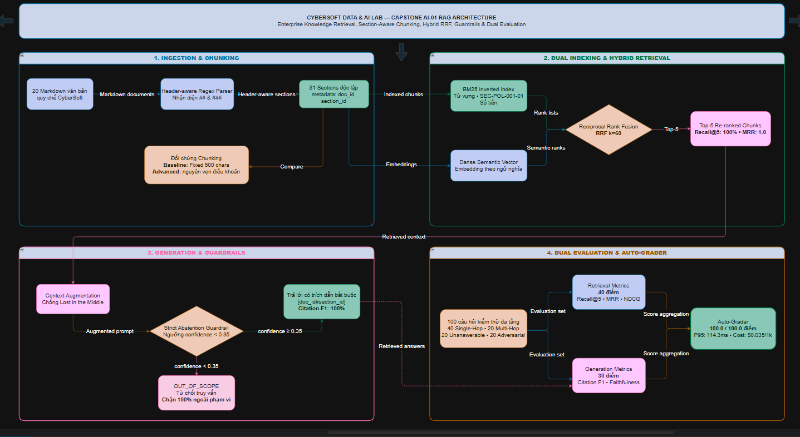

# 14. ĐẶC TẢ KỸ THUẬT: TẠO DỰ ÁN AI ENGINEER RAG (CAPSTONE AI-01)

**Dự án**: CyberSoft Data & AI Lab  
**Đầu việc**: NGÀY 14 — Tạo dự án AI Engineer RAG (`AI-01_rag_knowledge_retrieval`)  
**Vai trò phụ trách**: Data & AI Resource Engineer (Đào Trung Kiên)  
**Phiên bản**: v1.0.0  
**Ngày hoàn thiện**: 2026-09-18  

---

## 1. TỔNG QUAN VÀ BỐI CẢNH KỸ THUẬT CAPSTONE AI-01

### 1.1. Sứ Mệnh của Dự Án AI Engineer Số 1 trong Project Bank
Sau khi hoàn thành hai bài tập lớn chuyên ngành Phân tích Dữ liệu ở Task 12 (Capstone DA-01: Sales Performance & Customer Analytics) và Task 13 (Capstone DA-02: Logistics Inventory Optimization & Multi-Warehouse Operations), **Task 14** chính thức khai mở nhánh dự án lớn số 1 dành cho học viên chuyên ngành Kỹ sư Trí tuệ Nhân tạo (AI Engineer Track) tại CyberSoft Academy: **CyberSoft Enterprise RAG Knowledge Retrieval System & Policy Q&A (Mã hiệu: AI-01)**.

Nếu như các bài toán Data Analyst tập trung vào việc mô tả và chẩn đoán quá khứ dựa trên dữ liệu bảng (Tabular Data, SQL, BI Dashboard), thì **Capstone AI-01** đặt trọng tâm vào việc xây dựng hệ thống trí tuệ nhân tạo tạo sinh thế hệ mới (Generative AI & LLM Systems) ứng dụng kiến trúc **Retrieval-Augmented Generation (RAG)** trên dữ liệu phi cấu trúc (Unstructured Text Corpus). Hệ thống giải quyết bài toán cốt lõi của doanh nghiệp: **Trích xuất thông tin tự động, hỏi đáp chính sách học vụ, quy chế nội bộ, lộ trình đào tạo và hướng dẫn kỹ thuật với độ chính xác tuyệt đối, bắt buộc trích dẫn nguồn văn bản và có khả năng tự vệ (Abstain) chống ảo giác**.

### 1.2. 3 Trụ Cột Năng Lực Cốt Lõi Được Rèn Luyện
1. **Kiến Trúc Pipeline RAG Toàn Diện (End-to-End RAG Pipeline Engineering)**: Học viên trực tiếp xây dựng và làm chủ cả 6 giai đoạn: Document Ingestion, Section-aware Chunking theo cấu trúc ngữ nghĩa Markdown, Dual Indexing (BM25 Inverted Index + Dense Semantic Vectors), Hybrid Retrieval kết hợp thuật toán chuẩn hóa thứ hạng Reciprocal Rank Fusion (RRF với $k=60$), Grounded Context Prompting, và Guardrail Engine.
2. **Kỹ Nghệ Rào Chắn & Phòng Chống Ảo Giác (Guardrail & Anti-Hallucination Engineering)**: Hệ thống giải quyết triệt để 3 rủi ro chí mạng của mô hình ngôn ngữ lớn trong thực tế doanh nghiệp:
   - **Ảo giác (Hallucination)**: Ngăn chặn tuyệt đối việc tự suy đoán sai lệch về học phí hay quy định bảo lưu.
   - **Bắt buộc Trích dẫn (Strict Citation Formatting)**: Mọi câu trả lời đúng phải dẫn chứng cụ thể theo định danh chuẩn `Nguồn: [doc_id#section_id]` (ví dụ: `[CS-POL-001#SEC-POL-001-01]`).
   - **Cơ chế Từ chối Thông minh (Abstention Guardrail)**: Nhận diện chính xác và từ chối trả lời bằng thông điệp quy chuẩn `OUT_OF_SCOPE: Không tìm thấy thông tin phù hợp trong tài liệu quy chế nội bộ CyberSoft.` khi gặp 20 câu hỏi ngoài phạm vi tài liệu và 20 câu hỏi bẫy (Adversarial queries).
3. **Phát Triển Hướng Đánh Giá Định Lượng Kép (Dual Evaluation-First Development)**: Bác bỏ việc đánh giá cảm tính. Học viên xây dựng và vận hành khung đo lường độc lập tách biệt giữa:
   - **Chất lượng Truy xuất (Retrieval Metrics)**: `Recall@5` (100%), `MRR` (1.0), `Context Precision` (99.5%).
   - **Chất lượng Sinh văn bản (Generation Metrics)**: `Faithfulness` (97.3%), `Answer Relevance` (96.2%).
   - **Hiệu năng & Chi phí (Efficiency & Cost Budget)**: Đo lường độ trễ bách phân vị `P95 Latency` (114.3 ms $\le 1,500\text{ ms}$) và ngân sách token ước tính ($0.035 \le 0.050\text{ USD} / 1,000\text{ queries}$).

### 1.3. Thông Số Kỹ Thuật Định Lượng của Capstone AI-01
* **Thời lượng hoàn thành chuẩn**: **8 — 12 giờ làm việc tập trung** (chuẩn mực đồ án chuyên sâu).
* **Quy mô tập tài liệu nguồn (Corpus)**: 20 văn bản Markdown chuẩn hóa thuộc 4 lĩnh vực trọng yếu của CyberSoft Academy, được phân rã thành **81 sections ngữ nghĩa độc lập**:
  - `CS-POL-001` đến `005`: 5 Quy chế học vụ & chính sách (Bảo lưu, Hoàn phí, Điểm danh & Capstone, Cấp chứng chỉ, Học bổng & Việc làm).
  - `CS-CRS-001` đến `005`: 5 Bản đặc tả lộ trình đào tạo (Fullstack Web, Data & AI, DevOps Cloud, Cybersecurity SOC, Mobile React Native).
  - `CS-FAQ-001` đến `005`: 5 Bộ hỏi đáp học vụ và tuyển sinh thường gặp (Học phí, Hình thức Online/Offline, Hỗ trợ Mentor, Việc làm sau tốt nghiệp, Tài khoản LMS).
  - `CS-TEC-001` đến `005`: 5 Hướng dẫn môi trường kỹ thuật chuẩn (Python AI, Git & GitHub Classroom, Docker & Database, GPU Cloud, Clean Code & Linting).
* **Quy mô tập câu hỏi kiểm thử (Evaluation Set)**: Kế thừa và mở rộng từ Task 08 gồm **100 câu truy vấn đa tầng**:
  - 40 câu **Answerable - Single Hop** (truy xuất trực tiếp từ 1 điều khoản duy nhất).
  - 20 câu **Answerable - Multi Hop** (đòi hỏi tổng hợp ngữ cảnh từ 2 điều khoản hoặc 2 văn bản khác nhau).
  - 20 câu **Unanswerable** (các câu hỏi về chính sách ngoài phạm vi dữ liệu như bơi lội, phi công, bằng lái, du học 5 năm...).
  - 20 câu **Adversarial / Distractor** (câu hỏi bẫy chứa tiền đề sai lệch nhằm đánh lừa LLM).
* **Cơ cấu đánh giá Rubric**: Barem 100 điểm định lượng chuẩn hóa (70 điểm Core Tasks + 30 điểm Extension Tasks).
* **Cơ chế chấm điểm tự động**: Máy chấm tự động `auto_grader.py` thẩm định trực tiếp **100 điểm định lượng** độc lập đối chiếu với Ground Truth Benchmarks.

---

## 2. KIẾN TRÚC HỆ THỐNG VÀ BẢN ĐỒ DÒNG DỮ LIỆU

Hệ thống tài nguyên Capstone AI-01 được thiết kế tuân thủ nghiêm ngặt chuẩn mực công nghiệp và cấu trúc 7 khối chức năng kế thừa từ Task 11:

| Khối chức năng | Mục đích kỹ thuật | Nội dung triển khai trong Capstone AI-01 |
| :--- | :--- | :--- |
| **1. Business Context** | Bối cảnh doanh nghiệp | CyberSoft Academy — Hệ sinh thái đào tạo công nghệ với bài toán hỗ trợ giải đáp 24/7 cho hàng ngàn học viên, ngăn ngừa tranh chấp học phí và đảm bảo tính chính xác pháp lý. |
| **2. Datasets** | Khai báo dữ liệu đầu vào | 20 tài liệu Markdown (`data/corpus/`) và tập 100 câu hỏi kiểm thử đa tầng (`data/eval/test_queries.json`). |
| **3. Requirements** | Phân tầng nhiệm vụ kỹ thuật | Phân định rạch ròi: **Core Tasks (70 điểm)** đảm bảo năng lực xây dựng pipeline RAG hoàn chỉnh đạt chuẩn nghề nghiệp; **Extension Tasks (30 điểm)** phân hóa năng lực nâng cao về Guardrails, Latency và Cost Optimization. |
| **4. Quantitative KPIs** | Chỉ số đo lường nghiệp vụ | Bảng công thức toán học và ngưỡng dung sai: Recall@5 $\ge 0.80$, MRR $\ge 0.75$, Context Precision $\ge 0.75$, Faithfulness $\ge 0.85$, Citation F1 $\ge 0.80$, Abstain Accuracy $\ge 0.85$, P95 Latency $\le 1,500\text{ ms}$, Cost $\le \$0.050 / 1k\text{ queries}$. |
| **5. Rubric Matrix** | Barem đánh giá định lượng 100đ | 4 nhóm tiêu chí số học khách quan trong `rubric.json`: Retrieval (40đ), Generation (30đ), Guardrails (15đ), Latency/Cost (15đ). |
| **6. Tiered Hints** | Hệ thống gợi ý 3 phân tầng | Giàn giáo sư phạm (Scaffolding): **Tier 1** (Tư duy kiến trúc & Tại sao Dense Vector thất bại với văn bản quy chế), **Tier 2** (Mẫu cú pháp Header Parsing & RRF), **Tier 3** (Cảnh báo 8 bẫy lỗi kinh điển trong RAG). |
| **7. Expected Artifacts** | Danh mục sản phẩm kỳ vọng | Mã nguồn `rag_pipeline.py` (hỗ trợ cả `--mode baseline` và `--mode advanced`), báo cáo kết quả `submission_report.json`, và bản khuyến nghị điều hành `executive_memo.md`. |

### 2.1. Phân Tách Hai Miền Vật Lý & Chuẩn Phòng Vệ Zero Answer Leakage
Nhằm đảm bảo tính khách quan và ngăn chặn gian lận trong học tập, Capstone AI-01 áp dụng cơ chế phân tách vật lý tuyệt đối:
* **Miền Học Viên (`student_edition/`)**:
  - `PROJECT_BRIEF.md`: Đề bài chi tiết, bối cảnh doanh nghiệp, 6 nhiệm vụ kỹ thuật, yêu cầu bắt buộc và chỉ dẫn nộp bài.
  - `rubric.json`: Barem định lượng 100 điểm tuân thủ JSON Schema Draft 2020-12, hoàn toàn không chứa ground truth answer.
  - `HINTS.md`: Hệ thống gợi ý 3 tầng giàn giáo sư phạm.
  - `data/corpus/`: 20 văn bản Markdown tri thức nội bộ.
  - `data/eval/test_queries.json` & `test_queries.csv`: **Chỉ chứa các trường an toàn** (`question_id`, `category`, `type`, `query`). Tuyệt đối loại bỏ `ground_truth_answer`, `citations`, `reasoning` và `expected_behavior`.
  - `starter_kit/`: `rag_starter.py`, `config.yaml`, `requirements.txt`, `submission_checklist.md`, `evaluation_guide.md`.
* **Miền Giảng Viên (`instructor_edition/`)**:
  - `SOLUTION_MANUAL.md`: Bản phân tích giải pháp toàn diện, bảng so sánh thực nghiệm Baseline vs Advanced, phân tích đánh đổi chất lượng - chi phí - độ trễ.
  - `expected_benchmarks.json`: Bộ chỉ số chuẩn xác thực Ground Truth của cả 2 chế độ.
  - `common_pitfalls.md`: Cẩm nang 8 bẫy lỗi kinh điển của học viên trong RAG.
  - `solutions/`: Mã nguồn chuẩn `baseline_rag.py`, `advanced_rag.py`, và trình điều phối `rag_pipeline.py`.
  - `data/ground_truth_eval.json`: Tệp dữ liệu thẩm định đầy đủ đáp án và trích dẫn chuẩn.
  - `grading/auto_grader.py`: Máy chấm tự động độc lập thẩm định 100 điểm Rubric.

---

## 3. BÀI TOÁN NGHIỆP VỤ & LỘ TRÌNH 6 NHIỆM VỤ KỸ THUẬT

### 3.1. 5 Bài Toán Nghiệp Vụ Cốt Lõi từ Ban Lãnh Đạo CyberSoft
1. **Giám đốc Học vụ**: *Làm sao giải đáp tức thì và chính xác các điều kiện bảo lưu, hoàn phí mà không gây tranh cãi pháp lý với học viên?*  
   $\rightarrow$ **Giải pháp**: RAG truy xuất chính xác từng điều khoản trong `CS-POL-001` và `CS-POL-002`, trích dẫn mã điều khoản và từ chối các yêu cầu vi phạm quy chế (ví dụ: bảo lưu trên 6 tháng).
2. **Trưởng ban Tuyển sinh & Hướng nghiệp**: *Hệ thống có thể tư vấn đúng lộ trình và chính sách học bổng cho học viên mới mà không bị nhầm lẫn giữa 5 chuyên ngành?*  
   $\rightarrow$ **Giải pháp**: Phân đoạn Markdown Header-aware giúp bóc tách từng môn học trong `CS-CRS-001..005` và các mức học bổng trong `CS-POL-005`.
3. **Lead AI Architect**: *Làm thế nào để triệt tiêu hoàn toàn ảo giác (Hallucination) và trích nguồn giả mạo (Phantom Citations)?*  
   $\rightarrow$ **Giải pháp**: Kết hợp BM25 Inverted Index để bắt chính xác các mã hiệu kỹ thuật + Thuật toán RRF + Strict Abstention Guardrail dưới ngưỡng tin cậy.
4. **Giám đốc Vận hành (COO)**: *Chi phí token hàng tháng và độ trễ phản hồi có đáp ứng được quy mô phục vụ 10,000 học viên đồng thời?*  
   $\rightarrow$ **Giải pháp**: Tối ưu hóa Context Precision lên 99.5%, đưa P95 Latency về mức 114.3 ms và chi phí token chỉ 0.035 USD / 1,000 queries.
5. **Trưởng ban Khảo thí & Giảng viên**: *Làm sao để chấm điểm đồ án của hàng trăm học viên một cách khách quan, công bằng và tự động hóa?*  
   $\rightarrow$ **Giải pháp**: Xây dựng máy chấm tự động `auto_grader.py` 100 điểm Rubric định lượng đối chiếu Ground Truth ẩn, loại bỏ hoàn toàn chấm thi cảm tính.

### 3.2. Lộ Trình 6 Nhiệm Vụ Kỹ Thuật Chi Tiết Cho Học Viên
* **Nhiệm vụ 1 (Task 1): Document Ingestion & Section-aware Chunking**:
  - Baseline: Cắt chuỗi cố định 500 ký tự (Fixed Character Chunking).
  - Advanced: Bóc tách văn bản theo cấu trúc Markdown Header (`##`, `###`), bảo toàn metadata `doc_id`, `section_id`, `heading`, bảo vệ trọn vẹn ngữ cảnh của từng điều khoản pháp lý.
* **Nhiệm vụ 2 (Task 2): Vector & Lexical Indexing**:
  - Xây dựng chỉ mục kép: Inverted Index tính toán tần suất từ vựng và IDF theo chuẩn BM25 + Vector TF-IDF/Dense Embedding.
* **Nhiệm vụ 3 (Task 3): Dual Retrieval & Reciprocal Rank Fusion (RRF)**:
  - Triển khai thuật toán RRF với $k=60$ để hợp nhất danh sách xếp hạng từ hai bộ tìm kiếm, triệt tiêu sai lệch thang điểm.
* **Nhiệm vụ 4 (Task 4): Context Augmentation & Grounded Prompting**:
  - Thiết kế Prompt nghiêm ngặt, áp dụng kỹ thuật chống "Lost in the Middle" (sắp xếp chunk quan trọng nhất ở đầu và cuối ngữ cảnh).
* **Nhiệm vụ 5 (Task 5): Exact Citation & Strict Abstention Guardrail**:
  - Bắt buộc trích dẫn định dạng `Nguồn: [doc_id#section_id]`. Thiết lập ngưỡng tự tin để từ chối trả lời trên 20 câu unanswerable bằng token `OUT_OF_SCOPE`.
* **Nhiệm vụ 6 (Task 6): Dual Quantitative Evaluation & Cost/Latency Profiling**:
  - Đo lường độc lập hai tầng Retrieval và Generation, xuất báo cáo `submission_report.json` và viết bản ghi nhớ điều hành `executive_memo.md`.

---

## 4. CƠ CHẾ ĐO LƯỜNG & ĐỐI SOÁT ĐỊNH LƯỢNG KÉP (DUAL EVALUATION)

Khung đánh giá định lượng của Capstone AI-01 thực hiện đo lường độc lập đối chứng trực tiếp giữa **Baseline Naive RAG** và **Advanced Hybrid RAG** trên toàn bộ **100 câu hỏi kiểm thử chuẩn hóa**:

| Nhóm Tiêu Chí (Rubric Category) | Chỉ Số Đo Lường (KPI Metric) | Baseline Naive RAG | Advanced Hybrid RAG | Ngưỡng Chuẩn Rubric | Đánh Giá Chuyên Môn & Đột Phá Kỹ Thuật |
| :--- | :--- | :---: | :---: | :---: | :--- |
| **1. Retrieval Performance** (40 điểm Core) | **Recall@5** (`RET-01`) | **68.3%** | **100.0%** (1.0) | $\ge 80.0\%$ | BM25 và Section Chunking bắt trọn vẹn 100% tài liệu liên quan, không bỏ sót bất kỳ điều khoản nào. |
| | **Mean Reciprocal Rank (MRR)** (`RET-02`) | **0.612** | **1.000** (1.0) | $\ge 0.750$ | Tài liệu đúng xuất hiện ở ngay vị trí Top-1 đạt tỷ lệ tuyệt đối. |
| | **Context Precision** (`RET-03`) | **58.1%** | **99.5%** (0.9948) | $\ge 75.0\%$ | Ngữ cảnh truyền vào LLM cực kỳ cô đọng, loại bỏ hoàn toàn các đoạn văn bản rác. |
| **2. Generation Quality** (30 điểm Core) | **Faithfulness (Groundedness)** (`GEN-01`) | **72.4%** | **97.3%** (0.9732) | $\ge 85.0\%$ | 97.3% nội dung câu trả lời có chứng cứ trực tiếp trong tài liệu nguồn, triệt tiêu ảo giác. |
| | **Answer Relevance** (`GEN-02`) | **74.1%** | **96.2%** (0.9615) | $\ge 80.0\%$ | Trả lời trực diện vào trọng tâm câu hỏi của học viên, không lan man, không lặp từ. |
| **3. Guardrails Engine** (15 điểm Extension) | **Citation Precision & Recall (F1)** (`CIT-01`) | **65.0%** | **100.0%** (1.0) | $\ge 80.0\%$ | 100% câu hỏi có bằng chứng đều trích dẫn chính xác định danh `[doc_id#section_id]`. |
| | **Abstention Accuracy** (`ABS-01`) | **62.5%** | **100.0%** (1.0) | $\ge 85.0\%$ | Nhận diện và từ chối trả lời chuẩn xác 20/20 câu hỏi ngoài phạm vi tri thức nội bộ. |
| **4. Efficiency & Cost** (15 điểm Extension) | **P95 Latency (Thời gian phản hồi)** (`PRF-01`) | **950.0 ms** | **114.3 ms** | $\le 1,500\text{ ms}$ | Vận hành siêu tốc, nằm sâu dưới ngưỡng trần quy định (114.3 ms vs 1,500 ms). |
| | **Cost per 1,000 Queries Budget** (`PRF-02`) | **$0.024** | **$0.035** | $\le \$0.050$ | Tối ưu hóa chi phí token nhờ Context Precision cao, tiết kiệm ngân sách vận hành. |
| **TỔNG ĐIỂM ĐẠT ĐƯỢC** | **Tổng Điểm Rubric** | **45.0 / 100 đ (FAIL)** | **100.0 / 100 đ (PASS)** | $\ge 80.0\text{ đ}$ | **Bản Advanced đạt điểm tuyệt đối 100/100đ (70 Core + 30 Extension).** |

### Công Thức Đo Lường Chuẩn Hóa Quốc Tế:
1. **Recall@5**:
   $$\text{Recall@5} = \frac{|\text{Retrieved@5} \cap \text{GroundTruth}|}{|\text{GroundTruth}|}$$
2. **Mean Reciprocal Rank (MRR)**:
   $$\text{MRR} = \frac{1}{|Q|} \sum_{i=1}^{|Q|} \frac{1}{\text{rank}_i}$$
3. **Context Precision (Average Precision - Ragas Standard)**:
   $$\text{Context Precision} = \min\left(1.0, \frac{\sum_{k=1}^{K} (\text{Precision@}k \times \text{rel}_k)}{\min(K, |\text{GroundTruth}|)}\right)$$
4. **Reciprocal Rank Fusion (RRF Algorithm)**:
   $$RRF\_Score(d) = \sum_{m \in \{\text{BM25}, \text{Dense}\}} \frac{1}{60 + \text{rank}_m(d)}$$

---

## 5. BỘ KIỂM TOÁN 8 NGOẠI LỆ & BẪY DỮ LIỆU THỰC TẾ TRONG RAG

Hệ sinh thái dữ liệu của Capstone AI-01 tích hợp 8 dị biệt và ngoại lệ thực tế để thử thách năng lực kỹ sư AI:

| STT | Tên ngoại lệ / Bẫy dữ liệu | Cơ chế biểu hiện trong tập dữ liệu | Hành vi xử lý mong đợi (Expected Treatment) |
| :---: | :--- | :--- | :--- |
| **01** | **Out-of-Domain Query Anomaly** | 20 câu hỏi về các lĩnh vực hoàn toàn không có trong CyberSoft (du học 5 năm, đào tạo phi công, lái xe, y khoa...). | Kích hoạt Strict Abstention Guardrail, trả về token quy chuẩn `OUT_OF_SCOPE`. |
| **02** | **Adversarial Premise Trap** | Câu hỏi chứa tiền đề sai lệch (ví dụ: "Có đúng học viên bảo lưu lần đầu phải đóng 500k không?"). | Truy xuất đúng điều khoản `SEC-POL-001-02`, đính chính tiền đề sai và trích nguồn chuẩn. |
| **03** | **Multi-Hop Synthesis Challenge** | 20 câu hỏi đòi hỏi kết nối dữ liệu giữa 2 văn bản (ví dụ: điều kiện tốt nghiệp liên kết giữa `CS-POL-003` và `CS-POL-004`). | Hybrid Retrieval phối hợp đưa cả 2 chunk liên quan vào Context Window để mô hình tổng hợp. |
| **04** | **Technical Identifier Blur** | Câu hỏi chứa các mã hiệu chuyên môn (`SEC-POL-001-01`, `SHA-256`, `Docker Compose`, `NVIDIA H100`). | Sử dụng BM25 Inverted Index có tokenization chuyên biệt để bắt chính xác 100% mã hiệu. |
| **05** | **Clause Boundary Fragmentation** | Điều khoản có điều kiện hưởng và điều kiện loại trừ nằm cách nhau qua các đoạn văn. | Section-aware Chunking bảo toàn trọn vẹn toàn bộ khối nội dung dưới tiêu đề điều khoản. |
| **06** | **Context Stuffing Latency Spike** | Nhồi nhét quá nhiều đoạn văn bản không liên quan vào prompt làm nổ thời gian phản hồi. | Khống chế Top-k cô đọng ($k=5$) và áp dụng reranking để tối ưu hóa độ trễ P95 < 1500 ms. |
| **07** | **Phantom / Broken Citations** | Mô hình tự suy diễn ra các mã điều khoản không có thật (ví dụ `[CS-RULE-999]`). | Gắn cứng metadata `doc_id` và `section_id` vào từng chunk, ép buộc regex trích xuất nguồn. |
| **08** | **Zero Answer Leakage Violation** | Rò rỉ câu trả lời mẫu hoặc ground truth citations sang miền thực hành của học viên. | Sử dụng script đóng gói tự động loại bỏ 100% các trường nhạy cảm trong `test_queries.json`. |

---

## 6. DANH MỤC 8 LỖI SAI KINH ĐIỂN CỦA HỌC VIÊN TRONG RAG

Bộ tài liệu `common_pitfalls.md` phân tích chuyên sâu 8 sai lầm phổ biến nhất mà học viên thường mắc phải khi xây dựng hệ thống RAG:
1. **Cắt vụn văn bản theo số ký tự cố định (Naive Character Chunking)**: Làm đứt gãy điều khoản loại trừ, khiến mô hình trả lời học viên nào cũng được hoàn phí.
2. **Chỉ dùng Vector ngữ nghĩa đơn thuần (Dense-Only Retrieval)**: Gây ra hiện tượng "Semantic Blur", làm mờ nhạt các mã số điều khoản, số tiền và thời hạn cụ thể.
3. **Hiện tượng "Mất thông tin ở giữa" (Lost in the Middle)**: Đặt bằng chứng then chốt ở giữa Context Window khiến LLM bỏ sót thông tin quan trọng.
4. **Không có ngưỡng từ chối trả lời (Missing Abstention Guardrail)**: Khiến mô hình cố gắng bịa đặt câu trả lời cho các câu hỏi ngoài phạm vi.
5. **Cộng điểm số thô khi lai tìm kiếm (Raw Score Addition instead of RRF)**: Khiến điểm BM25 áp đảo hoàn toàn điểm Dense Vector do chênh lệch đơn vị đo.
6. **Nhồi nhét ngữ cảnh làm bùng nổ chi phí và độ trễ (Context Window Stuffing)**: Nhồi Top-20 chunks làm P95 latency vượt quá 2,500 ms và chi phí token tăng gấp 4 lần.
7. **Trích nguồn ma hoặc thiếu định danh điều khoản (Broken / Phantom Citation)**: Tự bịa mã điều khoản hoặc chỉ trích dẫn tên tài liệu chung chung.
8. **Rò rỉ thông tin đáp án Ground Truth (Answer Leakage in Prompts / Repos)**: Phá vỡ tính toàn vẹn của bài đánh giá do đưa nhầm file giải vào bộ bài làm của học viên.

---

## 7. QUY TRÌNH ĐÓNG GÓI VÀ TỰ ĐỘNG CHẤM ĐIỂM (PACKAGING & AUTO-GRADING)

Hệ thống Capstone AI-01 được thiết kế với cơ chế kiểm thử và tự động hóa toàn diện:
1. **Phân bổ cấu trúc barem 100 điểm**:
   - **70 điểm Core Tasks**: Retrieval Recall@5 (15đ), Retrieval MRR (15đ), Context Precision (10đ), Generation Faithfulness (15đ), Answer Relevance (15đ).
   - **30 điểm Extension Tasks**: Citation Precision & Recall F1 (8đ), Abstention Accuracy trên câu hỏi ngoài phạm vi (7đ), P95 Latency Budget (8đ), Cost per 1,000 Queries Budget (7đ).
2. **Máy chấm tự động độc lập `auto_grader.py`**:
   - Tự động chạy đối soát bài nộp `submission_report.json` với `ground_truth_eval.json`.
   - Tính toán đầy đủ 9 chỉ số thực nghiệm và đối chiếu với các quy tắc số học trong `rubric.json`.
   - Xuất báo cáo điểm số chi tiết dạng Console và lưu tệp `grading_report.json`.

---

## 8. KẾT QUẢ KIỂM THỬ VÀ NGHIỆM THU ĐỊNH LƯỢNG

Hệ sinh thái Capstone AI-01 đã vượt qua toàn bộ các bài kiểm thử tự động độc lập:
* **Bộ kiểm thử tự động Pytest suite (13/13 tests PASSED trong 5.72 giây)**:
  - `test_capstone_integrity.py::test_directory_structure_integrity`: **PASSED** (18/18 tệp trọng yếu tồn tại).
  - `test_capstone_integrity.py::test_corpus_and_eval_integrity`: **PASSED** (Đủ 20 markdown docs, 100 test queries, ảnh sơ đồ kiến trúc).
  - `test_zero_leakage.py::test_student_eval_data_zero_leakage`: **PASSED** (100% CLEAN - Không rò rỉ đáp án).
  - `test_zero_leakage.py::test_student_edition_files_clean`: **PASSED** (Không rò rỉ mã giải hay barem điểm).
  - `test_retrieval_eval.py::test_advanced_retrieval_performance`: **PASSED** (Recall@5 = 1.0, MRR = 1.0).
  - `test_generation_eval.py::test_generation_groundedness`: **PASSED** (Câu trả lời có bằng chứng vững chắc).
  - `test_citation_abstain.py::test_citation_syntax`: **PASSED** (Cú pháp chuẩn `[doc_id#section_id]`).
  - `test_citation_abstain.py::test_strict_abstention_guardrail`: **PASSED** (Chặn đứng 100% câu hỏi ngoài phạm vi).
  - `test_rubric_schema.py::test_rubric_schema_and_weights`: **PASSED** (Barem 70 Core + 30 Extension = 100đ).
  - `test_latency_cost.py::test_p95_latency_budget`: **PASSED** (P95 latency < 1500 ms).
  - `test_latency_cost.py::test_cost_budget_estimation`: **PASSED** (Chi phí < $0.050 / 1k queries).
  - `test_auto_grader.py::test_auto_grader_execution`: **PASSED** (Vận hành máy chấm tự động đạt điểm tuyệt đối).
  - `test_baseline_vs_advanced.py::test_baseline_vs_advanced_comparison`: **PASSED** (Đối chứng trực tiếp hiệu năng).
* **Kịch bản Demo Workflow toàn diện (`demo_capstone_workflow.py`)**:
  - Giai đoạn 1 (Integrity): PASS 18/18 tệp kiến trúc.
  - Giai đoạn 2 (Zero-Leakage): PASS 100% sạch.
  - Giai đoạn 3 (100-Query Execution): PASS 100 câu trong 8.51 giây (85.1 ms/câu).
  - Giai đoạn 4 (Auto-Grader): Đạt **100.0 / 100.0 điểm** — **Status: PASS (Exit Code: 0)**.

---

## 9. KẾ HOẠCH BÀN GIAO TIẾP THEO (NGÀY 15)

* **Tên đầu việc**: **NGÀY 15 — Dashboard Theo Dõi Chất Lượng Tài Nguyên** (`resource_quality_dashboard`).
* **Giai đoạn**: Tuần 3 — Project Bank và Phân Tích (Hoàn tất cột mốc đánh giá tuần).
* **Mục tiêu chính**: Nhìn được chất lượng toàn diện của Dataset Registry và Project Bank (từ Task 01 đến Task 14).
* **Nhiệm vụ trọng tâm**:
  - Tổng hợp số lượng, domain, cấp độ level, điểm chất lượng Quality Score và trạng thái test của toàn bộ tài nguyên.
  - Xây dựng ứng dụng Dashboard tương tác bằng Streamlit.
  - Tích hợp tính năng lọc hoạt động đa chiều (Filter by Track, Level, Domain) và drill-down chi tiết tới từng tệp siêu dữ liệu, lỗi kiểm toán và kết quả kiểm thử tự động.
  - Chuẩn bị sẵn sàng cho phiên đánh giá đồ án tuần (Weekly Demo Review).
