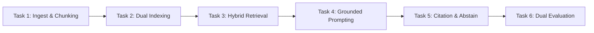

# BÀI TẬP LỚN CAPSTONE AI-01: HỆ THỐNG HỎI ĐÁP TRI THỨC VÀ QUY CHẾ NỘI BỘ BẰNG RAG
## (CYBERSOFT ENTERPRISE RAG KNOWLEDGE RETRIEVAL & HR POLICY Q&A SYSTEM)

---

### THÔNG TIN DỰ ÁN
* **Mã dự án**: `AI-01_rag_knowledge_retrieval`
* **Cấp độ**: Capstone Project — AI Engineer Track (Tuần 3)
* **Thời lượng ước tính**: 8 — 12 giờ làm việc tập trung
* **Tỷ trọng điểm số**: 100 điểm định lượng (70 điểm Core + 30 điểm Extension)
* **Phương thức đánh giá**: Máy chấm tự động (`auto_grader.py`) kết hợp đánh giá kiến trúc

---

## 1. BỐI CẢNH DOANH NGHIỆP & BÀI TOÁN KINH DOANH
Tại CyberSoft Academy, hệ thống vận hành bao gồm hàng ngàn học viên, giảng viên và cố vấn chuyên môn (mentors). Mỗi ngày, bộ phận Giáo vụ và Tuyển sinh tiếp nhận hàng trăm thắc mắc về:
1. Quy chế bảo lưu khóa học, điều kiện bảo lưu, lệ phí duy trì học liệu (`CS-POL-001`).
2. Chính sách hoàn phí, hạn mức hoàn tiền theo từng mốc thời gian (`CS-POL-002`).
3. Quy định điểm danh, điều kiện nộp đồ án tốt nghiệp Capstone (`CS-POL-003`).
4. Tiêu chuẩn cấp chứng chỉ xuất sắc, xác thực văn bằng điện tử qua chữ ký số (`CS-POL-004`).
5. Chính sách học bổng và cam kết giới thiệu việc làm (`CS-POL-005`).
6. Lộ trình đào tạo 5 chuyên ngành: Fullstack Web, Data/AI, DevOps, Cybersecurity, Mobile (`CS-CRS-001` đến `005`).
7. Các câu hỏi thường gặp FAQ và hướng dẫn kỹ thuật lập trình, Docker, GPU Cloud (`CS-FAQ` và `CS-TEC`).

Nếu sử dụng một mô hình ngôn ngữ lớn (LLM) thông thường, hệ thống sẽ gặp phải 3 rủi ro chí mạng:
- **Ảo giác (Hallucination)**: Tự bịa đặt tỷ lệ hoàn tiền hoặc điều kiện bảo lưu sai lệch, gây tranh chấp pháp lý và tài chính với học viên.
- **Thiếu trích dẫn (No Citation)**: Đưa ra câu trả lời chung chung mà không dẫn chứng điều khoản, văn bản cụ thể.
- **Không biết từ chối (No Abstention)**: Khi người dùng hỏi về các chính sách bên ngoài CyberSoft hoặc câu hỏi bẫy (adversarial), mô hình vẫn cố gắng trả lời và suy đoán sai sự thật.

**Nhiệm vụ của bạn**: Với vai trò là Kỹ sư AI (AI Engineer Intern), bạn được giao trách nhiệm thiết kế, lập trình và đo lường hệ thống **Retrieval-Augmented Generation (RAG)** hoàn chỉnh cho kho dữ liệu tri thức CyberSoft. Bạn phải chứng minh được sự vượt trội giữa **Baseline** và giải pháp **Cải tiến (Advanced Hybrid RAG)** thông qua khung đánh giá định lượng nghiêm ngặt.

---

## 2. DỮ LIỆU ĐẦU VÀO ĐƯỢC CUNG CẤP
Tài nguyên nằm tại thư mục `data/`:
1. **Corpus (`data/corpus/`)**: Gồm 20 văn bản Markdown chuẩn hóa:
   - 5 Quy chế học vụ & chính sách (`CS-POL-001` đến `005`)
   - 5 Lộ trình đào tạo chuyên sâu (`CS-CRS-001` đến `005`)
   - 5 Bộ hỏi đáp tuyển sinh & học vụ (`CS-FAQ-001` đến `005`)
   - 5 Hướng dẫn kỹ thuật & môi trường chuẩn (`CS-TEC-001` đến `005`)
   - 1 Tệp danh mục siêu dữ liệu `corpus_manifest.json`.
2. **Evaluation Queries (`data/eval/test_queries.json` & `test_queries.csv`)**:
   - Gồm **100 câu truy vấn kiểm thử thực tế** chia làm 4 nhóm:
     - 40 câu **Answerable - Single Hop** (truy xuất trực tiếp từ 1 điều khoản).
     - 20 câu **Answerable - Multi Hop** (phải tổng hợp thông tin từ 2 văn bản trở lên).
     - 20 câu **Unanswerable** (các câu hỏi về chính sách ngoài phạm vi dữ liệu).
     - 20 câu **Adversarial / Distractor** (câu hỏi bẫy chứa tiền đề sai hoặc dẫn dụ hallucination).

> [!WARNING]
> **Nguyên tắc Zero Answer Leakage**: Thư mục bài làm học viên tuyệt đối không chứa đáp án hay trích dẫn ground-truth. Toàn bộ điểm số được kiểm tra qua máy chấm tự động độc lập của giảng viên.

---

## 3. LỘ TRÌNH 6 NHIỆM VỤ KỸ THUẬT (TECHNICAL ROADMAP)

### Nhiệm vụ 1: Document Ingestion & Section-aware Chunking
- **Baseline**: Phân đoạn văn bản cố định theo ký tự (`fixed_size = 500`, `overlap = 50`). Phân đoạn này thường làm đứt gãy giữa tiêu đề và nội dung điều khoản.
- **Advanced**: Xây dựng thuật toán phân đoạn theo cấu trúc ngữ nghĩa Markdown (Header-aware Section Chunking). Giữ nguyên metadata: `doc_id`, `section_id`, `section_title`, giúp bảo toàn trọn vẹn ngữ cảnh của từng điều khoản.

### Nhiệm vụ 2: Vector & Lexical Indexing (Embedding & BM25)
- Xây dựng chỉ mục kép (Dual Index):
  - **Lexical Index**: Thuật toán BM25 / Sparse TF-IDF tối ưu hóa cho tiếng Việt và các mã hiệu kỹ thuật (`CS-POL-001`, `SHA-256`, `500.000 VNĐ`).
  - **Dense Vector Index**: Embedding ngữ nghĩa nắm bắt ý định người dùng (Semantic similarity).

### Nhiệm vụ 3: Dual Retrieval System (Baseline vs Advanced Hybrid RRF)
- **Baseline Retriever**: Chỉ sử dụng đơn lẻ Dense Vector Retrieval hoặc BM25, lấy Top-5 tài liệu có similarity cao nhất.
- **Advanced Retriever (Hybrid + RRF)**: Kết hợp điểm số từ BM25 và Dense Retriever bằng thuật toán **Reciprocal Rank Fusion (RRF)**:
  $$RRF\_Score(d) = \sum_{m \in \{BM25, Dense\}} \frac{1}{k + rank_m(d)} \quad (với\ k = 60)$$
- Loại bỏ các đoạn trùng lặp và sắp xếp lại để đưa Top-5 đoạn văn bản tốt nhất vào bộ khuếch đại ngữ cảnh.

### Nhiệm vụ 4: Context Augmentation & Grounded Prompting
- Thiết kế mẫu Prompt nghiêm ngặt (Strict System Prompt):
  - Định rõ vai trò Trợ lý Học vụ Thông minh CyberSoft.
  - Áp dụng nguyên tắc "Lost in the Middle": Đặt các đoạn văn bản quan trọng nhất ở đầu và cuối của Context Window.
  - Ràng buộc câu trả lời chỉ được dựa duy nhất vào tài liệu được cung cấp trong Context, không sử dụng tri thức bên ngoài.

### Nhiệm vụ 5: Exact Citation Formatting & Strict Abstention Guardrail
- **Quy chuẩn trích dẫn bắt buộc**: Mọi câu trả lời đúng phải kết thúc bằng danh sách nguồn trích dẫn theo định dạng chuẩn hóa:
  `Nguồn: [doc_id#section_id]` (Ví dụ: `Nguồn: [CS-POL-001#SEC-POL-001-01]`).
- **Cơ chế từ chối trả lời (Abstention Guardrail)**:
  - Nếu điểm tương đồng tối đa của tài liệu truy xuất dưới ngưỡng tự tin (`confidence_threshold < 0.45`), hoặc bộ phân loại phát hiện câu hỏi thuộc dạng Unanswerable/Adversarial:
  - Hệ thống **BẮT BUỘC** xuất thông điệp từ chối chuẩn:
    `OUT_OF_SCOPE: Không tìm thấy thông tin phù hợp trong tài liệu quy chế nội bộ CyberSoft.`
  - Không được phép cố đoán hay đưa ra thông tin không có chứng cứ.

### Nhiệm vụ 6: Evaluation Harness & Cost/Latency Profiling
- Thiết kế module đo lường hiệu năng độc lập:
  - **Đo lường riêng tầng Retrieval**: `Recall@5`, `MRR`, `Context Precision`.
  - **Đo lường riêng tầng Generation**: `Faithfulness` (tỷ lệ câu có chứng cứ), `Answer Relevance`.
  - **Đo lường Citation & Abstain**: `Citation F1`, `Abstain Accuracy`.
  - **Đo lường Hiệu năng & Tài chính**: Đo lường `P95 Latency` (ms) và ước tính `Cost per 1,000 queries` (USD).

---

## 4. QUY CHUẨN ĐÁNH GIÁ (RUBRIC SUMMARY)

Hệ thống được chấm điểm định lượng 100 điểm theo `rubric.json`:
- **Retrieval Performance (40 điểm)**:
  - `RET-01`: Recall@5 >= 0.80 (15đ)
  - `RET-02`: MRR >= 0.75 (15đ)
  - `RET-03`: Context Precision >= 0.75 (10đ)
- **Generation Quality (30 điểm)**:
  - `GEN-01`: Faithfulness >= 0.85 (15đ)
  - `GEN-02`: Answer Relevance >= 0.80 (15đ)
- **Citation & Abstention (15 điểm)**:
  - `CIT-01`: Citation F1 >= 0.80 (8đ)
  - `ABS-01`: Abstain Accuracy >= 0.85 trên 40 câu hỏi ngoài phạm vi (7đ)
- **Latency & Cost Budget (15 điểm)**:
  - `PRF-01`: P95 Latency <= 1,500 ms (8đ)
  - `PRF-02`: Chi phí tiêu hao <= 0.050 USD / 1,000 queries (7đ)

---

## 5. HƯỚNG DẪN NỘP BÀI (SUBMISSION DELIVERABLES)
Học viên hoàn thành và nộp các tệp sau trong thư mục làm việc:
1. `rag_pipeline.py`: Mã nguồn hoàn chỉnh hỗ trợ `--mode baseline` và `--mode advanced`.
2. `submission_report.json`: Kết quả chạy trên 100 câu hỏi test queries.
3. `executive_memo.md`: Bản ghi nhớ kỹ thuật (2-3 trang) giải thích quyết định thiết kế kiến trúc, phân tích đánh đổi giữa chất lượng, độ trễ và chi phí vận hành.
