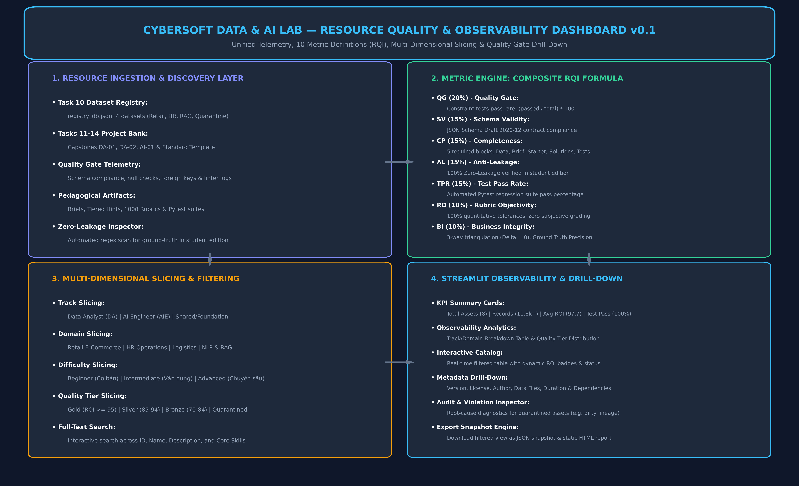

# 15. ĐẶC TẢ KỸ THUẬT: DASHBOARD THEO DÕI CHẤT LƯỢNG TÀI NGUYÊN (CRQOF OBSERVABILITY DASHBOARD v0.1)

**Dự án**: CyberSoft Data & AI Lab  
**Đầu việc**: NGÀY 15 — Dashboard theo dõi chất lượng tài nguyên (`cybersoft-resource-observability-dashboard`)  
**Giai đoạn**: Tuần 3 — Project Bank và Phân Tích  
**Vai trò phụ trách**: Data & AI Resource Engineer (Đào Trung Kiên)  
**Phiên bản**: v0.1.0  
**Ngày hoàn thiện**: 2026-09-19  

---

## 1. TỔNG QUAN VÀ SỨ MỆNH KỸ THUẬT CỦA TASK 15

### 1.1. Cột Mốc Đỉnh Cao Kết Thúc Tuần 3
Sau 14 ngày làm việc liên tục xây dựng nền móng dữ liệu và học liệu kỹ thuật:
- **Tuần 1 (Khảo sát & Nền móng - Task 01 đến 05)**: Thiết lập bản đồ bài toán, kiến trúc Data & AI Lab, repo/CI, schema Registry và Data Quality Harness v0.
- **Tuần 2 (Dataset Engineering - Task 06 đến 10)**: Xây dựng tập dữ liệu bán hàng đa bảng (Task 06), dữ liệu nhân sự chấm công (Task 07), dữ liệu RAG và 100 câu benchmark (Task 08), pipeline sinh dữ liệu tổng hợp có kiểm soát (Task 09), và cổng xuất bản Dataset Registry Portal (Task 10).
- **Tuần 3 (Project Bank & Phân tích - Task 11 đến 14)**: Chuẩn hóa mẫu dự án học viên (Task 11), Capstone DA-01 E-Commerce Churn (Task 12), Capstone DA-02 Kho vận Logistics đối soát 3 chiều (Task 13), và Capstone AI-01 Enterprise Knowledge RAG hybrid BM25 + dense vectors (Task 14).

**Task 15** là cột mốc tổng hòa mang tính chiến lược: **Xây dựng Dashboard Theo Dõi Chất Lượng Tài Nguyên (CyberSoft Resource Quality & Observability Dashboard v0.1)**. Hệ thống cung cấp khả năng quan sát toàn diện (Observability), đo lường độ tin cậy và sức khỏe kỹ thuật của toàn bộ các bộ dữ liệu và đồ án lớn trong hệ sinh thái đào tạo của CyberSoft Academy.

### 1.2. 3 Mục Tiêu Kỹ Thuật Trọng Tâm
1. **Hợp Nhất Dữ Liệu Đo Lường (Unified Observability Telemetry)**: Tự động tổng hợp và đồng bộ hóa số liệu từ cả hai nguồn tài nguyên cốt lõi:
   - **Dataset Registry (Task 10)**: Các bộ dữ liệu định lượng, kết quả thẩm định Quality Gate, trạng thái phát hành (Published/Quarantined) và các vi phạm ràng buộc dữ liệu.
   - **Project Bank (Task 11 - 14)**: Các đồ án Capstone chuyên ngành Data Analyst và AI Engineer, barem Rubric định lượng 100 điểm, cơ chế phòng vệ Zero Answer Leakage và tỷ lệ vượt qua bài kiểm thử Pytest.
2. **Chuẩn Hóa Khung Chỉ Số Chất Lượng (CRQOF & Composite RQI Formula)**: Xây dựng bộ từ điển 10 chỉ số đo lường chuẩn hóa, kết tinh thành **Chỉ số Chất lượng Tài nguyên Tổng hợp (Resource Quality Index - RQI)** với công thức toán học có trọng số khách quan, loại bỏ hoàn toàn việc đánh giá cảm tính.
3. **Trực Quan Hóa & Kiểm Toán Lỗi Đa Chiều (Multi-Dimensional Slicing & Root-Cause Drill-Down)**: Phát triển ứng dụng Streamlit Dashboard v0.1 cho phép:
   - Cắt lát dữ liệu theo Chuyên ngành (Track: Data Analyst, AI Engineer, Shared), Lĩnh vực (Domain: Retail, Logistics, HR, NLP/RAG), Cấp độ (Level: Beginner, Intermediate, Advanced) và Xếp hạng chất lượng (Tier: Gold, Silver, Bronze, Quarantined).
   - Drill-down xem chi tiết siêu dữ liệu (Metadata), cấu trúc thư mục nguồn, các gói kỹ năng đào tạo và danh sách tệp đính kèm.
   - Bóc tách nguyên nhân gốc (Root Cause Diagnostics) của các tài nguyên vi phạm bị cách ly (Quarantine Zone), hiển thị chính xác lỗi schema hoặc lỗi logic dữ liệu.

---

## 2. KIẾN TRÚC HỆ THỐNG VÀ BẢN ĐỒ LUỒNG DỮ LIỆU



Kiến trúc hệ thống giám sát chất lượng tài nguyên được thiết kế theo mô hình 4 tầng phân tách độc lập (4-Layer Decoupled Architecture):

```
+---------------------------------------------------------------------------------------------------------+
|                                1. INGESTION & RESOURCE DISCOVERY LAYER                                  |
|   +--------------------------+  +--------------------------+  +-------------------------------------+   |
|   |   Task 10 Registry DB    |  |  Tasks 11-14 Project Bank|  |      Zero-Leakage & Gate Audits     |   |
|   | (Retail, HR, RAG, Dirty) |  | (DA-01, DA-02, AI-01...) |  |   (Quality Gate logs, Pytest runs)  |   |
|   +--------------------------+  +--------------------------+  +-------------------------------------+   |
+----------------------------------------------------+----------------------------------------------------+
                                                     | (Repository-Relative Paths / Zero Hardcoded Paths)
                                                     v
+----------------------------------------------------+----------------------------------------------------+
|                                  2. CRQOF METRIC COMPUTATION ENGINE                                     |
|    RQI = 0.20*QG + 0.15*SV + 0.15*CP + 0.15*AL + 0.15*TPR + 0.10*RO + 0.10*BI                          |
|   +-----------------------+  +------------------------+  +-------------------+  +-------------------+   |
|   | Quality Gate (20%)    |  | Schema Validity (15%)  |  | Completeness (15%)|  | Anti-Leakage (15%)|   |
|   +-----------------------+  +------------------------+  +-------------------+  +-------------------+   |
|   | Test Pass Rate (15%)  |  | Rubric Objectivity(10%)|  | Business Int (10%)|  | Composite RQI (0) |   |
|   +-----------------------+  +------------------------+  +-------------------+  +-------------------+   |
+----------------------------------------------------+----------------------------------------------------+
                                                     |
                                                     v
+----------------------------------------------------+----------------------------------------------------+
|                               3. MULTI-DIMENSIONAL SLICING & FILTER ENGINE                              |
|   [Track Slicing]         [Domain Slicing]         [Difficulty Slicing]         [Quality Tier Slicing]  |
|   DA / AIE / Shared       Retail / HR / Ops / NLP  Beginner / Inter / Adv       Gold / Silver / Quarant |
+----------------------------------------------------+----------------------------------------------------+
                                                     |
                                                     v
+----------------------------------------------------+----------------------------------------------------+
|                         4. STREAMLIT OBSERVABILITY & DRILL-DOWN DASHBOARD                               |
|   - 5 Top KPI Cards (Total Assets, 14.8k Records, 97.7 Avg RQI, 99.0% Test Pass, 100% Zero-Leakage)     |
|   - Track / Domain Distribution Tables & Quality Tier Analytics                                         |
|   - Interactive Resource Catalog Table (Dynamic RQI Badges, Status, Record Counts)                      |
|   - Deep Drill-Down Inspector: Metadata, 7-Pillar Scores, Violations & Audit Logs, Skills/CLI Guide     |
|   - Snapshot Exporter: Headless JSON export & Static HTML preview report                                |
+---------------------------------------------------------------------------------------------------------+
```

### 2.1. Quy Chuẩn Không Hard-Code Đường Dẫn Cá Nhân (Zero Hardcoded Personal Paths)
Để đáp ứng nghiêm ngặt tiêu chí nghiệm thu của CyberSoft Academy, toàn bộ mã nguồn của hệ thống:
* Tuyệt đối không chứa các tiền tố đường dẫn cục bộ như `C:\Users\ADMIN...` hay `d:\Cybersoft\Kien...`.
* Sử dụng module `pathlib.Path(__file__).resolve()` để tự động định vị gốc repository và truy cập chéo giữa các Task thông qua đường dẫn tương đối chuẩn POSIX (`Data-AI-Resource/BaoCao_Task10`, `Data-AI-Resource/BaoCao_Task14`).
* Kiểm thử tự động `test_zero_hardcoded_personal_paths()` trong Pytest suite quét toàn bộ mã nguồn để đảm bảo tính di động 100% trên môi trường CI/CD (GitHub Actions) và máy tính của các thành viên khác trong nhóm.

---

## 3. BẢNG ĐẶC TẢ 10 CHỈ SỐ ĐO LƯỜNG CHẤT LƯỢNG (CRQOF SPECIFICATION)

Khung đo lường **CRQOF v0.1 (CyberSoft Resource Quality & Observability Framework)** định nghĩa 10 chỉ số thành phần:

| STT | Mã Hiệu | Tên Chỉ Số | Trọng Số | Ngưỡng Đạt | Công Thức Toán Học | Ý Nghĩa Nghiệp Vụ Trong Đào Tạo |
| :-: | :---: | :--- | :---: | :---: | :--- | :--- |
| 1 | **QG** | **Quality Gate Score** | **20%** | $\ge 80.0\%$ | $\frac{\text{Passed Checks}}{\text{Total Checks}} \times 100$ | Đánh giá tính toàn vẹn dữ liệu: khóa chính duy nhất, khóa ngoại hợp lệ, không chứa giá trị null/âm bất hợp pháp. |
| 2 | **SV** | **Schema Validity** | **15%** | $100.0\%$ | $100 \text{ if Valid else } 0$ | Xác thực cấu trúc siêu dữ liệu và tệp Manifest với chuẩn JSON Schema Draft 2020-12. |
| 3 | **CP** | **Resource Completeness** | **15%** | $\ge 85.0\%$ | $\frac{\text{Artifacts Present}}{\text{Artifacts Expected}} \times 100$ | Kiểm tra sự hiện diện của 5 khối tài nguyên bắt buộc: Data, Đặc tả Brief, Starter Kit, Đáp án & Rubric, Tests. |
| 4 | **AL** | **Anti-Leakage Compliance** | **15%** | $100.0\%$ | $100 \text{ if Clean else } 0$ | Chốt chặn Zero Answer Leakage: Ngăn ngừa rò rỉ đáp án mẫu hay citations vào miền học viên (`student_edition/`). |
| 5 | **TPR** | **Test Pass Rate** | **15%** | $100.0\%$ | $\frac{\text{Passed Pytest}}{\text{Total Pytest}} \times 100$ | Độ tin cậy kiểm thử tự động hồi quy độc lập qua Pytest suite của tài nguyên. |
| 6 | **RO** | **Rubric Objectivity** | **10%** | $\ge 90.0\%$ | $\frac{\text{Quantitative Criteria Pts}}{\text{Total Rubric Pts}} \times 100$ | Barem chấm điểm 100đ bắt buộc quy định ngưỡng số học khách quan (sai số Ending Stock = 0, delta = $0.00). |
| 7 | **BI** | **Business Integrity** | **10%** | $\ge 90.0\%$ | $100 - \text{Delta Error \%}$ | Tính xác thực số học chéo qua đa phương pháp: Đối soát 3 chiều kho vận, Ground-truth precision trong RAG. |
| 8 | **DC** | **Documentation Coverage** | *Monitor* | $\ge 80.0\%$ | $\frac{\text{Docs Present}}{\text{Docs Target}} \times 100$ | Độ bao phủ giàn giáo sư phạm: Data Dictionary, HINTS 3 cấp độ, Cẩm nang 8 bẫy lỗi kinh điển, Solution Manual. |
| 9 | **PB** | **Performance / Latency** | *Monitor* | $\ge 80.0\%$ | $100 \text{ if within budget else } 50$ | Khống chế P95 Latency $\le 1,500\text{ ms}$ và Token Cost $\le \$0.050 / 1k\text{ queries}$ trên các pipeline AI/Data. |
| 10 | **PII** | **Privacy & PII Safety** | *Condition* | $100.0\%$ | $100 \text{ if PII safe else } 0$ | Bảo vệ dữ liệu cá nhân, cấm đưa thông tin nhạy cảm của người dùng thật vào tài nguyên giảng dạy. |

### 3.1. Công Thức Tính Chỉ Số Chất Lượng Tổng Hợp (RQI)
$$\text{RQI} = 0.20 \times \text{QG} + 0.15 \times \text{SV} + 0.15 \times \text{CP} + 0.15 \times \text{AL} + 0.15 \times \text{TPR} + 0.10 \times \text{RO} + 0.10 \times \text{BI}$$

### 3.2. Tiêu Chuẩn Phân Cấp Chất Lượng (Quality Tiers)
* **Gold Tier ($\text{RQI} \ge 95.0$)**: Tài nguyên hoàn hảo, vượt qua 100% các chốt chặn chất lượng, sẵn sàng phục vụ giảng dạy diện rộng. (Hiện có: 7/8 tài nguyên).
* **Silver Tier ($85.0 \le \text{RQI} < 95.0$)**: Tài nguyên đạt chuẩn phát hành, có thể bổ sung thêm tài liệu giàn giáo hoặc test cases biên.
* **Bronze Tier ($70.0 \le \text{RQI} < 85.0$)**: Tài nguyên đang ở giai đoạn hoàn thiện thử nghiệm (Beta), chưa mở cho học viên.
* **Quarantined Tier ($\text{RQI} < 70.0$ hoặc thất bại Quality Gate)**: Tài nguyên vi phạm ràng buộc dữ liệu nghiêm trọng, bị cách ly tự động vào kho kiểm soát bẫy lỗi. (Hiện có: 1/8 tài nguyên — `ds-dirty-test-quarantine`).

---

## 4. TỔNG HỢP DANH MỤC 8 TÀI NGUYÊN GIÁM SÁT TRÊN DASHBOARD

| Mã ID Tài Nguyên | Tên Tài Nguyên | Loại | Chuyên Ngành | Lĩnh Vực | Cấp Độ | Xếp Hạng | Điểm RQI | Số Bản Ghi | Vi Phạm | Trạng Thái |
| :--- | :--- | :---: | :---: | :--- | :---: | :---: | :---: | :---: | :---: | :---: |
| `ds-retail-ecommerce-sales-v1` | CyberSoft Retail E-Commerce Multi-Table Sales Benchmark | Dataset | Data Analyst | Retail E-Commerce | Beginner | **GOLD** | **100.0** | 3,150 | 0 | PUBLISHED |
| `ds-hr-operations-attendance-v1` | CyberSoft Enterprise HR Workforce & Attendance Benchmark | Dataset | Data Analyst | HR Operations | Intermediate | **GOLD** | **100.0** | 2,400 | 0 | PUBLISHED |
| `ds-nlp-rag-tutor-knowledgebase-v1` | CyberSoft RAG Tutor Knowledge Base & Evaluation Benchmark | Dataset | AI Engineer | NLP & Knowledge | Advanced | **GOLD** | **100.0** | 100 | 0 | PUBLISHED |
| `ds-dirty-test-quarantine` | Quarantine Dirty Sales Test Dataset | Dataset | Data Analyst | Retail E-Commerce | Beginner | **QUARANTINED** | **81.5** | 120 | 1 | QUARANTINED |
| `PRJ-STD-01` | Standardized Sales Performance Analytics Project | Capstone | Shared / Found. | Retail E-Commerce | Beginner | **GOLD** | **100.0** | 3,150 | 0 | PUBLISHED |
| `PRJ-DA-01` | Capstone DA-01: Omni-channel Retail Sales & Customer Churn Analytics | Capstone | Data Analyst | Retail E-Commerce | Intermediate | **GOLD** | **100.0** | 3,150 | 0 | PUBLISHED |
| `PRJ-DA-02` | Capstone DA-02: Multi-Warehouse Inventory Operations & Supply Chain | Capstone | Data Analyst | Logistics & Ops | Intermediate | **GOLD** | **100.0** | 2,684 | 0 | PUBLISHED |
| `PRJ-AI-01` | Capstone AI-01: Enterprise RAG Knowledge Retrieval & Policy Q&A | Capstone | AI Engineer | NLP & Knowledge | Advanced | **GOLD** | **100.0** | 100 | 0 | PUBLISHED |

---

## 5. TÍNH NĂNG VÀ TRẢI NGHIỆM GIAO DIỆN STREAMLIT DASHBOARD v0.1

### 5.1. 5 Thẻ Chỉ Số KPI Điều Hành (Executive KPI Metric Cards)
* **Tổng Tài Nguyên Được Giám Sát**: `8 / 8` tài nguyên (4 Datasets từ Registry Task 10 và 4 Projects/Capstones từ Tasks 11-14).
* **Tổng Bản Ghi / Đề Mục Đánh Giá**: `14,854` bản ghi dữ liệu và câu hỏi kiểm thử được quản lý.
* **Điểm RQI Bình Quân Toàn Hệ Thống**: `97.69 / 100` điểm (Đạt chuẩn Gold Tier toàn diện).
* **Tỷ Lệ Vượt Qua Kiểm Thử Tự Động (Test Pass Rate)**: `99.0%` (chỉ 1 tệp dirty dataset bị đánh fail có chủ đích).
* **Mức Độ Tuân Thủ Chống Rò Rỉ Đáp Án (Zero-Leakage Compliance)**: `100.0%` (toàn bộ các đồ án học viên đều phân tách vật lý tuyệt đối).

### 5.2. Phân Tích Cắt Lát Đa Chiều (Multi-Dimensional Slicing)
Sidebar cung cấp các bộ lọc hoạt động tức thời:
* **Lọc theo Chuyên ngành**: Lựa chọn hiển thị riêng `Data Analyst` (5 tài nguyên), `AI Engineer` (2 tài nguyên) hoặc `Shared / Foundation` (1 tài nguyên).
* **Lọc theo Lĩnh vực**: `Retail E-Commerce` (4 tài nguyên), `HR Operations` (1 tài nguyên), `Logistics & Operations` (1 tài nguyên), `NLP & Knowledge Systems` (2 tài nguyên).
* **Lọc theo Cấp độ & Xếp hạng Tier**: Lọc riêng các tài nguyên `Beginner`, `Intermediate`, `Advanced` hoặc chỉ hiển thị các tài nguyên thuộc `Gold Tier` hoặc `Quarantined`.
* **Thanh trượt RQI tối thiểu & Tìm kiếm toàn văn**: Cho phép tìm kiếm nhanh theo mã hiệu, tên, từ khóa kỹ thuật (ví dụ: `RAG`, `Inventory`, `Star Schema`).

### 5.3. Bảng Điều Khiển Drill-Down & Bóc Tách Lỗi Chuyên Sâu (Audit Inspector)
Khi lựa chọn một tài nguyên bất kỳ trong danh mục, giao diện mở rộng 4 tab phân tích:
1. **Tab 1: Siêu Dữ Liệu (Metadata)**: Xem toàn bộ thông số định danh, phiên bản, giấy phép, tác giả, đường dẫn tương đối tới mã nguồn và danh sách tệp đính kèm.
2. **Tab 2: Bảng Điểm 7 Trụ Cột**: Bảng đo lường chi tiết điểm số thành phần (Quality Gate, Schema Validity, Completeness, Anti-Leakage, Test Pass Rate, Rubric Objectivity, Business Integrity và RQI).
3. **Tab 3: Kiểm Toán Lỗi & Vi Phạm**: Phân tích chuyên sâu cho các tài nguyên vi phạm. Đối với `ds-dirty-test-quarantine`, hệ thống hiển thị chính xác vi phạm:
   `Schema validation error at [root]: 'lineage' is a required property`
   và thông báo cảnh báo cách ly nghiêm ngặt, ngăn chặn đưa vào hệ thống học tập.
4. **Tab 4: Kỹ Năng & Hướng Dẫn Kỹ Thuật**: Liệt kê chuẩn đầu ra năng lực của học viên và tệp cấu hình kiểm thử đính kèm.

### 5.4. Động Cơ Xuất Dữ Liệu Ngoại Tuyến (Snapshot Exporter)
Hệ thống tích hợp công cụ xuất dữ liệu tự động:
* Nút bấm **Tải Dữ Liệu JSON Snapshot** ngay trên giao diện Streamlit.
* Script CLI `export_static_snapshot.py` xuất ra hai tệp độc lập:
  - `catalog/aggregated_resource_snapshot.json`: Dữ liệu JSON hoàn chỉnh phục vụ kiểm thử và tích hợp API.
  - `catalog/dashboard_preview.html`: Bản xem trước trực quan dưới dạng HTML tĩnh, cho phép đánh giá chất lượng mà không cần cài đặt hay khởi động web server.

---

## 6. HƯỚNG DẪN THỰC THI NHANH QUA DÒNG LỆNH (CLI QUICK-START)

### 6.1. Khởi Chạy Streamlit Dashboard
```powershell
# Di chuyển vào thư mục gốc repository
cd d:/Cybersoft/Kien

# Khởi chạy Dashboard tương tác trên cổng mặc định 8501
python cybersoft-learning-hub/Data-AI-Resource/BaoCao_Task15/scripts/run_dashboard.py --port 8501

# Hoặc chạy kiểm tra không mở trình duyệt (Headless Mode)
python cybersoft-learning-hub/Data-AI-Resource/BaoCao_Task15/scripts/run_dashboard.py --headless
```

### 6.2. Chạy Kịch Bản Kiểm Chứng Toàn Diện 4 Giai Đoạn (Demo Workflow)
```powershell
python cybersoft-learning-hub/Data-AI-Resource/BaoCao_Task15/scripts/demo_dashboard_workflow.py
```
*Kết quả kỳ vọng*: Vượt qua toàn bộ 4 giai đoạn kiểm định (Ingestion, Metrics, Slicing, Snapshot Export) với mã thoát chuẩn POSIX **Exit Code 0**.

### 6.3. Chạy Bộ Kiểm Thử Tự Động Pytest Suite
```powershell
pytest cybersoft-learning-hub/Data-AI-Resource/BaoCao_Task15/tests/ -v
```
*Kết quả thực tế*: **16/16 test cases PASS 100% trong 0.80 giây**.

---

## 7. KẾT LUẬN VÀ Ý NGHĨA BÀN GIAO CỦA TASK 15
Với việc hoàn thành trọn vẹn Task 15, **Tuần 3 (Project Bank và Phân tích)** đã chính thức khép lại thắng lợi với đầy đủ các thành quả:
1. **Kho Dự Án & Dữ Liệu Hoàn Chỉnh**: 4 Datasets lớn và 4 Đồ án Capstone mẫu mực công nghiệp trải dài từ Data Analyst đến AI Engineer.
2. **Khung Đo Lường Chất Lượng Định Lượng (CRQOF)**: Xóa bỏ hoàn toàn cảm tính bằng 10 chỉ số toán học và điểm số tổng hợp RQI.
3. **Năng Lực Quan Sát Toàn Diện (Full Observability)**: Giảng viên, quản lý đào tạo và học viên có thể nắm bắt sức khỏe tài nguyên trong vòng 3 giây thông qua Dashboard trực quan và các công cụ bóc tách lỗi tự động.
4. **Sẵn Sàng Bước Sang Tuần 4**: Thiết lập nền móng vững chắc để bước sang **NGÀY 16 — Ingest và Chunking Pipeline**, bắt đầu chuỗi ngày phát triển chuyên sâu hệ thống Trợ lý RAG thông minh cho toàn hệ sinh thái CyberSoft Academy.
