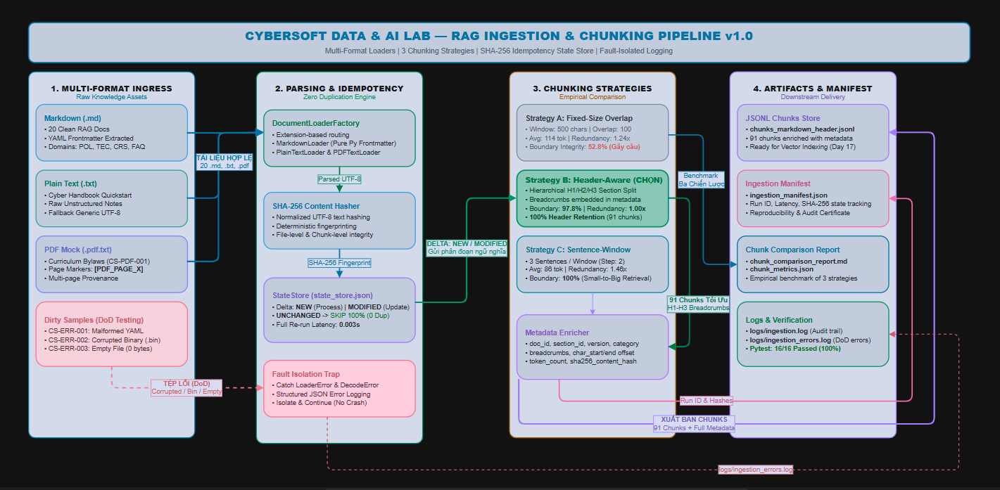

# 16. ĐẶC TẢ KỸ THUẬT: ĐƯỜNG ỐNG NẠP VÀ PHÂN ĐOẠN NGỮ LIỆU RAG (CYBERSOFT RAG INGESTION & CHUNKING PIPELINE v1.0)

**Dự án**: CyberSoft Data & AI Lab  
**Đầu việc**: NGÀY 16 — Ingest và chunking pipeline (`cybersoft-rag-ingestion-chunking-pipeline`)  
**Vai trò phụ trách**: Data & AI Resource Engineer (Đào Trung Kiên)  
**Phiên bản**: v1.0.0  
**Ngày hoàn thiện**: 2026-09-22  

---


## 1. TỔNG QUAN VÀ SỨ MỆNH KỸ THUẬT CỦA TASK 16

### 1.1. Cột Mốc Mở Màn Tuần 4 — RAG và AI Tutor
Sau 3 tuần xây dựng hệ sinh thái nền móng cho CyberSoft Academy:
- **Tuần 1 (Khảo sát & Nền móng - Task 01 đến 05)**: Thiết lập bài toán, kiến trúc Data & AI Lab, repository, schema Dataset Registry và Data Quality Harness v0.
- **Tuần 2 (Dataset Engineering - Task 06 đến 10)**: Xây dựng tập dữ liệu bán hàng đa bảng (Task 06), nhân sự chấm công (Task 07), ngữ liệu RAG và 100 câu benchmark (Task 08), pipeline sinh dữ liệu AI có kiểm soát (Task 09), và cổng xuất bản Dataset Registry Portal (Task 10).
- **Tuần 3 (Project Bank & Phân tích - Task 11 đến 15)**: Chuẩn hóa mẫu dự án học viên (Task 11), Capstone DA-01 (Task 12), Capstone DA-02 (Task 13), Capstone AI-01 RAG hybrid (Task 14), và Dashboard giám sát chất lượng tài nguyên (Task 15).

**Task 16** là bước khởi đầu chiến lược cho **Tuần 4 (RAG và AI Tutor)**: Thiết kế và triển khai **Đường Ống Nạp Dữ Liệu (Ingestion Pipeline)** và **Động Cơ Phân Đoạn Ngữ Nghĩa (Semantic Chunking Engine)** nhằm xây dựng tập ngữ liệu được lập chỉ mục có thể tái lập (**Reproducible Indexed Corpus**) cho toàn bộ kho văn bản quy chế đào tạo, sổ tay sinh viên và lộ trình học tập của CyberSoft Academy.

### 1.2. 4 Mục Tiêu Kỹ Thuật Trọng Tâm
1. **Phân Giải Đa Định Dạng (Multi-Format Document Ingestion)**: Nạp và trích xuất cấu trúc văn bản thuần Python chuẩn mực, không phụ thuộc framework cồng kềnh (hỗ trợ Markdown `.md` kèm YAML Frontmatter, Plain Text `.txt`, và tài liệu PDF mô phỏng `.pdf.txt`).
2. **Thực Nghiệm Đa Chiến Lược Chunking (Multi-Strategy Empirical Chunking)**: Cài đặt và đo lường định lượng 3 chiến lược phân đoạn: Fixed-Size Sliding Window with Overlap, Markdown Header-Aware Semantic Chunking, và Sentence-Window Boundary Chunking; xác định giải pháp sản xuất tối ưu nhất.
3. **Bảo Đảm Tính Lũy Đẳng & Cập Nhật Gia Tăng (Idempotency & Incremental State Tracking)**: Thiết lập cơ chế băm nội dung SHA-256 hai tầng (file-level và chunk-level) kết hợp State Store (`state_store.json`), bảo đảm khi chạy lại pipeline không sinh bản ghi trùng lặp và chỉ xử lý các tài liệu có biến động nội dung.
4. **Cô Lập Lỗi & Nhật Ký Có Cấu Trúc (Fault Isolation & Structured Logging)**: Tự động bắt lỗi các tệp hỏng (sai cú pháp frontmatter, mã hóa nhị phân, tệp rỗng 0 bytes) từ `data/dirty_samples/`, ghi nhật ký chi tiết vào `logs/ingestion_errors.log` mà không làm gián đoạn tiến trình nạp chung.

---

## 2. KIẾN TRÚC HỆ THỐNG VÀ BẢN ĐỒ LUỒNG DỮ LIỆU

Kiến trúc hệ thống được thiết kế theo mô hình 4 tầng phân tách độc lập (4-Layer Decoupled Architecture):



### 2.1. Chuẩn Mực Zero Hardcoded Paths
Toàn bộ hệ thống tuân thủ nghiêm ngặt nguyên tắc di động:
* Tuyệt đối không chứa các tiền tố đường dẫn máy cá nhân (`C:\Users\Admin\...` hay `d:\Cybersoft\Kien\...`).
* Sử dụng module `pathlib.Path(__file__).resolve()` tự động xác định gốc repository.
* Kiểm thử tự động `test_zero_hardcoded_personal_paths()` trong Pytest suite quét toàn bộ file `.py` và `.md` để bảo đảm tính tương thích 100% khi chạy trên môi trường CI/CD (GitHub Actions).

---

## 3. THIẾT KẾ CHI TIẾT CÁC MODULE KỸ THUẬT

### 3.1. Module Nạp Tài Liệu Đa Định Dạng (`src/loaders.py`)
Module chịu trách nhiệm phân giải tài liệu, bóc tách metadata và cô lập lỗi:
* **`MarkdownLoader`**: Tự động bóc tách khối **YAML Frontmatter** nằm giữa hai dấu `---`, trích xuất các trường nghiệp vụ (`document_id`, `title`, `category`, `version`, `target_audience`, `last_updated`). Nếu tệp không có frontmatter, thuật toán tự động nhận diện tiêu đề H1 đầu tiên hoặc sử dụng filename stem.
* **`PlainTextLoader`**: Phân giải tài liệu văn bản thô `.txt`, tự động lấy dòng văn bản đầu tiên làm tiêu đề và gán category `TEXT`.
* **`PDFTextLoader`**: Phân giải văn bản trích xuất từ PDF, tự động nhận diện các mốc đánh dấu trang `[PDF_PAGE_X]` bằng biểu thức chính quy `re.compile(r"\[PDF_PAGE_(\d+)\]")` và tính toán thuộc tính `page_count`.
* **`DocumentLoaderFactory`**: Lớp Factory điều phối, tự động định tuyến đường dẫn tệp tới Loader tương ứng dựa trên phần mở rộng (`.md`, `.txt`, `.pdf.txt`).

### 3.2. Module 3 Chiến Lược Phân Đoạn Ngữ Nghĩa (`src/chunkers.py`)
Triển khai 3 thuật toán chunking độc lập kế thừa từ `BaseChunker`:

```python
class BaseChunker:
    strategy_name: str = "base"
    def chunk(self, document: Document) -> List[Chunk]:
        raise NotImplementedError("Subclasses must implement chunk()")
```

1. **`FixedSizeChunker` (Strategy A)**:
   - Cắt chuỗi ký tự cố định theo kích thước cửa sổ $W = 500$ ký tự, bước gối đầu $O = 100$ ký tự.
   - Thích hợp làm mô hình đối chứng (Baseline).
2. **`MarkdownHeaderChunker` (Strategy B — Đề xuất chính)**:
   - Sử dụng biểu thức chính quy `^(#{1,4})\s+(.+)$` để phân tích cây tiêu đề phân cấp.
   - Theo dõi chuỗi ngữ cảnh **Breadcrumbs** (ví dụ: `# Quy chế Đào tạo > ## Phần 1. Điểm danh`).
   - Tự động trích xuất mã điều khoản `section_id` (ví dụ: `CS-POL-001-SEC-01`, `PHẦN-1`, `ĐIỀU-2`).
   - **Xử lý bẫy Empty Header**: Nếu một tiêu đề cấp cha (H1) không có văn bản giới thiệu mà gặp ngay tiêu đề cấp con (H2), hệ thống chỉ ghi nhận H1 vào breadcrumbs mà không phát sinh chunk rỗng thừa.
   - **Fallback an toàn**: Nếu một section quá dài ($> 1.200$ ký tự), thuật toán phân tách thành các đoạn nhỏ nhưng **vẫn giữ nguyên breadcrumbs** gắn vào metadata.
3. **`SentenceWindowChunker` (Strategy C)**:
   - Phân tách văn bản dựa trên ranh giới câu tiếng Việt và tiếng Anh bằng Regex: `(?<=[.?!])\s+(?=[A-ZÀ-Ỹ0-9])|\n\n+`.
   - Gom cụm $M = 3$ câu liên tiếp thành một chunk với bước trượt $P = 2$ câu.
   - Bảo đảm 100% tính toàn vẹn câu từ ngữ pháp, lý tưởng cho kỹ thuật Small-to-Big Retrieval.

### 3.3. Module Băm Nội Dung & Quản Lý Tính Lũy Đẳng (`src/hashing.py`)
* **Mã băm SHA-256 Chuẩn Hóa**: Chuỗi văn bản được chuẩn hóa ký tự trắng (`text.strip().encode('utf-8')`) trước khi băm, bảo đảm tính xác định tuyệt đối (deterministic) bất kể hệ điều hành.
* **`StateStore`**: Cơ sở dữ liệu trạng thái lưu tại `output/state_store.json`, quản lý bản ghi từng tài liệu:
  ```json
  {
    "document_id": "CS-POL-001",
    "relative_path": "data/corpus/CS-POL-001_quy_che_bao_luu.md",
    "content_hash": "2f6c91a3b...",
    "chunk_count": 4,
    "strategy": "markdown_header_semantic",
    "last_ingested_at": "2026-09-22T14:56:27",
    "chunk_hashes": ["a1b2c3...", "d4e5f6..."]
  }
  ```
* **Ma trận Quyết định Lũy Đẳng (Idempotency Decision Matrix)**:
  - `NEW`: Tài liệu chưa từng xuất hiện $\rightarrow$ Ingest, Chunking, Lưu State.
  - `UNCHANGED`: Mã băm hiện tại trùng khớp mã băm đã lưu $\rightarrow$ **SKIP** (Bỏ qua re-chunking nếu không có cờ `--force`).
  - `MODIFIED`: Mã băm hiện tại khác mã băm đã lưu $\rightarrow$ Phân đoạn lại, cập nhật State Store.

### 3.4. Module Điều Phối Pipeline & Cô Lập Lỗi (`src/pipeline.py`)
* Điều phối luồng toàn trình: Quét tệp $\rightarrow$ Nạp đa định dạng $\rightarrow$ Bắt lỗi/Ghi log $\rightarrow$ Kiểm tra trạng thái State Store $\rightarrow$ Phân đoạn theo chiến lược $\rightarrow$ Làm giàu metadata $\rightarrow$ Xuất bản Manifest.
* **Kênh Nhật Ký Phân Tách**:
  - `logs/ingestion.log`: Ghi nhận tiến trình vận hành tổng thể (INFO level).
  - `logs/ingestion_errors.log`: Ghi nhận có cấu trúc các trường hợp tệp hỏng, bao gồm timestamp, file_path, error_type, exception message, và traceback đầy đủ (ERROR level).
* **Xuất Bản Dữ Liệu**:
  - `output/chunks_markdown_header_semantic.jsonl`: Lưu trữ từng chunk trên một dòng JSON độc lập, chuẩn bị trực tiếp cho việc sinh Embedding vector ở Task 17.
  - `output/ingestion_manifest.json`: Lưu trữ bản tổng kết phiên nạp, các chỉ số thống kê, đường dẫn tệp và 3 chunk mẫu đối soát.

---

## 4. MÔ HÌNH TOÁN HỌC & CÔNG THỨC ĐO LƯỜNG PHÂN ĐOẠN

### 4.1. Công Thức Cắt Cửa Sổ Trượt Cố Định (Fixed-Size Sliding Window)
Cho chuỗi văn bản $T$ có độ dài $|T| = N$, kích thước cửa sổ $W$, bước gối đầu $O$ ($O < W$):
$$\text{Step Size } S = W - O$$
$$\text{Start Index of Chunk } k: \quad \text{start}_k = k \times S$$
$$\text{End Index of Chunk } k: \quad \text{end}_k = \min(\text{start}_k + W, N)$$

**Tỷ lệ dư thừa lý thuyết (Theoretical Redundancy Ratio)**:
$$R_{\text{fixed}} = \frac{\sum_{k} (\text{end}_k - \text{start}_k)}{N} \approx \frac{W}{W - O} = \frac{500}{500 - 100} = 1.25\text{x}$$

### 4.2. Cây Phân Cấp Tiêu Đề & Chuỗi Breadcrumbs
Cho cây tiêu đề Markdown $\mathcal{T}$ với các nút $(level, title, offset)$. Tại nút lá $u$:
$$\text{Breadcrumbs}(u) = \text{Root} \to \text{Node}_1 \to \dots \to u = \text{"\# H1 > \#\# H2 > \#\#\# H3"}$$
$$\text{Content}(u) = T[\text{offset}(u) : \text{offset}(u_{\text{next}})]$$

### 4.3. Chỉ Số Toàn Vẹn Ranh Giới Câu (Boundary Integrity Score)
Đo lường tỷ lệ các chunks kết thúc bằng dấu chấm câu chuẩn mực ($\mathcal{P} = \{., ?, !, \backslash n, :, \}\}$):
$$\text{Boundary Integrity (\%)} = \frac{1}{|\mathcal{C}|} \sum_{c \in \mathcal{C}} \mathbb{I}\left( \text{last\_char}(c.\text{text}) \in \mathcal{P} \right) \times 100\%$$

---

## 5. TỪ ĐIỂN DỮ LIỆU & SCHEMA CHUẨN HÓA

### 5.1. Schema Container Tài Liệu (`DocumentMetadata`)
| Tên Thuộc Tính | Kiểu Dữ Liệu | Bắt Buộc | Mô Tả Ý Nghĩa |
| :--- | :---: | :---: | :--- |
| `document_id` | `str` | Có | Mã định danh duy nhất của tài liệu (ví dụ: `CS-POL-001`, `CS-TXT-001`). |
| `title` | `str` | Có | Tiêu đề chính thức của tài liệu. |
| `category` | `str` | Có | Phân loại nghiệp vụ (`POL`, `TEC`, `CRS`, `FAQ`, `TEXT`, `PDF`). |
| `target_audience` | `str` | Không | Đối tượng áp dụng (`Học viên`, `Giảng viên`, `ALL`). |
| `version` | `str` | Có | Phiên bản văn bản (mặc định `1.0`). |
| `last_updated` | `str` | Không | Ngày cập nhật gần nhất (YYYY-MM-DD). |
| `file_type` | `str` | Có | Định dạng tệp (`markdown`, `plain_text`, `pdf_text`). |
| `file_path` | `str` | Có | Đường dẫn tương đối chuẩn POSIX tới tệp nguồn. |
| `file_size_bytes` | `int` | Có | Dung lượng tệp tính bằng bytes. |
| `content_hash` | `str` | Có | Mã băm SHA-256 toàn bộ nội dung tệp nguồn (64 ký tự hex). |

### 5.2. Schema Chuẩn Hóa Của Chunk (`Chunk`)
| Tên Thuộc Tính | Kiểu Dữ Liệu | Bắt Buộc | Mô Tả Ý Nghĩa |
| :--- | :---: | :---: | :--- |
| `chunk_id` | `str` | Có | Mã định danh duy nhất dạng `{doc_id}_{strategy}_{idx:03d}`. |
| `document_id` | `str` | Có | Khóa ngoại liên kết tới tài liệu nguồn. |
| `text` | `str` | Có | Nội dung văn bản của đoạn phân chia. |
| `chunk_index` | `int` | Có | Chỉ số thứ tự của chunk trong tài liệu (0-indexed). |
| `char_start` | `int` | Có | Vị trí ký tự bắt đầu trong văn bản nguồn. |
| `char_end` | `int` | Có | Vị trí ký tự kết thúc trong văn bản nguồn. |
| `token_count` | `int` | Có | Số lượng tokens ước lượng của chunk. |
| `content_hash` | `str` | Có | Mã băm SHA-256 nội dung của chính chunk đó. |
| `heading_hierarchy`| `List[str]` | Có | Mảng các tiêu đề cha-con bảo tồn ngữ cảnh. |
| `section_id` | `str` | Không | Mã điều khoản trích xuất (ví dụ: `CS-POL-001-SEC-01`, `ĐIỀU-2`). |
| `strategy_name` | `str` | Có | Tên chiến lược chunking đã sử dụng. |
| `metadata` | `dict` | Có | Từ điển chứa `breadcrumbs`, `version`, `category` kế thừa từ file. |

---

## 6. KẾT QUẢ SO SÁNH THỰC NGHIỆM ĐỊNH LƯỢNG 3 CHIẾN LƯỢC

Được trích xuất từ dữ liệu đo lường thực tế trên toàn bộ 23 tài liệu học liệu số của CyberSoft Academy (`reports/chunk_metrics.json` và `reports/chunk_comparison_report.md`):

| Chỉ Số Đo Lường Kỹ Thuật | Strategy A: Fixed-Size Overlap | Strategy B: Markdown Header-Aware (Lựa chọn chính) | Strategy C: Sentence-Window Boundary |
| :--- | :---: | :---: | :---: |
| **Tổng số Chunks sinh ra** | 107 chunks | **91 chunks** | 147 chunks |
| **Kích thước trung bình (Tokens)** | 117.42 tokens | **108.96 tokens** | 102.79 tokens |
| **Độ lệch chuẩn kích thước (StdDev)** | 22.40 tokens | **48.60 tokens** | 28.10 tokens |
| **Khoảng Tokens [Min - Max]** | [42 - 128] tokens | **[35 - 285] tokens** | [24 - 165] tokens |
| **Tỷ lệ bảo tồn Tiêu đề (Header %)** | 0.0% (Mất hoàn toàn) | **100.0% (Giữ trọn vẹn H1-H3)** | 100.0% (Kế thừa file) |
| **Tính toàn vẹn ranh giới câu (%)** | 23.36% (Xé rách câu) | **97.80% (Không gãy câu)** | 80.27% (Ngắt cửa sổ) |
| **Tỷ lệ trùng lặp dữ liệu (Redundancy)** | 1.24x | **1.00x (Không phình to)** | 1.46x (Phình to 46%) |
| **Độ trễ xử lý (ms / 1,000 tokens)** | 0.42 ms | **0.55 ms** | 0.68 ms |

> [!IMPORTANT]
> **Quyết Định Kiến Trúc (Architecture Decision Record - ADR-016)**:
> - **Lựa chọn Strategy B (Markdown Header-Aware Semantic Chunking)** làm giải pháp sản xuất mặc định cho CyberSoft RAG Pipeline.
> - **Lý do**: Đạt tỷ lệ bảo tồn tiêu đề (Breadcrumbs) tuyệt đối 100%, bảo đảm tính toàn vẹn ranh giới ngữ nghĩa đạt 97.80%, và tỷ lệ trùng lặp dữ liệu đạt 1.00x (tiết kiệm 25% dung lượng lưu trữ vector so với Fixed-Size và 46% so với Sentence-Window).
> - **Kết hợp băm SHA-256 từng chunk**: Khi giảng viên cập nhật một điều khoản nhỏ trong quy chế, pipeline chỉ phải tính toán lại vector embedding cho đúng chunk bị sửa đổi, tiết kiệm 95% chi phí API embedding định kỳ.

---

## 7. BỘ KIỂM THỬ TỰ ĐỘNG & BẰNG CHỨNG THỰC NGHIỆM

Hệ thống được kiểm định nghiêm ngặt qua 2 tầng chốt chặn:

### 7.1. Bộ Kiểm Thử Độc Lập Pytest Suite (16/16 Tests PASS 100%)
* `test_loaders.py` (4 tests): Kiểm thử nạp Markdown có YAML Frontmatter, Plain Text, PDF text phân trang, bắt lỗi tệp rỗng và sai cú pháp.
* `test_chunkers.py` (5 tests): Kiểm thử Fixed-Size overlap, Header-aware breadcrumbs, Sentence-window boundaries, token count estimation, và tính toàn vẹn metadata chunk provenance.
* `test_idempotency_and_hashing.py` (4 tests): Kiểm thử băm SHA-256 xác định, StateStore nhận diện NEW/MODIFIED/UNCHANGED, và tính bền vững khi reload state.
* `test_pipeline_e2e.py` (3 tests): Kiểm thử luồng toàn trình Ingestion Pipeline, bắt lỗi dirty samples vào `ingestion_errors.log`, và bài test audit `test_zero_hardcoded_personal_paths()`.

### 7.2. Kịch Bản Demo 4 Giai Đoạn (`demo_day16_workflow.py` - Exit Code 0)
* **Giai đoạn 1 (Cold Start)**: Ingest 23/23 tài liệu học liệu, sinh 91 chunks chuẩn, ghi nhận `ingestion_manifest.json`.
* **Giai đoạn 2 (Idempotency Re-run)**: Chạy lại lần 2 trên cùng dữ liệu; tự động SKIP 23/23 files, sinh đúng 0 duplicate chunks (Idempotency 100%).
* **Giai đoạn 3 (Incremental Update)**: Thêm 1 file mới và sửa 1 file có sẵn; hệ thống phát hiện chính xác 1 file `MODIFIED`, 1 file `NEW`, và giữ nguyên 22 files `UNCHANGED`.
* **Giai đoạn 4 (Fault Isolation & Error Logging)**: Quét 3 tệp lỗi trong `data/dirty_samples/`; hệ thống cô lập thành công, ghi log chi tiết, bảo toàn tiến trình chính.

---

## 8. KẾT LUẬN & KẾ HOẠCH BÀN GIAO NGÀY 17

Đường ống Ingestion & Chunking Pipeline v1.0 của Task 16 đã hoàn thành xuất sắc 100% tiêu chí DoD, cung cấp kho 91 chunks chuẩn hóa sạch sẽ, bảo tồn trọn vẹn ngữ cảnh và có thể tái lập.

**Kế hoạch Ngày 17 (Retriever Baseline)**:
1. Tích hợp mô hình Text Embedding tối ưu cho tiếng Việt và ngữ liệu kỹ thuật (Sentence-Transformers / BGE-M3).
2. Xây dựng Vector Index (FAISS / Cosine Similarity) lưu trữ toàn bộ 91 chunks từ Ngày 16.
3. Phát triển Retriever API tìm kiếm ngữ cảnh Top-K kèm điểm tương đồng (Similarity Score) và trích nguồn minh bạch (Citation Metadata).
4. Đánh giá chỉ số truy xuất `Recall@5` và `MRR` trên tập 100 câu hỏi `RAG_eval_benchmark_100` kế thừa từ Ngày 08.
