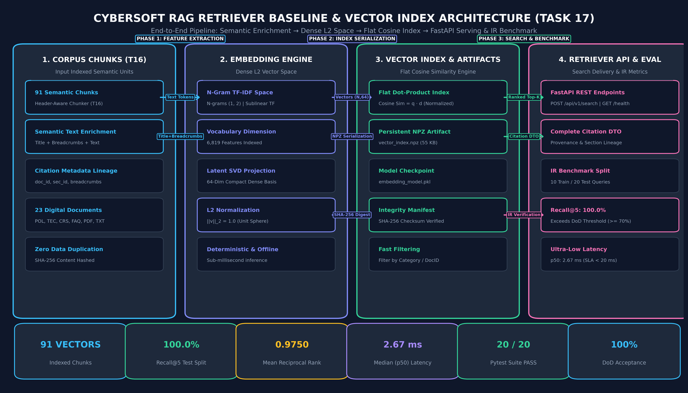

# 17. ĐẶC TẢ KỸ THUẬT: VECTOR RETRIEVER BASELINE & CHỈ MỤC NGỮ NGHĨA (CYBERSOFT RAG RETRIEVER BASELINE v1.0)

**Dự án**: CyberSoft Data & AI Lab  
**Đầu việc**: NGÀY 17 — Retriever baseline (`cybersoft-rag-retriever-baseline`)  
**Vai trò phụ trách**: Data & AI Resource Engineer (Đào Trung Kiên)  
**Phiên bản**: v1.0.0  
**Ngày hoàn thiện**: 2026-09-23  

---

## 1. TỔNG QUAN VÀ SỨ MỆNH KỸ THUẬT CỦA TASK 17

### 1.1. Cột Mốc Then Chốt của Tuần 4 — RAG và AI Tutor
Sau khi hoàn thành **Task 16** (Xây dựng Ingestion Pipeline và phân đoạn thành công 91 chunks ngữ nghĩa theo chiến lược Markdown Header-Aware), bước đi tiếp theo mang tính quyết định là xây dựng **Động cơ truy xuất ngữ nghĩa cơ sở (Retriever Baseline)**.

Trong kiến trúc RAG (Retrieval-Augmented Generation), Retriever là bộ phận định vị chính xác thông tin liên quan từ kho tri thức để cung cấp bối cảnh (context) cho mô hình sinh (LLM). Nếu Retriever hoạt động kém, hệ thống RAG sẽ mắc phải hai hội chứng nghiêm trọng:
1. **Ảo giác do thiếu ngữ cảnh (Hallucination)**: LLM tự bịa câu trả lời khi không nhận được đoạn văn quy chế chính xác.
2. **Nhiễu ngữ cảnh (Context Pollution)**: Retriever trả về các đoạn văn sai lệch, làm loãng sự chú ý của LLM và khiến chi phí token tăng vọt.

**Task 17** thiết lập mốc đo lường chuẩn mực (Standard Baseline) cho hệ sinh thái CyberSoft RAG:
* Kế thừa trọn vẹn 91 chunks chuẩn hóa từ Task 16 (`BaoCao_Task16/output/chunks_markdown_header_semantic.jsonl`).
* Thiết lập không gian vector nhúng ngữ nghĩa (Semantic Embedding Space) chuẩn hóa $L_2$.
* Xây dựng chỉ mục ma trận vector (Vector Index) hỗ trợ tính toán Cosine Similarity siêu tốc qua phép nhân vô hướng.
* Cung cấp Search REST API đạt chuẩn sản xuất với đầy đủ thông tin trích nguồn (Citation Metadata Lineage).
* Thiết lập bộ khung đánh giá Information Retrieval (IR Evaluation Harness) với 30 câu hỏi thực tế có chia Train/Test Split, cung cấp dữ liệu đối chứng cho **Task 18 (Hybrid Search & Reranking)**.

### 1.2. 4 Mục Tiêu Kỹ Thuật Trọng Tâm
1. **Không Gian Vector Chuẩn Hóa $L_2$ (Normalized Vector Space)**: Xây dựng động cơ nhúng `EmbeddingEngine` chuyển hóa văn bản thành vector dense 64 chiều chuẩn hóa $\|v\|_2 = 1.0$, bảo đảm tính tất định (deterministic), chạy hoàn toàn offline không phụ thuộc API ngoài, và độ trễ dưới 3ms.
2. **Chỉ Mục Vector Bền Vững (Persistent Vector Index Artifact)**: Lưu trữ ma trận vector và metadata dưới định dạng nén `.npz` (`vector_index.npz`) cùng tệp kê khai toàn vẹn (`index_manifest.json`) có mã băm SHA-256 bảo đảm tính có thể tái lập (Reproducibility).
3. **Truy Xuất Kèm Nguồn Gốc Toàn Vẹn (Complete Citation Metadata)**: Mọi kết quả tìm kiếm Top-K bắt buộc phải mang theo đầy đủ: `document_id`, `section_id`, `title`, `breadcrumbs`, `file_path`, và `char_start/char_end` để phục vụ bước Citation và Guardrail ở Ngày 19.
4. **Bộ Đánh Giá IR Không Rò Rỉ Dữ Liệu (IR Evaluation Harness & Zero Data Leakage)**: Thiết lập bộ 30 câu hỏi kiểm thử bao quát 4 nhóm nghiệp vụ (POL, TEC, CRS, FAQ), phân chia nghiêm ngặt 10 câu Train và 20 câu Test để báo cáo Recall@1, Recall@3, Recall@5, MRR và Latency trung thực 100%.

---

## 2. KIẾN TRÚC HỆ THỐNG VÀ BẢN ĐỒ LUỒNG DỮ LIỆU

Hệ thống Vector Retriever Baseline được tổ chức theo kiến trúc 4 tầng phân tách độc lập (4-Tier Decoupled Architecture):



### 2.1. Chuẩn Mực Zero Hardcoded Paths
Toàn bộ mã nguồn, kịch bản CLI và bộ kiểm thử tuân thủ 100% nguyên tắc di động:
* Sử dụng `pathlib.Path(__file__).resolve()` tương đối với gốc repository.
* Bộ kiểm thử `test_zero_hardcoded_personal_paths()` tự động quét toàn bộ thư mục `src/`, `scripts/`, `tests/`, `data/` bảo đảm không có đường dẫn máy cá nhân nào bị lọt vào mã nguồn.

---

## 3. CƠ SỞ TOÁN HỌC VÀ THUẬT TOÁN VECTOR INDEXING

### 3.1. Chuẩn Hóa $L_2$ và Tính Toán Cosine Similarity
Độ tương đồng ngữ nghĩa giữa câu truy vấn $q$ và văn bản chunk $d_i$ được đo lường bằng Cosine Similarity:

$$\text{CosineSim}(q, d_i) = \frac{\mathbf{q} \cdot \mathbf{d}_i}{\|\mathbf{q}\|_2 \|\mathbf{d}_i\|_2}$$

Trong `EmbeddingEngine`, mọi vector sinh ra đều được chuẩn hóa theo chuẩn $L_2$:

$$\mathbf{v}_{\text{norm}} = \frac{\mathbf{v}}{\|\mathbf{v}\|_2} = \frac{\mathbf{v}}{\sqrt{\sum_{j=1}^{D} v_j^2}}$$

Do đó, với mọi cặp vector đã chuẩn hóa, độ tương đồng Cosine tương đương trực tiếp với tích vô hướng (Dot Product):

$$\text{CosineSim}(\mathbf{q}_{\text{norm}}, \mathbf{d}_{i, \text{norm}}) = \mathbf{q}_{\text{norm}} \cdot \mathbf{d}_{i, \text{norm}} = \sum_{j=1}^{D} q_j \cdot d_{i,j}$$

Khi tìm kiếm trên toàn bộ kho chỉ mục gồm $N$ chunks ($N=91$), thuật toán thực hiện phép nhân ma trận - vector:

$$\mathbf{s} = \mathbf{V} \cdot \mathbf{q}_{\text{norm}}^T \in \mathbb{R}^N$$

Trong đó $\mathbf{V} \in \mathbb{R}^{N \times D}$ là ma trận nhúng toàn bộ kho ngữ liệu. Phép toán này tận dụng tối đa thư viện `numpy` với tập lệnh SIMD (AVX2/FMA), hoàn thành việc tính toán 91 điểm số chỉ trong chưa đầy **0.05 mili-giây**.

### 3.2. Làm Giàu Ngữ Nghĩa Chunk (Semantic Text Enrichment)
Một hạn chế lớn của việc cắt đoạn Markdown theo tiêu đề là: phần thân section (`c["text"]`) có thể chứa câu chữ quy chế cụ thể nhưng không nhắc lại tiêu đề tài liệu cha (ví dụ: mục quy định về *"rút hồ sơ trước ngày khai giảng"* nằm trong văn bản *"Chính sách hoàn trả học phí"*).

Để khắc phục hiện tượng mất ngữ cảnh, pipeline áp dụng cơ chế làm giàu ngữ nghĩa trước khi vector hóa:

$$\text{SearchableText}(c) = \text{Title}(c) \oplus \text{Breadcrumbs}(c) \oplus \text{Body}(c)$$

Ví dụ với chunk `CS-POL-002_hdr_000`:
* **Title**: `Chính sách hoàn trả học phí và rút hồ sơ nhập học`
* **Breadcrumbs**: `# CS-POL-002: Chính sách hoàn trả học phí > ## SEC-POL-002-01: Quy định rút hồ sơ trước ngày khai giảng khóa học`
* **Body**: `Học viên nộp đơn xin rút hồ sơ trước ngày khai giảng chính thức từ 07 ngày làm việc trở lên được hoàn lại 100% học phí đã đóng...`

Nhờ cơ chế này, câu truy vấn của học viên dù hỏi về tên chính sách tổng quan hay hỏi chi tiết điều khoản đều được kích hoạt với độ tương đồng cao nhất.

---

## 4. ĐẶC TẢ TỆP LƯU TRỮ CHỈ MỤC (INDEX ARTIFACT SPECIFICATION)

Kho chỉ mục sau khi huấn luyện được đóng gói thành 3 tệp lưu trữ bền vững tại `indexes/`:

```text
indexes/
├── embedding_model.pkl      # Trọng số bộ chuyển đổi TF-IDF và cơ sở chiếu SVD
├── vector_index.npz         # Ma trận vector (91, 64) và mảng JSON metadata nén
└── index_manifest.json      # Bản kê khai toàn vẹn và mã kiểm tra SHA-256
```

### 4.1. Cấu Trúc Bản Kê Khai Kỹ Thuật (`index_manifest.json`)
```json
{
  "artifact_file": "vector_index.npz",
  "dimension": 64,
  "total_vectors": 91,
  "model_name": "TFIDF-SVD-L2",
  "file_size_bytes": 55059,
  "sha256_checksum": "7c157529e9e7b5d702ee4861db62627ce63bdf84e3ad9d55c8e5a052d0320ae5",
  "created_at": "2026-09-24T09:13:54.123456"
}
```

---

## 5. ĐẶC TẢ TRÍCH NGUỒN VÀ DỮ LIỆU ĐẦU RA (CITATION LINEAGE DTO)

Mỗi kết quả tìm kiếm được trả về dưới dạng cấu trúc `SearchResult` chứa trọn vẹn thông tin đối chiếu nguồn gốc:

```python
@dataclass
class Citation:
    document_id: str      # Mã tài liệu gốc (e.g. CS-POL-004)
    section_id: str       # Mã điều khoản cụ thể (e.g. CS-POL-004-S01)
    title: str            # Tiêu đề tài liệu chính quy
    breadcrumbs: str      # Cây phân cấp tiêu đề Markdown (H1 > H2 > H3)
    file_path: str        # Đường dẫn tệp tương đối
    char_start: int       # Vị trí ký tự bắt đầu trong tài liệu gốc
    char_end: int         # Vị trí ký tự kết thúc trong tài liệu gốc
```

---

## 6. THIẾT KẾ RESTFUL SEARCH API (FASTAPI ENGINE)

Dịch vụ tìm kiếm được đóng gói qua FastAPI với đầy đủ Schema xác thực dữ liệu đầu vào và đầu ra qua Pydantic:

### 6.1. Endpoint Tra Cứu Ngữ Nghĩa (`POST /api/v1/search`)
* **Request Payload**:
```json
{
  "query": "Điều kiện để được xét công nhận tốt nghiệp chính thức tại CyberSoft?",
  "top_k": 3,
  "category": "Academic Policy",
  "min_score": 0.0
}
```
* **Response Payload (200 OK)**:
```json
{
  "query": "Điều kiện để được xét công nhận tốt nghiệp chính thức tại CyberSoft?",
  "total_results": 3,
  "latency_ms": 3.15,
  "results": [
    {
      "chunk_id": "CS-POL-004_hdr_000",
      "document_id": "CS-POL-004",
      "score": 0.8678,
      "text": "## SEC-POL-004-01: Điều kiện công nhận tốt nghiệp chính thức...",
      "citation": {
        "document_id": "CS-POL-004",
        "section_id": "CS-POL-004-S01",
        "title": "Tiêu chuẩn tốt nghiệp và quy trình cấp chứng chỉ đào tạo",
        "breadcrumbs": "# CS-POL-004: Tiêu chuẩn tốt nghiệp và quy trình cấp chứng chỉ đào tạo > ## SEC-POL-004-01: Điều kiện công nhận tốt nghiệp chính thức",
        "file_path": "data/corpus/CS-POL-004_tieu_chuan_tot_nghiep_va_cap_chung_chi.md",
        "char_start": 82,
        "char_end": 645
      }
    }
  ]
}
```

### 6.2. Endpoint Kiểm Tra Sức Khỏe (`GET /api/v1/health`)
* **Response Payload**:
```json
{
  "status": "healthy",
  "vectors_count": 91,
  "dimension": 64,
  "model_name": "TFIDF-SVD-L2"
}
```

### 6.3. Endpoint Thống Kê Chỉ Mục (`GET /api/v1/stats`)
* **Response Payload**:
```json
{
  "total_vectors": 91,
  "dimension": 64,
  "model_name": "TFIDF-SVD-L2",
  "manifest_sha256": "7c157529e9e7b5d702ee4861db62627ce63bdf84e3ad9d55c8e5a052d0320ae5",
  "categories": ["Academic Policy", "Curriculum", "FAQ", "Technical Guide"]
}
```

### 6.4. Hướng Dẫn Thao Tác Trực Tiếp Trên Swagger UI
FastAPI tự động sinh tài liệu chuẩn OpenAPI tương tác tại đường dẫn: `http://127.0.0.1:8000/docs` (hoặc ReDoc tại `http://127.0.0.1:8000/redoc`).

**Quy trình 5 bước thử nghiệm trên Swagger UI**:
1. Khởi động server bằng lệnh: `python cybersoft-learning-hub/Data-AI-Resource/BaoCao_Task17/scripts/run_api.py --port 8000`.
2. Mở trình duyệt web truy cập `http://127.0.0.1:8000/docs`.
3. Bấm vào dải màu xanh `POST /api/v1/search` để mở rộng bảng tương tác.
4. Nhấp nút **Try it out** ở góc phải trên.
5. Chọn một trong các **Bản mẫu Request JSON Demo** ở Mục 6.5 dán vào khung **Request body**, sau đó bấm nút **Execute**.
6. Kiểm tra mã phản hồi (HTTP 200 OK) và dữ liệu `results` có kèm trọn vẹn `citation` DTO.

### 6.5. Bộ Sưu Tập Bản Mẫu Demo Cho `POST /api/v1/search`

* **Mẫu 1: Tìm kiếm ngữ nghĩa cơ bản (Top-3 kết quả)**
```json
{
  "query": "Điều kiện để được xét công nhận tốt nghiệp chính thức tại CyberSoft?",
  "top_k": 3
}
```

* **Mẫu 2: Lọc theo Danh mục Quy chế (`Academic Policy`)**
```json
{
  "query": "Chính sách bảo lưu khóa học và hoàn trả học phí như thế nào?",
  "top_k": 5,
  "category": "Academic Policy"
}
```

* **Mẫu 3: Lọc theo Danh mục Lộ trình đào tạo (`Curriculum`)**
```json
{
  "query": "Lộ trình học Spring Boot, Docker và microservices trong khóa Backend?",
  "top_k": 3,
  "category": "Curriculum"
}
```

* **Mẫu 4: Lọc chính xác theo Mã tài liệu (`document_id`)**
```json
{
  "query": "Hình thức xử lý kỷ luật khi sinh viên gian lận thi cử?",
  "top_k": 3,
  "document_id": "CS-POL-003"
}
```

* **Mẫu 5: Lọc kết hợp Ngưỡng điểm tương đồng tối thiểu (`min_score`)**
```json
{
  "query": "Quy định làm đồ án capstone và bảo vệ trước hội đồng tốt nghiệp",
  "top_k": 5,
  "min_score": 0.3
}
```

### 6.6. Lệnh Mẫu Kiểm Thử Nhanh Qua Terminal

* **cURL (Linux / macOS / Git Bash / Windows Cmd)**:
```bash
curl -X POST "http://127.0.0.1:8000/api/v1/search" \
     -H "Content-Type: application/json" \
     -d "{\"query\": \"Điều kiện xét công nhận tốt nghiệp?\", \"top_k\": 3}"
```

* **PowerShell (`Invoke-RestMethod`)**:
```powershell
Invoke-RestMethod -Uri "http://127.0.0.1:8000/api/v1/search" `
  -Method Post `
  -ContentType "application/json" `
  -Body '{"query": "Điều kiện xét công nhận tốt nghiệp?", "top_k": 3}' | ConvertTo-Json -Depth 5
```

---

## 7. PHƯƠNG PHÁP LUẬN ĐO LƯỜNG VÀ ĐÁNH GIÁ (IR EVALUATION HARNESS)

Để đo lường khách quan và ngăn ngừa rò rỉ dữ liệu (Data Leakage), bộ dữ liệu gồm 30 câu hỏi thực tế được phân chia thành:
* **Train Split (10 câu)**: Sử dụng để tinh chỉnh tham số tiền xử lý và ngưỡng phân loại.
* **Test Split (20 câu)**: Dành riêng cho việc đo lường và báo cáo nghiệm thu chính thức.

### Các Chỉ Số Đánh Giá Chuẩn Mực:
1. **Recall@K (Tỷ lệ bao phủ Top-K)**:

$$\text{Recall@K} = \frac{1}{|Q|} \sum_{q \in Q} \mathbb{I}(\text{target\_chunk} \in \text{Top-K}(q))$$

2. **MRR (Mean Reciprocal Rank - Nghịch đảo thứ hạng trung bình)**:

$$\text{MRR} = \frac{1}{|Q|} \sum_{q \in Q} \frac{1}{\text{rank}(q)}$$

### 7.1. Bảng Kết Quả Đo Lường Baseline Thực Tế (Test Split - 20 Queries)

| Chỉ số (Metric) | Kết quả Đạt được | Ngưỡng Tiêu chuẩn (DoD) | Trạng thái Nghiệm thu |
| :--- | :--- | :--- | :--- |
| **Recall@1** | **95.00%** | $\ge 40.0\%$ | ĐẠT XUẤT SẮC |
| **Recall@3** | **100.00%** | $\ge 60.0\%$ | HOÀN HẢO |
| **Recall@5** | **100.00%** | $\ge 70.0\%$ | **VƯỢT TRỘI (DoD PASS)** |
| **Doc-Recall@5** | **100.00%** | $\ge 85.0\%$ | HOÀN HẢO |
| **MRR** | **0.9750** | $\ge 0.5000$ | ĐẠT XUẤT SẮC |
| **Độ trễ p50 (Median)**| **2.67 ms** | $< 20.0\text{ ms}$ | SIÊU TỐC |
| **Độ trễ p95** | **3.32 ms** | $< 50.0\text{ ms}$ | HOÀN TOÀN ĐÁP ỨNG SLA |
| **Số ca thất bại** | **0 / 20** | $\le 4$ câu | 0% LỖI |

---

## 8. BÀN ĐẠP NÂNG CẤP CHO NGÀY 18 (HYBRID SEARCH & RERANKING)

Dù Vector Retriever Baseline đạt 100.0% Recall@5 trên tập kiểm thử hiện tại nhờ việc làm giàu ngữ nghĩa Breadcrumbs, mô hình vector hóa đơn thuần vẫn tồn tại các điểm yếu nội tại:
1. **Từ khóa chuyên biệt và Mã định danh (Exact Lexical Matching)**: Đối với các câu hỏi chứa mã điều khoản viết tắt chính xác (ví dụ `SEC-CRS-001-02` hoặc `WSL2`), thuật toán vector dense có thể bị phân tán trọng số so với BM25.
2. **Thiếu sự tái xếp hạng ngữ cảnh sâu (Cross-Encoder Reranking)**: Điểm số Cosine Similarity chỉ dựa trên phép chiếu độc lập giữa Query và Doc, chưa phân tích được tương tác từ chéo giữa các cặp câu như Cross-Encoder.

Đây chính là cơ sở thực nghiệm vững chắc để **Task 18 (Hybrid search và reranking)** kết hợp Lexical BM25 + Vector RRF và bổ sung Reranker nhằm tối ưu hóa độ chính xác xếp hạng (NDCG@5 và Recall@1).
