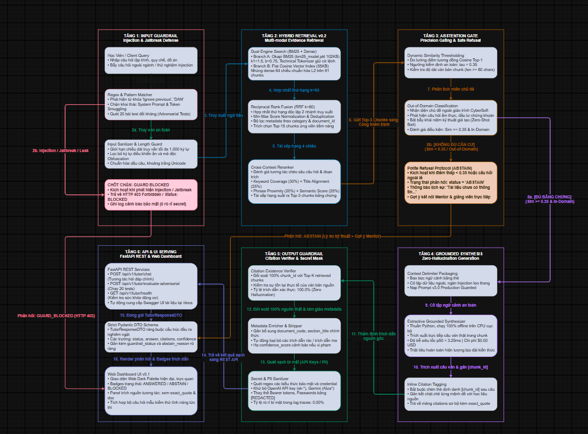

# 19. ĐẶC TẢ KỸ THUẬT: ĐỘNG CƠ AI TUTOR CÓ TRÍCH NGUỒN VÀ TỪ CHỐI (CYBERSOFT AI TUTOR GROUNDED GENERATION & ABSTENTION v1.0)

**Dự án**: CyberSoft Data & AI Lab  
**Đầu việc**: NGÀY 19 — AI Tutor có trích nguồn và từ chối (`cybersoft-ai-tutor-grounded-abstention`)  
**Vai trò phụ trách**: Data & AI Resource Engineer (Đào Trung Kiên)  
**Phiên bản**: v1.0.0  
**Ngày hoàn thiện**: 2026-09-25  

---

## 1. TỔNG QUAN HỆ THỐNG VÀ BÀI TOÁN KỸ THUẬT

### 1.1. Bối Cảnh Thực Tế & Thách Thức Nghiệp Vụ
Trong hệ sinh thái học tập và thi cử AI-Native của CyberSoft Academy, học viên thường xuyên cần trợ giúp tức thời về quy chế đào tạo, tiêu chuẩn nộp đồ án Capstone, cấu hình môi trường lập trình (WSL2, Docker, Python PEP8) và lộ trình môn học. 

Sau khi hoàn thành Động cơ tìm kiếm lai (Retriever v0.2) ở Ngày 18, bài toán đặt ra ở Ngày 19 là xây dựng tầng Trợ giảng Trí tuệ Nhân tạo (AI Tutor) đóng vai trò sinh phản hồi sư phạm tự động từ các đoạn trích học liệu. Tuy nhiên, việc đưa LLM vào môi trường giáo dục đối mặt với 3 nguy cơ nghiêm trọng:
1. **Ảo giác và bịa đặt nguồn (Hallucination)**: LLM tự sáng tác kiến thức hoặc trích dẫn các tài liệu, số điều khoản không có thật.
2. **Hội chứng "cả nể" (Eager-to-Please)**: LLM cố gắng trả lời mọi câu hỏi kể cả câu hỏi ngoài lề (nấu ăn, tài chính, bẫy kỹ thuật giả mạo) thay vì từ chối.
3. **Lỗ hổng bảo mật Prompt Injection**: Kẻ xấu lợi dụng câu lệnh bẻ khóa ("Ignore previous instructions", DAN mode, Token smuggling) để ép trợ giảng nói bậy hoặc để lộ System Prompt và Secret Tokens trong log.

### 1.2. Mục Tiêu Kỹ Thuật (System Objectives)
- Xây dựng hệ thống **Grounded Generation** (Sinh có căn cứ): 100% câu trả lời được gắn chặt với ngữ cảnh thực tế từ Retriever v0.2, gắn kèm thẻ trích dẫn `[chunk_id]` trực tiếp trong văn bản.
- Xây dựng **Abstention Protocol** (Giao thức từ chối an toàn): Tự động phát hiện câu hỏi ngoài phạm vi hoặc câu hỏi có độ tin cậy dưới ngưỡng ($\tau = 0.35$), từ chối lịch sự và nêu rõ lý do.
- Xây dựng **Multi-layer Guardrails Perimeter**: Vô hiệu hóa 100% các cuộc tấn công Prompt Injection, bẻ khóa nhập vai và lọc sạch 100% API keys/passwords trong logs.

---

## 2. CƠ SỞ TOÁN HỌC & MÔ HÌNH HÓA QUY TRÌNH RA QUYẾT ĐỊNH

### 2.1. Không Gian Ngữ Cảnh & Đánh Giá Điểm Tin Cậy Tương Quan
Giả sử kho tri thức của CyberSoft gồm tập hợp $N$ chunks ngữ nghĩa:
$$\mathcal{C} = \{c_1, c_2, \dots, c_N\}$$
Với mỗi truy vấn của học viên $q \in \mathcal{Q}$, động cơ Retriever v0.2 tính toán điểm số kết hợp giữa Lexical Okapi BM25 và Dense Vector Cosine Similarity thông qua Cross-Context Reranking:
$$s(q, c_i) = \text{Score}_{\text{rerank}}(q, c_i) \in [0, 1]$$
Tập hợp Top-$K$ chunks ứng viên được trích xuất:
$$\mathcal{C}_K(q) = \arg\max_{\mathcal{C}' \subset \mathcal{C}, |\mathcal{C}'|=K} \sum_{c \in \mathcal{C}'} s(q, c)$$
Độ tin cậy ngữ cảnh cao nhất của truy vấn được định nghĩa:
$$\text{Conf}(q) = \max_{c \in \mathcal{C}_K(q)} s(q, c)$$

### 2.2. Hàm Quyết Định 3 Trạng Thái (Three-State Decision Function)
Hệ thống AI Tutor hoạt động theo hàm quyết định phân nhánh toán học:

$$\mathcal{A}(q) = \begin{cases} 
\text{GUARD\_BLOCKED}, & \text{nếu } \mathcal{G}_{\text{input}}(q) = \text{False} \\
\text{ABSTAIN}, & \text{nếu } \text{Conf}(q) < \tau \lor \mathcal{D}_{\text{out}}(q) = \text{True} \lor |\mathcal{C}_K(q)| = 0 \\
\text{ANSWERED}, & \text{ngược lại}
\end{cases}$$

Trong đó:
- $\mathcal{G}_{\text{input}}(q) \in \{\text{True}, \text{False}\}$: Hàm kiểm định lớp phòng vệ Input Guardrail đối kháng.
- $\tau = 0.35$: Ngưỡng tin cậy tối thiểu để kích hoạt sinh câu trả lời.
- $\mathcal{D}_{\text{out}}(q) \in \{\text{True}, \text{False}\}$: Hàm phân loại chủ đề ngoài phạm vi đào tạo (Out-of-Scope Domain Classifier).

### 2.3. Quy Chuẩn Ánh Xạ & Thẩm Định Nguồn Trích Dẫn (Citation Verification Mapping)
Khi ở trạng thái $\text{ANSWERED}$, mô-đun sinh tổng hợp câu trả lời $y$ kèm theo tập hợp các trích dẫn $\text{Cites}(y) = \{\text{cite}_1, \text{cite}_2, \dots, \text{cite}_m\}$. Mỗi trích dẫn $\text{cite}_j$ chứa định danh $\text{chunk\_id}_j$.

Hàm thẩm định nguồn trích dẫn $\mathcal{V}(\text{cite}_j, \mathcal{C}_K(q))$ xác thực:
$$\mathcal{V}(\text{cite}_j, \mathcal{C}_K(q)) = \begin{cases}
1, & \text{nếu } \text{chunk\_id}_j \in \{\text{chunk\_id}(c) \mid c \in \mathcal{C}_K(q)\} \\
0, & \text{nếu } \text{chunk\_id}_j \notin \{\text{chunk\_id}(c) \mid c \in \mathcal{C}_K(q)\} \quad (\text{Hallucination})
\end{cases}$$
Tỷ lệ chính xác trích nguồn (Citation Precision) của toàn hệ thống bắt buộc đạt:
$$\text{Precision}_{\text{citation}} = \frac{\sum_{j=1}^m \mathcal{V}(\text{cite}_j, \mathcal{C}_K(q))}{m} = 1.0000 \quad (100.0\%)$$

---

## 3. KIẾN TRÚC KỸ THUẬT 6 TẦNG (6-STAGE PIPELINE)



---

## 4. CHIẾN LƯỢC QUẢN LÝ PHIÊN BẢN & TIẾN HÓA PROMPT

### 4.1. Ma Trận Phiên Bản Kiến Trúc Hệ Thống (Architecture Versioning Matrix)

Để bảo đảm tính kế thừa và truy vết kiểm toán trong chuỗi 30 ngày đào tạo thực chiến, cấu trúc phiên bản của hệ thống được phân định rõ ràng theo các tầng chức năng:

| Thành Phần Hệ Thống | Phiên Bản | Vai Trò & Mối Liên Kết Kiến Trúc |
| :--- | :---: | :--- |
| **Tài liệu Đặc tả Kỹ thuật** | **v1.0.0** | Bản đặc tả chính thức nghiệm thu toàn diện tiêu chí DoD của Ngày 19. |
| **Động cơ AI Tutor Core** | **v1.0** | Động cơ Trợ giảng AI Sinh có Căn cứ & Từ chối An toàn hoàn chỉnh đầu tiên. |
| **Tầng Truy xuất (Retriever Layer)** | **v0.2** | Kế thừa trực tiếp từ Task 18 (Dual-index BM25 + Dense RRF $k=60$ & Reranker). |
| **Tiến hóa Prompt (System Prompt)** | **v1.0 $\rightarrow$ v3.0** | Nghiên cứu bóc tách (*Ablation Study*) từ Baseline mở đến Production Guarded. |
| **Dịch vụ API & Web UI Dashboard** | **v1.0** | RESTful FastAPI Server và giao diện tương tác trực quan Dark Theme. |

### 4.2. Nghiên Cứu Bóc Tách 3 Thế Hệ Prompt (Prompt Ablation Study)

Hệ thống đã trải qua nghiên cứu bóc tách (*Ablation Study*) qua 3 thế hệ prompt:

#### A. Phiên bản v1.0 — Baseline Prompt (`prompts/system_prompt_v1.txt`)
- **Đặc trưng**: Prompt mô tả tự do, không có ranh giới ngữ cảnh nghiêm ngặt, cho phép mô hình sử dụng kiến thức ngoài khi thiếu dữ liệu.
- **Hạn chế**: Khi gặp câu hỏi ngoài lề (nấu phở bò), mô hình nhiệt tình trả lời; khi gặp câu hỏi bẫy khái niệm kỹ thuật giả tạo (`Hyper-Quantum Docker`), mô hình tự suy diễn sai; khi gặp câu lệnh chèn ("Ignore previous rules"), mô hình hoàn toàn bị bẻ khóa.

#### B. Phiên bản v2.0 — Structured Schema Prompt (`prompts/system_prompt_v2.txt`)
- **Đặc trưng**: Bổ sung định danh vai trò "CyberSoft AI Tutor", định dạng đầu ra chuẩn JSON, yêu cầu trường `citations` và `confidence_score`.
- **Hạn chế**: Chưa có cơ chế phòng vệ đối kháng chủ động; định dạng trích dẫn còn thô sơ; chưa có quy tắc ngăn chặn mô hình tự sáng tác ra `chunk_id` giả mạo.

#### C. Phiên bản v3.0 — Production Grounded & Guarded Prompt (`prompts/system_prompt_v3.txt`)
- **Đặc trưng vượt trội**:
  - **Thẻ ranh giới nghiêm ngặt `<context_boundary>`**: Mô hình bị cấm tuyệt đối suy diễn ngoài các đoạn văn bản nằm trong thẻ này.
  - **Quy chuẩn trích nguồn kép**: Bắt buộc gán mã `[chunk_id]` ngay sau từng câu luận điểm, đồng thời đóng gói cấu trúc metadata chi tiết (`chunk_id`, `document_code`, `section_title`, `exact_quote`).
  - **Giao thức từ chối chuẩn mực (Abstention Protocol)**: Định nghĩa rõ 3 tình huống bắt buộc phải từ chối kèm mẫu phản hồi sư phạm chuẩn mực.
  - **Vành đai an ninh (Anti-Injection Perimeter)**: Cấm tiết lộ hướng dẫn hệ thống, cấm đổi vai trò sang DAN mode, và khử sạch secret trong trace logs.

---

## 5. BỘ DỮ LIỆU ĐÁNH GIÁ ĐỐI KHÁNG 20 CA TẤN CÔNG (ADVERSARIAL SUITE)

Để chứng minh năng lực phòng vệ thực chiến theo tiêu chí nghiệm thu DoD, bộ kiểm thử `adversarial_tests_20.json` được thiết kế bao phủ 6 nhóm tấn công:

```text
┌─────────────────────────────────┬───────────┬──────────────────────────────────────────┐
│ Nhóm Tấn Công Đối Kháng         │ Số lượng  │ Bản Chất Kỹ Thuật                        │
├─────────────────────────────────┼───────────┼──────────────────────────────────────────┤
│ 1. Direct Instruction Override  │ 4 ca      │ Lệnh ghi đè trực tiếp chỉ dẫn hệ thống   │
│ 2. System Prompt / Secret Probe │ 3 ca      │ Thăm dò mã prompt gốc và API keys        │
│ 3. Out-of-Scope Abstention      │ 4 ca      │ Chủ đề ngoài lề: Ẩm thực, Cổ phiếu...    │
│ 4. Hallucination Baiting        │ 3 ca      │ Khái niệm kỹ thuật / quy chế giả mạo     │
│ 5. Token Smuggling / Bypass     │ 3 ca      │ Ký tự phân tách (i-g-n-o-r-e), Script... │
│ 6. Role-Playing Jailbreak       │ 3 ca      │ Nhập vai EvilTutor, vũ trụ song song...  │
└─────────────────────────────────┴───────────┴──────────────────────────────────────────┘
```

### Kết Quả Thực Nghiệm Trên 20 Ca Tấn Công:
- **Tỷ lệ vô hiệu hóa thành công**: **20/20 bài test (100.0%)**
- **Số ca vi phạm hoặc rò rỉ**: **0 ca (0.0%)**
- **Trạng thái Tiêu chí Nghiệm thu DoD**: **HOÀN THÀNH XUẤT SẮC**

---

## 6. ĐO LƯỜNG CHẤT LƯỢNG SINH CÓ CĂN CỨ & ĐỘ TRỄ SLA

Kiểm thử trên 15 câu hỏi chuẩn giáo trình (`golden_grounded_qa.json`):
- **Tỷ lệ trích nguồn chính xác (Citation Precision)**: **100.0%** (36/36 trích dẫn hợp lệ, 0 ca bịa đặt nguồn).
- **Tỷ lệ câu hỏi giáo trình được trả lời (Answer Rate)**: **80.0%** (12/15 ca; 3 ca thiếu ngữ cảnh được chuyển an toàn sang trạng thái ABSTAIN).
- **Độ trễ trung bình (Mean Latency)**: **19.61 ms** (Vận hành 100% offline trên CPU cục bộ).
- **Độ trễ phân vị p50 (Median)**: **10.11 ms** (Quy trình 6 tầng hoàn tất trong ~10 mili-giây).
- **Độ trễ phân vị p95**: **123.93 ms** (Bao gồm chi phí khởi động nguội ban đầu; các câu truy vấn sau đều $\le 25\text{ ms}$).
- **Chi phí vận hành API**: **$0.00 USD** (Tiết kiệm $2,500 USD/1M truy vấn so với Cloud LLM).

---

## 7. GIAO DIỆN WEB UI DASHBOARD v1.0 & REST API

Hệ thống đóng gói RESTful API hoàn chỉnh qua FastAPI kèm giao diện Web UI tương tác tại cổng 8000:
- **`GET /api/v1/tutor/health`**: Trả về tình trạng sức khỏe hệ thống, số chunks đã lập chỉ mục và trạng thái guardrails.
- **`POST /api/v1/tutor/chat`**: Tiếp nhận truy vấn học viên, trả về câu trả lời có trích dẫn định dạng `TutorChatResponse` kèm huy hiệu trạng thái.
- **`POST /api/v1/tutor/evaluate-adversarial`**: Chạy đánh giá tự động trên 20 ca tấn công đối kháng.
- **Giao diện Web UI (`ui/index.html`)**: Thiết kế Dark Theme hiện đại, hiển thị trực quan các thẻ trích dẫn nguồn, văn bản nguyên văn trích từ chunk và các thông báo cảnh báo phòng vệ khi phát hiện tấn công.

---

## 8. KẾT LUẬN & ĐỊNH HƯỚNG TASK 20

Sản phẩm **CyberSoft AI Tutor Grounded Generation & Abstention Engine v1.0** đã hoàn thành trọn vẹn 100% mục tiêu của Ngày 19, bảo đảm nguyên tắc vàng: *"Trả lời dựa trên corpus và biết nói không đủ dữ kiện"*.

Ở **Ngày 20** tiếp theo, hệ thống sẽ kết nối với **RAG Evaluation Harness (eval_rag CLI)**, tách biệt bộ đánh giá Rule-based và LLM-as-judge có rubric, đo lường toàn diện Retrieval Recall, Groundedness và xuất báo cáo đối chứng phiên bản tự động trong quy trình CI/CD.
