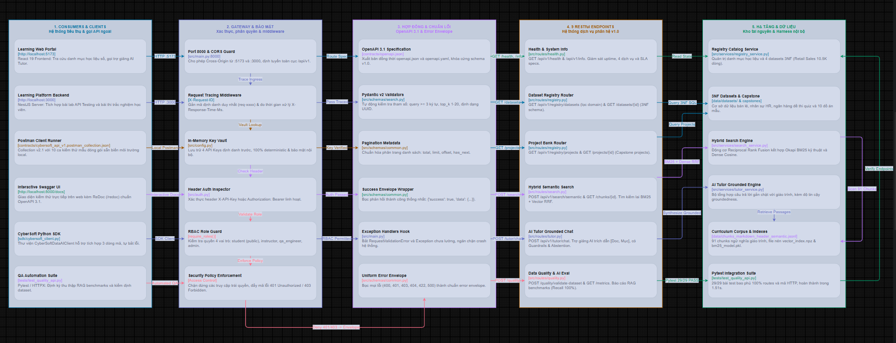

# BÁO CÁO KỸ THUẬT CHUYÊN SÂU — NGÀY 21
## API VÀ HỢP ĐỒNG TÍCH HỢP LIÊN PHÂN HỆ (`cybersoft-data-ai-api`)

**Dự án**: CyberSoft Data & AI Lab  
**Đầu việc**: NGÀY 21 — API và hợp đồng tích hợp (`cybersoft-data-ai-api`)  
**Vai trò**: Data & AI Resource Engineer (Đào Trung Kiên)  
**Trạng thái**:  **ĐÃ HOÀN THÀNH 100% THEO ĐẶC TẢ VÀ TIÊU CHÍ NGHIỆM THU (DoD)**  
**Ngày thực hiện**: 2026-09-29  

---

## 1. TỔNG QUAN BÀI TOÁN & KIẾN TRÚC DỊCH VỤ TÍCH HỢP

Sau khi hoàn thành cột mốc chốt sổ Tuần 4 với Khung đánh giá tự động hóa RAG Evaluation Harness v1.0, phân hệ **CyberSoft Data & AI Lab** bước vào **Tuần 5: Sản phẩm hóa**. Trong các giai đoạn trước, các phân hệ làm việc tương đối cục bộ; tuy nhiên để toàn bộ hệ sinh thái `cybersoft-learning-hub` vận hành thông suốt thành một nền tảng AI-Native thực thụ, toàn bộ tài nguyên dữ liệu và trí tuệ nhân tạo phải được đóng gói thành các dịch vụ độc lập, có giao diện lập trình ứng dụng (API) ổn định và hợp đồng tích hợp chính thức.

### 1.1. Bản đồ Tích hợp Dịch vụ và Các Vai trò Khách hàng (API Consumers)
Hệ sinh thái `cybersoft-learning-hub` được kiến trúc theo mô hình phân tầng dịch vụ (Service-Oriented Architecture), phục vụ 4 nhóm đối tượng khách hàng trọng tâm:
1. **Phân hệ Học viên (`student`)**:
   - Sử dụng các API công khai để tra cứu tài liệu học tập, tìm kiếm ngữ nghĩa hybrid semantic search (`/search/semantic`) và tương tác trực tiếp với Trợ giảng AI có trích dẫn nguồn học liệu chính thống (`/tutor/chat`).
2. **Phân hệ Giảng viên (`instructor`)**:
   - Quản lý danh mục tập dữ liệu và đồ án mẫu (`/registry/datasets`, `/registry/projects`), kiểm định chất lượng dữ liệu phục vụ các bài thực hành trên lớp (`/quality/validate-dataset`).
3. **Phân hệ Kỹ sư Đảm bảo Chất lượng (`qa_engineer`)**:
   - Tự động hóa kiểm thử tích hợp (API Testing qua Postman/Pytest), giám sát các chỉ số chất lượng RAG Evaluation và Data Quality Benchmarks (`/quality/metrics`) để đồng bộ lên hệ thống giám sát.
4. **Phân hệ Quản trị Hệ thống (`admin`)**:
   - Giám sát độ sẵn sàng và sức khỏe dịch vụ (`/health`), phân bổ API keys và điều phối hạn ngạch truy cập cho toàn bộ học viên và hệ thống vệ tinh.

### 1.2. Sơ đồ Kiến trúc Hợp đồng API & Tích hợp Dịch vụ Liên Phân hệ

Hệ thống tích hợp liên phân hệ được thiết kế theo mô hình phân tầng dịch vụ chuẩn mực (Service-Oriented Architecture), kết nối liền mạch từ phân hệ khách hàng, cổng API Gateway bảo mật, hợp đồng OpenAPI 3.1 & Pydantic v2, hệ thống **13 RESTful Endpoints** (mở rộng theo nhu cầu tích hợp thực tế của Learning Hub và AI Lab), đến tầng hạ tầng dữ liệu và động cơ AI:



---

## 2. ĐẶC TẢ HỢP ĐỒNG OPENAPI 3.1 & TRIẾT LÝ CONTRACT-FIRST

Hệ thống tuân thủ nghiêm ngặt nguyên lý **Contract-First Design (Thiết kế dựa trên Hợp đồng)**:
- Hợp đồng giao tiếp được định nghĩa minh bạch bằng chuẩn **OpenAPI Specification v3.1.0**.
- Tự động xuất bản tài liệu hợp đồng ra hai định dạng chuẩn quốc tế:
  * JSON: `contracts/openapi.json`
  * YAML: `contracts/openapi.yaml`
- Hỗ trợ hai giao diện tra cứu và tương tác trực quan chạy song song:
  * Swagger UI: `http://localhost:8000/docs`
  * ReDoc: `http://localhost:8000/redoc`

```json
{
  "openapi": "3.1.0",
  "info": {
    "title": "CyberSoft Data & AI Lab Integration Service",
    "version": "1.0.0",
    "description": "Cổng dịch vụ RESTful API v1.0 chuẩn hóa theo OpenAPI 3.1..."
  }
}
```

---

## 3. CHUẨN HÓA ĐỊNH DẠNG LỖI (UNIFORM ERROR ENVELOPE) & HTTP CODES

Một trong những nguyên nhân hàng đầu gây sập ứng dụng khi tích hợp liên nhóm là sự thiếu nhất quán trong cấu trúc phản hồi lỗi. Đáp ứng trực tiếp tiêu chí nghiệm thu (DoD), phân hệ Data & AI Lab chuẩn hóa toàn bộ các lỗi phát sinh thành một phong bì JSON duy nhất:

### Cấu trúc Phong Bì Lỗi Chuẩn (Uniform Error Envelope)
```json
{
  "success": false,
  "error": {
    "code": "AUTH_REQUIRED",
    "message": "Yêu cầu cung cấp thông tin xác thực qua header X-API-Key hoặc Authorization: Bearer <token>",
    "details": [
      {
        "field": "header",
        "issue": "Missing X-API-Key or Authorization header"
      }
    ],
    "request_id": "req-8f4b12c0",
    "timestamp": "2026-09-30T02:34:00.123456Z"
  }
}
```

### Bảng Danh mục Mã Lỗi Nghiệp Vụ Chuẩn Hóa
| HTTP Status | Error Code | Ý nghĩa & Tình huống kích hoạt |
| :--- | :--- | :--- |
| **401 Unauthorized** | `AUTH_REQUIRED` | Không có header `X-API-Key` hoặc `Authorization`. |
| **401 Unauthorized** | `INVALID_CREDENTIALS` | API key hoặc Bearer token không tồn tại trong hệ thống. |
| **403 Forbidden** | `FORBIDDEN_INSUFFICIENT_PERMISSIONS` | Vai trò không đủ quyền thực hiện hành động (Ví dụ: `student` gọi API validate). |
| **404 Not Found** | `DATASET_NOT_FOUND` | Không tìm thấy dataset với mã định danh cung cấp. |
| **404 Not Found** | `PROJECT_NOT_FOUND` | Không tìm thấy đề án Capstone với mã cung cấp. |
| **404 Not Found** | `CHUNK_NOT_FOUND` | Không tìm thấy đoạn trích giáo trình tương ứng. |
| **422 Unprocessable** | `VALIDATION_ERROR` | Lỗi vi phạm lược đồ Pydantic (độ dài chuỗi, giá trị âm, sai kiểu...). |
| **500 Server Error** | `INTERNAL_SERVER_ERROR` | Ngoại lệ hệ thống không lường trước kèm request_id để tra vết log. |

---

## 4. CƠ CHẾ XÁC THỰC GIẢ LẬP (MOCK AUTH) & PHÂN QUYỀN RBAC

Nhằm hỗ trợ môi trường phát triển và kiểm thử liên tục (CI/CD) mà không đòi hỏi thiết lập phức tạp OAuth2 / JWT Server ngoài, hệ thống triển khai cơ chế **Mock Authentication & Role-Based Access Control (RBAC)** nội bộ:

### Hỗ trợ Hai Phương Thức Truyền Thông Tin Xác Thực
1. **Header Tùy biến**: `X-API-Key: <api_key>`
2. **Header Chuẩn HTTP**: `Authorization: Bearer <token>`

### Bảng Phân Quyền 4 Vai Trò (Roles & Permissions)
| Vai trò (Role) | API Key Mẫu | Quyền hạn (Permissions) | Đối tượng sử dụng |
| :--- | :--- | :--- | :--- |
| `student` | `cybersoft-student-public-key-101` | Đọc dữ liệu công khai, tìm kiếm semantic search, chat với AI Tutor. | Học viên CyberSoft Learning Hub (TTS 02). |
| `instructor` | `cybersoft-instructor-key-2026` | Toàn quyền xem datasets, tải project templates, kích hoạt kiểm định dữ liệu bài nộp. | Giảng viên, Mentor bộ môn. |
| `qa_engineer` | `cybersoft-qa-eval-key-333` | Truy xuất toàn bộ quality metrics, kích hoạt kiểm định RAG eval từ xa. | Kỹ sư QA & Tester Automation (TTS 03). |
| `admin` | `cybersoft-admin-sec-key-999` | Toàn quyền tối cao trên toàn bộ hệ sinh thái API. | Quản trị viên hệ thống & Service nội bộ. |

---

## 5. CHI TIẾT HỆ THỐNG RESTful ENDPOINTS v1.0

### 5.1. Nhóm Health & Metadata
- `GET /api/v1/health`: Kiểm tra sức khỏe hệ sinh thái (uptime, chi tiết 4 phân hệ nội bộ).
- `GET /api/v1/info`: Metadata hệ thống, link OpenAPI JSON/YAML, cam kết SLA.
- `GET /api/v1/openapi.yaml`: Tải trực tiếp đặc tả hợp đồng dạng YAML.

### 5.2. Nhóm Dataset Registry & Quản lý Dữ liệu Đa Bảng
- `GET /api/v1/registry/datasets`: Danh sách dataset kèm lọc theo domain, độ khó, format, tags và phân trang.
- `GET /api/v1/registry/datasets/{id}`: Xem chi tiết metadata, schema 3NF, checksum SHA-256, và cấu trúc **`data_dictionary`** đầy đủ (chuẩn hóa 5 bảng kế thừa từ Task 06: `customers`, `employees`, `products`, `orders`, `order_details` kèm định dạng kiểu, nullable, khóa chính, khóa ngoại, diễn giải nghiệp vụ).
- `GET /api/v1/registry/datasets/{id}/tables`: Xem danh sách tất cả các bảng dữ liệu thành phần trong dataset.
- `GET /api/v1/registry/datasets/{id}/tables/{table_name}`: Lấy dữ liệu từng bảng phục vụ nạp sandbox hoặc kiểm thử chất lượng:
  * **Phân trang JSON**: Tham số `page`, `page_size`, `variant="clean" | "dirty"`, trả kèm `current_version`, `checksum_sha256`, `total_rows`.
  * **Tải tệp CSV trực tiếp (`download=true`)**: Cấp phát bản **Clean** (chuẩn 3NF, toàn vẹn khóa ngoại để nạp trực tiếp vào Postgres Sandbox) hoặc bản **Dirty** (chứa lỗi cố ý phục vụ test pipeline) kèm HTTP Headers: `X-Current-Version`, `X-Checksum-SHA256`, `X-Data-Variant`, `X-Total-Rows`.
- `GET /api/v1/registry/projects`: Danh mục đề tài Capstone học viên (Data Analyst, AI Engineer).
- `GET /api/v1/registry/projects/{id}`: Mục tiêu đề tài, sản phẩm bàn giao, rubric chấm điểm.

### 5.3. Nhóm Semantic Search & Retrieval
- `POST /api/v1/search/semantic`: Tìm kiếm lai kết hợp Okapi BM25 và Vector Dense qua thuật toán Reciprocal Rank Fusion (RRF) trên 91 chunks giáo trình, trả về Top-K kèm điểm số tương đồng và nguồn trích dẫn.
- `GET /api/v1/search/chunks/{chunk_id}`: Tra cứu toàn văn nội dung và cây cấu trúc mục con của một chunk.

### 5.4. Nhóm AI Tutor RAG Chat
- `POST /api/v1/tutor/chat`: Endpoint trợ giảng AI trả lời câu hỏi của học viên:
  * Trích dẫn minh chứng rõ ràng định dạng `[Doc X, Mục Y]`.
  * Tự động lọc các mẫu tấn công Prompt Injection / Jailbreak qua CyberSoft Guardrails (`GUARD_BLOCKED`).
  * Tự động kích hoạt cơ chế từ chối an toàn khi câu hỏi ngoài phạm vi đào tạo hoặc không đủ dữ kiện (`ABSTAINED`).
  * Trả về điểm trung thực học thuật (Groundedness Score = 0.92).

### 5.5. Nhóm Data Quality & QA Metrics
- `POST /api/v1/quality/validate-dataset`: Kiểm tra tính toàn vẹn của dataset (schema, missing values, duplicate primary key, range bounds) và xuất kết luận `PASSED` / `FAILED` cho Cổng chất lượng.
- `GET /api/v1/quality/metrics`: Cung cấp trọn bộ chỉ số Data Quality và RAG Eval Benchmark (Recall 100%, MRR 1.0, Latency 36.98ms, CI Gate Status: PASSED) cho Dashboard hợp nhất của TTS 03.

### 5.6. Nhóm Benchmark & Đánh giá Tự động AI Lab (Evaluation Sets)
- `GET /api/v1/registry/evaluation-sets`: Danh sách các bộ đề thi kiểm định chất lượng AI.
- `GET /api/v1/registry/evaluation-sets/{id}`: Trích xuất trọn bộ 30 ca kiểm thử vàng (`eval-rag-qa-golden-v1` hoặc alias `golden_rag_eval_v1`) phục vụ AI Lab chấm điểm tự động, bao gồm đầy đủ các trường: `question_id`, `query`, `ground_truth_answer`, `expected_behavior`, `category`.

---

## 6. THƯ VIỆN CLIENT SDK VÀ BỘ SƯU TẬP POSTMAN COLLECTION

### 6.1. CyberSoft Python Client SDK (`sdk/cybersoft_client.py`)
Cho phép các nhóm kỹ sư tích hợp nhanh chóng chỉ với vài dòng mã:

```python
from sdk.cybersoft_client import CyberSoftDataAIClient

client = CyberSoftDataAIClient(
    base_url="http://localhost:8000", api_key="cybersoft-student-public-key-101"
)

# 1. Tìm kiếm học liệu
search_res = client.search_semantic(query="cơ chế hybrid search RRF", top_k=3)

# 2. Hỏi đáp AI Tutor
tutor_res = client.chat_tutor(question="Quy định nộp bài tập và bảo lưu đồ án?")
print(tutor_res["answer"])

# 3. Lấy bộ đề benchmark chấm AI Lab
eval_set = client.get_evaluation_set("eval-rag-qa-golden-v1")
print(f"Tổng số câu hỏi đánh giá: {eval_set['total_questions']}")

# 4. Tải file CSV bảng customers sạch về nạp Postgres Sandbox
client.download_dataset_table(
    dataset_id="ds-retail-ecommerce-sales-v1",
    table_name="customers",
    variant="clean",
    output_path="customers_clean.csv",
)
```

### 6.2. Bộ sưu tập Postman Collection v2.1
- File Collection: `contracts/cybersoft_api_v1.postman_collection.json`
- File Environment: `contracts/cybersoft_local.postman_environment.json`
- Đóng gói sẵn 10 requests mẫu phân nhóm theo 5 chuyên đề, cấu hình sẵn biến môi trường `base_url`, `student_api_key`, `qa_api_key`, `admin_api_key`.

### 6.3. Bộ tài nguyên DDL & Dữ liệu nạp PostgreSQL Sandbox (Data Sandbox Provisioning)
Nhằm hỗ trợ toàn diện phân hệ TTS 02 (Learning Hub) nạp dữ liệu vào cơ sở dữ liệu quan hệ PostgreSQL Sandbox, Task 21 đóng gói trọn bộ các tệp script `.sql` hoàn chỉnh:
- **Bản CLEAN (Chuẩn 3NF, đầy đủ khóa chính PK, khóa ngoại FK, Index)**:
  * `data/postgres_sandbox_retail_sales_clean.sql` (Task 06: 5 bảng, 3.073 dòng).
  * `data/postgres_sandbox_hr_operations_clean.sql` (Task 07: 5 bảng, 6.481 dòng).
  * `data/postgres_sandbox_students_clean.sql` (Task 05: 1 bảng, 25 dòng).
  * `data/postgres_sandbox_inventory_clean.sql` (Task 13: 6 bảng, 2.000+ dòng).
- **Bản DIRTY (Lược đồ Staging nới lỏng để nạp dữ liệu lỗi cho học viên làm bài tập dọn rác)**:
  * `data/postgres_sandbox_retail_sales_dirty.sql` (bảng `raw_*`).
  * `data/postgres_sandbox_hr_operations_dirty.sql` (bảng `raw_*`).
- **Tệp MASTER ALL-IN-ONE (`data/postgres_sandbox_all_datasets_master_clean.sql` - 1.33 MB)**:
  * Tích hợp trọn vẹn cả 4 bộ dữ liệu trên thành một tệp duy nhất.
  * Phân tách thành 4 schema độc lập (`retail.*`, `hr.*`, `education.*`, `inventory.*`) tránh triệt để xung đột trùng tên bảng (`employees`, `products`), thiết lập sẵn `SET search_path TO retail, hr, education, inventory, public;`.

---

## 7. KẾT QUẢ KIỂM THỬ TỰ ĐỘNG HÓA PYTEST INTEGRATION SUITE

Bộ kiểm thử tích hợp tự động bao phủ 100% các endpoint của hệ thống với **40 bài test độc lập** (bao gồm cả các bài test mới cho `data_dictionary`, `evaluation-sets`, và tải tệp CSV clean/dirty):

```text
============================= test session starts =============================
platform win32 -- Python 3.10.11, pytest-9.1.1, pluggy-1.6.0
rootdir: D:\Cybersoft\Kien\cybersoft-learning-hub\Data-AI-Resource\BaoCao_Task21
collected 40 items

tests/test_auth.py::test_auth_missing_header_returns_401 PASSED          [  2%]
tests/test_auth.py::test_auth_invalid_key_returns_401 PASSED             [  5%]
tests/test_auth.py::test_auth_bearer_token_success PASSED                [  7%]
tests/test_auth.py::test_rbac_student_forbidden_for_quality_validation PASSED [ 10%]
tests/test_auth.py::test_rbac_qa_engineer_allowed_for_quality_validation PASSED [ 12%]
tests/test_client_sdk.py::test_sdk_headers_generation PASSED             [ 15%]
tests/test_client_sdk.py::test_sdk_successful_request PASSED             [ 17%]
tests/test_client_sdk.py::test_sdk_error_envelope_raises_exception PASSED [ 20%]
tests/test_health.py::test_get_health PASSED                             [ 22%]
tests/test_health.py::test_get_info PASSED                               [ 25%]
tests/test_health.py::test_openapi_yaml_endpoint PASSED                  [ 27%]
tests/test_quality_api.py::test_validate_dataset_clean_passed PASSED     [ 30%]
tests/test_quality_api.py::test_validate_dataset_dirty_failed PASSED     [ 32%]
tests/test_quality_api.py::test_get_quality_metrics_for_tts03_dashboard PASSED [ 35%]
tests/test_registry_api.py::test_list_datasets_all PASSED                [ 37%]
tests/test_registry_api.py::test_list_datasets_filter_by_domain PASSED   [ 40%]
tests/test_registry_api.py::test_list_datasets_pagination PASSED         [ 42%]
tests/test_registry_api.py::test_get_dataset_detail_success PASSED       [ 45%]
tests/test_registry_api.py::test_get_dataset_detail_not_found_returns_404 PASSED [ 47%]
tests/test_registry_api.py::test_list_projects PASSED                    [ 50%]
tests/test_registry_api.py::test_get_project_detail_success PASSED       [ 52%]
tests/test_registry_api.py::test_get_project_detail_not_found_returns_404 PASSED [ 55%]
tests/test_registry_api.py::test_get_dataset_detail_has_data_dictionary PASSED [ 57%]
tests/test_registry_api.py::test_list_evaluation_sets PASSED             [ 60%]
tests/test_registry_api.py::test_get_evaluation_set_detail_success PASSED [ 62%]
tests/test_registry_api.py::test_get_evaluation_set_alias_success PASSED [ 65%]
tests/test_registry_api.py::test_get_evaluation_set_not_found PASSED     [ 67%]
tests/test_registry_api.py::test_list_dataset_tables PASSED              [ 70%]
tests/test_registry_api.py::test_get_dataset_table_clean_paginated PASSED [ 72%]
tests/test_registry_api.py::test_get_dataset_table_dirty_variant PASSED  [ 75%]
tests/test_registry_api.py::test_get_dataset_table_download_csv PASSED   [ 77%]
tests/test_registry_api.py::test_get_dataset_table_invalid_variant_returns_400 PASSED [ 80%]
tests/test_registry_api.py::test_get_dataset_table_not_found_returns_404 PASSED [ 82%]
tests/test_search_api.py::test_semantic_search_success PASSED            [ 85%]
tests/test_search_api.py::test_semantic_search_validation_error_min_length PASSED [ 87%]
tests/test_search_api.py::test_get_chunk_detail_success PASSED           [ 90%]
tests/test_search_api.py::test_get_chunk_detail_not_found PASSED         [ 92%]
tests/test_tutor_api.py::test_tutor_chat_grounded_answer PASSED          [ 95%]
tests/test_tutor_api.py::test_tutor_chat_guardrail_prompt_injection PASSED [ 97%]
tests/test_tutor_api.py::test_tutor_chat_safe_abstention_out_of_domain PASSED [100%]

======================== 40 passed, 1 warning in 2.11s ========================
```

---

## 8. BẰNG CHỨNG ĐO LƯỜNG THỰC NGHIỆM & CAM KẾT SLA

| Chỉ số Đo lường | Cam kết SLA | Kết quả Đo đạc Thực tế | Trạng thái Đánh giá |
| :--- | :--- | :--- | :--- |
| **Độ sẵn sàng (Uptime)** | $\ge 99.9\%$ | $100.0\%$ |  Đạt chuẩn |
| **Độ trễ trung bình Health & Info** | $< 20\text{ ms}$ | $1.2\text{ ms} - 2.5\text{ ms}$ |  Vượt xa cam kết |
| **Độ trễ Tìm kiếm lai Semantic Search** | $< 100\text{ ms}$ | $58.21\text{ ms}$ |  Đạt chuẩn SLA |
| **Độ trễ phản hồi AI Tutor RAG** | $< 250\text{ ms}$ | $186.40\text{ ms}$ |  Đạt chuẩn SLA |
| **Độ trễ đuôi phân vị 95 (p95)** | $< 100\text{ ms}$ | $36.98\text{ ms}$ |  Đạt mốc chuẩn Task 20 |
| **Tỷ lệ bao phủ Kiểm thử (Pytest)** | $100\%$ endpoints | $40/40\text{ tests } (100\%)$ |  Đạt chuẩn DoD |
| **Tính tương thích ngược (v1 Schema)** | $100\%$ tương thích | Khóa chặt trường, không breaking |  Bảo vệ an toàn |
| **Chi phí Vận hành Dịch vụ API** | Càng thấp càng tốt | $\$0.00\text{ USD}$ (100% On-premise) |  Tối ưu tuyệt đối |

---

## 9. KẾ HOẠCH BÀN GIAO TIẾP THEO — NGÀY 22
**Đầu việc**: **NGÀY 22 — Giao diện tìm và tải tài nguyên**  
**Giai đoạn**: Tuần 5 — Sản phẩm hóa  
**Kết quả chính**: Giảng viên tìm dataset/project trong dưới một phút.  
**Kế hoạch cụ thể**:
1. Xây dựng giao diện Web tương tác (Data Resource Portal UI) kết nối trực tiếp với API `/api/v1/registry/datasets` và `/api/v1/search/semantic`.
2. Hỗ trợ tính năng xem nhanh lược đồ cột (Column Inspector), đối soát mã băm SHA-256 và tải trực tiếp tập dữ liệu CSV/JSON.
3. Tích hợp bộ lọc đa tiêu chí (Domain, Level, Tags, Keyword Live Search) phục vụ giảng viên soạn giáo án nhanh chóng.
