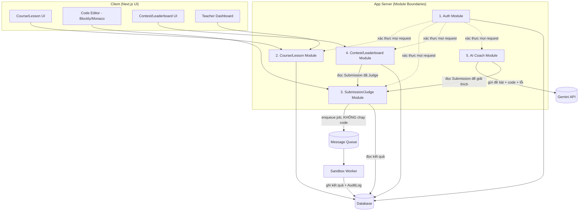

# API & Module Map - CyberSoft Learning & Contest Hub v1.0

**Người thực hiện:** Dương Chí Việt
**Ngày:** Ngày 02 - Tuần 1 (Nền móng sản phẩm)
**Liên quan:** [architecture.md](./architecture.md), [ADR-001](../adr/ADR-001-tech-stack-and-sandbox.md)

---

## 1. Ranh giới Module (Module Boundaries)

Hệ thống là Next.js Monolith nhưng được tổ chức thành 5 module nghiệp vụ tách biệt rõ ràng theo trách nhiệm (mỗi module có thư mục route/service riêng, không gọi chéo trực tiếp vào DB của module khác mà qua service layer):

### 1.1 Auth Module
- **Trách nhiệm:** Đăng ký/đăng nhập, quản lý session, phân quyền theo `role` (`KID`, `STUDENT`, `ADULT`, `TEACHER`, `ADMIN`).
- **Sở hữu dữ liệu:** bảng `User`, `Session`.
- **Không làm:** không chứa logic nghiệp vụ Course/Submission.

### 1.2 Course/Lesson Module
- **Trách nhiệm:** CRUD bài học, bài tập (`Problem`), nội dung theo lứa tuổi, quản lý tiến độ học (`Progress`).
- **Sở hữu dữ liệu:** bảng `Lesson`, `Problem`, `Progress`.
- **Phục vụ:** Teacher Dashboard (danh sách học viên + % hoàn thành).

### 1.3 Submission/Judge Module
- **Trách nhiệm:** Nhận bài nộp, validate, **đẩy job vào Message Queue** (không chạy code), đọc kết quả từ Worker để trả về Client.
- **Sở hữu dữ liệu:** bảng `Submission`.
- **Ranh giới cứng:** đây là module duy nhất được phép ghi vào Queue `submission.queue`; Sandbox Worker là tiến trình riêng biệt (xem [architecture.md](./architecture.md) mục 2-3), **không** nằm trong App Server process.

### 1.4 Contest/Leaderboard Module
- **Trách nhiệm:** Quản lý kỳ thi (thời gian bắt đầu/kết thúc), tính bảng xếp hạng dựa trên `Submission` đã judge.
- **Sở hữu dữ liệu:** bảng `Contest`, `ContestParticipant`, view/query tổng hợp `Leaderboard`.
- **Phụ thuộc:** đọc (read-only) dữ liệu từ Submission/Judge Module, không tự chấm bài.

### 1.5 AI Coach Module
- **Trách nhiệm:** Gọi Gemini API để giải thích lỗi, dựa trên đề bài + code + thông báo lỗi từ Submission Module. Giữ System Prompt ràng buộc "không sinh đáp án".
- **Sở hữu dữ liệu:** không sở hữu bảng riêng (MVP); chỉ đọc `Submission`, `Problem`.
- **Ranh giới:** không có quyền ghi/sửa `Submission` hay `Progress`.

---

## 2. Bảng API Endpoints cốt lõi cho MVP

| Method | Endpoint | Mô tả (Description) | Role Access |
| :--- | :--- | :--- | :--- |
| **Auth Module** | | | |
| POST | `/api/auth/register` | Đăng ký tài khoản mới (chọn role: Kid/Student/Adult) | Public |
| POST | `/api/auth/login` | Đăng nhập, trả JWT/session | Public |
| POST | `/api/auth/logout` | Đăng xuất, hủy session | Authenticated |
| GET | `/api/auth/me` | Lấy thông tin user hiện tại + role | Authenticated |
| **Course/Lesson Module** | | | |
| GET | `/api/lessons` | Danh sách bài học theo lứa tuổi/nhóm | Authenticated |
| GET | `/api/lessons/:id` | Chi tiết 1 bài học (video, nội dung) | Authenticated |
| GET | `/api/problems` | Danh sách bài tập (lọc theo tag, độ khó, ngôn ngữ) | Authenticated |
| GET | `/api/problems/:id` | Chi tiết đề bài + testcase mẫu (không lộ hidden testcase) | Authenticated |
| GET | `/api/progress/:userId` | Tiến độ học của 1 học viên | Owner hoặc Teacher |
| **Submission/Judge Module** | | | |
| POST | `/api/submissions` | Nộp bài: validate, ghi `PENDING`, đẩy job vào Queue | Student, Adult, Kid |
| GET | `/api/submissions/:id` | Lấy trạng thái/kết quả 1 submission | Owner hoặc Teacher |
| GET | `/api/submissions?userId=&problemId=` | Lịch sử nộp bài (phục vụ Teacher phát hiện học viên nộp sai nhiều lần) | Owner hoặc Teacher |
| **Contest/Leaderboard Module** | | | |
| GET | `/api/contests` | Danh sách kỳ thi đang diễn ra/sắp tới | Authenticated |
| GET | `/api/contests/:id` | Chi tiết kỳ thi (đề bài, thời gian) | Authenticated (đã tham gia) |
| POST | `/api/contests/:id/join` | Tham gia kỳ thi | Student, Adult, Kid |
| POST | `/api/contests/:id/submissions` | Nộp bài trong khuôn khổ contest (dùng chung Submission Module) | Contest Participant |
| GET | `/api/contests/:id/leaderboard` | Bảng xếp hạng real-time | Authenticated |
| **AI Coach Module** | | | |
| POST | `/api/ai-coach/explain` | Gửi `submissionId`, nhận giải thích lỗi bằng tiếng Việt | Owner (học viên của submission đó) |
| **Teacher Dashboard (đọc tổng hợp, dùng chung Course + Submission)** | | | |
| GET | `/api/teacher/students` | Danh sách học viên + % hoàn thành | Teacher |
| GET | `/api/teacher/struggling` | Danh sách học viên nộp sai > 3 lần cùng 1 bài | Teacher |
| **Audit (nội bộ, không public cho học viên)** | | | |
| GET | `/api/admin/audit-logs` | Truy vấn Audit Log theo user/action/thời gian | Admin, Teacher (giới hạn phạm vi lớp mình) |

---

## 3. Nguyên tắc phân quyền (Role Access)

| Role | Mô tả | Quyền đặc thù |
| :--- | :--- | :--- |
| `KID` | Học sinh K3-5 | Chỉ thấy bài học/bài tập được gán, không thấy Contest ICPC-style |
| `STUDENT` | Học sinh K6-12 | Truy cập Course + Submission + Contest theo lứa tuổi |
| `ADULT` | Người lớn Data/AI/Tester | Truy cập thêm SQL Lab, Capstone Projects |
| `TEACHER` | Giảng viên/Mentor | Đọc Progress + Submission của học viên thuộc lớp mình, xem Audit Log giới hạn |
| `ADMIN` | Quản trị hệ thống | Toàn quyền, xem toàn bộ Audit Log |

**Quy tắc chung:** mọi endpoint (trừ Public) đều đi qua Auth Module để xác thực + kiểm tra role trước khi vào logic nghiệp vụ của module tương ứng — tránh việc từng module tự viết logic auth riêng lẻ, thiếu nhất quán.

---

## 4. Ghi chú phạm vi MVP

Bảng endpoint trên là **tập lõi bắt buộc** cho 30 ngày. Các API mở rộng (ví dụ: `PATCH /api/submissions/:id/rejudge`, `GET /api/analytics/telemetry`, quản lý nhóm học tập theo lớp/câu lạc bộ, đồng bộ GitHub) thuộc phạm vi **Production Hardening** — xem bảng phân biệt MVP/Production trong [ADR-001](../adr/ADR-001-tech-stack-and-sandbox.md) mục 4.
