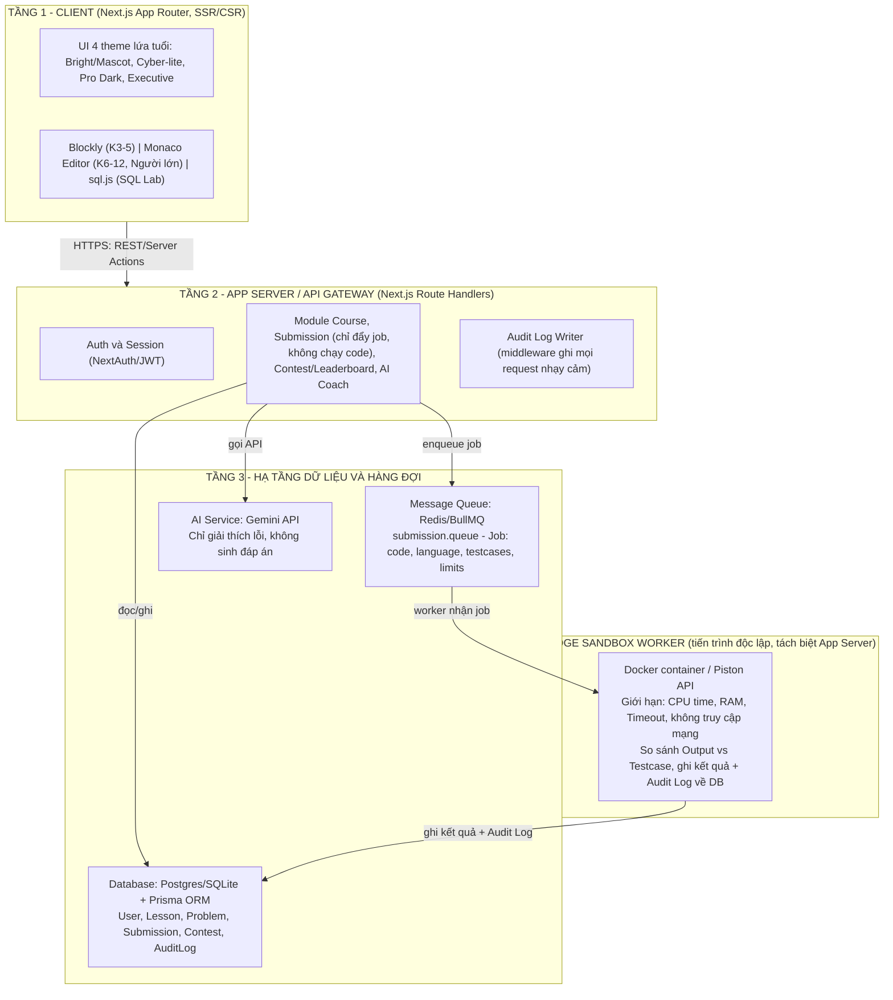
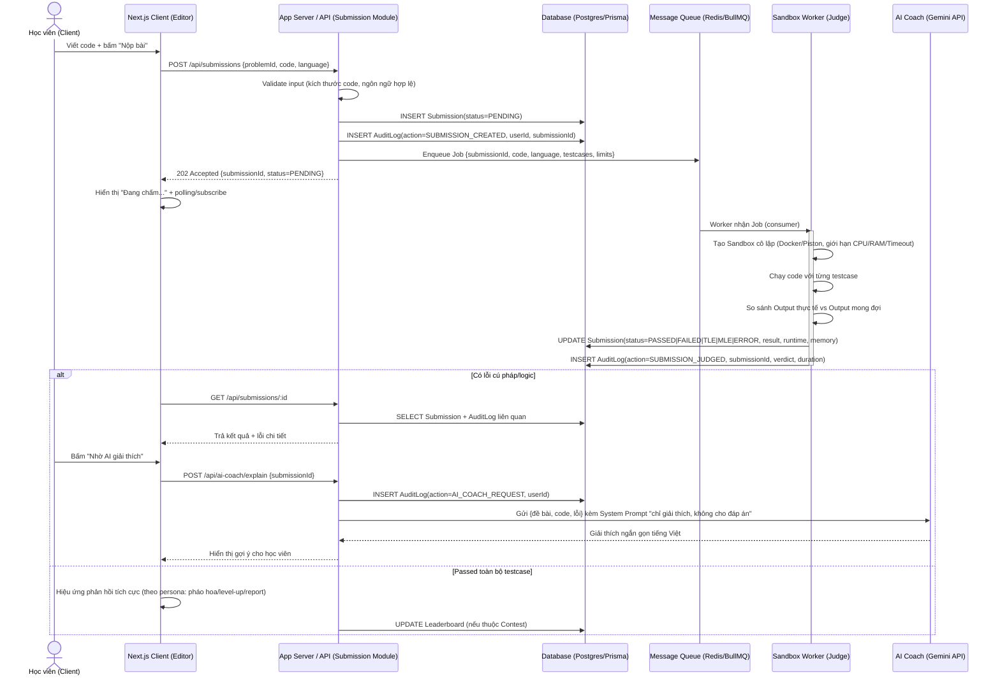

# Kiến Trúc Hệ Thống - CyberSoft Learning & Contest Hub v1.0

**Người thực hiện:** Dương Chí Việt
**Ngày:** Ngày 02 - Tuần 1 (Nền móng sản phẩm)
**Trạng thái:** Draft cho MVP 30 ngày
**Liên quan:** [Persona_cards.md](../../learning-hub/Persona_cards.md), [User_Journey_Map.md](../../learning-hub/User_Journey_Map.md), [mvp_backlog.md](../../learning-hub/mvp_backlog.md), [ADR-001](../adr/ADR-001-tech-stack-and-sandbox.md)

---

## 1. Mục tiêu kiến trúc

Kiến trúc phải phục vụ luồng 5 bước đã xác định ở Ngày 01: **Học bài → Luyện tập → Nộp bài → Phản hồi → Thi đấu**, cho 4 nhóm persona (K3-5, K6-9, K10-12, Người lớn Data/AI/Tester), đồng thời đáp ứng 2 ràng buộc bắt buộc:

1. **Không bao giờ chạy code người dùng trực tiếp trên App Server.** Mọi lượt nộp bài phải đi qua Message Queue rồi được xử lý bởi Sandbox Worker cô lập tài nguyên (CPU/RAM/Timeout).
2. **Mọi hành động quan trọng phải được ghi Audit Log** để phục vụ truy vết, debug và giám sát giảng viên (Time-to-Intervene < 30 phút theo mvp_backlog.md).

---

## 2. Kiến trúc phân tầng (Layered Architecture)



**Nguyên tắc phân tầng:**

- Client **không** bao giờ gọi thẳng Worker; mọi request đi qua App Server.
- App Server **không** import hay `exec()` code người dùng — trách nhiệm duy nhất của Submission module là validate input, ghi record `Submission(status=PENDING)`, đẩy job vào Queue, và trả `submissionId` cho Client để polling/subscribe kết quả.
- Sandbox Worker là tiến trình/service **độc lập**, có thể scale ngang riêng, không chia sẻ process với App Server.

---

## 3. Luồng dữ liệu chi tiết: Submission & Judge



**Điểm mấu chốt đảm bảo an toàn:**

- App Server **chỉ** ghi vào Queue, không có đường code path nào gọi `child_process.exec`, `eval`, hay tương tự trên request thread của App Server.
- Worker là nơi **duy nhất** thực thi code người dùng, chạy trong container/sandbox cô lập, không có quyền truy cập mạng ra ngoài, giới hạn CPU/RAM/Timeout nghiêm ngặt (chi tiết ở [ADR-001](../adr/ADR-001-tech-stack-and-sandbox.md)).
- Mỗi bước quan trọng (tạo submission, chấm xong, gọi AI) đều ghi Audit Log — phục vụ giảng viên phát hiện học viên bế tắc (pain point #10 trong mvp_backlog.md).

---

## 4. Thiết kế Audit Log System

### 4.1 Mục tiêu

- Truy vết **ai làm gì, khi nào, kết quả ra sao** — phục vụ bảo mật, debug, và Teacher Dashboard (danh sách học viên nộp sai >3 lần).
- Không chặn luồng chính (ghi log là side-effect, không rollback submission nếu ghi log lỗi — nhưng lỗi ghi log phải được log riêng ra console/error tracker).

### 4.2 Schema đề xuất (Prisma model)

```TypeScript
model AuditLog {
  id          String   @id @default(cuid())
  userId      String?
  action      String   // enum-like string: SUBMISSION_CREATED, SUBMISSION_JUDGED, AI_COACH_REQUEST, LOGIN, CONTEST_JOIN, ...
  entityType  String   // "Submission" | "Contest" | "User" | ...
  entityId    String?
  metadata    Json?    // dữ liệu bổ sung: verdict, duration, ip, language...
  createdAt   DateTime @default(now())

  @@index([userId])
  @@index([entityType, entityId])
  @@index([action, createdAt])
}
```

### 4.3 Các hành động bắt buộc ghi log (MVP)

| Hành động (`action`) | Khi nào ghi | Dùng để làm gì |
| :--- | :--- | :--- |
| `AUTH_LOGIN` / `AUTH_LOGIN_FAILED` | Đăng nhập thành công/thất bại | Bảo mật, phát hiện brute-force |
| `SUBMISSION_CREATED` | Học viên nộp bài | Đếm số lần nộp, phát hiện spam |
| `SUBMISSION_JUDGED` | Worker chấm xong | Verdict, runtime, memory — nguồn cho Teacher Dashboard |
| `AI_COACH_REQUEST` | Gọi AI giải thích lỗi | Theo dõi tần suất dùng AI, chi phí Gemini API |
| `CONTEST_JOIN` / `CONTEST_SUBMIT` | Tham gia/nộp bài trong contest | Chống gian lận, dựng lại timeline khi có khiếu nại |
| `ADMIN_ACTION` | Giảng viên sửa điểm, khóa tài khoản | Trách nhiệm giải trình (accountability) |

### 4.4 Nơi ghi log

- **App Server**: ghi log ở tầng API route/middleware (không phải ở Client) để đảm bảo không bị giả mạo.
- **Sandbox Worker**: ghi log kết quả chấm bài trực tiếp vào DB sau khi judge xong (worker có quyền ghi DB giới hạn — chỉ bảng `Submission` và `AuditLog`).
- MVP: log lưu thẳng vào bảng `AuditLog` trong cùng Postgres/SQLite. **Không** cần hệ thống log tập trung riêng (ELK/Datadog) ở giai đoạn 30 ngày — xem bảng phân biệt MVP/Production Hardening trong ADR-001.

---

## 5. Ánh xạ tầng kiến trúc với Persona (tham chiếu Ngày 01)

| Tầng | Thành phần đặc thù persona |
| :--- | :--- |
| Client | Blockly Workspace (K3-5) · Dual Editor Block-Python (K6-9) · Monaco 3 cột + Vim (K10-12) · Cloud Jupyter/SQL Playground (Người lớn) |
| App Server | Cùng 1 bộ API cho mọi persona, phân quyền theo `role` (Kid/Student/Adult/Teacher) |
| Sandbox Worker | Chạy Scratch export / Python / C++ / SQL tùy `language` trong Job — vẫn qua chung 1 cơ chế Queue + Sandbox |
| AI Service | System Prompt khác nhau theo `ageGroup` (giọng điệu phù hợp từng lứa tuổi) nhưng chung 1 nguyên tắc: không lộ đáp án |

---

## 6. Giới hạn phạm vi MVP (xem chi tiết trong ADR-001)

Kiến trúc này mô tả đúng mức cần thiết cho 30 ngày: **Next.js Monolith + 1 Queue + 1 loại Worker**. Các mở rộng như multi-region, autoscaling Worker, tách microservices theo module, hay hệ thống logging tập trung được để ở phần **Production Hardening**.
