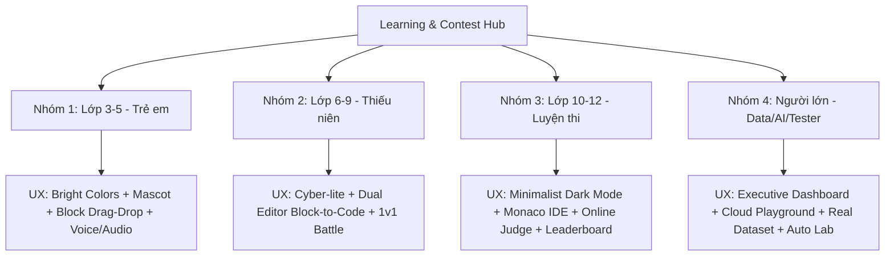

# 🎨 Persona Cards & UX Guidelines - Learning & Contest Hub

Tài liệu chuẩn hóa **4 Persona Cards** cho Nền tảng Học tập Lập trình & Thi đấu (**Learning & Contest Hub**), tích hợp trực tiếp khung **Đặc điểm cốt lõi** & **Nhu cầu trọng tâm** kết hợp với phân tích chi tiết (Mục tiêu, Hành vi, Điểm đau, Yêu cầu UX/UI) phù hợp từng lứa tuổi.

---

## 📌 Bảng Tổng Quan Khung Phân Nhóm Persona

| Tiêu chí | Nhóm 1: Lớp 3 - 5 (Trẻ em) | Nhóm 2: Lớp 6 - 9 (Thiếu niên) | Nhóm 3: Lớp 10 - 12 (Luyện thi) | Nhóm 4: Người lớn (Data/AI/Tester) |
| :--- | :--- | :--- | :--- | :--- |
| **Đặc điểm cốt lõi** | Tư duy trực quan, dễ nản, hạn chế gõ phím & đọc câu lệnh dài | Tư duy logic có cấu trúc, tiếp cận Python/Code cơ bản | Năng lực tự học cao, chịu áp lực thi cử, luyện thuật toán phức tạp | Học viên trưởng thành, mục tiêu nâng cao kỹ năng / chuyển nghề rõ ràng |
| **Nhu cầu trọng tâm** | Giao diện đơn giản, nhiều màu sắc, kéo thả khối lệnh, trắc nghiệm ngắn | Bài tập mô phỏng game, giải bài toán logic từng bước có gợi ý | Online Judge test ẩn khắt khe, Leaderboard real-time, bài tập phân tầng | Bài Lab thực chiến chuyên sâu, Dataset thực tế, chấm tự động & báo cáo tiến độ |
| **Tên Persona** | **Bé Bo** (8-10 tuổi) | **Minh Triết** (11-14 tuổi) | **Hoàng Nam** (15-18 tuổi) | **Chị Thảo** (22-35+ tuổi) |
| **Hình thức Code** | Block-based (Scratch/Blockly) | Hybrid (Block → Python/C++/Web) | Text-based (C++, Python, Java, Rust) | Real-world Text (SQL, Python Data, JS, AI Agent) |
| **Phong cách UX/UI** | Gamified, Bright, Mascot, Audio | Dynamic, Cyber-lite, Game-based, Arena | Professional Dark Mode, Minimalist, Data-dense | Executive, Corporate, Cloud Playground |

---

## 🪪 1. Persona Card: Học Sinh Lớp 3 – 5 (Trẻ Em)

```
+--------------------------------------------------------------------------+
|  NAME: Bé Bo (8-10 tuổi) - "Học Lập Trình Vui Như Chơi Game"             |
|  ROLE: Khám phá STEM / Scratch Creator                                   |
|  MOTTO: "Con muốn tự tạo ra game chú mèo chạy vượt rào cản!"             |
+--------------------------------------------------------------------------+
```

### 📌 Đặc điểm cốt lõi (Core Characteristics)
* **Tư duy trực quan:** Tiếp thu thông tin qua hình ảnh rực rỡ, âm thanh và chuyển động sống động thay vì chữ viết khô khan.
* **Dễ nản lòng:** Khả năng kiên nhẫn còn thấp, dễ bỏ cuộc nếu gặp trở ngại mà không có hỗ trợ ngay lập tức.
* **Hạn chế gõ phím & đọc hiểu:** Tốc độ gõ phím chậm, dễ gõ sai chính tả, khả năng đọc hiểu các đoạn câu lệnh dài hoặc từ vựng tiếng Anh hàn lâm còn chưa phát triển hoàn thiện.

### 💡 Nhu cầu trọng tâm (Key Needs)
* **Giao diện đơn giản & Nhiều màu sắc:** Thiết kế trực quan, bắt mắt, không làm rối mắt trẻ.
* **Ưu tiên Kéo - Thả khối lệnh (Block-based):** Thao tác chính dạng lắp ráp khối lệnh (Scratch/Blockly) hoặc trả lời câu hỏi trắc nghiệm ngắn gọn có hình ảnh minh họa.

### 🎯 1. Mục tiêu chi tiết (Detailed Goals)
* **Học qua chơi (Gamified Learning):** Tự tay sáng tạo các đoạn hoạt hình, bài hát hoặc trò chơi 2D đơn giản.
* **Phản hồi tức thì:** Thấy ngay kết quả nhân vật di chuyển hay phát âm thanh ngay khi bấm nút "Chạy thử".
* **Sưu tầm phần thưởng:** Thu thập Huy hiệu (Badges), điểm kinh nghiệm (XP), mở khóa trang phục cho Mascot đại diện.
* **Ghi nhận từ gia đình:** Được bố mẹ và thầy cô khen ngợi khi hoàn thành một "Nhiệm vụ" (Quest).

### 🧠 2. Hành vi (Behaviors)
* Sức tập trung ngắn (**15–25 phút/phiên học**).
* Thao tác bằng **Chạm / Kéo - Thả (Touch & Drag-and-Drop)** trên máy tính bảng (Tablet/iPad) hoặc chuột.
* Học theo sự hướng dẫn từng bước (Step-by-step) của Mascot hoạt hình hoặc có phụ huynh/thầy cô đồng hành.

### ⚠️ 3. Điểm đau cụ thể (Specific Pain Points)
* **Ngợp vì chữ (Text Overload):** Giao diện chứa quá nhiều menu chữ dài hoặc thông báo lỗi tiếng Anh phức tạp.
* **Sợ gõ sai cú pháp:** Dễ bực bội khi phải gõ bàn phím chính xác từng dấu chấm, dấu phẩy.
* **Giao diện nhàm chán:** Tông màu tối kiểu lập trình viên chuyên nghiệp gây cảm giác áp lực như bài tập về nhà.

### 🎨 4. Yêu cầu UX/UI Phù hợp Lứa tuổi (Age-Appropriate UX)
* **Visual Palette & Typography:** Sử dụng tone màu tươi sáng (Pastel/Vibrant: Vàng nắng, Xanh lá tươi, Cam), font chữ to tròn không chân dễ đọc (Nunito, Quicksand).
* **Mascot / Trợ lý Linh vật:** Tích hợp chú Linh vật hoạt hình xuất hiện hướng dẫn bằng giọng nói (Voice hint), phát hiệu ứng bắn pháo hoa (Confetti) và âm thanh vui nhộn khi làm đúng.
* **Block Editor chuẩn hóa:** Khối lệnh phân màu rõ ràng (Chuyển động = Xanh, Âm thanh = Tím, Vòng lặp = Cam), kích thước khối to dễ kéo thả trên thiết bị cảm ứng.
* **Parental Gateway / Portal:** Cổng thông tin riêng cho phụ huynh theo dõi tiến độ, thời gian học và quản lý an toàn (COPPA compliant).

---

## 🪪 2. Persona Card: Học Sinh Lớp 6 – 9 (Thiếu Niên)

```
+--------------------------------------------------------------------------+
|  NAME: Minh Triết (11-14 tuổi) - "Coder Nhí & Đội Tuyển Tin Trẻ"          |
|  ROLE: Chuyển giao Block -> Text & Thi đấu cấp Trường/Quận               |
|  MOTTO: "Em muốn vừa giải toán Tin vừa tạo server game cùng bạn!"        |
+--------------------------------------------------------------------------+
```

### 📌 Đặc điểm cốt lõi (Core Characteristics)
* **Tư duy logic có cấu trúc:** Bắt đầu hiểu các khái niệm biến (variables), điều kiện (if/else), vòng lặp (loops) và hàm (functions).
* **Tiếp cận ngôn ngữ lập trình cơ bản:** Bắt đầu bước ra khỏi lập trình khối để học ngôn ngữ lập trình thực tế (như Python, HTML/CSS/JS, C++ cơ bản).
* **Thích thể hiện & Tương tác bạn bè:** Có tinh thần hiếu thắng nhẹ nhàng, muốn khẳng định bản thân qua thứ hạng và sản phẩm game/web tự làm.

### 💡 Nhu cầu trọng tâm (Key Needs)
* **Bài tập mô phỏng game:** Học lập trình thông qua việc điều khiển nhân vật game, tạo hiệu ứng đồ họa hoặc làm minigame.
* **Giải toán logic từng bước:** Các bài tập phân rã từng bước nhỏ (Step-by-step logic) có hệ thống hướng dẫn gợi ý (Hints) rõ ràng khi bị kẹt.

### 🎯 1. Mục tiêu chi tiết (Detailed Goals)
* **Chuyển đổi kỹ năng:** Gõ được dòng code Python/C++ đầu tiên chạy thành công.
* **Chinh phục giải đấu:** Tham gia cuộc thi Tin học trẻ, Code Blitz, Đấu trường 1v1 cấp trường.
* **Khẳng định bản sắc:** Thể hiện thứ hạng (Rank Gold/Diamond), danh hiệu cá nhân, Avatar ngầu trên Bảng xếp hạng.
* **Sản phẩm thực tế:** Tự làm web cá nhân, game Pygame 2D hoặc Bot Discord.

### 🧠 2. Hành vi (Behaviors)
* Học theo dự án thú vị (**Project-based**) hoặc câu đố logic dạng Quiz Game.
* Thích thách đấu 1v1 real-time với bạn bè, tham gia CLB Lập trình trường.
* Học nhanh qua video ngắn, thử nghiệm sửa code có sẵn (Remix code).

### ⚠️ 3. Điểm đau cụ thể (Pain Points)
* **Sốc cú pháp (Syntax Error Shock):** Dễ ức chế khi gõ sai dấu chấm phẩy `;`, sai thụt lùi dòng `indentation` trong Python.
* **Thông báo lỗi Console khó hiểu:** Lỗi tiếng Anh hàn lâm (`IndexError`, `SyntaxError`) khiến em không biết debug từ đâu.
* **Thiếu lộ trình chuyển tiếp:** Hụt hẫng khi chuyển từ kéo-thả rực rỡ sang màn hình Terminal đen trắng khô khan.

### 🎨 4. Yêu cầu UX/UI Phù hợp Lứa tuổi (Age-Appropriate UX)
* **Dynamic Cyber-Lite Theme:** Thiết kế phong cách trẻ trung, hiện đại, phối màu Dark-mode kết hợp Neon (Xanh Cyan, Tím Electric).
* **Dual Editor (Hybrid Mode):** Màn hình chia đôi cho phép xem song song Khối lệnh và Dòng code Python/C++ tương ứng để hiểu quy đổi cú pháp.
* **Friendly AI Error Interpreter:** Trợ lý AI dịch thông báo lỗi sang tiếng Việt thân thiện (*"Bạn quên dấu hai chấm `:` ở cuối dòng 4 rồi kìa!"*).
* **Code Duel Arena & Clan System:** Chế độ đấu trường 1v1 trong 5-10 phút có thanh đếm ngược, thanh HP và hệ thống Bang hội học tập.

---

## 🪪 3. Persona Card: Học Sinh Lớp 10 – 12 (Thanh Thiếu Niên / Luyện Thi)

```
+--------------------------------------------------------------------------+
|  NAME: Hoàng Nam (15-18 tuổi) - "Thợ Cày Thuật Toán & Săn Học Bổng"       |
|  ROLE: Thi HSG Quốc Gia / ICPC High School / Pre-CS University           |
|  MOTTO: "Tối ưu độ phức tạp thuật toán O(N log N) là chân lý!"           |
+--------------------------------------------------------------------------+
```

### 📌 Đặc điểm cốt lõi (Core Characteristics)
* **Năng lực tự học cao:** Khả năng tự đọc tài liệu, tự debug và nghiên cứu cấu trúc dữ liệu & thuật toán phức tạp (C++, Python, Java).
* **Chịu áp lực thi cử:** Đang trong giai đoạn ôn thi HSG Tỉnh/Quốc gia, chuẩn bị xét tuyển Đại học CNTT hoặc săn học bổng du học.
* **Cần luyện tập & Cọ sát:** Cần bài tập thuật toán khó, thực tế và các kỳ thi đấu thời gian thực nghiêm ngặt để đánh giá đúng năng lực.

### 💡 Nhu cầu trọng tâm (Key Needs)
* **Online Judge với Test ẩn khắt khe:** Hệ thống chấm bài tự động kiểm tra nghiêm ngặt về thời gian chạy (Time Limit), bộ nhớ (Memory Limit) và các corner testcases ẩn.
* **Bảng xếp hạng (Leaderboard) thời gian thực:** Cập nhật thứ hạng contest theo thời gian thực (ACM/ICPC style).
* **Kho bài tập phân tầng độ khó:** Hệ thống bài tập dán tag thuật toán rõ ràng (DP, Graph, Greedy, Segment Tree...) phân cấp theo độ khó/Rating.

### 🎯 1. Mục tiêu chi tiết (Detailed Goals)
* **Tăng Elo/Rating:** Leo hạng trên Bảng xếp hạng tổng và các kỳ contest tuần/tháng.
* **Xây dựng Profile xét tuyển:** Tích lũy bằng chứng nhận, Portfolio code sạch để nộp đại học top đầu (Bách Khoa, KHTN, FPT...) hoặc du học.
* **Luyện đề thi chuẩn cấu trúc IOI/ICPC.**

### 🧠 2. Hành vi (Behaviors)
* Dành **2–4 tiếng/ngày** để "cày" thuật toán.
* Ưu tiên dùng phím tắt, thích màn hình chia nhỏ (Split view) để đọc đề bài, gõ code và testcase.
* Đọc kỹ Editorial (Lời giải mẫu), phân tích Time & Space Complexity \(O(N \log N)\).

### ⚠️ 3. Điểm đau cụ thể (Pain Points)
* **Online Judge chậm / Lag:** Hệ thống nghẽn mạng khi thi Contest đông người; báo lỗi WA/TLE mà không cung cấp thông tin phân tích chi tiết.
* **Phân loại bài tập thiếu chính xác:** Tag độ khó bị lệch so với thực tế.
* **Giao diện rườm rà:** Các chi tiết đồ họa màu mè làm xao nhãng không gian tư duy thuật toán.

### 🎨 4. Yêu cầu UX/UI Phù hợp Lứa tuổi (Age-Appropriate UX)
* **Minimalist Pro Dark Mode:** Thiết kế tối giản (Slate/Obsidian Dark Theme), thông tin cô đọng, tối ưu mật độ hiển thị code.
* **Pro IDE Workspace:** Màn hình chia 3 cột: Đề bài (Markdown + LaTeX) | Monaco Editor (VS Code core có Vim Mode) | Console Output & Custom Testcases.
* **Detailed Telemetry Graph:** Hiển thị biểu đồ thời gian/bộ nhớ chạy so với toàn bộ người dùng.
* **Contest Engine chuẩn Quốc tế:** Bảng xếp hạng ACM-style (Penalty time, First to Solve, Freeze Board 1 giờ cuối), tính năng Virtual Contest.
* **GitHub Sync & Public Profile:** Tự động lưu bài giải lên GitHub cá nhân và xuất File Certificate PDF xác thực.

---

## 🪪 4. Persona Card: Người Lớn / Chuyển Nghề (Data / AI / Tester)

```
+--------------------------------------------------------------------------+
|  NAME: Chị Thảo (22-35+ tuổi) - "Chuyển Ngành & Upskill Công Nghệ"        |
|  ROLE: Reskiller / Career Changer (Học SQL, Python Data, AI, Tester)     |
|  MOTTO: "Tôi cần học đúng cái doanh nghiệp tuyển dụng, làm được việc ngay!"|
+--------------------------------------------------------------------------+
```

### 📌 Đặc điểm cốt lõi (Core Characteristics)
* **Học viên trưởng thành:** Đã đi làm, có tư duy phản biện và kinh nghiệm làm việc thực tế trong các lĩnh vực khác.
* **Mục tiêu nghề nghiệp rõ ràng:** Học để chuyển đổi nghề nghiệp (Career Switch) sang Data Analyst, QA/QC Automation Tester, AI Prompt/Agent Dev, hoặc nâng cao kỹ năng (Upskill) để tăng thu nhập.
* **Quỹ thời gian hạn hẹp:** Vừa đi làm vừa học, áp lực công việc hiện tại và gia đình.

### 💡 Nhu cầu trọng tâm (Key Needs)
* **Bài Lab thực chiến chuyên sâu:** Bài tập mô phỏng đúng bài toán thực tế của doanh nghiệp (viết SQL truy vấn báo cáo, viết Test Script Automation với Selenium/Playwright, xây dựng AI Agent).
* **Tích hợp Dataset thực tế:** Làm việc trực tiếp với dữ liệu lớn, bảng CSDL thực tế thay vì các ví dụ toy dataset đơn giản.
* **Hệ thống đánh giá tự động & Báo cáo tiến độ chi tiết:** Tự động chấm điểm SQL/Code, nhận xét Code Review và bảng dashboard theo dõi tỷ lệ hoàn thành lộ trình.

### 🎯 1. Mục tiêu chi tiết (Detailed Goals)
* **Hoàn thành Capstone Projects:** Có 2-3 dự án thực tế chuẩn doanh nghiệp đưa vào CV ứng tuyển.
* **Tối ưu thời gian học:** Bỏ qua lý thuyết hàn lâm, học đúng công cụ doanh nghiệp đang tuyển dụng.
* **Nhận tư vấn & Review Code:** Được sự hỗ trợ nhận xét code từ Mentor/AI chuyên sâu.

### 🧠 2. Hành vi (Behaviors)
* Học tranh thủ **1–2 tiếng vào buổi tối** sau giờ làm hoặc cuối tuần.
* Coi trọng tính ứng dụng (*"Kiến thức này áp dụng vào công việc thực tế ra sao?"*).
* Ưu tiên thực hành ngay trên trình duyệt, ngại việc cài đặt môi trường phức tạp trên máy cá nhân.

### ⚠️ 3. Điểm đau cụ thể (Pain Points)
* **Cực kỳ ngại Setup Môi trường (Environment Setup Hell):** Dễ bỏ cuộc nếu gặp lỗi cài đặt Python, Anaconda, PostgreSQL, Docker hay biến môi trường.
* **Dễ bị đứt gãy tiến độ:** Thiếu thời gian khiến tiến độ học không liên tục.
* **Tự ti background:** Sợ lớn tuổi hoặc không có bằng IT thì không cạnh tranh nổi.

### 🎨 4. Yêu cầu UX/UI Phù hợp Lứa tuổi (Age-Appropriate UX)
* **Executive & Professional Dashboard:** Giao diện doanh nghiệp hiện đại, tinh gọn (Navy/Sleek Gray Theme) giống Coursera / Datacamp.
* **Zero-Setup Cloud Playground:** Tích hợp sẵn Jupyter Notebook, SQL Query Editor, API Testing Console trực tiếp trên trình duyệt — bấm nút "Start Lab" là môi trường sẵn sàng trong 3 giây.
* **Micro-Learning & Modular Progress:** Bài học chia nhỏ 10–15 phút kèm tính năng Auto-save để học viên bận rộn dễ dàng học ngắt quãng.
* **AI Senior Mentor 24/7:** Trợ lý AI đóng vai Senior Engineer / Data Architect review code theo chuẩn Clean Code / ISTQB Standard.
* **Career Hub & Project Showcase:** Trang trưng bày đồ án cá nhân để chia sẻ link cho nhà tuyển dụng và Widget gợi ý việc làm.

---

## 🛠️ Tóm Tắt Khung Xác Thực Thiết Kế Hệ Thống (UX Authentication Matrix)


