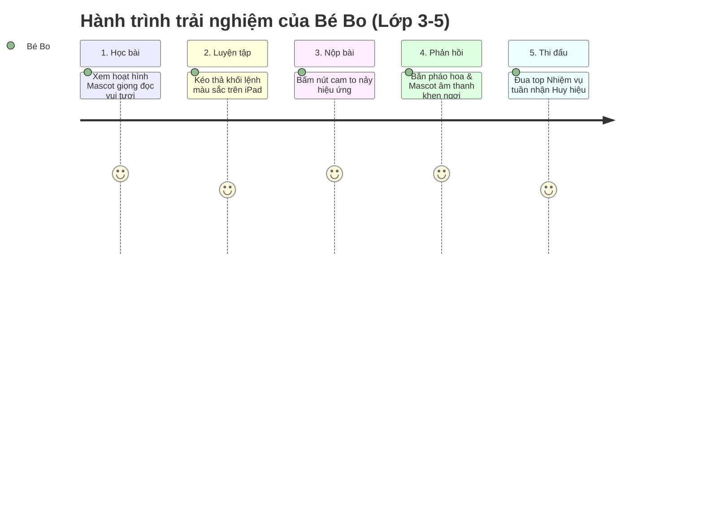
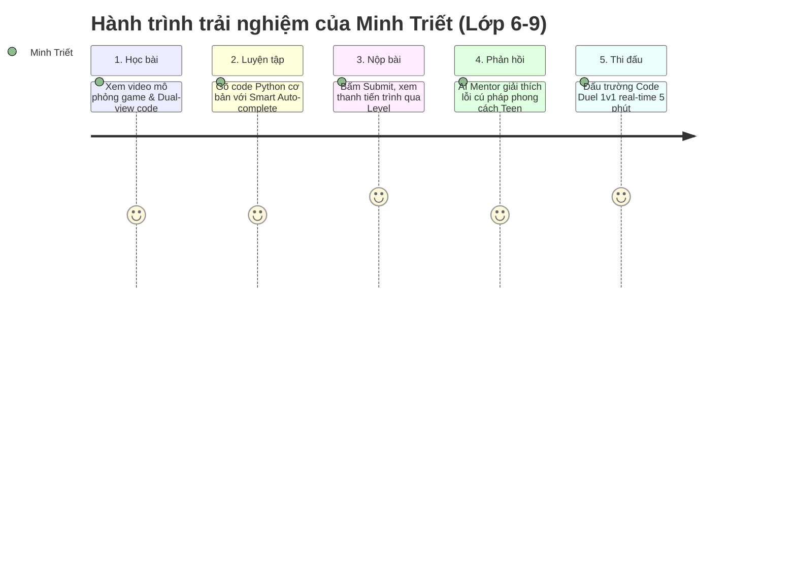
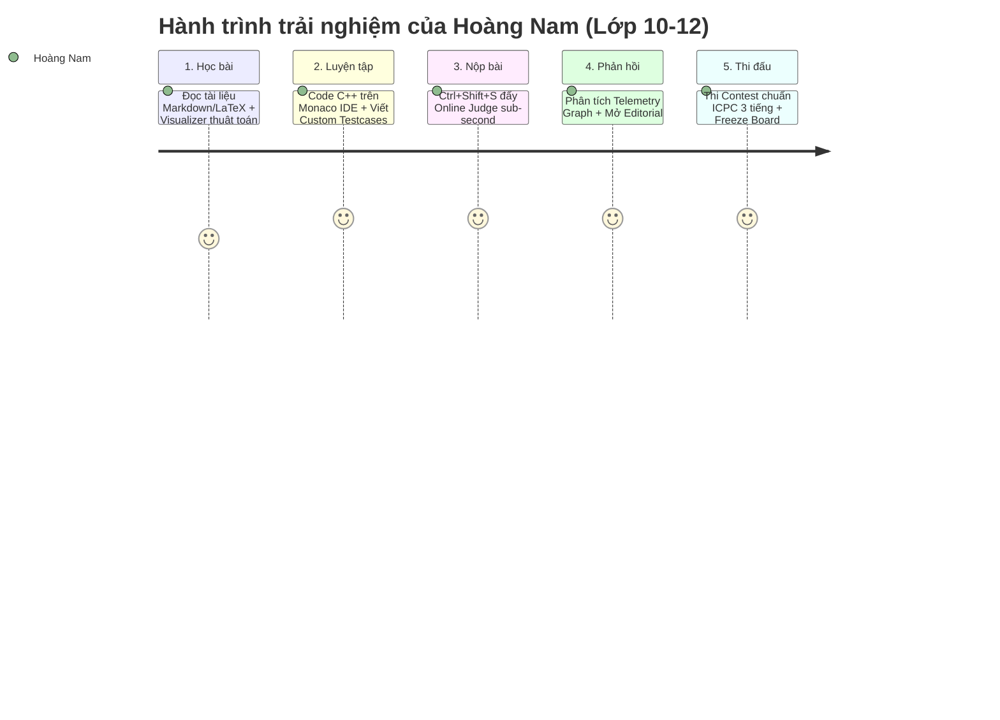
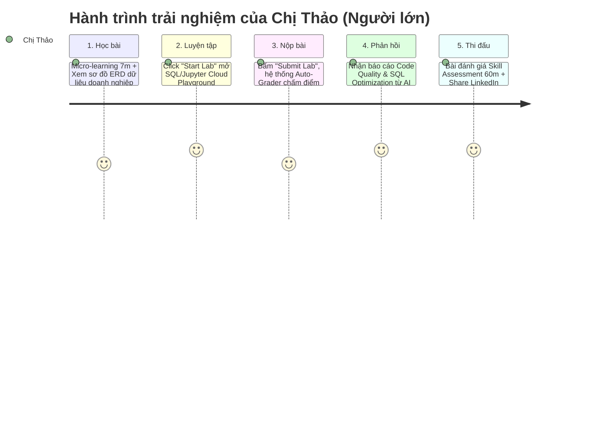
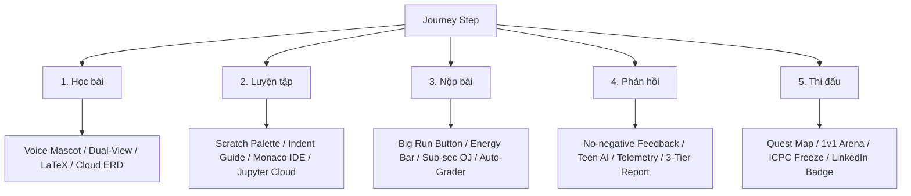

# 🗺️ Detailed User Journey Map - Learning & Contest Hub

Bản sơ đồ hành trình người dùng (**User Journey Map**) chi tiết cho 4 nhóm đối tượng trên nền tảng **Learning & Contest Hub**, xuyên suốt **5 bước hành trình**: **Học bài ➔ Luyện tập ➔ Nộp bài ➔ Phản hồi ➔ Thi đấu**.

---

## 📌 Bảng Tổng Quan Hành Trình (Journey Matrix Overview)

| Bước Hành Trình | Nhóm 1: Lớp 3-5 (Trẻ em) | Nhóm 2: Lớp 6-9 (Thiếu niên) | Nhóm 3: Lớp 10-12 (Luyện thi) | Nhóm 4: Người lớn (Data/AI/Tester) |
| :--- | :--- | :--- | :--- | :--- |
| **1. Học bài** | Xem video hoạt họa ngắn 3m + Mascot đọc audio. | Xem video 5m mô phỏng logic game + Dual-view code. | Đọc tài liệu Markdown + LaTeX + Sơ đồ thuật toán visualizer. | Micro-learning 7m + Case study doanh nghiệp + ERD Schema. |
| **2. Luyện tập** | Kéo thả khối Scratch / Trắc nghiệm hình ảnh to. | Code Python/C++ cơ bản + Gợi ý từng bước (Hints). | Monaco IDE (Vim mode) + C++ thuật toán + Custom Testcases. | Cloud Playground (SQL / Jupyter) khởi động < 3s, real dataset. |
| **3. Nộp bài** | Bấm nút cam to tròn "Thả Rồng Bo / Chạy Lệnh". | Bấm "Submit", xem thanh tiến trình vượt level game. | Ctrl+Shift+S đẩy Online Judge sub-second chấm bài. | Bấm "Submit Lab / Run Auto-Grader" chấm điểm tự động. |
| **4. Phản hồi** | Bắn pháo hoa + Mascot âm thanh khen tích cực. | AI Mentor dịch lỗi tiếng Anh sang câu tuổi teen. | Biểu đồ Time/Memory Telemetry + Unlock Editorial. | Báo cáo 3 tiêu chí (Logic, Efficiency, Clean Code) từ AI. |
| **5. Thi đấu** | "Nhiệm vụ tuần" 15m + Bảng nhận huy hiệu vui vẻ. | Code Duel 1v1 (5m) + Đua top Bang hội trường. | Contest ICPC/IOI (2-3h) + Freeze Board 1h cuối. | Skill Assessment Exam (60-90m) + Share LinkedIn Badge. |

---

## 🪪 1. Hành Trình Nhóm 1: Học Sinh Lớp 3 – 5 (Trẻ Em)
> **Persona đại diện:** Bé Bo (8-10 tuổi) | **Định vị:** Scratch & Visual Explorer  
> **Mục tiêu chính:** Học qua chơi, nhận phản hồi tức thì, không bị áp lực gõ phím hay lỗi cú pháp.

### 📍 Chi Tiết 5 Bước Hành Trình:

#### 1️⃣ Bước 1: Học bài (Lesson Onboarding)
* **Hành động (Actions):** Bấm phát video hoạt hình 3 phút, nghe Mascot chú Rồng Bo đọc hướng dẫn bằng giọng nói thân thiện.
* **Cảm xúc & Suy nghĩ (Feelings & Thoughts):** Hào hứng, tò mò. *"Oa! Rồng Bo biết nói kìa, để xem chú làm cách nào nhảy qua chướng ngại vật!"*
* **Điểm chạm (Touchpoints):** Card bài học dạng hoạt hình, Nút Audio Play to tròn, Mascot tương tác 2D.
* **Yêu cầu UX/UI & Giải pháp:**
  * Auto-play video ngắn 720p/1080p có phụ đề chữ to.
  * Tích hợp Voice-over (Giọng đọc trí tuệ nhân tạo truyền cảm phù hợp trẻ em).
  * Ẩn hoàn toàn các thanh menu điều hướng phức tạp.

#### 2️⃣ Bước 2: Luyện tập (Practice & Hands-on)
* **Hành động (Actions):** Kéo các khối lệnh Scratch màu sắc (Xanh = Chuyển động, Tím = Âm thanh) thả vào khung lắp ráp trên iPad hoặc máy tính.
* **Cảm xúc & Suy nghĩ (Feelings & Thoughts):** Tập trung vui vẻ, đôi khi lúng túng khi kéo nhầm khối. *"Khối màu cam này ghép vào đâu nhỉ?"*
* **Điểm chạm (Touchpoints):** Workspace Scratch/Blockly, Khung chứa khối lệnh (Palette), Nút nghe lại gợi ý giọng nói.
* **Yêu cầu UX/UI & Giải pháp:**
  * Kích thước khối lệnh to (Minimum touch target 48x48px) dễ thao tác cảm ứng.
  * Âm thanh "click/snap" vui tai khi 2 khối lệnh khớp vào nhau.
  * Gợi ý dạng mũi tên nhấp nháy chỉ vị trí ghép khối khi trẻ dừng thao tác > 15 giây.

#### 3️⃣ Bước 3: Nộp bài (Submission)
* **Hành động (Actions):** Bấm vào nút "Thả Rồng Bo!" màu cam rực rỡ có hình chân rồng.
* **Cảm xúc & Suy nghĩ (Feelings & Thoughts):** Hồi hộp, mong chờ nhân vật chạy. *"Chạy thử xem Rồng Bo có ăn được quả táo không!"*
* **Điểm chạm (Touchpoints):** Nút Run/Submit dạng Floating Action Button to nổi bật, Mascot giơ tay cổ vũ.
* **Yêu cầu UX/UI & Giải pháp:**
  * Hiệu ứng nảy nút (Pulse animation) thu hút ánh nhìn.
  * Tốc độ phản hồi tức thì (Zero-latency preview) trên màn hình Canvas 2D.

#### 4️⃣ Bước 4: Phản hồi (Feedback & Debugging)
* **Hành động (Actions):** Nhìn thấy nhân vật chạy thành công, hiệu ứng pháo hoa rực rỡ xuất hiện kèm âm thanh "Keng keng!" ăn sao. Nếu sai, Mascot hiện ra nhắc nhở nhẹ nhàng.
* **Cảm xúc & Suy nghĩ (Feelings & Thoughts):** Vui sướng tột độ khi thắng. Nếu sai thì không cảm thấy bị phạt hay sợ hãi. *"Ye! Được 3 sao rồi! Thử lại lần nữa nào!"*
* **Điểm chạm (Touchpoints):** Confetti animation, Modal nhận Sao/Huy hiệu, Mascot Voice Hint.
* **Yêu cầu UX/UI & Giải pháp:**
  * **Loại bỏ từ ngữ tiêu cực:** Thay câu *"Thất bại/Lỗi"* bằng *"Oops! Rồng Bo chưa nhảy tới nơi, bé đổi khối lệnh nhé!"*.
  * Tặng thưởng sao (Stars) và huy hiệu tích lũy ngay sau mỗi bài tập.

#### 5️⃣ Bước 5: Thi đấu (Contest / Assessment)
* **Hành động (Actions):** Tham gia "Nhiệm Vụ Tuần" 15 phút, hoàn thành 3 thử thách trắc nghiệm hình ảnh & kéo thả khối.
* **Cảm xúc & Suy nghĩ (Feelings & Thoughts):** Thích thú như chơi sự kiện tuần trong game. *"Sắp sưu tầm đủ bộ trang phục Rồng Bo rồi!"*
* **Điểm chạm (Touchpoints):** Bản đồ nhiệm vụ (Quest Map), Bảng nhận danh hiệu vui vẻ, Thẻ Certificate in hình bé.
* **Yêu cầu UX/UI & Giải pháp:**
  * Bảng xếp hạng không gây áp lực: Tất cả học sinh hoàn thành đều nằm trong "Bảng Vàng Dũng Sĩ".
  * Nhạc nền nhẹ nhàng, tươi vui (Upbeat background music) có thể bật/tắt.

---

## 🪪 2. Hành Trình Nhóm 2: Học Sinh Lớp 6 – 9 (Thiếu Niên)
> **Persona đại diện:** Minh Triết (11-14 tuổi) | **Định vị:** Hybrid Learner & Game Creator  
> **Mục tiêu chính:** Chuyển giao từ Scratch sang Python/C++, thi đấu 1v1, tự tạo minigame.

### 📍 Chi Tiết 5 Bước Hành Trình:

#### 1️⃣ Bước 1: Học bài (Lesson Onboarding)
* **Hành động (Actions):** Xem video 5 phút hướng dẫn cách viết hàm Python điều khiển nhân vật game, bật chế độ "Dual-View" xem song song Khối lệnh và Code chữ.
* **Cảm xúc & Suy nghĩ (Feelings & Thoughts):** Tò mò, hào hứng. *"À! Thì ra lệnh `for i in range(5):` trong Python chính là khối lặp 5 lần bên Scratch!"*
* **Điểm chạm (Touchpoints):** Interactive Video Player, Nút chuyển đổi Dual-View (Block ↔ Python), Thẻ tóm tắt cú pháp.
* **Yêu cầu UX/UI & Giải pháp:**
  * Giao diện phong cách **Dynamic Cyber-Lite** (Tone tối phối màu Neon Cyan/Purple).
  * Tính năng **Code Mapper**: Di chuột vào khối Scratch sẽ highlight đoạn code Python tương ứng.

#### 2️⃣ Bước 2: Luyện tập (Practice & Hands-on)
* **Hành động (Actions):** Gõ những dòng code Python đầu tiên trên Web IDE nhẹ, sử dụng gợi ý code thông minh (Auto-complete) để tránh gõ sai chính tả.
* **Cảm xúc & Suy nghĩ (Feelings & Thoughts):** Hơi lo lắng sợ gõ sai cú pháp, nhưng thích cảm giác được "code như người lớn".
* **Điểm chạm (Touchpoints):** Web Code Editor, Nút "Gợi ý / Hint", Indicator kiểm tra thụt lùi dòng (Indentation Guide).
* **Yêu cầu UX/UI & Giải pháp:**
  * Hiển thị đường dóng thụt dòng (Indentation guide lines) rõ ràng cho Python.
  * Nút "Gợi ý" phân tầng (Gợi ý 1: Ý tưởng -> Gợi ý 2: Code mẫu dở dang).

#### 3️⃣ Bước 3: Nộp bài (Submission)
* **Hành động (Actions):** Nhấn nút "Nộp Bài" màu xanh Neon, nhìn thanh năng lượng chạy kiểm tra từng màn chơi mô phỏng.
* **Cảm xúc & Suy nghĩ (Feelings & Thoughts):** Hào hứng như nhấn nút trong game. *"Xem robot có vượt qua được 5 level không nào!"*
* **Điểm chạm (Touchpoints):** Submit Button, Animated Progress Bar (5/5 Màn chơi), Level Passed Effect.
* **Yêu cầu UX/UI & Giải pháp:**
  * Thanh tiến trình hiển thị kết quả trực quan (e.g. Test 1: Passed ➔ Test 2: Passed).
  * Hiệu ứng âm thanh tăng cấp (Level up SFX).

#### 4️⃣ Bước 4: Phản hồi (Feedback & Debugging)
* **Hành động (Actions):** Nếu bài bị lỗi cú pháp, cửa sổ AI Mentor hiện ra dịch câu lỗi tiếng Anh sang gợi ý tiếng Việt dễ hiểu.
* **Cảm xúc & Suy nghĩ (Feelings & Thoughts):** Nhẹ nhõm vì biết lý do sai. *"À, mình quên dấu hai chấm ở cuối dòng `if`!"*
* **Điểm chạm (Touchpoints):** AI Friendly Error Popup, Line Error Highlight, EXP Gain Notification.
* **Yêu cầu UX/UI & Giải pháp:**
  * AI highlight chính xác dòng bị lỗi với dấu gợn sóng màu đỏ.
  * Giải thích lỗi bằng thuật ngữ đơn giản kèm nút "Tự động sửa cú pháp (Auto-fix syntax)" để xem tham khảo.

#### 5️⃣ Bước 5: Thi đấu (Contest / Assessment)
* **Hành động (Actions):** Tham gia Đấu trường "Code Duel 1v1" ghép đối thủ ngẫu nhiên, giải bài toán logic trong 5 phút.
* **Cảm xúc & Suy nghĩ (Feelings & Thoughts):** Kịch tính, tập trung cao độ, tự hào khi thắng đối thủ để thăng hạng Gold Rank.
* **Điểm chạm (Touchpoints):** 1v1 Arena Matching Screen, Đồng hồ đếm ngược rực rỡ, Leaderboard Bang hội trường.
* **Yêu cầu UX/UI & Giải pháp:**
  * Đồng hồ đếm ngược có hiệu ứng đổi màu (Xanh ➔ Vàng ➔ Đỏ khi còn 1 phút).
  * Bảng xếp hạng real-time có hiệu ứng hoạt họa khi người chơi vượt mặt đối thủ trên Rank.

---

## 🪪 3. Hành Trình Nhóm 3: Học Sinh Lớp 10 – 12 (Thanh Thiếu Niên / Luyện Thi)
> **Persona đại diện:** Hoàng Nam (15-18 tuổi) | **Định vị:** Algorithmic Contestant & High School Olympiad  
> **Mục tiêu chính:** Luyện thuật toán nâng cao (C++/Python), cày Elo Rating, săn giải HSG & xây dựng hồ sơ Đại học.

### 📍 Chi Tiết 5 Bước Hành Trình:

#### 1️⃣ Bước 1: Học bài (Lesson Onboarding)
* **Hành động (Actions):** Đọc bài giảng Markdown tích hợp công thức LaTeX, mở sơ đồ tương tác Algorithm Visualizer để xem mô phỏng từng bước chạy của thuật toán Quy hoạch động / Đồ thị.
* **Cảm xúc & Suy nghĩ (Feelings & Thoughts):** Tập trung sâu, khắt đòi hỏi sự chính xác. *"Cần hiểu rõ cách chuyển trạng thái DP này trước khi bắt đầu code."*
* **Điểm chạm (Touchpoints):** Markdown/LaTeX Document Reader, Data Structure Visualizer, Downloadable Code Snippets.
* **Yêu cầu UX/UI & Giải pháp:**
  * Giao diện **Minimalist Pro Dark Mode** (Tone xám đen Obsidian tối giản).
  * Công cụ mô phỏng thuật toán (Visualizer) cho phép Step-forward / Step-backward dòng code.

#### 2️⃣ Bước 2: Luyện tập (Practice & Hands-on)
* **Hành động (Actions):** Mở Monaco Editor (nhân VS Code), bật chế độ phím tắt Vim, gõ code C++20 và tự thêm các Corner Testcase vào tab Custom Test.
* **Cảm xúc & Suy nghĩ (Feelings & Thoughts):** Thách thức tư duy, tính toán kĩ bộ nhớ \(O(N)\) và thời gian \(O(N \log N)\).
* **Điểm chạm (Touchpoints):** Monaco Editor, Vim Keybindings Toggle, Custom Testcase Panel, Complexity Estimator.
* **Yêu cầu UX/UI & Giải pháp:**
  * Layout 3 cột linh hoạt: Đề bài (Left) | Editor (Right-Top) | Testcases & Console (Right-Bottom).
  * Hỗ trợ phím tắt compile/run siêu nhanh (`Ctrl + Enter`).

#### 3️⃣ Bước 3: Nộp bài (Submission)
* **Hành động (Actions):** Nhấn `Ctrl + Shift + S` đẩy code lên hệ thống Online Judge chấm bài tự động.
* **Cảm xúc & Suy nghĩ (Feelings & Thoughts):** Hồi hộp theo dõi danh sách testcase xem có bị TLE (Time Limit Exceeded) hay WA (Wrong Answer) không.
* **Điểm chạm (Touchpoints):** Sub-second Online Judge Status Modal, Real-time Test Matrix Indicator.
* **Yêu cầu UX/UI & Giải pháp:**
  * Tốc độ trả kết quả chấm bài dưới 1 giây.
  * Hiển thị mã màu trạng thái trực quan: Green (AC), Red (WA), Yellow (TLE), Purple (MLE).

#### 4️⃣ Bước 4: Phản hồi (Feedback & Debugging)
* **Hành động (Actions):** Xem biểu đồ phân bố Thời gian chạy & Bộ nhớ (Telemetry Graph) so với toàn bộ cộng đồng. Nếu bí, dùng điểm thưởng để mở bài viết Editorial.
* **Cảm xúc & Suy nghĩ (Feelings & Thoughts):** Thỏa mãn khi AC 100%. Tò mò phân tích code của những người giải nhanh nhất.
* **Điểm chạm (Touchpoints):** Time/Memory Telemetry Distribution Chart, Official Editorial Section, Discussion Forum.
* **Yêu cầu UX/UI & Giải pháp:**
  * Biểu đồ Telemetry so sánh hiệu năng code cá nhân với cộng đồng.
  * Tích hợp khung thảo luận Markdown có hỗ trợ chèn code block và công thức toán.

#### 5️⃣ Bước 5: Thi đấu (Contest / Assessment)
* **Hành động (Actions):** Tham gia Kỳ thi thử chuẩn ICPC/IOI kéo dài 2-3 tiếng, theo dõi bảng xếp hạng real-time bị đóng băng (Freeze Board) ở 1 giờ cuối.
* **Cảm xúc & Suy nghĩ (Feelings & Thoughts):** Căng thẳng, áp lực thời gian, trải nghiệm môi trường thi đấu chuyên nghiệp như thật.
* **Điểm chạm (Touchpoints):** ICPC Live Leaderboard (Freeze Board Mode), Virtual Contest Engine, Verified Certificate PDF Generator.
* **Yêu cầu UX/UI & Giải pháp:**
  * Chế độ khóa màn hình tập trung (Focus Mode / Fullscreen mode).
  * Tự động tạo File Certificate PDF chuẩn quốc tế có mã QR xác nhận thứ hạng để đưa vào Hồ sơ Đại học.

---

## 🪪 4. Hành Trình Nhóm 4: Người Lớn Học Data / AI / Tester
> **Persona đại diện:** Chị Thảo (22-35+ tuổi) | **Định vị:** Reskiller / Practical Professional  
> **Mục tiêu chính:** Chuyển nghề Data/AI/Tester, thực hành với Dataset thực tế, tối ưu thời gian học ngắt quãng.

### 📍 Chi Tiết 5 Bước Hành Trình:

#### 1️⃣ Bước 1: Học bài (Lesson Onboarding)
* **Hành động (Actions):** Tranh thủ 15 phút buổi tối xem bài học dạng Micro-learning 7 phút, cuộn xem sơ đồ CSDL thực tế (ERD Schema) của một công ty E-commerce.
* **Cảm xúc & Suy nghĩ (Feelings & Thoughts):** Thực tế, nghiêm túc. *"Bài học này giải quyết đúng bài toán lọc doanh thu theo tháng mà sếp mình đang cần!"*
* **Điểm chạm (Touchpoints):** Micro-learning Player, ERD Interactive Schema Viewer, Business Case Brief Card.
* **Yêu cầu UX/UI & Giải pháp:**
  * Giao diện **Executive Corporate** (Tone xanh Navy/Xám đen cao cấp).
  * Hiển thị thời gian đọc ước tính (e.g. "⏱️ 7 min lesson") và thanh % tiến độ học tập.

#### 2️⃣ Bước 2: Luyện tập (Practice & Hands-on)
* **Hành động (Actions):** Nhấn nút "Start Lab", môi trường Cloud Jupyter Notebook / SQL Query Editor khởi động ngay trên trình duyệt mà không cần cài đặt local.
* **Cảm xúc & Suy nghĩ (Feelings & Thoughts):** Hào hứng, nhẹ nhõm vì không phải vật lộn với lỗi cài đặt Anaconda/PostgreSQL.
* **Điểm chạm (Touchpoints):** Cloud Jupyter / SQL Editor Console, Sample Dataset Table Browser, Run Query Button.
* **Yêu cầu UX/UI & Giải pháp:**
  * Môi trường Cloud Sandbox khởi động dưới 3 giây.
  * Tính năng xem trước bảng dữ liệu (Table Preview) và gợi ý từ khóa SQL thông minh.

#### 3️⃣ Bước 3: Nộp bài (Submission)
* **Hành động (Actions):** Viết xong câu lệnh SQL/Script Automation, bấm "Submit Lab / Run Auto-Grader".
* **Cảm xúc & Suy nghĩ (Feelings & Thoughts):** Mong muốn nhận được phản hồi đánh giá chính xác, chuyên nghiệp.
* **Điểm chạm (Touchpoints):** Auto-Grader Progress Modal, Code Submission History.
* **Yêu cầu UX/UI & Giải pháp:**
  * Tự động lưu tiến độ (Auto-save) liên tục để phòng trường hợp bận việc gia đình phải thoát giữa chừng.
  * Cho phép nộp bài lại nhiều lần không giới hạn.

#### 4️⃣ Bước 4: Phản hồi (Feedback & Debugging)
* **Hành động (Actions):** Đọc báo cáo đánh giá chi tiết từ AI Senior Mentor phân tích theo 3 tiêu chí: Đúng logic, Tối ưu truy vấn (Execution Time), và Chuẩn Clean Code / ISTQB Standard.
* **Cảm xúc & Suy nghĩ (Feelings & Thoughts):** Tự tin vì biết code của mình đạt chuẩn doanh nghiệp. *"Tốt quá, AI chỉ ra cách dùng `INDEX` giúp câu SQL chạy nhanh hơn 40%!"*
* **Điểm chạm (Touchpoints):** Auto-Grader Comprehensive Report, AI Code Review Card, Performance Optimization Suggestion.
* **Yêu cầu UX/UI & Giải pháp:**
  * Báo cáo dạng Dashboard điểm số rõ ràng (e.g. Logic: 100%, Performance: 85%, Style: 90%).
  * Gợi ý dòng code cần tối ưu kèm đoạn code mẫu tương đương.

#### 5️⃣ Bước 5: Thi đấu (Contest / Assessment)
* **Hành động (Actions):** Tham gia Bài đánh giá năng lực tổng hợp (Skill Assessment Test) trong 60-90 phút để lấy chứng nhận module.
* **Cảm xúc & Suy nghĩ (Feelings & Thoughts):** Nghiêm túc, muốn kiểm chứng năng lực để bổ sung vào CV xin việc.
* **Điểm chạm (Touchpoints):** Final Capstone Exam Portal, Skill Verified Badge, LinkedIn One-Click Share Button.
* **Yêu cầu UX/UI & Giải pháp:**
  * Nút chia sẻ Chứng nhận (Badge) trực tiếp lên LinkedIn Profile bằng 1-click.
  * Widget gợi ý vị trí tuyển dụng (Job Matching) dựa trên điểm số đánh giá.

---

## 🛠️ Tổng Kết Yêu Cầu Kỹ Thuật UX/UI Cho Đội Ngũ Phát Triển (Product Team Matrix)

