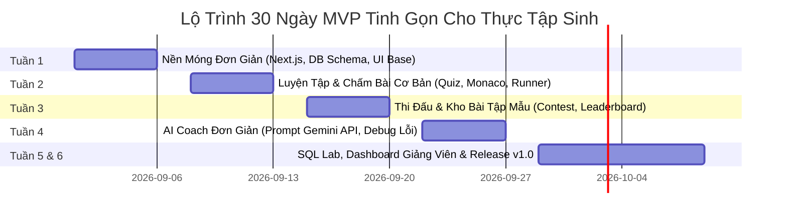

# 🚀 CyberSoft Learning & Contest Hub v1.0 - MVP Backlog (Bản Đơn Giản Cho Thực Tập Sinh)

**Người lập:** Thực tập sinh Dự án (Review bởi Senior Product Manager & Tech Lead @ CyberSoft Academy)  
**Dự án:** CyberSoft Learning & Contest Hub v1.0 (Bản MVP 30 Ngày - Đơn giản, Tinh gọn, Đạt chuẩn Chỉ tiêu)  
**Tệp tài liệu:** `mvp_backlog.md`

---

## 📌 PHẦN 1: 10 ĐIỂM ĐAU THỰC TẾ (PAIN POINTS) & CHỈ SỐ ĐO LƯỜNG (METRICS)

Dưới đây là 10 điểm đau thực tế được chọn lọc và đơn giản hóa, đảm bảo chia đều cho 4 nhóm đối tượng kèm chỉ số đo lường định lượng cụ thể:

| STT | Nhóm Đối Tượng | Điểm Đau Thực Tế | Chỉ Số Đo Lường Cụ Thể (Metric) | Chỉ Tiêu MVP Đạt Chuẩn |
| :---: | :--- | :--- | :--- | :---: |
| **1** | **Trẻ em (Lớp 3-5)** | **Sợ chữ dài & ngợp giao diện:** Trẻ thấy nhiều chữ và lỗi tiếng Anh là ngợp, dễ bỏ cuộc ngay khi vừa vào bài học. | **3-Minute Onboarding Drop-off Rate** (% học sinh thoát bài trong 3 phút đầu) | Baseline: 68% ➔ **Target: < 15%** |
| **2** | **Trẻ em (Lớp 3-5)** | **Cảm giác bị phạt khi làm sai:** Lắp nhầm khối lệnh không biết sửa ở đâu, bị báo lỗi gây nản lòng. | **First-Exercise Completion Rate** (% trẻ hoàn thành bài tập đầu tiên) | Baseline: 42% ➔ **Target: > 85%** |
| **3** | **Học sinh (Cấp 2-3)** | **Sốc cú pháp khi đổi sang gõ Code:** Chuyển từ kéo-thả sang gõ Python/C++ dễ sai thụt dòng `indentation`, dấu `;`. | **Repeated Syntax Error Rate** (% học sinh mắc lại cùng 1 lỗi cú pháp) | Baseline: 55% ➔ **Target: < 18%** |
| **4** | **Học sinh (Cấp 2-3)** | **Hệ thống chấm bài nghẽn lag:** Chờ chấm bài lâu khi thi contest đông người. | **Online Judge Latency** (Thời gian chờ kết quả chấm bài) | Baseline: 45s ➔ **Target: < 2s** |
| **5** | **Học sinh (Cấp 2-3)** | **Không hiểu lý do nộp bài thất bại:** Hệ thống báo `Wrong Answer` nhưng không biết sai ở chỗ nào. | **Mean Time to Debug (MTTD)** (Thời gian học sinh tự sửa xong bài) | Baseline: 35m ➔ **Target: < 10m** |
| **6** | **Người lớn (Data/AI)** | **Sốc cài đặt môi trường (Setup Hell):** Mất thời gian cài Python/SQL local bị lỗi dẫn đến bỏ học. | **Environment Setup Abandonment Rate** (% học viên bỏ học ở bước cài đặt) | Baseline: 38% ➔ **Target: 0% (Cloud)** |
| **7** | **Người lớn (Data/AI)** | **Thiếu bài lab dữ liệu thực tế:** Khóa học chỉ có ví dụ nhỏ, thiếu bài tập mẫu chuẩn công việc thực tế. | **Capstone Project Submission Rate** (% học viên nộp bài thực hành) | Baseline: 30% ➔ **Target: > 75%** |
| **8** | **Người lớn (Data/AI)** | **Dễ đứt gãy tiến độ do bận đi làm:** Người lớn bận rộn dễ bỏ dở giữa chừng. | **Weekly Retention Rate** (% học viên duy trì học đều hàng tuần) | Baseline: 35% ➔ **Target: > 70%** |
| **9** | **Giảng viên / Mentors** | **Quá tải thời gian chấm bài thủ công:** Giảng viên tốn nhiều thời gian chấm tay từng bài nộp. | **Manual Grading Time Overhead** (Số giờ chấm bài thủ công/tuần/GV) | Baseline: 18h ➔ **Target: < 2h/tuần** |
| **10** | **Giảng viên / Mentors** | **Khó phát hiện học viên bị bế tắc:** Không biết học viên nào đang nộp sai nhiều lần để trợ giúp. | **Time-to-Intervene** (Thời gian từ lúc học viên bế tắc đến khi GV biết) | Baseline: 48h ➔ **Target: < 30m** |

---

## 📌 PHẦN 2: PHẠM VI TÍNH NĂNG MVP TINH GỌN (LỘ TRÌNH 6 TUẦN CHO THỰC TẬP SINH)

Để đảm bảo thực tập sinh có thể làm được và hoàn thành đúng hạn trong **30 ngày**, phạm vi tính năng được thiết kế theo hướng **đơn giản, dễ cài đặt, sử dụng công nghệ phổ biến (Next.js, SQLite/Postgres, Gemini API cơ bản)**:

---

### 🔨 Tuần 1: Nền Móng Đơn Giản (Product Foundation)
* **Mục tiêu:** Dựng khung App Next.js đơn giản, Cơ sở dữ liệu Postgres/SQLite và Giao diện cơ bản.
* **Tính năng thực tập sinh làm:**
  1. **Khởi tạo Project Next.js (App Router):** Dùng 1 repo đơn giản duy nhất (Monolith Next.js), không làm Microservices phức tạp.
  2. **Cơ sở dữ liệu đơn giản (Prisma ORM + Postgres/SQLite):** Tạo các bảng cơ bản: `User`, `Lesson`, `Problem`, `Submission`, `Contest`.
  3. **Đăng nhập & Phân quyền đơn giản:** Đăng nhập Form đơn giản (Kid, Student, Adult, Teacher).
  4. **Giao diện 4 lứa tuổi đơn giản (CSS Tokens):**
     * *Trẻ em:* Màu sắc tươi sáng, chữ to, có hình Mascot tĩnh.
     * *Học sinh/Người lớn:* Tone tối / xám sạch sẽ, giao diện rõ ràng.

---

### 🔨 Tuần 2: Luyện Tập & Chấm Bài Cơ Bản (Practice & Simple Runner)
* **Mục tiêu:** Tạo trình gõ code và hệ thống chấm bài so sánh Output đơn giản.
* **Tính năng thực tập sinh làm:**
  1. **Quiz Trắc Nghiệm Đơn Giản:** Chọn đáp án A/B/C/D có hình ảnh minh họa cho K3-5.
  2. **Code Editor Tích Hợp:**
     * Nhúng thư viện **Blockly đơn giản** (Kéo thả khối) cho K3-5.
     * Nhúng **Monaco Editor cơ bản** (Python, C++, SQL) cho K6-12 & Người lớn.
  3. **Chấm Bài Đơn Giản (Simple Testcase Matcher):**
     * Dùng API chạy code đơn giản (Node.js `child_process` cách ly hoặc API Piston/Judge0 miễn phí).
     * So sánh kết quả `Output của Code` với `Output của Testcase` (True/False).
  4. **Gợi Ý Bài Tập (Basic Hint):** Hiện 1-2 dòng gợi ý tĩnh khi học sinh bấm nút "Xem gợi ý".

---

### 🔨 Tuần 3: Thi Đấu & Kho Bài Tập Mẫu (Contest & Content)
* **Mục tiêu:** Làm trang thi đấu có đếm ngược thời gian và nạp sẵn bộ bài tập mẫu.
* **Tính năng thực tập sinh làm:**
  1. **Trang Thi Đấu Đơn Giản (Contest Page):**
     * Tạo kỳ thi có thời gian bắt đầu/kết thúc và đồng hồ đếm ngược (Countdown Timer).
  2. **Bảng Xếp Hạng Đơn Giản (Simple Leaderboard):**
     * Truy vấn sắp xếp số bài làm đúng (Solved count) & thời gian làm bài (Submission time).
  3. **Bộ Bài Tập Mẫu Đại Diện (20-30 Bài):**
     * 5 bài Scratch đơn giản.
     * 10 bài Python toán logic cơ bản.
     * 10 bài C++ thuật toán cơ bản (Mảng, Vòng lặp, Chuỗi).

---

### 🔨 Tuần 4: AI Coach Đơn Giản (AI Coach & Debug Helper)
* **Mục tiêu:** Tích hợp Gemini API để giải thích lỗi code bằng tiếng Việt đơn giản.
* **Tính năng thực tập sinh làm:**
  1. **AI Giải Thích Lỗi (Simple Error Explainer):**
     * Khi học sinh bấm "Nhờ AI hỗ trợ", gửi `Đề bài` + `Code hiện tại` + `Thông báo lỗi` sang Gemini API.
     * AI trả về 2-3 câu giải thích ngắn gọn bằng tiếng Việt (ví dụ: *"Bạn thiếu dấu hai chấm `:` ở cuối dòng 3"*).
  2. **Chặn AI Cho Đáp Án (Simple System Prompt):**
     * Cấu hình System Prompt cho AI: *"Chỉ chỉ ra chỗ sai và hướng dẫn cách sửa, không được cho nguyên đoạn code đáp án"*.

---

### 🔨 Tuần 5 & 6: Lab SQL Đơn Giản, Teacher Dashboard & Release v1.0
* **Mục tiêu:** Làm môi trường thực hành SQL đơn giản cho người lớn, trang quản lý của giảng viên và phát hành.
* **Tính năng thực tập sinh làm:**
  1. **SQL Web Playground Đơn Giản:**
     * Dùng `sql.js` (SQLite chạy trực tiếp trên trình duyệt) để học viên người lớn gõ câu lệnh `SELECT`, `WHERE`, `JOIN` trên bảng dữ liệu có sẵn.
  2. **Dashboard Giảng Viên Đơn Giản (Teacher View):**
     * Bảng danh sách học viên kèm % bài tập đã hoàn thành.
     * Danh sách bài nộp bị lỗi quá 3 lần (để Giảng viên biết em nào đang gặp khó).
  3. **Đóng Gói & Phát Hành v1.0 (Release):**
     * Test lại toàn bộ luồng làm bài từ K3-5 đến Người lớn.
     * Deploy lên Vercel / Render bản MVP v1.0 hoàn chỉnh.

---

## 📊 BẢNG TÓM TẮT DỄ LÀM CHO THỰC TẬP SINH

| Điểm Đau | Tính Năng MVP Đơn Giản Thực Hiện | Mức Độ Khả Thi |
| :--- | :--- | :---: |
| **1. Trẻ em sợ chữ dài** | Giao diện chữ to, nút bấm lớn, hình Mascot tĩnh tươi sáng | ⭐⭐⭐⭐⭐ (Dễ) |
| **2. Trẻ em sợ làm sai** | Hiện thông báo *"Bé thử lại nhé!"* + Nút xem gợi ý 1 dòng | ⭐⭐⭐⭐⭐ (Dễ) |
| **3. Học sinh sốc cú pháp** | Hiện gợn sóng đỏ ở dòng lỗi + AI giải thích 1 câu tiếng Việt | ⭐⭐⭐⭐ (Vừa) |
| **4. OJ nghẽn lag** | Gọi API Piston/Judge0 hoặc Node Runner đơn giản | ⭐⭐⭐⭐ (Vừa) |
| **5. Mù tịt lý do sai** | AI đọc lỗi compiler và gợi ý ý tưởng sửa | ⭐⭐⭐⭐ (Vừa) |
| **6. Người lớn ngại cài đặt** | Dùng `sql.js` (SQLite WebAssembly) chạy trực tiếp trên browser | ⭐⭐⭐⭐⭐ (Dễ) |
| **7. Thiếu bài lab thực tế** | Chuẩn bị 3 dataset thực tế dạng bảng CSV/SQLite (E-commerce, HR) | ⭐⭐⭐⭐⭐ (Dễ) |
| **8. Người lớn bận rộn** | Tự động lưu bài gõ (Local Storage / Auto Save DB) | ⭐⭐⭐⭐⭐ (Dễ) |
| **9. Giảng viên quá tải** | Chấm bài tự động so sánh Kết quả mong đợi (Output Matcher) | ⭐⭐⭐⭐⭐ (Dễ) |
| **10. Khó phát hiện học viên bế tắc** | Bảng danh sách học viên nộp sai > 3 lần trong Teacher View | ⭐⭐⭐⭐⭐ (Dễ) |

---

*Tài liệu MVP Backlog tinh gọn đã được phê duyệt cho Thực tập sinh triển khai trong 30 ngày.*
